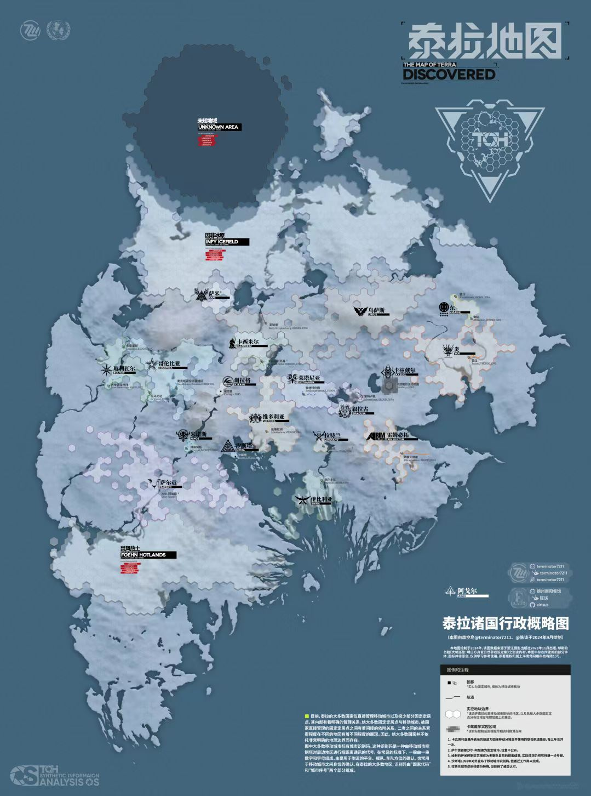

# 国家与地区

泰拉大地上与国家相关的一切是如此复杂，我们不妨从一个简单的概念切人，由浅人深地展开讨论这些复杂的话题。泰拉核心圈恰好是个绝佳的导人切口，有关核心圈的认识不单指向这个概念本身，还涉及现代人如何看待地区差异、文化边界、政治博弈与经济往来等国际的交流与冲突。如今人们喜欢使用"核心圈"这个词来称呼泰拉大地中部的那片区域。这个名称被谈及的时候总是与一些国家的名字同时出现，但从来没有人能说清楚核心圈的范围从何而起，又至何而止。在我还是个孩子的时候，大家口中的核心圈是维多利亚、高卢、莱塔尼亚、伊比利亚和拉特兰。时至今日，高卢灭亡，伊比利亚不复往日荣光，后来居上的乌萨斯在很多人的意识中成为核心圈的一部分。与此同时，卡西米尔同样是个强大的国家，而且从地理位置来说，卡西米尔到泰拉中心的距离并不比乌萨斯到泰拉中心的距离更远。这两国间曾数次爆发战争，双方互有胜负，但卡西米尔显然不是广义上的核心圈国家。从另一个角度讲，炎国一直以来都是这片大地上最重要也是实力最强大的国家之一，但炎国似乎从未像乌萨斯一样表现出"进军核心圈"这样的想法，也许是炎国一直以来关注本土和不对外侵略的政治方针导致了其对核心圈不感兴趣。
这样看来，比起模糊的"泰拉中央"而言，"泰拉某些强大国家的势力范围"这个说法更契合核心圈在日常语境中的含义。换言之，这个词代表的其实不是纯粹的地理区划，而更像是一个随各政治实体综合实力变化而改变的政治学概念。就目前而言，"核心圈"特指的是维多利亚、莱塔尼亚、乌萨斯、拉特兰和伊比利亚这几个国家的控制范围。

## 维多利亚

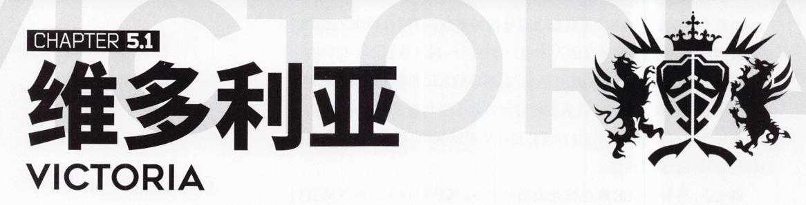

### 概览
维多利亚帝国是目前泰拉核心圈内军事实力最强大、经济最繁荣、综合国力最强的国家，是泰拉大地上名副其实的霸权帝国。维多利亚领土广袤，本土与多个核心圈国家相邻，除此之外还有若干开拓区与飞地。维多利亚帝国强调强权与扩张。她旨在于泰拉大地建立以维多利亚帝国为主导的国际秩序，通过霸权与掠夺开拓区来维持维多利亚帝国贵族的利益，并维持维多利亚至上的国际政治秩序。维多利亚的王公贵族依靠帝国多年的扩张与霸权获得了巨大的权力与利益，而皇家的实力却日渐衰弱。
### 历史
#### 龙临谷地
在泰拉大地的中央有一片谷地，这里水系发达、土地丰饶。一支德拉克氏族带领数个部落流浪到这片堪称天赐福地的广袤区域后决定就此驻留。由此，这片谷地成了泰拉人最早定居生活的地区之一。得天独厚的优越条件及较为稳定的生活环境在以后的千百年间不断地吸引泰拉各地的移民们迁人此地。原住民与移民在知识和文化上的长期交流与融合使当地农业和牧业都得到了迅速的发展，一个经济繁荣的半游牧部落联合体随之形成。强大而古老的德拉克氏族成为这个部落联合体的领导者和庇护者。谷地的社会形态基本定型，问题也随之到来。来自泰拉四面八方的社群迁移至此后大多各自为政，部落联合的社会结构过于松散，难以团结起来发挥合力。人们在遭遇天灾时经常损失惨重，因为受灾的部落很难得到其他部落的支援。这个问题的根源在于德拉克的地位更接近于指导者而非统治者，各部落在遭遇危险时都处于某种意义上的混乱之中。

### 现实问题
面对现实存在的问题，身居高位的德拉克氏族内部因意见不同分成了两派:一派认为应当提高德拉克的地位，效仿萨尔贡建立国家和贵族体系以巩固统治，即"王政派";另一派则认为应该在保留原有社会形态的前提下以更灵活的形式来解决问题，即"守旧派"。双方的分歧越来越大，最终导致了两派分道扬镳。这种现象堪称独特，因为在那个时代的绝大多数地区，部落内部的分歧往往会以暴力冲突后的兼并收场，维多利亚却发展出了和平解决的方案。很多历史学家认为，这次分裂直接催生了后来维多利亚处理重大事务时以协商为主的政治传统。
王政派宣称德拉克本就是谷地之王，现赋予其统治的地区维多利亚王国之名，而德拉克即为维多利亚王室。守旧派则带领数个部落离开了谷地，

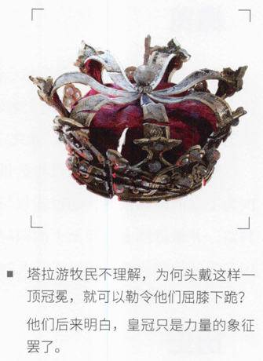

### 阿斯兰到来
维多利亚帝国正式诞生后，统治逐渐稳固，成为泰拉中央地带一个举足轻重的强大政权。在德拉克声势正盛之时，一支阿斯兰帕夏家族离开了萨尔贡，宣布从此服务于维多利亚。在当时的几个君主制国家之间，贵族改换门庭并不算特别少见，德拉克将这一事件视为维多利亚影响力扩大的又一明证，热烈地欢迎了阿斯兰的到来。
然而，帕夏此举另有所谋。萨尔贡当时的万王之王为了稳固自身的权柄，对非直系的阿斯兰贵族一直施行强力的压制政策。这些分散在各地的阿期兰贵族们苦于血脉散落各处的现状，决定寻求一个团结起来的方式，以使整个族群获取更大的权力。他们最终将眼光转离萨尔贡，转而瞄准了维多利亚。在悄然吸纳了绝大多数散落在外的同族家系之后，维多利亚的阿斯兰举起了反旗。这是一场宫廷政变，也是一场规模极小的内战。维多利亚皇室迅速被早有预谋的阿斯兰击败，盖尔王也无法抵抗掌握了宫廷力量的阿斯兰。德拉克终于同意暂且低下高傲的头颅，签订条约承认阿斯兰的皇室地位，维多利亚从此变为龙与狮子共治之国。
从另一个角度来说，议事的传统始终限制着皇帝的权力范围，这次事变后宫廷内部出现了短暂的权力真空，各地贵族借此机会获得了更多的自主权。从维多利亚普通民众的角度而言，一般百姓其实不了解宫廷沉重大门背后发生的巨变。在德拉克让渡部分权力给阿斯兰后，大家发现各地的自治程度和生活质量显著提高，因此便将此次分权视为一种彰显维多利亚进步精神的贤明大度行为。

### 扩张、争霸与停滞
内战结束，维多利亚帝国也迎来了发展的最佳时机。稳定的社会环境带来了一段经济繁荣期，新型农庄及工厂大量出现，就业率显著提高，金融业高速发展，学院中的精英们持续高效地迭代着各类科学技术及理论。在这种情况下，王公贵族们将目光投向了广袤的泰拉大地，开始大举对外扩张。维多利亚帝国本土的领土面积不断扩大，而帝国派出的各种探险队、开拓军也在远离本土的地区建立了许多开拓区和飞地。这导致维多利亚与周边各国的关系日益紧张，边境摩擦时有发生。
1029年，高卢向莱塔尼亚宣战，这一事件正是被后世称为"四国战争"的大战的开端。在经过一年的观望后，判断高卢并不占优势的弗雷德里克三世选择加人战争。维多利亚、莱塔尼亚和乌萨斯三国组成联军，对高卢发起了猛烈的攻击。1031年10月，三国联军与高卢军团间爆发了一场决定性的战役，这场因四名君主亲临战阵而得名"四皇会战"的战役最终以三国联军的胜利而告终，高卢帝国随后灭亡。
战后，维多利亚帝国接管了富庶的下高卢地区，取得了大量来自高卢的资源、技术和政治遗产，为其在新时代的霸权地位奠定了基础。但维多利亚没有一直强大下去,在四十多年的平稳期后，衰落的迹象开始显现。1072年，维多利亚皇帝阿利斯泰尔被推翻并处决，此后维多利亚帝国开始陷人某种意义上的困境:王位空缺，而有权势的贵族们结成了各种互相之间半公开敌对的团伙。万幸的是，维多利亚应该仍保有足够的底蕴支撑到这场政治闹剧结束，或者说直到下个时代到来。
### 地理
维多利亚帝国本土位于泰拉大地的中心地带，其地形由东北的高原和台地到中央谷地再过渡到西南的丘陵和平原，整体上呈现为自高到低，由山人海的态势。
由于南临克拉斯德内海，维多利亚本土整体属于受到海洋强烈影响的湿润气候，全年温和潮湿，年温差小，降水均匀。一般来说，维多利亚北部的季节特征要比南部更分明一些。
维多利亚南面是伊比利亚，东边是莱塔尼亚，北方是卡西米尔和乌萨斯，西方则隔着谢拉格与哥伦比亚遥遥相望，其地理位置既是泰拉大地的中心，也是核心圈的中心。同时，维多利亚还在泰拉各处拥有一些大大小小的开拓区和飞地。帝国随时准备着将她的影响力传递到更远的地方。

#### 开拓区的不满
维多利亚在各开拓区实行差别政策，旨在从开拓区获取尽可能多的资源，但只提供最低程度的支持。这样的态度在各开拓区激起了不满和抗议，其中最具代表性的两场运动分别是哥伦比亚独立战争与围栏事件后尤立卡自治州加入雷姆必拓的斗争。开拓区给维多利亚带来了难以计数的财富和资源，但对维多利亚来说，也许是时候重新考虑和规划与开拓区相关的政策了。

### 政治与军事
### 政体
在绝大多数人看来，皇帝是骄傲强大的维多利亚的象征，如各种畅销历史画册中璀璨夺目的王冠一样，代表着维多利亚无可置疑的权威。但事实上，从政治运行的逻辑而言，维多利亚皇帝并没有掌控人们印象中那种不可挑战的权力。维多利亚内部运行着一套名为"君主立宪"的体制，这代表维多利亚的政权由皇帝和议会共同掌握。
维多利亚皇帝在理论上是国家的权力中心，也是维多利亚的领导者，拥有重要的行政、立法、司法和军事权力。皇帝拥有维多利亚全境的土地，他将这些土地分封给贵族。贵族在拥有获取封地收人权利的同时，也需要承担替皇帝保护和治理封地的责任。同时，皇帝也是议会的议长。议会是辅助皇帝的议政会议，由大贵族构成，这些贵族议员在议会参政议政，从而直接影响皇帝的决策。这个机构对于庞大的维多利亚来说至关重要，皇帝的任何失误都有可能让伟大的帝国陷人风雨飘摇，而议会的存在极强地制衡了可能会无限膨胀的皇权，也尽可能地避免了皇帝独断专行的可能。
一直以来，这样一种开明的政治体制被认为是维多利亚的一大优势。自1072年以来，维多利亚君主缺位二十余年，整套国家机构虽然处境艰难，却仍然保持着基本的运转，这也许可以作为这种观点的佐证。
### 君主与皇室
维多利亚的君主头衔为维多利亚、塔拉、下高卢的国王，维多利亚全境的皇帝。君主本人加冕后仍然保留其个人拥有的各类其他贵族头衔。维多利亚的皇室定义是一个复杂的话题。从理论上来说，德拉克家族成员仍被视作皇室成员，尽管他们早已销声匿迹;而阿斯兰们有着复杂的家系，只有一小部分家族成员才有资格自称皇室宗亲，至于拥有实际继承权的阿斯兰则更是少之又少。
### 领土与区划
维多利亚帝国的土地均归君主所有，这些土地由君主以一种复杂的分封制度交予贵族们管辖。维多利亚的分封制度诞生至今已有千年之久，在历史的进程中随着时代需要的变化而多次修正过。因此，我在这里只简单地介绍现状，对这个话题有兴趣的读者可以自行查看相关的资料。
维多利亚帝国由三个法理王国组成:维多利亚王国、塔拉王国、下高卢王国。这三个王国又由皇室直属领地，若干公爵领、侯爵领及子爵领组成，公爵领下辖伯爵领，伯爵领又下辖男爵领。

维多利亚帝国声称她的皇帝拥有完整的下高卢王国，因此比起各自控制部分上高卢王国领地的其他国家更具有联统整个高卢的正当性，为此维多利亚与莱塔尼亚和乌萨斯摩擦不断。
在行政区划上，维多利亚将全国划分为若干个郡，郡下辖的移动城市称为"市"，固定定居点称为"村"或者"镇"。各郡大小不一，有时一个功能完备的移动城市会单独设郡。这些行政区划由不同级别的地区议会来主持日常事务的运作。
### 议会和政府
维多利亚的议会脱胎自上文曾提到过的协商议事传统，也与维多利亚长期以来的社会氛围关系紧密。从传统上讲，维多利亚的政治与文化崇尚克制而反对极端，宁愿通过一套费时费力的复杂政治流程来规避激进政治行为可能带来的风险。
维多利亚议会的议长一职由维多利亚皇帝本人担任，议会成员由大贵族担任。一些位高权重的大贵族通常会派遣自己的代表常驻议会，只在需要做出重大决策时亲自到场。
议会下设各类委员会，拥有审议和行政决策权。议会任命一些行政长官和行政职员来构成维多利亚政府的工作部门，他们拥有行政执行权。委员会和工作部门一一对应，例如维多利亚卫生委员会与维多利亚卫生局相对应，区别是委员会由政务官构成，而工作部门由事务官构成。
郡及郡以下地区议会的情况与维多利亚议会相似，区别在于地区议会的成员除了当地的大贵族，也包括了小贵族和有影响力的平民。
### 法律
维多利亚存在一部相当完备齐全的宪法，它是一切其他法律的依据。宪法在其诞生之后的漫长执行历史之中不断增补，它不是一份简单、独立的文件，而是一套由大量的历史文书与惯例组成的庞大法律系统。为了治理一个广袤的大帝国，实际执法的大贵族们有权在不违背宪法的情况下于治下的领地内对法律进行更适时的解释。
维多利亚的最高立法机构和最高司法机构是维多利亚议会，负责法律相关工作的议会职位为常任法官。维多利亚的执法机关是维多利亚皇家警察，整个机关直接向皇室负责。
### 贵族
在维多利亚立国之初，君主为了有效地统治国家，将土地、权力和相应的头衔赐予拥有影响力，且与君主具有联合利益的各界人士，来换取他们对君主的效忠和服务。这类人士组成了一个居于统治地位的社会阶层，也就是我们现在所说的贵族。经过长期的发展，贵族的特权和相应的义务都以法律的形式得到了确立，贵族制度已成为维多利亚社会的基石。
维多利亚贵族制度的特殊之处在于，所有拥有土地的人都是皇帝的封臣，皇帝附庸的附庸仍然是皇帝的附庸。这从法理上确保了皇帝本人能够对整个国家拥有足够的控制力。
维多利亚的贵族可以分为两类:大贵族和小贵族。大贵族是最为传统的贵族阶层，拥有封地和特权，其头衔世代相传，并且其整个家族都拥有贵族身份。传统上，维多利亚议会的议员只能由大贵族来担任。小贵族则出现得较晚，其头衔更像是一种荣誉称号。他们没有封地，而是以契约方式从封君处获取各种形式的报酬。大部分小贵族头衔只授予本人且不可世袭。
目前，维多利亚的大贵族实行五级爵位制，不同等级的爵位有着不同的权利和义务。
公爵是地位最高、权力最大的贵族。他们是皇帝的左右手，手握各地军政大权，实际控制着维多利亚的大部分领土。
侯爵是纯粹的军事贵族，领地基本都是边境军事要塞或是飞地。他们的责任是保卫维多利亚领土不受外敌人侵。维多利亚在设立侯爵这一爵位之初就有意让其远离政治中心，并对他们的政治权力进行了严格的限制。
伯爵是公爵的封臣，通常一人治理数个小郡或一个大郡。他们负有对从男爵和方旗骑士这一类小贵族的管理义务。
子爵是一郡之主。这一爵位是维多利亚吞并下高卢后承袭高卢制度产生的，只在下高卢地区存在。
男爵是伯爵的封臣，是最下级的大贵族，他们的领地通常为几个村镇或是移动城市上的几个地块，又或是一些较小的郡。
维多利亚的小贵族是在大贵族体系成型之后出现的。与大贵族不同的是，小贵族并不从封君处获得封地，取而代之的是他们与封君签订契约来规定其提供的服务和获取的报酬。大多数小贵族头衔是不可世袭的，只有从男爵等少数例外。维多利亚的骑士就是一种典型的小贵族:他们为封君提供军事服务，而封君向他们支付年金，其头衔为终身制，但不可世袭。
### 军事
维多利亚帝国旧时的军事制度以贵族为核心，整支军队由直属于皇帝的卫队、军事贵族的附庸部队以及战时征召的民兵和雇佣兵组成。随着时代的发展,这种典型的旧式军队越来越不能满足维多利亚日益增长的军事需求。解决这个问题的是维多利亚历代皇帝中著名的军事家弗雷德里克三世。他在即位后敏锐地意识到现有的军队架构存在各种弊端，无法适应当时日益严峻的国际形势。在进行充足的准备，解决了大量前置的政治问题后，弗雷德里克三世开展了一次彻底的军事改革，建立了一支由皇帝和议会直接指挥的职业军队。新生的维多利亚军立刻在四国战争中展现出了远超旧军队的战斗力，这证明了新式军队的有效性。
维多利亚军的主体是由职业军人组成的常备军，完整的军校体系和征召制度支撑着这支军队。军队纪律严明，武器先进，有大量火力支援和技术装备。得益于建设良好的基层军官体系，维多利亚军有着强大的灵活性和机动性，既能在大方阵作战中使用复杂的战术，也能在拆分成小队的情况下有效地执行任务。
作为维多利亚新式军队的代表，帝国的风暴突击队威名赫赫，这支部队的前身正是维多利亚典范军。作为直属于议会的特殊军事单位，他们的主要责任是执行由维多利亚议会直接下达的特殊任务。风暴突击队的成员无一不是从维多利亚军中选拔出来的精锐。由于风暴突击队地位的特殊性，民间一直流传着各种有关他们的夸大其词的传说，人们在遭遇风暴突击队成员时总是会做出夸张的反应。
在改革的同时，弗雷德里克三世并没有轻视帝国最具历史传统的军事单位蒸汽骑士。蒸汽骑士仍是维多利亚最昂贵、最强大、最忠诚的战士，是维多利亚军事力量的底牌，更是维多利亚对自身实力的夸耀。只有身体强健、头脑聪慧、意志坚定、战技精湛的骑士才具备被选拔为蒸汽骑士的资格。蒸汽骑士的甲胄则是维多利亚军事科技的最高结晶，其本身既是异常坚固的防具，又有着强劲的动力，还是一套先进的集成武器系统，能够全方位强化穿着者的个人战斗力。不管是蒸汽骑士人选极其严格的筛选条件，还是其甲胃极高的成本和生产难度，都只有维多利亚这样的大国才能够承受。即便如此，从古至今，同时在役的蒸汽骑士从未超过五十名。蒸汽骑士广泛地受到人们的尊重和敬畏，他们是维多利亚少男少女的偶像，也是维多利亚的敌人最可怕的噩梦。
维多利亚的大贵族们依然遵照传统维持着属于自己的军队。这些军队仍以旧式军事制度组织，多由小贵族和平民组成。权力较大的贵族能够拥有高速战舰一类的技术军备。
### 经济
维多利亚是全泰拉最早发展现代工业的国家,工业门类齐全,技术先进。维多利亚的机械工程技术是全泰拉最先进的，与其相关的移动城市技术、机动车辆技术以及军械技术均得到了充分的发展。维多利亚的农业、牧业、林业、矿业等基础产业都应用了大量的机械设备。可以说，维多利亚社会是一个高度机械化的社会。不过，对机械科学的依赖近年来造成了一个新的问题，那就是学界对电子科学这一门新兴学科不够重视，导致了维多利亚在电子技术上的整体落后。
维多利亚经济活跃，发达的国内贸易催生出了各种各样的商事契约，这些契约最终发展成了现在人们熟悉的公司制度。在此之后，商业的继续发展让维多利亚拥有了全泰拉最完整的金融产业。在维多利亚,银行、保险、信托、证券业务一应俱全。
### 文化与社会
维多利亚帝国总人口目前约为四千万，有一半以上的人口生活在移动城市里。对于大部分维多利亚国民来说，身为维多利亚人只是一个事实。只有少数接受过良好教育并且有一定社会地位的人才会对身为维多利亚人这件事产生认同，而这种认同经常是狂热的。
传统上，维多利亚人分为三大阶层:贵族、平民和贤人。贵族包括具备维多利亚议会议员资格的五级大贵族和乡绅、骑士一类的小贵族;平民则包括所有的普通市民和农民;贤人指的是自古以来掌握知识，并以之帮助人们生产生活的一类人。在进人结晶时代之后，作为一个阶层的贤人的作用基本被现代教育体系取代，"贤人"成为一个历史词语。
整体上来说，维多利亚的社会呈现出一种自信、克制、相信理性、强调道德的风貌。理性是维多利亚社会生活的主旋律，科学则是维多利亚人在茶余饭后热衷于谈论的话题。维多利亚完善的基础教育体系和先进的高等教育体系正建立在理性和科学的基础上。作为与科学并举的另一颗明珠，维多利亚的艺术在这样的环境下也得到了高度的发展。人们常常将科学和艺术并列谈论，试图以科学来寻找艺术上新的可能性，电影就是维多利亚人在这样的氛围中发明出来的。
由于高度的工业化，维多利亚的感染者问题事实上已经相当严重。在维多利亚的大部分地区，感染者通常被隔离或是收押，集中于公权力管控的区域内。私藏感染者是严重的犯罪行为。近年来，有贵族试验性地实施了新型的感染者应对政策，感染者被允许在特定的设施内参与劳动，不过他们获取的报酬远远低于正常水平。
### 维多利亚的困境
一种广泛的意见认为，维多利亚是全泰拉综合实力最为强大的国家。在三十年以前，我也许会赞同这样的意见;但今时不同往日，变化正在发生。曾经，维多利亚人自豪地声称维多利亚的各方各面都是最先进的。然而，执着于一些特定时期的先进成果，反而容易陷人落后。一个典型的例子是维多利亚的机械科学和电子科学。在进人结晶时代后，维多利亚的机械科学是各国中发展最快的。但随之而来的对机械科学的路径依赖导致维多利亚学界几乎错过了电子科学兴起的时机，整个学科起步缓慢，目前维多利亚仍不能大批量生产高精度的电子元件。这样的现象也发生在其他领域:维多利亚贵族、议会和公务员交叉的复杂系统远不如炎国的文官制度来得高效;维多利亚军的改制工作做得不像乌萨斯军那样彻底，导致其整体规模和灵活性始终受到限制;而维多利亚发明的金融工具在哥伦比亚和卡西米尔这样的地方已经得到了远超其在发源地的应用与发展。维多利亚似乎停滞在了某种名为"先进"的幻景中，忘记了时代本身会推着所有人一同前行，在浪潮中，不进则退。
维多利亚的现状，同样也不容乐观。一个帝国，王位空置二十余载，勉力支撑到如今还能基本维持现状，全仰赖维多利亚深厚的基业。但这二十余年来积攒的压力，落在了每一个维多利亚人的肩上。空置的皇冠犹如黑暗中的灯火，引诱着公爵们的野心逐渐膨胀，令他们互相争斗。毕竟，既然红龙的伦蒂尼姆可以让狮子人主，那它也就没有拒绝其他人的道理。同时，古老的争端逐渐浮出水面，塔拉的居民们祭出旧时的旗号，要为自己遭受的一切求一个公道。许多居住在其他地区的维多利亚人在这些年里也与塔拉人一样，体会到了国家不再庇护自己的感受。维多利亚的边境不复安稳，由高卢地区归属问题引发的领土争端愈演愈烈，帝国与周边各国之间的摩擦持续升温。雪上加霜的是，帝国的心脏绊倒在新世纪的门槛前，伦蒂尼姆上空飘扬的旗帜属于何人竟成了一个疑问。维多利亚帝国从未像现在这样需要同时面对各种广泛而深刻的问题。
现在的维多利亚帝国，陷人了前所未有的困境之中。曾经无比辉煌，现在却显出几分黯淡的维多利亚，究竟是被乌云暂时遮住了光芒，还是仍然散发着落日的余晖，我们无从得知。希望当一切发生变化的时候，每个人都能做好准备。
### 结语:不朽舞台
名为"维多利亚"的宏大剧场始终向所有类型的戏剧敞开大门，而狮王时代这台上演了百余年的炫目大戏已在二十余年前落下了帷幕。但维多利亚没有结束，她会永远地矗立于这片大地之上，见证一切的兴盛与衰亡，正如过去那样，直到永远。

### 塔拉地区

当你想找明天时,却会与昨日相见。————塔拉旧谚语

塔拉地区新政权与维多利亚之间将可能发生的分离是一桩有较大争议且正在发展的事件。学术界有人认为这是必然之事，另一些人则否认这一点。出于追求准确的必要，我选择谨慎发表与之相关的观点和意见。让未来的我去记录、评断"现代塔拉"吧。

在维多利亚语中，"塔拉"(廷盖语称"迢拉克""迢尔"等)是古代游牧民用于指称集会场所的词语。在今天，它通常指代的是维多利亚南方的一片地理区域，这片地区边界模糊，随着当地移动城市的巡弋路线而不断变化。
可以肯定地说，塔拉地区的文明史始于萨尔贡的扩张。可以同样肯定地说，自约泰拉历前100年开始，这一地区便由来自维多利亚、讲廷盖语的德拉克游牧部族统治。到哈兰杜汗驰骋大地、进人黄沙的时代，这些维多利亚人已经在此地建立了独立国家，即塔拉王国。
一般认为，为了抵挡梦魇可汗，维多利亚和塔拉两个王国选择了合并，从而形成了后世维多利亚帝国的雏形。当时的塔拉国王将王国的"里.图雅哈"即"国王"头衔让渡给了当时的维多利亚国王，而后者则将"里.纳盖尔"也即"盖尔王"的称号赠送给了前者(今时常有"盖尔"为王本身姓名的说法，为讹传)。二者对塔拉地区的协同统治一直持续到九世纪阿斯兰登极、德拉克逊位的事件发生之时。尔后盖尔王一脉绝嗣，塔拉地区的政治事务由各大公爵协理至现代。四国战争后，塔拉地区成为威灵顿公爵的领地至今。
遗憾的是，由于文化习俗多为口口相传和实物资料遭人为破坏等因素，保存下来的王国历史、文化资料十分有限，大多由伦蒂尼姆各大学和博物馆的学者搜集整理。盖尔王谱系业已大部分散佚，我们今天比较了解、公认较为可信的"华贵王"梅里亚德和"放逐王"拉布雷德等几位盖尔王的故事则大多由塔拉当地的民俗故事与文物资料比照得来，口述故事中的其他大多数盖尔王形象则难以再找到对应的考古证据。

现代以来，塔拉地区长久饱受发展缓慢之苦。一方面，也许是出于文化N习惯等多项因素的分歧，威灵顿公爵之前的其他北方大公爵们为治理该地区付出的精力明显不足;另一方面，从客观的角度看，北方源石工业的爆发式扩张对该地区自有的自然资源及人口都产生了巨大的拉拽效应。塔拉地区的维多利亚人得到的是明显低于全国平均水平的劳动报酬及公共服务，却常常要为购买工业品支付更高的价格，他们和维多利亚其他地区同胞的交流也往往是单向而低效的。到了本世纪七八十年代，为了摆脱艰苦的生活，他们中越来越多的人倾向于脱离维多利亚。虽然舆论普遍认为塔拉的分离运动规模尚且有限，活动还不频繁，但倘使维多利亚仍不采取措施，泰拉的大地上终究是绝不能说"没有出现过这样的先例"的。
值得进一步讨论的是，倘若我们看到一个独立自主的塔拉，它是选择重新成为一个君主统治的旧王国，还是开创一个崭新的现代国家;脱离了大国的掌控，它要用何种方式实现人民恢复文化、改善生活的初衷这些是我个人最为好奇的问题，也是我认为社会或许应当更关心的话题。

#### 廷盖语

廷盖语今天一般称为"塔拉语"或"盖尔语"，其词源可由原始德拉克语言中"舌头"一词考察而来。这种语言虽然和维多利亚语同源，却发展出了一套截然不同的语法体系，其"谓一主一宾"的基本语序在地缘上是个孤例，显然保留了极为完整的古典萨尔贡语法习惯。
自可考的时期开始，廷盖语便使用维多利亚文字记录。塔拉地区的古代人过着游牧生活，口语文化高度发达，发展出了一套变化丰富的音韵系统。当时应当存在着数十种方言，但如今皆已失传。
由于使用上的不便，在盖尔王统治初期，塔拉地区的维多利亚人逐渐被鼓励放弃使用廷盖语，转而接受流通更广的维多利亚语和高卢语。廷盖语的文字记载于八到九世纪间中断，到本世纪初，基本已经没有能如文献资料所记述一般使用廷盖语的维多利亚人，这门语言只剩个别词语还留在塔拉地区的维多利亚语方言中。然而，随着分离运动的兴起，不断有当地学者、作家、诗人等尝试复原这种语言，并取得了真实可信的成果。如前所述，塔拉地区自古以来流传着大量口口相传的传奇故事,它们今天全部以维多利亚语讲述。假以时日，我们也许能听到古代的传奇以它原本的音律和韵脚，再次传唱在大地上。
然而，伴随着古老语言的复苏而出现的则可能是一种新的现象:我从许多1096年至1098年间离开的人那里听闻，在塔拉，使用廷盖语(塔拉语)的人对不讲这种语言而只讲维多利亚语的邻居逐渐不再友好，分离运动与政府间的政治分歧可能正在演变为一般塔拉民众之间的内部分化。如果这是事实，那么无论是对于未来可能建立的塔拉政权，还是对于所有生活在那里的人们来说，都是一个值得警惕的现象。

#### 大发掘与疯王的移动城堡

近年来，传统艺术鉴赏和考古研究在维多利亚蔚然成风，特别是在上流社交圈中，贵族们纷纷努力展现自己对艺术和历史的兴趣。拜此风潮所赐，我们在传统艺术和考古领域的研究事业获得了源源不断的物质支持，博物馆、大学和皇家科学院都成了高官贵族们热衷于赞助和合作的对象。当然，他们的名字也会出现在成果的致谢名单里。客观上看，这股赞助的浪潮确实是好事，它极大推动了考古学的发展。
四国战争后，高卢战败灭国，高卢人对历史的大部分研究成果也被维多利亚和莱塔尼亚接手。不过因为政府交接时混乱的管理，古代高卢实地考古的进展一直深受阻碍。多亏各方慷慨解囊，维多利亚的考古学家们终于得以对下高卢地区进行大规模的发掘，并有了惊人的发现，还开启了一场追溯移动城市历史的大讨论。
现藏于维多利亚皇家博物馆的"移动城堡设计图手稿"这不是它本来的名字便是此轮下高卢地区考古浪潮中最为重要的发现，该份手稿署名为资料不详的"查理王"。为了找出"查理王"的来历，学者们翻遍史书，终于从浩如烟海的典籍中找到了一位被记录者称为"疯王查理"的高卢人。根据已有资料，查理是古代高卢地区小国的国王，史书中甚至没有记载这个国家的名字。此人不勤于朝政，对治理与权力毫无兴趣，却是非常出色的建筑设计师与源石技艺使用者。
在位期间，他为了给自己修建宫殿而大兴土木，压榨平民，持续搜刮民脂民膏，重金聘请泰拉各地的专家给他出谋划策。再后来，也许是苦不堪言的百姓决定推翻他的残暴统治，又或许是积弱积贫的王国被邻国攻占，总之被称为"疯王"的查理和他的宫殿消失在了人们的视野之中。历史学家们认为古代史官的语焉不详事出有因，而原因就记录在这份出土的手稿文物中。历史学家和考古学家们在研读这份手稿时发现，这项工程不是一座简单的"宫殿"，而是一座可以被强大牵引力拉动的移动堡垒。于是学者们将其称为"移动城堡"。整座城堡的设计分为两大部分，分别是牵引器械和由牵引器械拖行的主体建筑。

主体建筑可以被划分为两层:上层是城堡部分，下层是移动部分。在上层部分，为了在保证功能的前提下尽可能地减轻重量，使用的都是经源石技艺改造过的原料;建筑结构尽可能地采用镂空设计，整座建筑比起人们观念中坚实的城堡，更像是一个精致而又轻盈的笼子。下层部分则是由巨大履带构成的移动底座。
牵引器械部分是一次对源石运用的大胆尝试。与后世维多利亚以源石为燃料、水蒸气为动力的蒸汽技术不同，手稿作者设计了一套纯粹依靠源石作为动力的引擎系统。查理王设计出的这一套源石动力系统及其配套器械，只需要源石技艺使用者定期向系统内填充源石燃料并维持其运行，就能将源石本身作为动力使用并排放。不过可想而知的是，这种系统会排出大量未经清洁的源石废料，造成极其严重的污染。
在后续的进一步发掘中，我们没有发现任何与这座移动城堡相关的实际遗址。所以这份手稿是否确实付诸实施，学界内众说纷纭。
有人认为移动城堡根本没有建成，持反对意见的人则说，如果没有完工，那应该在手稿出土位置附近勘察到城堡的遗迹，所以城堡应该是移动到了目前尚未发现的地方。也有人认为城堡在建造期间就因各种各样的原因而遭到了破坏。
有关移动城堡与移动城市之关系的争论，目前也发展到了新的阶段。
历史学家普遍认为"移动城堡"的概念是移动城市技术的灵感源泉，虽然没有任何直接证据能表明建造了第一座现代移动城市的七城联邦的设计师们借鉴过移动城堡的设计，但二者是一脉相承的关系。
大多数工程师则认为，以今天的视角来看，疯王查理的手稿内容达不到基本的设计标准，当时的材料也不支持建造如此庞大的工程。除这一份手稿外，没有见到流传至今的复制稿。因此这个设计不可能对后世造成直接影响，现代移动城市更可能是有着独立起源的设计。
虽然在城堡相关的问题上大家各持己见，但对于"移动城堡"的概念，所有人都钦佩不已。
至少在历史的某个时间点，在下高卢这片土地上，确实有人幻想过这样一幕场景:庞大引擎日夜轰鸣，它吐出漆黑的浓烟，牵引着梦想中的城堡前往没有天灾的远方。

## 莱塔尼亚

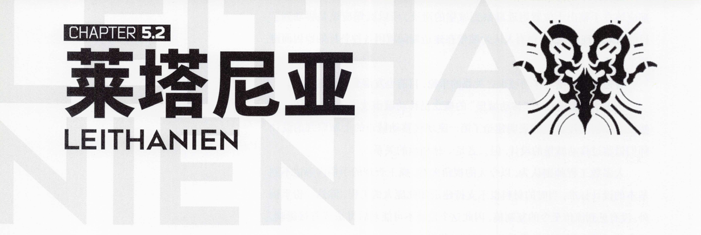

### 概览
术师与高塔的国度莱塔尼亚帝国是泰拉大地上的传统强国。古老而典雅的帝国不仅是源石技艺造就的强大国家，它灿烂的历史文化也对现代核心圈乃至整个泰拉的其他国家都有着极为重大的影响。近代数百年的时间里，莱塔尼亚从分裂的危机和牵动诸国的战争中一路走来，到如今巫王的恐怖统治画上了休止符，双子女皇宏伟和谐的乐章再度奏响，帝国迎来了暌违已久的曙光。不过，使人心悸的疑问仍在莱塔尼亚国境之内暗暗传播:为帝国续写的乐谱是否能够如此轻易地改弦更张?

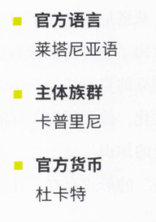

### 历史
#### 帝国序曲
在有记载的历史之中，莱塔尼亚本不是一个统一的帝国，原先存在于泰拉中央至东部卡兹戴尔之间的广袤大地上的，是十个相对独立的地区。这十个地区中有九个逐渐形成了各自为政的区域性部落政权，唯独距离卡兹戴尔最近的叙拉古地区因为诸多原因仍然保持混乱状态。在九个地区之中，有一个以卡普里尼为主要居民的部落，该部落居民的源石技艺最为强大，他们将其融人了他们认为最有力量的媒介声音。他们以声音作为施术载体不断精进，于是在这样的研习氛围中，与音乐相关的艺术和文化活动诞生了。其他部落在日常交流时为这种艺术和文化所感召，开始向他们学习，卡普里尼为了"音律的和谐"也广泛接受其他部落的文化。长此以往，各个地区之间的文化逐渐趋同。而受制于地理和政治条件，位于九区以东的叙拉古保持了非常独立的文化。
最终将莱塔尼亚统一起来的是来自卡兹戴尔的直接威胁。彼时的卡兹戴尔综合实力强劲，前述的十个地区笼罩在卡兹戴尔的阴影之下。各个地区不可能独立地与强大的卡兹戴尔抗衡，因此九大部落和饱受卡兹戴尔侵扰的叙拉古决定联合起来，建立一个可以共同抵抗外部侵略的联盟。九大部落的领导人和叙拉古的各个家族首领经过磋商，最终得出了一套各方都可以接受的治理方案<<金律乐章>>:以九大部落所在的地区为核心区域，叙拉古地区为自治领，建立一个相对统一的新生国家。从此以后，坐拥十大地区的国家莱塔尼亚帝国诞生了。
#### 贵胄急板
在建国之后相当漫长的岁月里，莱塔尼亚不仅实现了抵御外敌的最初目标，更作为邦联帝国雄踞于泰拉大地中央，政治体制平稳运行，国家的生产力也因得到了一定程度的统筹而迅速发展。
与此同时，莱塔尼亚延续了对于源石技艺和音乐的热爱，并且将这份热爱推广，孕育出了一种重视源石技艺和艺术的氛围。在这一过程中，与帝国政治一同确立的贵族体制功不可没，贵族们拥有更高超的源石技艺，掌握大部分的文化，他们怀抱美好的信念，在自己的封地开设学术教育机关，将自己拥有的知识传播出去，并对未知的领域进行深人研究。这样的机关多以"高塔"的形式存在，并逐渐成为权力的象征，贵族们也因此被称为"高塔贵族"。

#### 不协和音程
然而，莱塔尼亚人似乎与生俱来的源石技艺本领没能让他们杜绝帝国内外潜藏的危机。随着国家发展，莱塔尼亚与周边摩擦不断，更是数度主动引发军事冲突，例如在泰拉历897年，莱塔尼亚悍然向深陷内战泥潭的玻利瓦尔发兵，在那里建立了傀儡政权，以期实现对玻利瓦尔的实际控制。此外，帝国本土自古有之的分离主义思潮甚嚣尘上，原本就与其他九区差异极大的叙拉古地区在967年爆发了声势浩大的独立运动，这种思潮随后波及了其他的九个大区，一时间莱塔尼亚国内叛乱四起。选帝侯们纷纷以镇压独立运动为由，要求更多的资源和政治倾斜，事实上却在借此机会壮大自身实力，古老的帝国濒临崩溃。在这样危急存亡的时期，一位传奇般的统治者登上了帝国的宝座，他的统治令莱塔尼亚的乐章迎来了漫长的变奏。

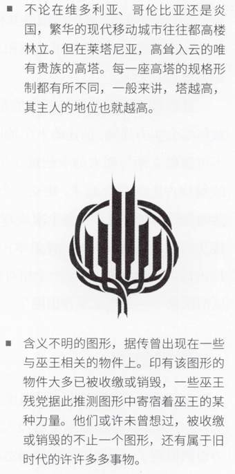

#### 巫王变奏
969一1077年这一百多年时间中，莱塔尼亚由一位强大的术师统治。时至今日，仍有许多人认为这位被称为"巫王"的统治者是泰拉有史以来最强大的源石技艺使用者。
"巫王"赫尔昏佐伦被推举登基时面临内忧外患，但他立刻采取了一系列雷霆手腕，展现了惊世才干与作为明君的远见卓识。他将长期与帝国离心离德的叙拉古切割，承认其独立，随后以镇压国内叛乱为由，将选帝侯们的军队和一部分权力收归帝国宫廷，国内的危机得到迅速解决。当时的莱塔尼亚人将赫尔昏佐伦视作救星，但无人能够预料到未来能有何等恐怖。赫尔昏佐伦继续将权力集中到帝国宫廷，帝国的皇帝在历史上首次获得了超越选帝侯的实权，而后他开始大刀阔斧地改革，在保证莱塔尼亚全域文化一致的前提下，教育和经济行业急速壮大，整个莱塔尼亚在他的带领下蓬勃发展，但这些举措同时也造成了其他贵族的不满。
面对贵族们日益增长的不满，赫尔昏佐伦以强硬的手段对付异见者，结果当然只能招致更激烈的反抗。冲突和对抗不断升级，他的手段越来越残酷，原先镇压叛乱的亲兵此时被用作密探和特务。他在国内大肆搜捕甚至直接屠杀反对分子，莱塔尼亚掀起了旷日持久的腥风血雨，许多骇人听闻的惨案就在此时发生。在这段时间里，赫尔昏佐伦的形象已经和原来民众心中的明君相去甚远。他将自己关在高塔之中，越来越少以国家统治者的身份出现在大众面前。诡异疯狂的神秘主义做派反而让赫尔昏佐伦的追随者们越来越崇拜他，也让其他莱塔尼亚人越来越畏惧他，他们不愿或不敢再以原来的名字称呼他，"巫王"这个如今更如雷贯耳的名号逐渐取代了"赫尔昏佐伦"。震动整个泰拉大陆的高卢-莱塔尼亚战争在1029年打响。为泰拉大地带来深重劫难的大战持续了两年，在诸国往战场填人了千万生命之后，最终以高卢帝国战败灭亡而宣告结束。
虽然赢得了战争胜利，但作为主战场的莱塔尼亚国内仍然遭受了严重的破坏，可此时的巫王不但没有主持大局以恢复国力，反而变本加厉施行暴政，民生凋敝的莱塔尼亚依然笼罩在阴云中。

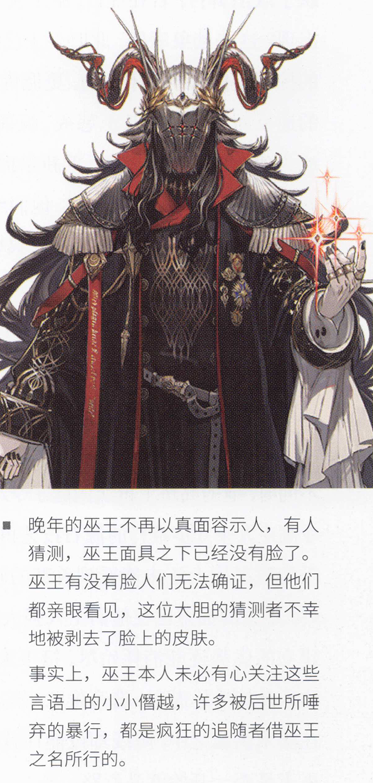

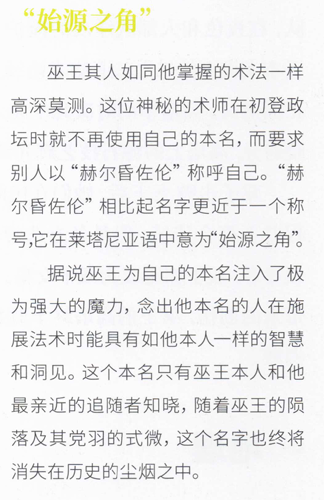

（什么GDR和FRG ∪･ω･∪ 不过我现在真的好奇HG内部的大纲哪里是二战前哪里是现实替换了）
#### 二重协奏
在巫王统治的最后二三十年，陷人癫狂的他终年居于自己的高塔之中，几乎断绝了和外界的一切联系。在这一时期，一方面，国家大权重新落人选帝侯们手里，选帝侯和各级贵族又可以主持自己领地内的大小事务了，其领地之间的许多事项也重新交由选帝侯们自行讨论决定，各个选帝侯宫廷再度成为最大的实权机构;另一方面，莱塔尼亚的文化管控也稍有放松，许多在巫王统治早期被认为是"不人流""不合格""无意义"的艺术形式重新出现，不受巫王掌控的艺术创作者们又开始活动了。这一时期涌现出了一大批至今都具有重大影响的艺术家和政治家，其中最负盛名的是彼时被称为"双子"的莉泽洛特和希尔德加德，也即如今的双子女皇。双子最初作为两位有史以来最年轻的乐团首席而名声大噪，又以和巫王党羽针锋相对的政治立场活跃于政治舞台。若在往日，巫王及其门徒怎么可能放任不受自己控制的声音出现?这些迹象表明，此时巫王已经完全失去了施政的能力，他对莱塔尼亚的控制力也已经大不如前。更能佐证这一事实的是，双子不但没有因为公开的逆反而遭到打压甚至惩戒，反而能够越发频繁地出人各个选帝侯宫廷，成为他们真正的座上宾。重新掌握实权的选帝侯在巫王稍许放松的指缝之间，窥见了莱塔尼亚的希望，他们终于有机会采取进一步的措施，终结巫王所造成的混乱局面。他们坚信，只要巫王的高塔不再存在，莱塔尼亚就能真正地从暴君之苦中永远解脱。
在选帝侯们的支持下，1077年9月，双子率领来自数个大区的联合部队突然出现在首都附近，与驻扎在周围的军队及巫王的门徒展开激战，"九月起义"爆发。选帝侯联军最初取得了不小的优势，向着首都高歌猛进，但正当他们喜出望外地以为巫王已经疯癫至极，连对发生在门前的战争都不闻不问时，他的高塔上再次闪起了令人终生难忘的源石技艺辉光数十年前令高卢大军寸步难行的源石技艺再一次在莱塔尼亚人面前爆发出来。成百上千的联军战士还未能看到首都的轮廓，就在巫王的源石技艺之中化成了灰烬。巫王的拥趸也在他们主人强大实力的鼓舞下越发狂热地作战，联军最初建立的优势逐渐消耗殆尽。接下来六次尝试向首都推进的攻势都被巫王的法术及其爪牙逼退，选帝侯联军陷人了举步维艰的境地。联军士兵接连葬身在法术洪流之中，阵线却没能往首都推进分毫。许多人开始怀疑起来，挑战巫王是否一开始就是死路一条。
就在起义被逼到溃败边缘时，双子决定孤注一掷。她们率领一支精锐部队，在夜色和大部队佯攻的掩护下潜人首都，直奔巫王的高塔。在突破了巫王本人设下的二十二道法术防线之后，双子直接登上了巫王的高塔，与巫王正面对峙。高塔中的对决几乎无人目击，但最终结果世人皆知在黎明破晓时分，高塔上的源石技艺辉光终于彻底熄灭，莱塔尼亚巫王就此陨落。双子击败巫王后，她们在民间和官方的声望都达到了新的高度。尽管过程并不符合传统，但是各方选帝侯仍然一致推举了她们作为莱塔尼亚新的领导者，双子加冕成为双子女皇。两位女皇掌权后立刻着手处理巫王给国家带来的创伤，巫王的高塔终于倾覆，笼罩高贵典雅帝国的百年阴霾终于开始消散。
### 地理
莱塔尼亚地处泰拉大陆中央，毗邻核心圈内多个国家，西南接维多利亚，东隔叙拉古遥望卡兹戴尔，北边是乌萨斯帝国。莱塔尼亚国土上有绵延不绝的山区，东北与西南较高，中间低且山势较为平缓，呈现出一条连接卡西米尔与叙拉古的"走廊"。山间散布的河谷与平原是部落文明向早期城市文明转变的地方，最早的城镇在这里发源，移动城市也在此拔地而起。覆盖莱塔尼亚全境的茂林生长的多为常见的温带树种，植物生长有明显的季节性，体现了莱塔尼亚温和的气候与分明的四季。

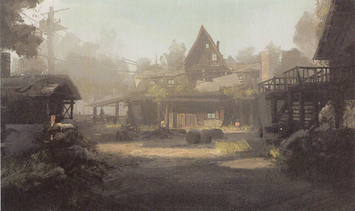

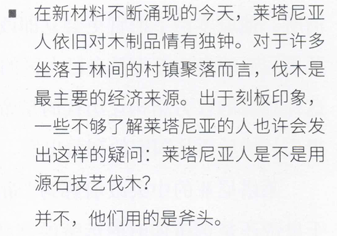

### 政治与军事
#### 政体
莱塔尼亚的政体在学习萨尔贡君主制度的同时亦有自己的发展，诞生出了独特的政治体制，可以简称为"选举君主制"虽然名为"帝国"，但事实上在莱塔尼亚内部运行的是一套联盟系统。建国时的九个地区称为"大区"或者"选帝侯区"，这九个大区的领导人称为"选帝侯"，全国境内只有他们九人拥有选出皇帝的选举权和被选举权。
皇帝对帝国境内除宪章以外的所有法律拥有最终阐释权，同时莱塔尼亚没有严格的监管机制对皇权问责，所以理论上皇帝拥有极大的权力。但是事实上，莱塔尼亚的选帝侯对皇权有着极强的牵制作用。也许皇帝对所有法律都有最终阐释权，但选帝侯们能援引宪章说莱塔尼亚的本质是各大区的联合，各大区会以保证本地利益为先而拒绝承认皇帝的阐释。因此，在莱塔尼亚历史上，除巫王外的所有皇帝实际上并没有非常大的权力。

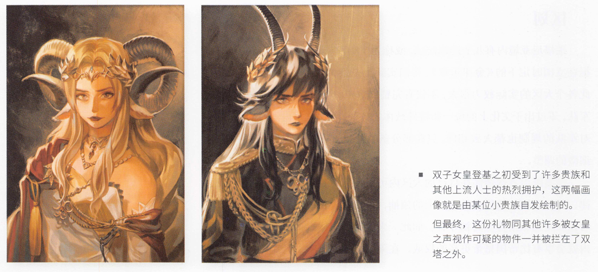

#### 政府
莱塔尼亚没有固定的首都。当皇帝去世或因其他特殊原因卸任，一位选帝侯将被选举为新的皇帝，帝国的中央政府也随之迁移到那位选帝侯的治所，他原本治下的官吏会立即改组，晋升成为新的中央政府官员。因此莱塔尼亚的皇帝首先是自己大区的最高领导人，然后才是整个帝国的皇帝。这样独特的权力结构让历代的皇帝在施政时往往会优先考虑自己领地内的得失，然后再从国家的利益出发，进行政策层面上的调控和治理。
莱塔尼亚的中央政府称为"帝国宫廷"，有着一套宫廷官僚系统，脱胎于皇帝还是选帝侯时的选帝侯宫廷。中央政府成员的任务是辅助皇帝进行决策，代表皇帝传达旨意，以及保护皇帝的人身安全。正如前文所述，历代皇帝基本都拥有专属于自己的官员团队，他们大多是皇帝本人身为选帝侯时治下的文武官员，或是皇帝亲近的人物。此外，皇帝的禁卫军也是帝国宫廷的成员，当今的莱塔尼亚统治者双子女皇的禁卫军被称为"女皇之声"位女皇之声首先是双子女皇的御前乐师，然后才是她们的谕使与禁卫。每个选帝侯宫廷除了日后有可能进人中央政府的特殊机构，如上述的选帝侯卫队、维护宪章的金律法卫之外，其他部门也都大致相同。选帝侯政府里存在两套平行的文武官体系:一套是以当地贵族为核心的封臣系统，另一套是维持政府运作的文官系统，前者的各级只对自己的直属上级负责，后者则要向选帝侯本人负责。在每个大区内，由地方上的各级贵族来总管各地的具体事务。
#### 区划
莱塔尼亚境内有九个选帝侯区，或称为"大区"，最高长官即选帝侯。根据在立国时定下的<<金律乐章>>，帝国实际上是各个大区所组成的邦联，因此各个大区的实际权力很大，不仅有完整的政府，也各自保有自己的法律和军队。不过出于文化上的统一和特殊政体的需要，各个大区内通行的法律和对军队的规制也都大致相同，只在部分条款或是细节上根据地方的不同有细微的调整。
最高统治者选帝侯在自己的大区内可以自行组建政府和军队、制定法律、分封贵族，他们既是政治上的领袖，也是军事上的统帅，甚至是当地居民在文化和精神上的领导者。如此一来，很多时候选帝侯在自己的大区内就会享有比帝国皇帝更高的权威。在莱塔尼亚的历史上，选帝侯为地方利益而拒绝服从皇帝旨意的事件时有发生。
##### 莱塔尼亚九区
组成莱塔尼亚帝国的九个选帝侯区分别是:海登施威尔大区、恩瓦德大区、厄登赫尔大区、鲁珀坎大区、施彤领大区、瓦瑟领大区、福特冈大区、奥施登海姆大区、凯普拉尼亚大区。
#### 法律
莱塔尼亚的根本法律来源于建国时的一纸宪章，这一远古时代九大部落和叙拉古共同缔结的条约有一个极富本国特色的名字<<金律乐章>>，它赋予了莱塔尼亚皇帝统治的权力，也是莱塔尼亚帝国建立的法理基础。在地方上，莱塔尼亚各个大区以<<金律乐章>>规定的世俗道德为基础，保有并发展了自己的法律。不过因为文化、社会和环境趋同，所以各区的法律其实大同小异，只会根据实际情况的微小差别略作调整。这些法律的主旨也都一致:维护社会稳定和优待贵族阶级。

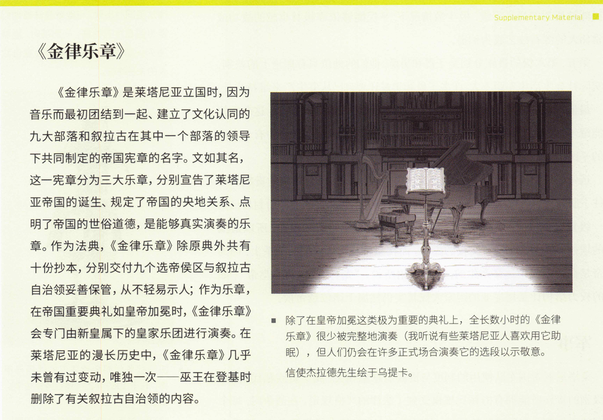

#### 贵族
莱塔尼亚的贵族体制与帝国政体一同确立，一共有七个阶级，法律规定他们是国家权力的核心。因为贵族们传授知识与技艺、管理领地、生活起居的场所多在独立的高塔中，所以他们又被称为"高塔贵族"。
宪章规定，帝国皇帝本人为最高一级的贵族，是帝国的最高统治者，理论上拥有绝对的权力，然而由选举产生的皇帝在实际统治中往往受选帝侯的牵制。
皇帝之下的第二级贵族是选帝侯，这一头衔是建国时除叙拉古外的九大部落领导人的改称，他们是自己大区内的最高统治者，也是最掌握国家实权的一批人。其他国家的人会称呼选帝侯为"大公""公爵"或者"亲王"，但实际上这是文化差异导致的误读。选帝侯们的实权经常超过帝国的皇帝，所以他们在莱塔尼亚的社会地位可能高于维多利亚国内的公爵和乌萨斯国内的大公。
第三级的贵族是侯爵，他们最初大都是受封的大地主，协助所属大区的选帝侯管理治下的大量土地资源。
第四级的贵族是伯爵，这个等级的贵族能够拥有自己的庄园，能够进行大规模的生产。莱塔尼亚境内的各大工厂基本都是伯爵们的产业。伯爵也是平民能被册封的最高等级，极少数情况下，平民能够依靠极其卓越的战功或非常伟大的源石技艺成为伯爵。
第五、第六级的贵族分别是子爵和男爵，他们的地位只有理论上的差别，在实际社会生活中差距不大，许多子爵和男爵还要自己从事生产来维持生计。最低一级的贵族为埃德勒，他们的地位近似于乌萨斯的勋爵，这个爵位不能继承，也没有实际的政治或军事意义，仅仅用来封赏在社会中有一定成就的平民。
选帝侯们可以册封第三级的贵族侯爵，自此以降，每个级别的贵族都可以往下册封比自己低级的贵族，一直到埃德勒，每个贵族都要向册封自己的二一级贵族负责。但如此不断分封也会削减受封者的实际权益，所以最低级的埃德勒几乎成了没有实权的虚衔。而在皇帝与选帝侯们的关系上，因为皇帝是在选帝侯中选举产生的，正如俗语所说，"先有诸侯，再有皇帝"，如此的权力结构让莱塔尼亚的国家大权其实仍然属于诸位选帝侯。

##### 金律法卫
莱塔尼亚国内维持着独特的军事法术研究与训练体系。在组建军队时，各级贵族对军队的训练方式不尽相同，但所有军人都必须参加一次专门针对军事法术的适应性测试。适应性测试结果良好者将被抽离贵族军队，送往单独的训练场所，接受特殊操练。在一段时间后，这些士兵会被训练成莱塔尼亚各选帝侯麾下最强大的常规作战部队金律法卫。这些身着重型护具，手持双手巨剑的强大施法者拥有的不只是惊人的单兵中近距离作战能力，当一定数量的金律法卫同时出现，可能就意味着他们要将源石技艺共联，一到那时，能够湮灭一切的毁灭性法术即会宣告敌人的末日降临。

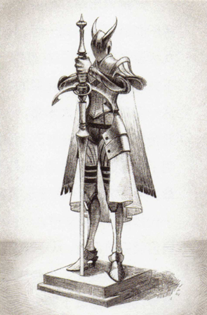

四国战争时期金律法卫的武器与甲胄，刊于1089年的<<泰拉博物馆学>>杂志。
双手巨剑是金律法卫的标志性武器，但在不同时期、不同选帝侯麾下，金律法卫的武器形制也大不相同，很多金律法卫所持的武器都不符合人们对"剑"的直觉想象。莱塔尼亚人将金律法卫军团的共联法术描述成一场盛大的交响乐，不同形制的武器发挥了不同乐器的功能。图中描绘的这种无锋无尖的钝剑通常被形容成打击乐器，是专门针对高卢的重装方阵设计的，在四国战争中发挥了至关重要的作用。

#### 军事
莱塔尼亚帝国军队使用的制度与贵族们息息相关，属于贵族私兵制。每个级别的贵族所能拥有的私兵规模受到了法律的严格规定。在战争时，每个级别的贵族都是自己军队的领袖，同时需要向自己的上级贵族负责，接受上级贵族的指挥命令。
因为莱塔尼亚人在源石技艺方面的高超造诣，术师在军队中具有尤其重要的地位。贵族们在建设自己军队时着重培养的，也是具有出众源石技艺才能的术师。除此之外，莱塔尼亚的源石技艺普及程度在整个泰拉都堪称顶尖，即使并非专业的施术者，莱塔尼亚军人也多多少少会使用一些简单的源石技艺，他们在接受训练后就能成为术师，水平往往也能超过其他国家军队中的普通术师。因此，莱塔尼亚的军队中经常出现全部由源石技艺使用者组成的部队。莱塔尼亚的金律法卫军团在战场之上爆发出的源石技艺的光辉能够点亮整片天空，是最让其他国家畏惧的一支力量。
不过，上述都不是莱塔尼亚军队最精锐的部分。帝国军队中甄选最细致、训练最严格、装备最精良的部队是皇帝本人的禁卫军。严格地说，皇帝的卫队应该属于帝国宫廷的一部分，向皇帝本人负责，只听从皇帝的号令，不受大区法律辖制，这可以视为皇帝有别于选帝侯的一种特权。
### 经济
作为核心圈内的老牌强国之一，莱塔尼亚在帝国的早期就发展出了依托河谷平原的发达农业。因有出类拔萃的源石技艺，莱塔尼亚人在山地之间创造的农业产出不输于平原。对文化艺术的热忱也让莱塔尼亚的艺术教育产业很具有地区特点，比如画廊、音乐厅等，其实都诞生自莱塔尼亚，泰拉大地上最大的美术馆和音乐厅也位于莱塔尼亚。近代以来，地处大地中央的莱塔尼亚接受了来自周边各国，尤其是维多利亚的科技成果，凭借自己雄厚的经济底蕴和源石技艺传统迅速地在结晶工业时代中建立起完整的产业链,为后来敢于迎战高卢帝国奠定了经济基础。不过，经历了高卢-莱塔尼亚战争、四国战争及巫王的疯狂统治之后，整个国家的基础受创，至今仍处于恢复期。
不管在历史上的哪个时期，莱塔尼亚的经济发展都严重依赖源石技艺的使用，而帝国的源石技艺和各种资源绝大多数掌握在贵族们的手中，因此莱塔尼亚的绝大部分产业都与贵族有紧密的人身依附关系一生产条件为贵族所有，生产出的产品也都属于贵族。

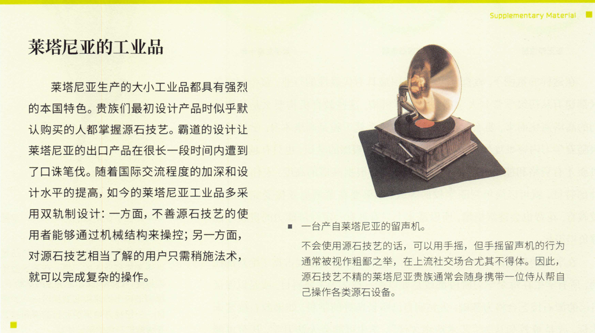

### 文化与社会
莱塔尼亚整体社会风貌的塑造离不开源石技艺和文化艺术。莱塔尼亚人会永远记得，将他们团结到一起的正是流传千年的源石技艺和承载这一脉技艺的优美艺术。出于各种各样的目的或是为了延续源石技艺，或是为了追求高雅文化，又或是为了启佑乡邦，给莱塔尼亚乃至整个泰拉大地开拓新的可能，世代的莱塔尼亚贵族总是心怀着一种尤其高尚的情操。他们以自己的高塔为基点，向平民们传授自己掌握的源石技艺,教他们优秀的文化，并努力地研究精进自己的源石技艺。从皇帝本人到最低级的贵族埃德勒，莱塔尼亚很难得地将这种意识保持了千年之久，并在千年的交织融合过程中把源石技艺、艺术文化与莱塔尼亚紧密地联系到了一起，使莱塔尼亚国内洋溢着崇尚知识的气息，成为求学者们魂牵梦绕的目的地。
在这样的氛围下，教育自然成了帝国最具有代表性的行业。整个国家各区都建有从初级学堂到大学的各级教育机构，这些教育机构要么是从贵族们的高塔演化而来，要么依托高塔建立，要么就干脆是高塔本身。学校的等级随着学习内容难度的加深而逐渐提高，而越艰深的学识，也只有越高级的贵族才有资格和能力进行传授、探讨、研究。根据高塔的高度、宏伟程度等外部特征，就可以简单判断学校的等级。如果要在莱塔尼亚接受完整的学校教育，花费也会逐级倍增，所以基本上只有具有一定经济能力的贵族才能够负担得起。
在学校的教育体系中，源石技艺的传授和各类艺术课程占据了绝对的比例。所有学生在每个学习阶段都或是要以源石技艺为主要科目，或是以保证自己的源石技艺合格为基础，去钻研自己所长所好的学科。如果源石技艺未达标，或是被教师认为"艺术造诣欠佳"，学生可能会无法升学，甚至可能被迫中止学海漫游。学校里主管各项事务的也都是贵族，笔者在威廉-赫尔佐格大学攻读博士学位时师从的诸位教授无不拥有自己的高塔，以衬他们在各自领域的卓越建树。
莱塔尼亚人总是过分强调自己对音乐的热爱，然而许多考古发掘成果显示，自前帝国时期开始，诸部落之间共有的审美远不止音乐，相同风格和形式的诗歌、绘画等也在不断复现，这证明"莱塔尼亚"作为一个文化整体的起源比他们自己声称的还要早许多。我们之所以可以把远古时期庞杂的文献和文物整理归结，得出这个结论，是因为所有的发现无一例外全部具有明显的源石技艺特征，这也说明人类对源石技艺的利用可以追溯到更古老的年代。
对知识、艺术的长久崇拜在泰拉堪称奇迹，莱塔尼亚人几乎是天赐一般地对源石技艺和艺术鉴赏有着超越其他民族的敏感。雅致的民族性在如今的莱塔尼亚也得到了极好的传承。不过莱塔尼亚人对文化的热爱是克制而冷静的，比起单纯的语言上的雄辩和争论，他们更赞赏使用艺术表达传递出冷峻的激情，而他们认为最适合寄托自己情感的艺术，就是莱塔尼亚的古典音乐。各处都能见到讨论音乐、哲学和源石技艺的居民，各处都能看到露天的音乐演奏，就算在巫王的时代，整个莱塔尼亚也似乎永不间断地沉浸于悦耳动听的乐曲中。
今天的莱塔尼亚有三千二百万国民，其中有一千万人居住在移动城市里。值得一提的是，莱塔尼亚的社会由源石技艺造就，对矿石病感染者的态度相较于核心圈各国来说略为宽容，但这并不意味着莱塔尼亚各地政府不歧视感染者。为了便于管理，感染者们会被划分在单独的社区居住。

#### "学士"路德维格
距今300一360年前，莱塔尼亚九大选帝侯区中的恩瓦德大区曾有一位统治者名为路德维格。这位绰号为"学士"的选帝侯对知识和艺术的热爱达到了空前的高度，对传道授业也有着一种异于常人的使命感甚至超越了对统治的责任心。路德维格近乎狂热地把自己的知识不分尊卑地教给愿意学习的莱塔尼亚人，是第一个将自己的高塔正式确立为"大学"的贵族。他认为，只要所有人都"掌握极上的知识"，"大地对莱塔尼亚便再也无可掣肘"。路德维格因此在彼时的莱塔尼亚平民间具有极高人望,当皇帝去世，希望他就任新君的意愿在民间占据了上风，但路德维格在选皇前夜突然发疯暴死，而这也成为帝国史上未决的悬案。路德维格墓地所在的乌提卡领迄今仍有纪念活动。

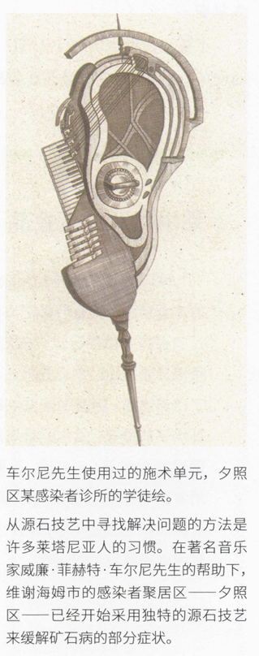

#### 莱塔尼亚歌剧
莱塔尼亚歌剧是融合了莱塔尼亚音乐、文学、绘画等艺术形式的综合性表演艺术，是表现莱塔尼亚灿烂文化的最佳体裁之一。从歌剧本身的剧本写作、音乐编排，到乐团乐器、表演形式，再到欣赏歌剧的舞台剧场，正统的莱塔尼亚歌剧中处处都有源石技艺精心加附，在事实上构成了一种传心感知系源石技艺的密集阵列，能够把丰沛的激情传达到观众的心中。有学者猜测，也是出于这个原因，莱塔尼亚的歌剧特别容易让人沉迷。在巫王陨落后的二十余年间，有大量的剧本以他为原型而创作又秘密上演在这些剧本中，能施展无上法术的巫王是莱塔尼亚最伟大的君王。

### 结语:帝国交响
莱塔尼亚这个由源石技艺而生的神奇国度创造了令人惊叹的奇迹，也见证了近代百年来无数的苦难。随着阴云散去，曙光乍现，莱塔尼亚将要如何续写自己的乐章?

## 乌萨斯

### 概览
乌萨斯帝国，是雄踞于泰拉大地北方的老牌军事帝国，以其恶劣的环境、坚忍的人民和雄厚的军事实力著称。这片土地原先属于名为"骏鹰"的黎博利神民和他们的骏鹰王国。但距今约一千年前，乌萨斯在传奇勇士伊戈尔的领导下，起义推翻了骏鹰的统治，他们以自己种族的名称重新命名脚下的土地，建立了乌萨斯帝国。
在这之后的一千年中，帝国始终保持着强大的军事传统，伊戈尔大帝的后裔将乌萨斯的军刀带到了泰拉大地各处。但今天，一系列严重的政治与社会危机正将庞大的帝国推向剧变的转折点。
### 历史

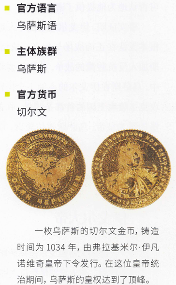

#### 乌萨斯建国
这片土地的历史远比乌萨斯的统治更长久。最早在泰拉北方的山地丘陵建立起文明国度的是一批黎博利神民，他们迫于萨卡兹的威胁迁居于北。他们自称"骏鹰"，并用自己的名字命名脚下的这片土地，是为骏鹰王国。彼时骏鹰贵族居住在山间的巢堡之上，睥睨山下大地的众生，征召其他"低等种族"作为自己的仆役和武装，被他们征为苦役的先民种族的实际地位极为低下。在这些先民种族中，最具代表性的就是与黎博利骏鹰一同迁徙到大地北方的乌萨斯。他们身体健壮，比骏鹰们更早地适应了北方严酷的环境。但这没有为乌萨斯争得理想的境遇，反而让骏鹰把更高的要求、更艰苦的工作强加于他们。
怒火在乌萨斯心中积郁了数百年，直到梦魇可汗将铁蹄踏上骏鹰的领土。骏鹰贵族们疯狂地压榨本就饱受苦难的乌萨斯，短时间内仓促组织的防御不堪一击，梦魇大军肆虐全境，横行无阻。乌萨斯见证了骏鹰的无能和软弱，若放任骏鹰随意支配这片土地，那么生活在这里的所有人都只能和他们一起沉沦。小规模的反抗在梦魇可汗挥师离去之后逐渐涌现。骏鹰虽然意识到了王国内部与日俱增的不满情绪，但他们既没有解决国内问题的想法，也不具备彻底平息叛乱的能力。于是，一场即将席卷全国，并将永远改变这片土地命运的浩荡起义在骏鹰贵族们的眼皮之下暗暗酝酿，而领导这场起义的，是一名乌萨斯族的军官，即后世著名的伊戈尔大帝。伊戈尔大帝是当时少数获得了骏鹰册封的异族军官。他在很年轻时就被骏鹰强征，加人了军队，最初只是充当随军杂役，但过人的战斗技巧和指挥天赋让他迅速被提拔为军官。在之后的岁月里，伊戈尔屡建战功，鲜有败绩，赢得了骏鹰贵族的赏识，也让他在军队和乌萨斯族人的心中积攒起了传奇威望。在起义的前期谋划和推翻骏鹰的战争中，伊戈尔的这个特殊身份不可否认地为他提供了诸多便利。
事实证明，伊戈尔大帝的个人魅力与军事才能也确实非同凡响，骏鹰们根本无法在正面战场与起义军抗衡。伊戈尔的节节胜利让越来越多的乌萨斯加人反抗骏鹰的战争，他们誓要将这片由他们耕耘的土地夺回到自己的手中。乌萨斯在伊戈尔的率领下全民皆兵，经历了四年的拉锯战，终于在31年攻克了骏鹰王国的首都圣骏堡。在部将的热烈推举下，伊戈尔于同年在圣骏堡加冕为皇帝。乌萨斯效仿骏鹰，以自己的名字称呼新生的国家，乌萨斯帝国就此诞生。

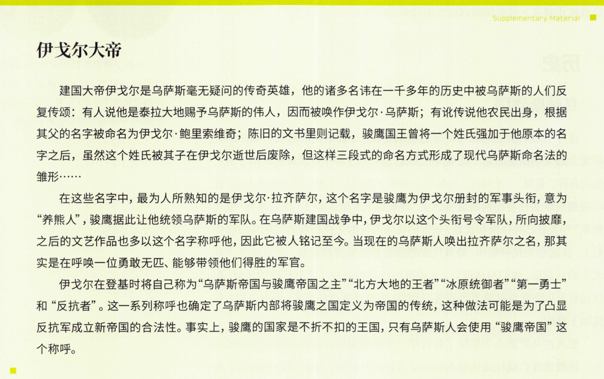

#### 帝国征服史
自建国之日以降，乌萨斯对外扩张的步伐就从未停止。伊戈尔从骏鹰手中夺取的古国最多只包含如今帝国疆域中部的山地丘陵一带，帝国目前的巨大版图其实来自后世一千年的征伐。
伊戈尔大帝加冕之时，敌对的骏鹰势力仍未被完全消灭，所以他没有与民生息，而是继续率军进攻不愿投诚的骏鹰，力求为帝国创造安定的发展环境。这项任务没能在伊戈尔大帝有生之年完成，他在攻打东部山脉的漫长战斗中与骏鹰残党僵持了二十余年，传说最后在军帐舆图之前溘然驾崩。伊戈尔的长子阿列克谢.伊戈洛维奇在军中即位，承接了父皇未竟的事业。"少年皇"阿列克谢把"东征"确定为帝国的基本战略方向，将彻底消灭骚扰乌萨斯的骏鹰残党作为最终的目标。这一国策一共延续了三代皇帝，持续近百年时间。
旷日持久的东征后来演变成了乌萨斯帝国延续千年的扩张战略，伊戈尔大帝传予继任者的弯刀指向大地各处。当乌萨斯帝国大军浩荡远征，军刀不会分辨刀尖所指的敌人。乌萨斯的人侵对其他国家来说是灭顶之灾他们的财物遭到掠夺，领土受到侵占，文化遭到破坏。有很多文明没有留下任何遗物，就这样永远消失在了历史上。乌萨斯帝国的军刀斩断了这些文明的根源，直到泰拉北方的大地只剩下乌萨斯人响亮的战吼。曾经活跃于泰拉北方大地的萨米诸部落一度生活在今乌萨斯境内西北部的地区，在乌萨斯军队的不断威逼下，他们败退到了大陆极北靠近无尽冰原的地方才得以存续。但帝国的征途也并非一帆风顺，在西拓的过程中，乌萨斯遭遇了强大的对手卡西米尔。卡西米尔与乌萨斯有着相似的起源，但拥有更精锐的骑士团。彼时乌萨斯征募兵勇的方式相当简易，配发的武器装备比较落后，专业军事训练更是无从谈起，这种剽悍骁勇的作战风格让乌萨斯军队在初战卡西米尔时蒙受了重大损失;与此同时，乌萨斯国内仍然采用骏鹰留下的古老制度，从国内送往前线的补给严重不足。这两方面的因素导致了乌萨斯在第一次乌卡战争中的失利。
这一次战争的惨败促成了乌萨斯第一次军事改革，议会、省级行政区、法律等也因此得以确立，乌萨斯的战争机器获得了前所未有的活力，并在此后千百年中数度向卡西米尔发起挑战。
军事上的胜败都不能让乌萨斯停下对外征战的脚步，只会让帝国变本加厉地往战争的方向奔去。自第一次军事改革之后，乌萨斯的历代皇帝对军队和国家施行了大大小小数十次改革，但每一次的变革都没能让国家焕然一新帝国军队的规模有增无减，开疆扩土的势头有增无减，功勋贵族的力量有增无减。

#### "大叛乱"   
（什么彼得大帝 ∪･ω･∪）

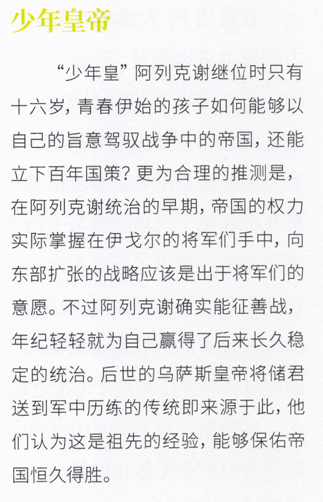

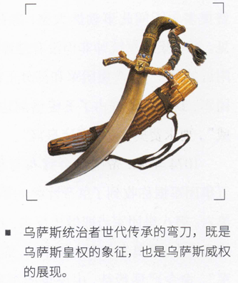

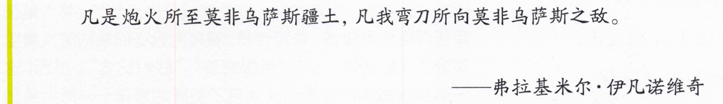

给帝国带来沉重创伤的"大叛乱"在乌萨斯先皇的时代就已经出现端倪。先皇弗拉基米尔.伊凡诺维奇亲历过四国战争。他在这场前所未有的战争中见证了高卢源石技术爆发出的强大生产力，并利用战后接收的高卢技术开启了乌萨斯最强盛的时代，力图将乌萨斯打造成一台攻无不克的战争机器，以实现自己征服四方的伟业。
在他治下，大量源石军工厂拔地而起，乌萨斯的国力和军力急速攀升。然而，与飞速增长的经济相伴诞生的还有许多非军方背景的"产业贵族"，这让以旧贵族为代表的军方势力非常不满。无论如何，乌萨斯的军事实力如弗拉基米尔皇帝所愿暴增。他迫不及待地发动了第九次和第十次乌萨斯与卡西米尔之间的战争，把卡西米尔的防线逼退了近百千米;他加剧了对萨米的打击，让他们只能迁徙到更寒冷的冻土;他还想把战争引向南方的莱塔尼亚和遥远的东国，甚至有传言他已经秘密地把自己的战线画到了伦蒂尼姆的城下......
乌萨斯于他在位的几十年间一刻不停地飞速运转，倾泻出似乎永无休止的战火，自北方为大地带来了深重的浩劫。帝国的力量随着工业增长和战争胜利越发膨胀，皇帝在国内的声望达到顶峰。但乌萨斯没有察觉到频传的捷报之下隐藏的危机，皇帝也没有意识到他的野心即将戛然而止。在乌萨斯与东国的战场上，东部集团军群于1072年血峰战役中突如其来地迎来了惨败，草草撤军。弗拉基米尔皇帝因这场离奇的战败遭受了重大打击，他本人从此身患重疾，不到一年就撒手人寰。弗拉基米尔的儿子费奥多尔是一位锐意改革的皇帝，登基之后立即着手削减军队的权力。他一方面大量起用非军事背景的议员，另一方面严格限制集团军属地的扩张规模，甚至提出了"改地为省"的策略。
1074年夏季，一队兵痞和一位贵族在临近圣骏堡的格里高利省的一间酒馆内发生肢体冲突，士兵们将贵族殴伤，却要求省议会处罚贵族，这引起了社会各界的强烈抗议。冬季，第六集团军称抗议为"内乱"，发兵占领该省，以"助长内乱"为名把省议会全员按军法处决。费奥多尔听闻此事勃然大怒，急召第六集团军统帅觐见。第六集团军统帅非但没有遵旨面圣，还通知屯驻在附近的第三、第八集团军和部分正在换防途中的第四集团军，共同行动强占了圣骏堡周边三省，号称"重塑军威"，要求费奥多尔"出让皇宫"。
1074年末，帝国议会宣布与集团军调解失败，第五集团军据称收到了皇帝旨意,向第六集团军发起攻击。第六、第八集团军当即做出反击，并开始围攻圣骏堡，炮击皇宫。费奥多尔向全国下诏，痛斥四个集团军为"叛军"，命令严惩叛徒。中央集团军死守圣骏堡，直到次年春季，第二、第七集团军从卡西米尔前线回援赶到，同叛军展开激战。圣骏堡的战火点燃了整个乌萨斯，烈度极高的内战全面爆发。战争持续到了1076年冬季，最终以第六、第八集团军被全歼，叛乱遭到镇压而告终。这场战争被乌萨斯官方称作"大叛乱"，对帝国产生了全方位的影响:在大叛乱中,数以百万计的乌萨斯军民失去生命，无数工业设施被摧毁;第六、第八集团军被当作叛乱的主谋，编制遭到裁撤;集团军属地被重新分配，作为叛乱同谋的第三、第四集团军被发配到偏远的边疆地区，勤王有功的部队接管了剩下的土地;拥护皇帝的旧贵族借机发声，要求重获议会的多数席位......在接下来的二十余年中，贵族派系之间的政治分歧、愈演愈烈的感染者危机以及严重的社会不公平暴露在所有人面前，成为不容忽视的问题，帝国面对的一系列困境逼迫着费奥多尔皇帝做出选择。

##### 血峰战役
......战争开始以来，军中对作战的消极态度就极为明显。我部原本奉命掩护第九、第十重装兵团和第十七炮兵团也是我弟弟所在的部队对敌方城镇展开突袭。但是我们和这些部队就位半个月后，仍没有接到师参谋部下达的进攻指令。我们以为行动取消了，在驻地又等待了一个星期，但既没有进攻命令，也没有撤退指令，后来连补给辎重都开始出现问题。我的直属上级安德烈大尉非常疑惑，他曾去集团军总参谋部述职，他说他看到总参谋部有成堆的锦缎信封，应该都是从圣骏堡送来的皇命，但一封也没有打开，长官们也只是笑着对他说"原地待命即可"。我们在驻地没头没尾地干等了一个多月，战舰几乎要陷进地里。我们甚至听说第六集团军接到了撤退的命令，已经开始大规模撤出战场，但这根本不可能。恐惧突然吞噬了我们，我们害怕的不是敌人，是自己见到了帝国本不该存在的暗面......
一第四集团军第二特别师第五炮兵团中尉尤里.扎伊采夫的回忆录

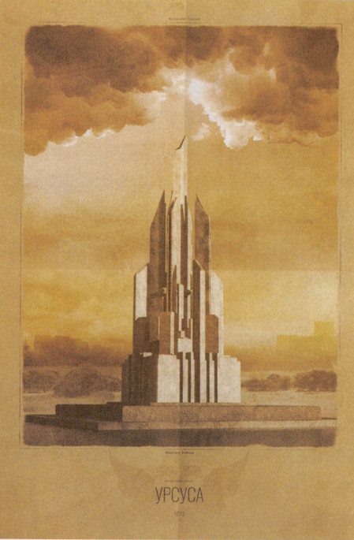

第六集团军英雄纪念碑，兴建于1072年，落成于1073年，后在"大叛乱"中被推倒。在血峰战役中溃败后，第六集团军铩羽回到圣骏堡。依照传统，皇帝为远征归来的第六集团军设立了纪念碑，上书"帝国凯旋""胜利纪念"。然而，这一举措因战事的惨痛结局而有了别样的意味第六集团军将这座棱角分明的纪念碑视作皇帝对他们的侮辱，尽管当它落成时，皇帝本人已然撒手人寰。

### 地理
漫长的征服和开拓战争史让乌萨斯帝国在泰拉大陆的北方拥有极为广袤的疆域。帝国整体的地势西低东高，自西向东从面积广阔的平原到低矮崎岖的丘陵，再到高耸巍峨的山脉，总体形成了近似于阶梯状的地理分布。气候上，受北部冻原的影响，乌萨斯总体具有一系列寒带气候的特征。越远离冻原的南方，寒带特征越弱，北风不敌温暖的空气，温带大陆气候占据上风;越靠近北部冻原，气候越发寒冷，冬季越发严酷漫长;另有东部高原的一部分山区呈现出高原气候区的特点。

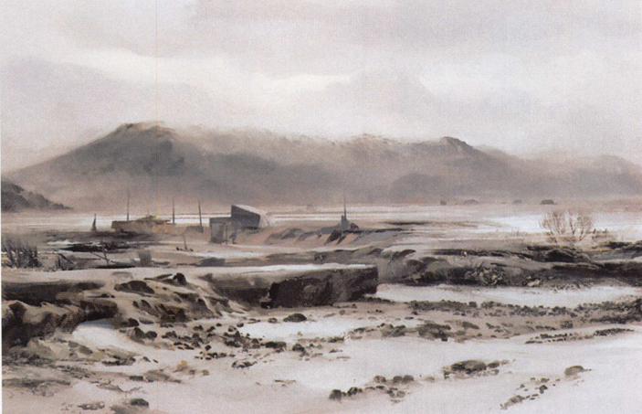

乌萨斯北部的广袤冻原，气候恶劣，泰拉常见的粮食作物大多无法在此存活。冻原上的乌萨斯人依赖一种被称作"苔麦"的作物果腹。苔麦本身是一种耐寒的苔藓植物，其孢子结构形似麦穗，在成熟前可食用，成熟后则会变得干瘪、苦涩，并有轻微毒性。由于产量小且对收割时机要求严苛，苔麦的收成并不稳定，冻原居民也因此常常面临饥荒。

乌萨斯帝国控制区的边界在西、南、东三个方向分别与卡西米尔、莱塔尼亚和炎国相邻，北部边界则逼近萨米及无尽冰原。大片的土地在过去一千年的征战中被纳人帝国的版图，其中有相当一部分区域还未得到充分的开发和治理，但乌萨斯的刀锋仍然直指帝国之外的大地，意图将帝国的势力延伸到更加广阔的地方。
### 政治与军事
#### 乌萨斯皇帝
乌萨斯深厚的君主专制传统脱胎于其战争建国的起源。乌萨斯的皇帝对整个帝国拥有军事统帅对部下一般的权威，他的每一个决策都代表着帝国的最高意志，皇帝所指即帝国的刀锋所向。在军队中，违抗统帅命令是最严重的罪行，而在乌萨斯，任何违背皇帝意志的举动都被视为是对整个帝国的最大背叛，必将受到最严厉的惩罚。
拥有最高权力的皇帝同时是帝国议会和帝国军队的领袖。议会从议员到议长都要向皇帝负责，各行政区的长官也要服从中央的命令。对于帝国军队来说，皇帝是至高统帅，每支集团军都需要定期向皇帝报告军队近期的动向和未来的规划，进行重大军事活动也要先获得皇帝的首肯。
通过战争建立起来的权威让帝国呈现出一种举国皆兵的气质，皇帝统领这支军队，胜败得失全取决于皇帝一人，所以皇权的维系严重依赖皇帝本人:英明的皇帝能够带着帝国百战百胜，如此部下会服从他，他会享有很高的威望;然而当君主无法带来胜利，或是不能做出表率时，则难免会遭到质疑。1072年，乌萨斯在侵略东国的战争中未能取胜，反而丢失了领土，这在当时的乌萨斯帝国内部引起轩然大波，帝国秩序乃至皇帝弗拉基米尔.伊凡诺维奇的地位都因此动摇，这也为后来的"大叛乱"埋下了祸根。
#### 帝国军队
乌萨斯军队的正式名称为"乌萨斯帝国军"。不过帝国军极少作为一个整体采取行动这对泰拉诸国来说，算得上是一件幸事。乌萨斯军队的最高一级编制是集团军，其指挥官拥有特殊军衔，名为"集团军统帅"。每一支集团军大致的作战方向由皇帝确定,皇帝会将旨意直接传达给集团军统帅，具体的战略方针由统帅和集团军参谋部研究决定，实际上拥有比较高的自主权。多次军事改革后的帝国军原有九支集团军，但在"大叛乱"中，第六和第八集团军遭到了整建制歼灭，随后被撤销编制。目前，帝国一共拥有七支集团军。按乌萨斯官方的说法，如果发动战争动员，每支集团军都能在短时间内将兵员人数扩大到百万级别。
崇军重武的传统让乌萨斯历来重视军队的建设。领导军队的军事贵族把部队的实力看作自己权力地位的来源，更是丝毫不敢松懈。乌萨斯的军队有完整的征募和操练的体系，对于军官也有成熟的培训方法，毕竟处于连年征战中的帝国需要尽快用上每一把刀、每一门炮。受到南方邻国莱塔尼亚的影响，帝国也很早就将源石技艺运用于征战之中，战争术师是重要的编制，有专门的学院和术师教官研究和教授军用法术。

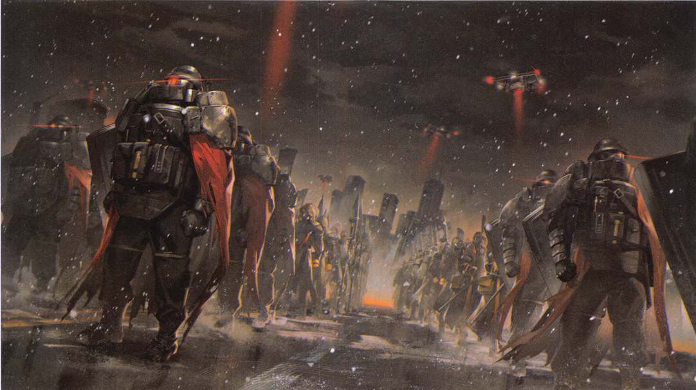

乌萨斯军队的最前线通常是身穿厚重铠甲的盾卫兵团和百战老兵，在他们身后，重型无人机轰鸣起飞，引导帝国战舰的火炮对目标进行不计成本的轰击。帝国军队对坚甲重炮有着近乎狂热的崇拜，对于乌萨斯的军人来说，冰冷的铠甲和盾牌能够断绝身为人类的自己与非人的战场之间的联系，而灼热的炮膛和烈火则能够烧尽所有的怯懦和软弱。
#### 帝国议会
乌萨斯帝国议会的议员主要有两种来源:一种是皇帝提名的贵族代表，另一种是由各省议会推举、由皇帝任命的帝国代表。皇帝领导议会行使作为乌萨斯最高立法机构的职能。乌萨斯帝国议会在第一次乌卡战争后设立，与帝国议会一同建立的还有省级行政区和地方议会，它们都是第一次军事改革的成果。最初的一部分议员和省官员是撤销了编制的退伍军官，另一部分是仍任军职的军事贵族。
在很长的时间里，乌萨斯议会其实是服务于军队的，所以军方在议会中有极大的话语权，议会的职能与实权也和现在相差甚远。帝国议会获得实际权力是在大量的产业新贵被推举为议员之后，现任议长伊斯拉姆.维特就是这些新贵族之一。
#### 区划
乌萨斯帝国目前的主要行政区划为省，每个省下辖的土地上都有数个固定聚落和移动城市。省的最高行政长官为省长，由皇帝亲自指派。省长组织数个下属移动城市的贵族代表组成省议会，领导该省的各个行政部门，同时省议会也负责选出该省的议会代表候选人至帝国议会，供皇帝任命。
在省级行政区划之外，还存在着完全独立于省级行政区划、不受省长与省议会管辖的集团军属地。集团军属地除充当军队的常设驻地之外，也是旧贵族(或称"功勋贵族")的封地。在集团军属地内，有与省完全不同的一套行政和法律体系，很大程度上由集团军统帅和参谋部按作战需要制定。在先皇弗拉基米尔在位的年代，他将土地作为军功的奖励，集团军属地的规模也随着乌萨斯的对外扩张而急速扩张。
#### 贵族
乌萨斯贵族等级制度的起源与帝国的军功赏赐密切相关。古时候，乌萨斯的皇帝或是王公常常给自己的亲兵或参谋册封爵位，爵位大小与赏赐多寡由军事成就的高低直接决定。就算是皇室家族之中的地位高低，有时候也是取决于战友关系而非亲缘关系。其他在战场上战功卓著的平民军官也有可能赢得大公们的青睐，从而跻身贵族行列。千年承袭的军功爵制激发了乌萨斯帝国军人们异常高涨的作战热情，也让勋贵的群体在漫长的历史中不断膨胀，这些人就是所谓的"旧贵族"。
在弗拉基米尔统治的时期，随着源石工业的发展和移动城市的兴盛，新鲜的血液开始进人贵族阶层。皇帝为工业发展制定"作战方针"，把从事工业生产者称为"产业士兵"，他们的军功大小以产出的多寡来衡量。非军事出身的富有者可以通过缴纳巨额税金晋升为"产业贵族"，即"新贵族"。
有趣的是，虽然总体上矛盾冲突不断，但功勋贵族与产业贵族、旧贵族与新贵族之间并非那么泾渭分明。军事功勋的继承实际上不利于维持贵族阶层人数的稳定，在此前提之下，不少旧贵族在"大叛乱"后开始了他们的"投资"以集团军的名义开设矿场和精炼厂;新贵族家庭也热衷于让青壮年加人军队，通过赢得功勋的方式提升在贵族阶层中的地位。
#### 法律
乌萨斯帝国有着相当严苛的军法，它可能也是乌萨斯唯一被严格执行的法律。在军队中赢得战功者自然能获得丰厚奖赏，但与之对应的是，触犯了军法条例的人也会遭到非常严厉的处罚。"军法处置"是乌萨斯各级军官乃至王公贵族都最恐惧的判罚，有时无需实际执行，就能够起到惩戒犯人的作用-有犯法者在军事法庭正式的判决下达之前，就因为畏惧惩罚而自杀。乌萨斯军法有此等威慑力有赖于军方的强制力，军事法庭全由军官和勋贵主持，所以大部分时候，所谓的"军法"只不过是上级军官的命令罢了。军法之外，看似武力横行的乌萨斯帝国其实也有比较完整的通用法律系统，立法、司法、执法机构一应俱全。各省、各个移动城市都有自己的议会、法庭和军警部门。但是，这一系列法律机构并不享有充分的独立地位，因而在实际运行中与官僚行政机构关系密切。除了实际负责的贵族官僚之外，皇帝本人也有权直接干预各级法律系统运行的任何一个环节，甚至能以谕旨的形式直接下达其作为最高统治者的判决。但皇帝直接干预司法的例子比较罕见，大多出现在协调贵族派系纠纷或发布皇帝特赦令等情况下。
#### 经济
军事工业毫无疑问是乌萨斯最重要的支柱产业，其技术与规模都在泰拉诸国中排名前列。在先皇统治的时期，他以对待战争的态度发展乌萨斯的工业，疯狂地为乌萨斯这台战争机器打造零部件。大部分的主要城市脱胎换骨，成了工厂林立的工业基地。这些产业要么接受旧贵族的投资而获得发展，要么其所有者在后来获封成为新贵族，基本上都归贵胄人家所有。在各省、各移动城市之间，工业化的发展规模也有差别，其中帝国首都圣骏堡是帝国最重要的工业中心，东部各省各城市次之，西部发展最慢。
军事工业之外，源石开采和金属加工这两个与之紧密相关的产业在乌萨斯也非常发达。乌萨斯辽阔的土地下蕴含着丰富的矿物资源，但大多集中在环境恶劣、与卡西米尔和萨米相邻的西部地区，这片地区受到集团军的牢牢掌控，开采权也都为集团军所有。被发配到西北矿场的苦役在冰天雪地之间日夜劳作，他们面朝漆黑的矿石，背靠惨淡的浓云，他们的血汗被源源不断地输送到帝国中部和东部的工业区。
#### 文化与社会
乌萨斯帝国目前约有八千万人口，主要集中在地势平缓、气候相对温暖并且更加靠近核心圈的中部地区。乌萨斯的区域环境差异和区域发展差异在人口分布上体现得尤为明显:圣骏堡和围绕着她的移动城市群集中了近千万人口，而帝国西北冻原的全部人口却几乎只是矿场劳役，以及驻守当地的集团军驻军。
除占绝大多数的乌萨斯族之外，其他族裔的人群也是帝国人口的重要组成部分。在弗拉基米尔的年代，他力排众议大量起用外族人才，甚至将其中的功勋卓著者封为贵族。战争引擎持续运转导致人力与资源长期处于相对稀缺的状态，这一点使帝国的统治者必须明智地令生活在这片土地上的所有种族都能够为他所用。弗拉基米尔的宽容收获了国内高涨的热情，不同种族的乌萨斯国民都会骄傲地把乌萨斯唤作祖国。
虽然乌萨斯人尚武嗜酒的形象相当深人人心，但这远不足以代表乌萨斯文化的全貌。乌萨斯的文学、音乐、舞蹈、戏剧等各种形式的艺术都十分兴盛，社会各阶层对于本国的艺术怀有相当强烈的自豪感。在先皇弗拉基米尔的时代，为了配合帝国军事扩张的方针，大量表现伊戈尔大帝起义的舞蹈、戏剧和文学作品被创作出来，重新演绎战争神话的风潮一度将现实主义艺术创作逐出舞台。近年来，乌萨斯与周边各国的关系有所改善，哥伦比亚、卡西米尔等国的外来文化对年轻一代的乌萨斯人产生了很深的影响，摇滚乐唱片和骑士竞技的录像带充斥了乌萨斯移动城市的地下交易市场。
乌萨斯的矿石病感染者的境遇在泰拉诸国之中最为悲惨，他们被长期排除在正常的社会秩序之外。大量感染者被送往冻原矿场充当劳役，移动城市中的感染者则必须隐瞒身份才能苟活。许多贵族在自己的领地中公开支持、鼓励迫害感染者，并部署感染者纠察队负责搜捕并处决感染者。虽然圣骏堡颁布过一系列政令，试图缓解尖锐的矛盾，但收效甚微。直到切尔诺伯格-龙门事件爆发并成为国际社会密切关注的典型案例，感染者问题才不再只是乌萨斯帝国内部的问题。
#### 圣骏堡千年
31年，伊戈尔率领乌萨斯起义军攻克圣骏堡与他一同迈入圣骏之门的，还有被他视作珍贵盟友的骏鹰将军。或是感念他们的协助，或是要展现自己恩威并施的手腕，伊戈尔保留了"圣骏堡"之名，并把此城作为帝国的首都。1033年，皇帝弗拉基米尔下旨将圣骏堡和他富丽堂皇的宫殿搬迁到巨大的移动平台之上，以表自己推行工业化的决心。自那以后，圣骏堡就成了帝国的工业重镇。
### 结语:歧路当前
乌萨斯先皇弗拉基米尔.伊凡诺维奇曾有名言:"乌萨斯，是我双手的延伸。"在铅一样深灰的云层之下，在冰冷刺骨的大雪之间，乌萨斯的战争机器投下漆黑的暗影，静静地矗立在大地的北方，千年的苦战让它坚不可摧的甲板渗出了浓稠、滚烫的污血。如今这台硕大无朋的战争机器终于在历史的十字路口停下了它碾碎一切的步伐，开始舔舐自己血流不止的伤口。泰拉大地的意志只能让乌萨斯暂时偃旗息鼓，这寒光凛凛的利刃般的帝国究竟将由何人执掌，又将指向何处?今日之乌萨斯，又是何人双手的延伸?
#### 圣愚
在乌萨斯的文化中，有着尊重"圣愚"的传统。乌萨斯人将那些在日常生活中看似疯癫却时常能表达对事物之深刻感受的人称为"圣愚"。乌萨斯的传统中有一种观念，认为人性中最伟大的部分是在苦难中仍能坚持对人类的深爱，而圣愚的癫狂行为则被认为是在用令人厌恶的方式挑战他人对人类的爱，他们的智慧与完美超脱了世俗的局限。

## 高卢的遗产

## 四国战争

## 拉特兰

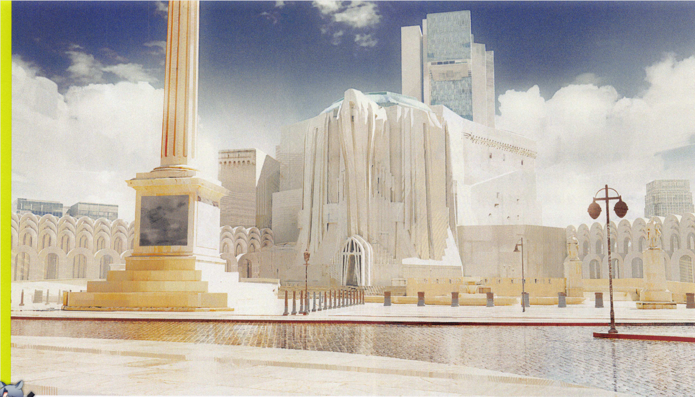

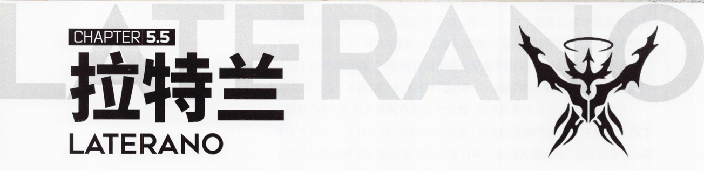

### 概览
他国人对拉特兰的认知往往鲜明地分为三个阶段:起初，圣城的声望也许会使你认为这是一个死板肃穆的国度，严苛的教条规诫无处不在，信徒的一言一行都得谨小慎微;但若你有幸结识几位萨科塔，了解过他们天马行空的事迹-诸如在头上加装螺旋桨，给雕像喂食小蛋糕，或是当街爆破公共建筑你就会发现拉特兰全然不符合刻板印象，倒像是个高度自由甚至崇尚享乐的国度;但当真正踏上拉特兰的土地，你会意识到所有自由与享乐都不过是秩序的副产物。这种几近自发却井然不紊的秩序，或许才是拉特兰最值得探讨的现象。

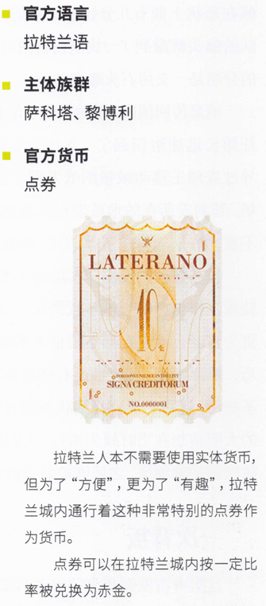

### 历史
被称作"启示石塔"的老钟楼可能已有数千年历史，它的石砖也许是由初代圣徒亲手砌上去的。但拉特兰的居民每天路过这座不可思议的古迹，就如同路过一座新建的普通民居，谁也不会驻足惊叹。历史的厚度在这座城市中自然而然地被压缩了，初代圣徒的古老事迹是现代拉特兰人信仰与生活中稀松平常的一部分。
在这人与历史并行的国度，考古学从未存在过。拉特兰的繁荣延续了数千年之久，拉特兰的古物从未人土，自然谈不上发掘，它们不是被齐齐整整地列在大教堂的陈列室，就是仍在人们的生活中忠实地发挥着作用。然而，1042年,一件被认为是古代拉特兰圣徒像的文物在拉特兰以西的荒地出土，轰动了整个考古学界。
### 一场发掘
基利安.杜戈尔出生在维多利亚的一个拉特兰教信徒家庭，父亲是塔拉地区一座乡村小教堂的教士。基利安的青年时代在战火中度过，四国战争催生了对源石及其他矿物的巨量需求，基利安也在劳动卫国的浪潮中成了一名光荣的地质勘探员，参与了深层矿脉勘探设备的研发、试验及后续的实际勘探工作。战后，源石大开采中罹患矿石病的大量工人与技术人员流离失所，基利安试图帮助曾经的工友重回岗位，但这种努力为他带来的只有多次的传讯、审问和降职。他曾经的好友大多在漂泊中殒命，仅有的几个幸存者在一座偏僻的乡村小教堂谋得了生计，在那里耕种一方贫瘠的土地，直到死亡。
1042年，基利安所属的地质勘探队沿着塔尔干主矿脉一路向东勘测，试图寻找适宜的开采地点。在一处浅层探坑中，基利安发现了包裹在源石晶体中的管状带孔金属残骸。在身为拉特兰教信徒的基利安看来，这些金属残骸在形状上颇有几分铳械的神韵，他的同伴却对此嗤之以鼻。但很快，勘探队的镐头就敲到了一块灰白色的巨石，基利安这回看得清清楚楚，他们挖到的分明是一支用石头雕成的铳。
消息传回国内，迅速引起了学界的高度关注。伦蒂尼姆皇家博物馆的时任馆长迅速组织起了一支经验丰富的考古队伍，其中不乏曾在高卢旧地主导过查理王移动城堡图纸发掘工作的学界权威。考古队第一时间接管了现场，基利安所在的地质勘探队虽然名义上还留在现场"提供安全指导"，却不被允许靠近探坑五米以内，理由是防止他们"不慎损坏帝国的重要财富"。经过数天的发掘，实际出土的不止一支石铳，还有一尊完整的石质圣徒像。根据源石侵蚀年代测定，这尊石像可能比泰拉现存的大多数文物都更为古老，而它在形态特征上的独特性也能够呼应这种判断。石像工艺精巧，雕琢细腻，却唯独没有刻画圣徒的面部特征。不同于传统上慈眉善目的圣徒像，这尊石像直接用状如魔方的几何形体替代了头部。一种基于此产生的大胆猜想在当时颇为流行:人们猜测初代圣徒并不真实存在，他们最初是:律法的抽象象征，之后则被后世的拉特兰人进行了人格化的加工。
### 一次背叛
这次考古发掘得到了维多利亚政界的直接支持。彼时，高卢与伊比利亚的辉煌相继落幕，维多利亚全国上下都洋溢着浓厚的扩张热情。百余年来，不论是在商运还是在外交层面，拉特兰始终在核心圈处于枢纽地位，而骄傲的维多利亚正意图取而代之。
考古队收到的信件中如是写道:"一尊在拉特兰之外发现的圣徒像，却可能是拉特兰最为古老的文明遗产，它的存在将能够动摇圣城威望的根基。这件珍贵的艺术品是维多利亚的考古学界献给祖国的一件厚礼，它将为维多利亚的荣耀镀上一抹不朽的光辉。"考古队成员无不喜出望外，两天后便急匆匆地携圣徒像返程，在伦蒂尼姆等待他们的是功绩与表彰。然而没有人预料到，一支除了石头什么也没运的队伍，会在半途被劫掠一空。人们赶到时只看到了被源石爆炸物摧毁的车辆残骸，整支考古队的成员都成了零落的源石碎屑，而他们运送的圣徒像则不知所终。
考古队收到信件的当晚，整个营地热闹非凡，谁也没有注意到基利安与营地中的一辆越野车一同消失了。事后，警方怀疑基利安有预谋地泄露了考古队回程的时间和路线,认为他对异邦信仰的执迷压过了他对祖国的热爱。然而后续的调查毫无收获，偌大的荒原上毫无他的踪迹可寻。警方最终只能在通报中宣布基利安是叛国者，声称是他雇用的萨卡兹佣兵劫掠了考古队。
### 一桩悬案
两个月后，基利安毫无征兆地出现在维多利亚边境，他身受重伤，摇摇欲坠，言颠语倒地呢喃着"石像不存在""信仰不存在""圣城不存在"之类影的胡话。赶到场的医生沉默地摇了摇头，于是基利安在生命的最后时刻就地接受了两名警察的审讯。见到警察，基利安仿佛变了个人，他缓缓坐直身体，嘟哝起了战争、源石和维多利亚的话题。警方事后整理笔录时才发现,基利)安接受审讯时没有说出一个新词，他把当年因包庇感染者而遭到审讯时的供词又重复了一遍。
此后的数十年间，再无人见过这件遗失的文物。伦蒂尼姆皇家博物馆的前任馆长至死也没能等来他梦寐以求的藏品，拉特兰大教堂的陈列室里也从不曾出现这尊圣徒像的身影。如今，我们对这尊圣徒像的全部认知都来自当年考古队留下的几张潦草的绘图。
考古队遇难和圣徒像失窃成了一桩悬案，它引发的阴谋论不在少数，人们一直以来对堕天萨科塔的疑问也集中爆发。但自始至终，拉特兰官方都无人出面承认这尊圣徒像的存在，而对于人们的疑问与猜忌，只有古老典籍的文字在沉默地作答:

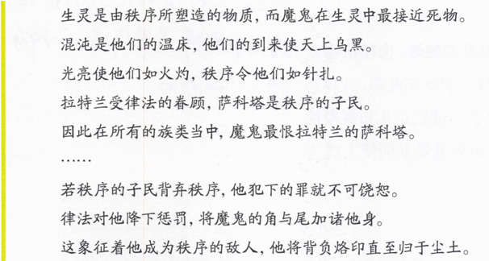

很快，仅有的几张潦草绘图便不再使人信服，圣徒像悬案成了坊间传闻,由它而生的种种猜测被贬为流言。拉特兰城繁荣依旧，它的根基无可动摇。
### 地理
拉特兰位于已知泰拉的中部，整体地貌走势北高南低，西高东低，落差较大。这里的气候以热带季风气候为主，全年高温，旱雨两季分明，为糖料，作物的生长提供了适宜的条件。拉特兰人对甜食的钟爱或许正是源自这种.得天独厚的自然地理条件。
从拉特兰城向西北望去，是一片黄绿色的高原，随风浮动的矮草之下埋藏着储量可观的源石与金属矿物，拉特兰铳的原材料大多出自这里的矿场。.拉特兰城的东南方向则是一片金绿相间的田野。发源自高山的河流定期泛滥，在这里造就了广阔的冲积平原。除了律法的眷顾之外，土地的丰饶也是拉特兰能够长久繁荣的重要原因。
### 经济
长久中立的外交立场与枢纽性的地理位置，使拉特兰成了核心圈重要的自由贸易港。这张枝繁叶茂的商贸网络并未被大企业所包揽，而是由许许多多头顶光环的独立商队编织而成。
依托优厚的地理条件，拉特兰有着深厚的农业基础。除小麦外，拉特兰东南部的冲积平原上还大量种植了以糖料作物为主的高价值经济作物。来自田野的糖不仅以五花八门的形式填满了拉特兰人每日的餐桌，还源源不断地销往周边各国。坐落田间的修道院则会自主对农副产品进行深加工，奶酪、面包、啤酒等产品成为当代许多修道院的重要收人来源。
得益于拉特兰的制铳传统，拉特兰的工匠大多长于精密源石元件的设计制造。特种加工与电子制造是拉特兰最突出的工业领域，这也使拉特兰拥有了极高的城际网络覆盖率。
### 信仰
拉特兰的信徒尊称律法为"主"，并对其报以最高的虔敬。向律法祷告时，即使最吵闹的拉特兰人也会沉静下来。尽管拉特兰的所有规则、戒律乃至信条都被模糊地统称为"律法"，但狭义上的律法不过只是几句规范性的话语，加起来也不过百字有余。很难想象仅凭几条规范是如何使人成为虔诚信徒的。
对此，一位黎博利信徒解释道:

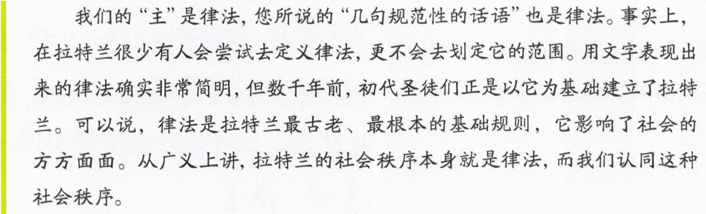

相比之下，萨科塔给出的答案则五花八门。有人称律法塑造了萨科塔的行为本能，有人说律法注定了萨科塔的认知方式;有人说律法的道理蕴含在拉特兰语的字里行间，也有人称律法的影响就流动在拉特兰的人与人之间。不过，绝大多数萨科塔在谈及信仰与律法时都会提到同一种现象:共感。我和妻子苏珊娜已经相处了七年有余，但我仍然不能很好地理解她的情绪，甚至还常常因此惹她生气。可两个萨科塔只需打个照面，就能熟得好像几十年的至交。我不是指他们互相之间有多么了解，共感终究不是读心，个人的思想和记忆还是要由自己保管;也不是指他们总会达成情绪上的同调一致，只消看看隔壁家四个头顶光环的小朋友就能知道，两个在哭的时候，另两个一定在笑。但当两个萨科塔产生交集时，他们的确总能够敏锐地感受到对方的情绪状态，在此基础上，两人才能迅速地互相理解、产生默契。从某种程度上来说,拉特兰的社会秩序正建立在这种理解与默契之上。谢拉格的传统习俗或哥伦比亚的联邦条例，萨尔贡王酋的亲兵或乌萨斯编制中的军警，这些都可以被视为秩序的代表，它们的共同点是蕴含着某种形式的暴力。但相比之下，拉特兰的秩序展现出了不可思议的自发性。即使在律法不涉及的领域，拉特兰人也自觉地维系着和谐。拉特兰有俗语称:"两顶光环能盖过一切争端。"无论是空调漏水、车辆刮擦，还是不慎炸毁他人财物，似乎只要见面聊上两句，纠纷双方就能自然而然地化解矛盾事实上，纠纷双方一见如故，把受损的财物晾在一边开始热情交谈，也是常见的情况。但我始终对萨科塔的共感抱有一点疑虑。拉特兰人固然安居乐业，但我很难想象每一个人在每时每刻都能欢天喜地。拉特兰城中不乏诸如沮丧、悲伤、愤怒这样的负面情绪，倘若萨科塔对情绪的感知当真如此敏锐，他们又如何能不受这些负面情绪的消极影响?

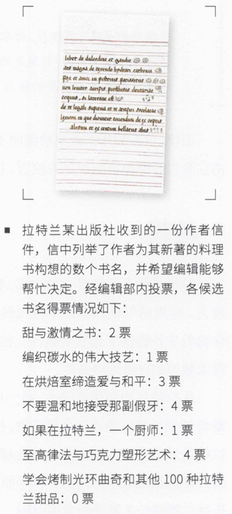

### 政治与军事
#### 法律
仅此诸条寥寥百余字的律法并未直接定义拉特兰的政治架构或权力关系，但它无疑是拉特兰公共权力的合理来源:包括教宗在内的拉特兰政府人员均以践行律法的名义行使权力，拉特兰的成文法条则大多衍生自各代教宗对律法的阐释与补充。教宗阐释律法的过程即立法的过程，由释法而衍生出的成文法条称为“戒律”与“规则”。律法阐释权独属于教宗本人，各厅枢机则在立法过程中起重要的辅助作用。
#### 政府
拉特兰的最高领导人是教宗。现任教宗伊万杰利斯塔十一世的完整头衔为“至高律法的看守者、监督者、践行者，教宗伊万杰利斯塔十一世”，在不同场合下也有更简约或更繁复的表达。头衔的前半部分代表教宗行使守护律法、阐释律法、践行律法的职能，以律法的名义治理拉特兰;后半部分代表教宗承袭了一位初代圣徒的名字一伊万杰利斯塔，也相应地承袭了这位圣徒所代表的美德--牺牲与团结。
当一位教宗离世或卸任时，枢机团中有意愿继任教宗的萨科塔均可成为候选人，并由全体枢机团成员投票选出新任教宗。这个过程被称作“授律圣事”，在拉特兰是具有神圣性的重要仪式，几乎每次授律圣事都能刷新几十年来的纪录，成为拉特兰一天内爆炸次数最多的日子。

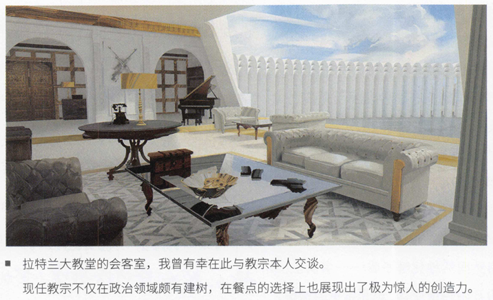

拉特兰的中央政府机构是教皇厅，即俗称的“教廷”。教皇厅设七个分厅，总管分厅事务的是由教宗亲自任命的枢机。
七分厅中，第一厅司律法，是拉特兰的司法机关，对各政府部门的行政行为有司法审查权。其余六厅均为执法机关，分掌不同社会领域的政务。其中，第二厅主要负责协调各部门公务，第三厅的主要职责范围包括农业、工业、交通等领域，第四厅则管理商贸、邮政等事务。
第五厅司公安、公证。第五厅下设拉特兰中庭公证所，负责治安、保卫、公证、消防等一系列繁杂事务。如有需要，公证所外派的执行者可以出现在泰拉的任何角落，保障拉特兰公民的权益，并督促他们履行公民义务。第六厅司民政、教育、医疗。户籍管理与社会福利等事务均在第六厅的管辖范畴之内。各城区与村镇的办事处均属于第六厅，这些地方派驻机构是许多拉特兰居民遭遇困难时最先想到的求助对象。此外，负责处理殡葬事务的安魂教堂也属于第六厅。
第七厅司情报、外交、国安。长久以来，拉特兰保持着中立的外交态度，在国际争端中多充当见证方或调解方。现任教宗伊万杰利斯塔十一世在成为教宗前，也曾作为第七厅的信使见证了高卢帝国的覆灭。随着1069年万国信使建立，拉特兰在国际关系中的见证与调解职能也进一步常态化、机制化了。

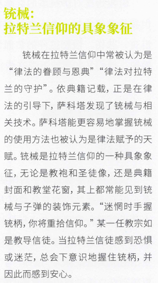
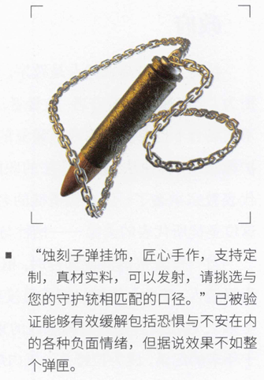

#### 军事
尽管千年来几平未被战火所染，拉特兰依然保留了训练有素的武装力量，不过它并不总以威严可怖的形象示人。倘若在街角的茶座撞上抿着咖啡读报的卫兵，或在修道院的长椅上偶遇正在打盹的铳骑，拉特兰的居民也不会感到丝毫惊诧。
铳骑也被称作“教宗骑士”，顾名思义，他们独立于教皇厅的编制，直接听命于教宗本人。铳骑往往是拉特兰技艺最精湛的射手，常配备近一人高的重型铳械。每个尝试过使用铳械的人都能明白，熟练操作这样的重型铳械本身就是一种壮举。
戍卫队是拉特兰的常设武装治安力量，负责拉特兰境内的防卫工作。戍卫队编有多支分队，每支均由铳骑统领。戍卫队的卫兵极少离开自己戍守的区域，但在应对突发事件时，铳骑可挑选戍卫队精锐成员组建特勤队，作为临时机动部队行动。
遭遇重大战事时，所有成卫队分队的统领将组成战时铳骑议会，共同负责战时指挥。同时，教宗将向拉特兰全境发起征兵。通过体检与审查后，每位从十二岁开始就与铳型武装为伴的公民都能成为拉特兰坚实的守备力量。

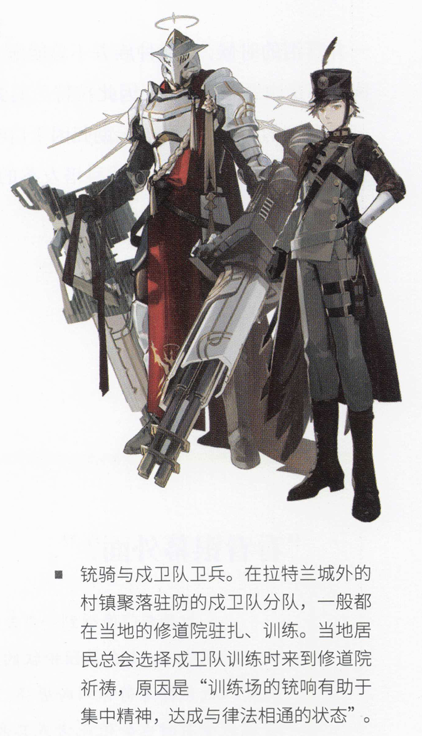

### 文化与社会
#### 人口与种族
拉特兰总人口约六百万，大部分集中在拉特兰城内，少部分以村镇聚落的形式分布于郊野。
拉特兰的主体种族为萨科塔，但也有相当比例的非萨科塔居民，其中以黎博利最为常见。千余年前，拉特兰城的萨科塔迎来了第一批黎博利流民。当逃离天灾的流民跨越大地，见到地平线上的高墙与白塔，他们将之视作奇迹。对于这些以部落为主要社会组织形式的狩猎采集者而言，“城市”的概念只模糊地存在于最古老的传说之中。习惯了漂泊生活的黎博利流民也许不理解萨科塔的社会秩序，但他们中的部分人仍对城市中富足安定的生活产生了朴素的向往。这些流民在拉特兰城附近的肥沃土地上建立了聚落。从生产与饮食，到语言和律法，他们开始逐步效仿萨科塔的生活方式。而拉特兰的萨科塔也在这些聚落中建造了教堂，既满足当地信徒的祈祷需求，也提供教育、医疗等服务或啤酒、点心等产品，甚至还组织并训练卫队来保护聚落免受侵袭。拉特兰的许多修道院就是由此诞生的。如今，拉特兰城外的村镇聚落已然成为拉特兰不可分割的一部分。
如今，尽管拉特兰处处刻印着萨科塔的痕迹，就连路灯也头顶光环，但除了被禁止人境的萨卡兹，其他种族在这里并不会遭遇系统性的歧视。拉特兰的绝大多数岗位--也许教宗除外--都不乏非萨科塔种族的身影。
在拉特兰定居数年，我也像当地的黎博利一样，习惯了与萨科塔交流。从房东太太到第六厅的民政工作人员，从书店老板到教宗伊万杰利斯塔十一世，比起交流对象是头顶光环还是耳披羽毛，他们也许更在意午餐是苹果馅还是菠萝馅。
但有一点是所有拉特兰居民都无法否认的:虽然享有近乎平等的权利与机遇，但其他任何种族都无法参与萨科塔的共感。萨科塔们一同欢笑、一并落泪的时候，其他种族并不总能顺利地融人其中。大部分时候，这种隔阂并不是由恶意造成的，因此拉特兰的黎博利也无法像乌萨斯人那样，将自己感受到的陌生、疏离与无助归因于口吐恶言的平民、面露鄙夷的公务员或手持屠刀的纠察官。面对萨科塔友善的笑容，黎博利们常常只能转向自我怀疑。

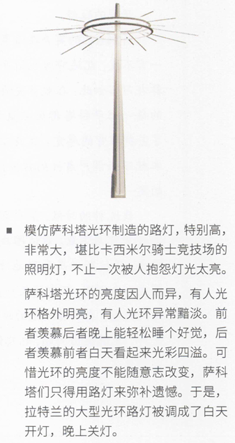

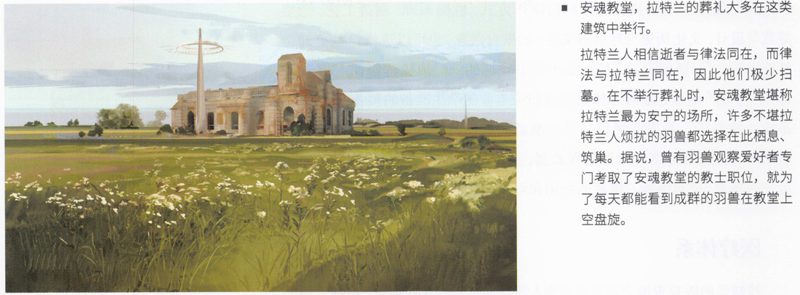

#### 文化氛围
拉特兰最具特色的艺术表现形式既不在剧院，也不在教堂，而是遍布街头巷尾。在外人眼中，那些每日在拉特兰街头上演的异想天开的闹剧堪称行为艺术。不过对拉特兰人来说，这也许只是他们从小到大习以为常的行事方式，是生活的乐趣之所在。自由与欢乐，甜品与爆炸，共同构成了拉特兰的文化氛围。

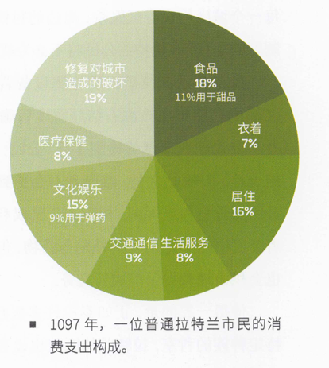

#### 铳械管理
铳型武装在拉特兰受到系统化的管理。每一支铳械的生产与销售信息，以及每一位公民的持铳与使用资格，均由公证所记录在案。
对于即将年满十二岁的拉特兰人来说，一趟铳械工坊之行也许就是最好的生日礼物。申报完成后，这位拉特兰人将在公证所执行者的陪同下，前往一家注册合规的铳械工坊，并在那里挑选一把心仪的铳或其他铳型武装。
初获守护铳的孩子每天醒来的第一件事，也许就是打开盒子欣赏自己的新伙伴，但他仍需在接下来四年间接受系统的铳型武装操作培训，并在中等教育结业后考取拉特兰铳型武装运用许可协议，才能正式获得铳型武装的使用资格。此后，年轻的拉特兰人还需定期前往公证所，进行铳检等基本手续，以维持使用资格。如果违规用铳次数太多，可能会不幸被公证所吊销铳型武装运用许可协议。

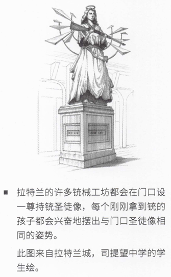

#### 教育体系
拉特兰拥有普及全民的教育体系，其中包含初、中、高三个层次，高等教育又有职业技术与普通高等两个分支。拥有公民身份的适龄儿童可在拉特兰城内的任一学校人学，并接受为期十四年的免费公立教育。倘若城外的村镇居民不愿远赴拉特兰城接受教育，也可以选择在当地的修道院修习。在拉特兰，绝大多数学校与修道院都开设有与铳型武装相关的课程，涉及内容包括铳型武装及爆炸物的操作方式、机械原理、制造工艺、造型鉴赏与设计、文化历史与社会含义等。如果有兴趣，也可以选修一些更加奇妙的课程。“与铳械交流”是最受中学生欢迎的一门趣味选修课，“圣徒、遗产与学者”是为有意向选择遗产铳研究专业的学生准备的预备课程，“不是铳，胜似铳”是为非萨科塔学生准备的武器教学课程，教学范围囊括自动弩、发射器等多种常见远程武器。拉特兰的中学操场上也许没有球类运动的场地，但可供练习铳武的靶场和可供爆破的壕坑却鲜少缺席。

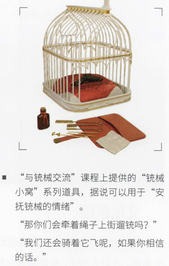

#### 医疗体系
拉特兰的医疗资源之富足常常令人怀疑自己是否身处泰拉。拉特兰城的每一个城区均设有区医院，周边的村镇聚落也均设有诊所。在全民医疗保障制度的支持下，拉特兰公民将不必为就医而倾家荡产。
拉特兰是泰拉矿石病检测设备普及率最高的国家之一。城内每一家医院都配有能将血液源石结晶密度精确到小数点后两位的检测设备，各地方办事处也配有便携的检测手环。公民一旦确诊矿石病，将被永久驱离拉特兰的土地。但除此之外，感染者不会受到其他任何形式的歧视或迫害。他们的公民身份将得到保留，相应的公民权利也将得到保障。被驱离拉特兰的感染者公民仍能够定期收到补贴与药物。但相应地，带来公民福利的外派执行者也会积极地敦促公民履行义务。
值得一提的是，正如泰拉许多医疗机构都设有诸如“角外科”这类针对特定种族的科室，拉特兰的医院也设有针对萨科塔的特殊诊疗服务。萨科塔孩童从小就要接受的常规体检包含光环稳定程度和共感能力等项目，而针对这些方面的问题，拉特兰也有一套成熟的治疗方法。
### 结语:撕开银幕的手
1034年，伦蒂尼姆，酒足饭饱的人们纷纷在影院落座，准备欣赏当时最新潮的艺术形式一彩色电影。在当时的人们看来，银幕上的画面简直与现实一模一样，他们不必长途跋涉也能身临其境地游览帝国的广袤疆土。电影演到最高潮时，一声锐响贯穿影院，银幕从中央被撕开，一只苍老的手从裂缝中颤颤巍巍地伸了出来。影院里一时间尖叫连连。
这是一场精心策划的社会实验，其初衷是治疗伴随彩色电影技术的诞生而出现的“银幕综合征”--一种使人对电影成瘾，分不清影片与现实的病症。实验结果并不理想，在场的“银幕综合征”患者确实在之后的几天里表现出了对电影的失望，但很快，他们又恢复了每天泡在影院里的生活。
拉特兰--这座圣城一遍遍地重塑着我的认知。行走泰拉几十年，我从未见过哪个国家能像拉特兰这样繁荣、安定、自由、包容。也许正因如此，我才会选择来到这里完成本书的编撰工作。
对于在拉特兰出生长大的人来说，这般盛景就是世界原本的样貌，他们也许在书中见过许多饱含苦难的文字，却不理解这些文字背后的意味。但是，只消换个角度来看，这幅近乎完美的图景就会变形、失真，显露出银幕背后那令人失望的现实。千百年来，有无数人尝试撕开拉特兰神圣的银幕，尝试向人们展示圣城繁荣的背后隐藏着怎样的压迫与暴力，但拉特兰城繁荣依旧，它的根基无可动摇。
毕竟，大地上能有这样一座圣城已经堪称奇迹。
### 拉特兰信仰在拉特兰外的影响

## 伊比利亚

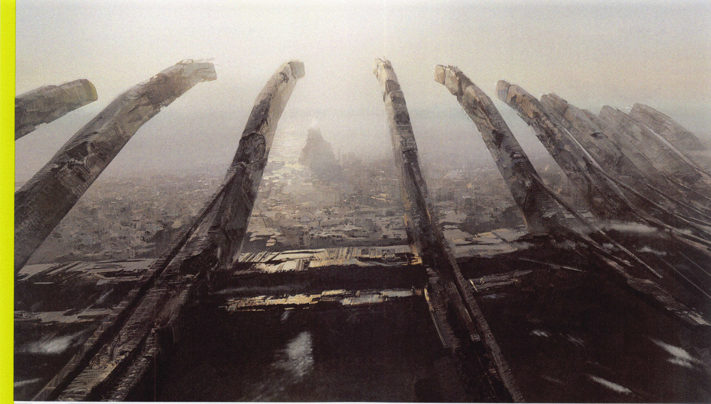

### 概览
萨尔贡帝国衰微之后，第二个将自己的土地与城塞喻作黄金的国家是伊比利亚。很久以前，它广阔的疆域向南延伸至如今已不复存在的土地。在堤岸上眯起眼睛眺望远方，就能看到灯火与船帆连成一线，那便是伊比利亚的海岸线。当王宫的仓库与厅堂再也装不下更多由开拓带来的珍宝，伊比利亚的国王在街头巷尾立起了展柜，使每一位踏足港都的人都能瞻仰伊比利亚的财富。
泰拉历1038年，来自海洋的灾祸降临在伊比利亚，令灯塔失去光芒，令宫殿沉人汪洋。大静谧后的伊比利亚在审判庭的封锁中沉默，即使是伊比利亚人也说不清它究竟是旧日辉煌的延续，还是其终结的标志。但他们都知晓，伊比利亚的挣扎还远没有结束。

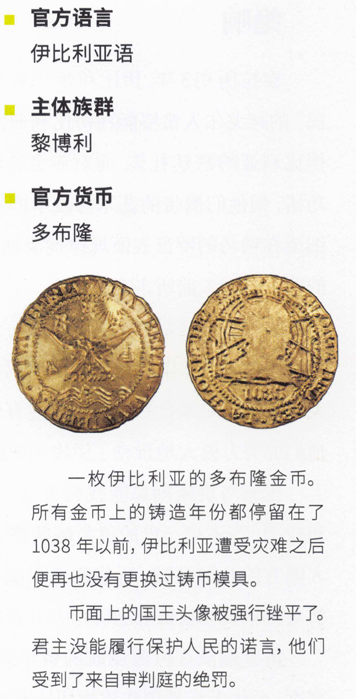

### 历史
#### 远歌
伊比利亚的开国诸王也许对拉特兰圣徒所象征的美德崇敬不已，但数百年后，到了伊比利亚大肆开拓与扩张的年代，王室已经不再将贤明与智慧视作最重要的美德。国王更希望在子女身上看到对求索与征服的执着。如果一位王储在幼年时就表现得谦恭仁厚、与世无争，他的法定继承权也许很快就会如细沙般流出他的掌心。
相应地，富有开拓的雄心与远见的人则常常能得到王室的资助与支持。当探险家德莱昂滔滔不绝地向国王讲述他的野心时，王宫中无人不为之动容。最终，他代表伊比利亚向西开拓，船队的每一面帆上都绣着王室的徽记。德莱昂取道水路避开维多利亚的封堵，又劝服萨尔贡的帕夏为他兴建商道。他最终在大地西北发现了水土丰沃的玻利瓦尔平原，并将财富源源不断地送回伊比利亚，国王欣喜地赐予他“征服者”的头衔，封他为玻利瓦尔总督区的总督
伊比利亚的扩张使周边诸国多有忌惮。新任的帕夏撕毁了先前的协议，截断了伊比利亚通往玻利瓦尔的商道;维多利亚、高卢、莱塔尼亚等国共同施压，尝试切断伊比利亚与泰拉内陆的联系。但当玻利瓦尔总督区被迫宣布从伊比利亚独立时，伊比利亚人已在别处找到了新的道路--沿海分布的独立聚落与城邦或归附于伊比利亚，或寻求与之合作，一个繁荣的贸易城邦联盟沿着泰拉南面的海岸线兴起。
#### 绝响
泰拉历913年，伊比利亚迎来了第一批来自海洋的移民，这些被称为“岛民”的阿戈尔人希望能在伊比利亚的土地上定居。刚刚上岸的阿戈尔人不知伊比利亚的宫廷礼节，面对赤金铸成的王座，他们既不卑躬屈膝，也无花言巧语，但他们携带的艺术与技术产物令伊比利亚人惊叹不已。当看到晶莹的细流在精巧的罗盘表面规律地流动，指示出整片海域的洋流走向，伊比利亚的国王燃起了前所未有的野心。
岛民上岸之后，伊比利亚成就了前所未有的繁荣，如今的伊比利亚人大多将这段岁月称作“黄金时代”。以首席船舶设计师布雷奥甘为代表，许多阿戈尔岛民仍对来自海洋的威胁抱有忌惮，他们尝试在灾难来临前做好准备，他们的努力极大地推动了伊比利亚的经济与技术发展。
王室与贵族则总能找到方法，将岛民的科研与技术成果用于攫取财富和权力。当不可一世的黄金舰队终于竣工，它并未像布雷奥甘期待的那样驶人南方的开阔海域，行使科考职能，而是浩浩荡荡穿过海峡，在维多利亚公爵与萨尔贡帕夏惊异的目光中沿着内海的海岸巡航。
黄金舰队在内海巡航的数年间，宫廷艺术家在旗舰上举办永不散场的宴席，无休无止地创作称颂伊比利亚的辞赋，直到每一艘舰船上的每一个部件都背负了层层叠叠的象征意义。能够记下并厘清所有这些象征意义的人被赏予重金，带着“辉煌见证者”的头衔成为旗舰的名誉船副。
当大静谧后的幸存者挤在阴冷潮湿的临时板房里追忆过去的生活时，他们兴许能比黄金时代的人们更深切地理解“黄金时代”的含义。
大静谧前的伊比利亚已然充斥着迷茫，对黄金时代的礼赞铺天盖地，但人们面对的生活现实并不总像颂歌中那样辉煌。无可辩驳的价值取向推动着所有伊比利亚人标新立异:到了十一世纪初，越来越多的人抛下世代相传的财产与家业，盲目地踏入全然未知的领域，寻觅配得上“黄金时代精神”的新异道路。踏实与本分则成了失败者与落后者的特质，伊比利亚的辉煌离不开工人与农民的汗水，这些底层劳动者走上街头却会听到刺耳的声音，斥责他们不思进取的态度辱没了黄金时代的美名。岛民的技术创造的过剩生产力短暂地掩饰了社会上的许多裂痕，但假使没有大静谧，这些裂痕是否也会逐渐显现，使伊比利亚辉煌的面貌不攻自破?

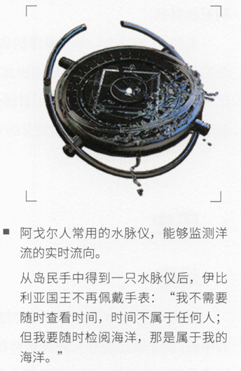
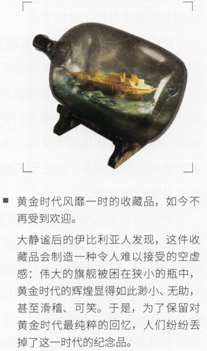

#### 静谧
来自海洋的灾难摧毁了伊比利亚的辉煌。黄金舰队悄无声息地消失在海上，伊比利亚之眼接二连三地熄灭。王宫中的笙歌与码头上的喧嚣失去了声音，人们在绝对的寂静中奋力翕动着嘴唇。灾难就在这样的静谧中降临，此后发生的一切无人能完整地讲述。这场被后世称作“大静谧”的灾祸使伊比利亚的大半国土沉人海底，当海水退去，残存的陆地支离破碎，曾经丰沃的耕地成了不毛的盐碱地。随着土地消失，庄园制的经济基础与采邑制的政治基础也土崩瓦解。王室与贵族不再有能用于维系军队的资源，也不再有可供农户耕种的田地。将庄园的粮仓洗劫一空后，幸存的平民失去了留在故土的最后一点理由。灾难过后，饥荒与暴乱使伊比利亚分崩离析。
通信瘫痪、地貌剧变，灾后的伊比利亚令人陌生。人们漫无目的地行走在废土之上，见不到熟悉的道路与建筑，听不到熟悉的广播与讲经。偶尔在黑暗中升起的炊烟也许来自匪徒，偶尔在寂静中响起的窸萃常常源于恐鱼。人们陷人了迷惘，他们不敢确信脚下的土地就是伊比利亚。
部分幸存的国教会成员尝试从基层开始重新塑造伊比利亚的形象。曾经的伊比利亚被描绘为不可一世的征服者，需要人们开枝散叶，为它开辟更广阔的疆土;而如今的伊比利亚被阐释为照亮黑暗的圣洁者，需要人们凝集，守护它的洁净与德行。拉特兰的典籍以律法与美德为胚，点缀以圣徒的趣闻逸事，但伊比利亚国教会将其重新编写，使之成为灾后伊比利亚人民生活的指导。在价值全面崩塌的年代，这种举措或许确有成效。按照教士的布道，价值无需依托于物质产品，哪怕在空无一物的废土之上，人们也可以践行美德。
教会不仅尝试为人们提供精神支撑，还试图恢复基本的社会秩序，甚至有计划地管理食物资源。固然有绝望的人踏过教士的尸体去抢夺食物，但也有绝望的人将信仰视作救命稻草，期望谨遵教诲能够换来救赎。

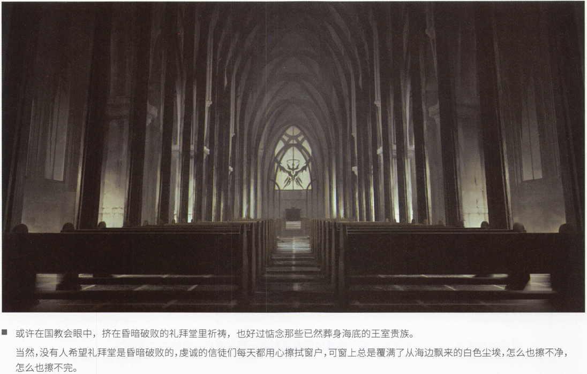

王室已然落人沉寂，但民众依然在寻求保护与拯救，人们甚至开始向伊比利亚的开国诸王祈祷，请求那些已经人土多年的枯骨庇护他们......国教会的许多高层成员迫切希望拥立一位教宗，以抓住人们对获得拯救的渴望，在伊比利亚树立起新的权威。但大主教卡门多次回绝了将他立为教宗的提议。在他的主持下，国教会的九名大主教抛却原本姓氏，取伊比利亚为姓，并加封圣徒之名，以另一种形式成为伊比利亚的领导者。
对于迫切希望树立统治权威的人来说，“圣徒”似乎并不是一个理想的名号。“圣徒”也许可以代表先驱者与引导者，但唯独缺乏统治者的含义一-拉特兰的古老典籍记载初代圣徒用双手建起家园，用双脚践行信仰，却唯独没有说他们居高临下地行使统治权力。
但卡门近乎执拗的坚持并非没有理由一-拥立教宗的前景是诱人的，失败的代价却不可承受。它意味着将所有伊比利亚人对救赎的希冀压在一人肩上，一旦此人无法担此重任，支离破碎的伊比利亚或许会永远失去统一的契机。失去了统治者的伊比利亚盲目地在暴乱与饥荒中挣扎，它几乎不再称得上是一个国家，却要面对超越人类理解范畴的灾厄。在这样的重负之下，大多数人手中的权力会从趁手的工具变成软弱的诱饵。毕竟，再昏庸的君主在画像上也会被描绘成英明神武的模样，他们常常躲在这种由权力编织的假象背后庸碌终生。可以想见，卡门和其他几位大主教或许不愿也不敢将自己置于这般考验中。
加封圣徒之名后，卡门·伊·伊比利亚集合了他的支持者，将国教会全面改组，并更名为“伊比利亚审判庭”。改组后的审判庭不仅仅是宗教组织，也是统治机关。灾民们被聚集在一起，并在律法的指引下投入劳动。从基层运作模式开始，伊比利亚的秩序逐渐得到重建。
仍有许多人对这个新生的机构颇有微词，认为“惩戒”与“审判”所预设的道德判断太过专断。在一些亲历过灾后重建的伊比利亚人的叙述中，审判庭的统治相较大静谧前的王室确实更显严苛，但最终将四分五裂的伊比利亚重新统合为一个国家的，也的确是审判庭。我们应当思考，在价值全面崩塌的年代，人们是否还有余力享受一个开放包容的环境?明确的引导与现成的答案是否更能打动人们迷惘而疲倦的内心?
### 地理
曾经的伊比利亚坐拥大地南面丰饶的半岛，掌控着连通内海与开阔海域的峡道。大静谧后，南方沿海地区繁华的港口城市十不存一，幸存者逃往北方，蜷缩在曾经偏僻的内陆边境。如今的伊比利亚由数个狭长的三角洲组成，境内地势低平，中部与北部的内陆区域有部分丘陵地形分布。
伊比利亚现今的海岸线是在大静谧中新形成的。几代测绘者用双脚丈量伊比利亚的伤口，一点点勾勒出了新海岸线的轮廓。如今，仍有伊比利亚人扯起单薄的帆，尝试寻找并收复残存的土地，但遗落海中的故土大多已经沦为了恐鱼的巢穴。

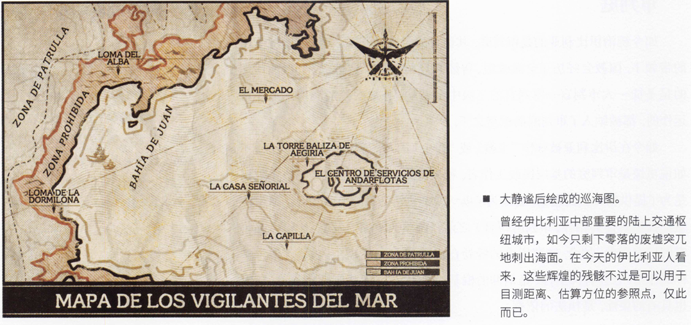

### 经济
早在岛民上岸以前，伊比利亚就拥有坚实的经济基础。得益于丰沃的土地与发达的水系，伊比利亚的种植业与渔业高度发达，大静谧前的每一位伊比利亚厨师都要掌握上百种海产的烹饪方式才能出师。伊比利亚的工业水平在核心圈诸国中也堪称领先，拉特兰城被改建为移动城市时，所需的大量重工制品正是进口自伊比利亚。岛民技术的引人更是一度使伊比利亚的个别地区出现了生产力过剩的情况，奢靡之风在社会中盛行。
大静谧后，大量先进技术遭到废弃。既没有能源与材料供应，也没有相应的消费需求，曾经整日轰鸣的工厂陷人了长久的沉寂。岛民的研究项目大多被审判庭叫停，他们的研究成果在颂圣棱堡的档案柜中腐烂。直到近年，审判庭才逐渐开始向当初的阿戈尔技术人员敞开门扉，邀请他们回到伊比利亚重新开展研究。
此外，土地被盐碱渗透，海洋被恐鱼占据，伊比利亚的种植业与渔业也几近停摆。在人们重新找到可靠的食物来源之前，伊比利亚经历了市场秩序的崩溃。当一车赤金也无法换来一袋粮食的时候，人们开始将货币与贵金属视作逃亡路上的累赘。荒地中的流寇会洗劫食物与衣物，却将银币与金条留在血泊之中。许多地区的经济活动倒退回了以物易物的形式。
审判庭尝试组织民众重新投人生产，并统一管理与分配生产的成果，计划式的经济模式在灾后的伊比利亚占据了主导地位。直到今天，伊比利亚的大多产业门类仍处在审判庭的计划控制之下。

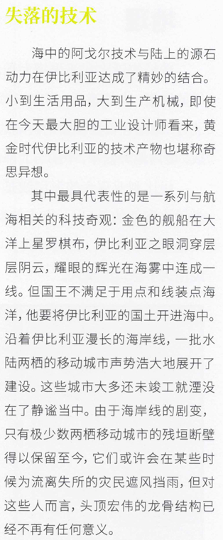

### 政治与军事
#### 审判庭
如今统治伊比利亚的是审判庭，其前身为伊比利亚国教会。在圣徒卡门的带领下，国教会经历了全面改组，曾经繁复的高层架构被抛弃，取而代之的是圣徒一大审判官一审判官的三级中枢架构。各地的基层架构还能正常运作的，都被纳人了审判庭的框架之下。
如今在伊比利亚被称作“主教”或“教士”的人，与其说是圣职人员，不如说更像是审判庭的基层民政工作者。很多时候，在教堂中讲经布道不仅仅是为了提供精神上的慰藉，更是为了以一种具有感染力的方式为人们的生产生活提供具体的指导。审判庭统合了之前经国教会改编的教义与经典，并将它们扩充完善。如今，这些厚重的经卷在伊比利亚人的生活中发挥了多种多样的作用:它具有神圣性，是信仰的根基;具有指导性，是生活的参考;同时也具有约束性，是执法的依据。
审判官是伊比利亚审判庭的中坚力量，他们的职责范围与经书的应用范围一样广泛:一名审判官需要履行精神领袖的职责，抚平民众的恐惧与疑虑;需要履行司法者与执法者的职责，纠察一切可能对伊比利亚产生威胁的事物;也需要履行军事指挥官的职责，带领惩戒军巡行海岸，观测海洋的变动，遏制恐鱼的蔓延。
不可否认的是，伊比利亚审判庭的统治表现出了诸多饱受批评的特征，如程序严重缺失、手段高度强硬等，但作为紧急状态下处理问题的最终手段，这些现象并非不能理解。上述因素是否造成了实质上的职权滥用与管理混乱，还有待考证。

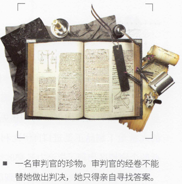
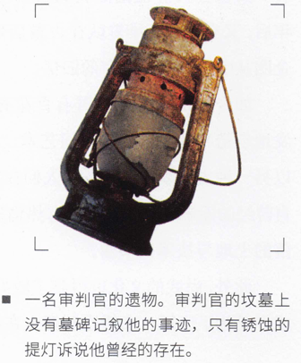

#### 区划
即使亲历过黄金时代的老人也很难在地图上辨认出曾经的贵族领地，过去的区划随着贵族阶层的消失一并被遗忘了。如今的伊比利亚不存在“行政区划”的概念，除了灾难中幸存下来的移动城市，就只有灾后自然形成的小型聚落零散地分布在荒野之上。由于国教会及后继的审判庭主导了灾后的重建，许多灾后新形成的聚落都以教堂或裁判所为社区中心。
#### 军事
伊比利亚的军事力量主要由国防军与惩戒军两套系统组成。伊比利亚国防军见证过王国的辉煌。国防军依托古老的城镇佣兵公会组建而成，由王室与贵族任命的军官成建制地从佣兵公会雇佣军力，他们开出的巨额佣金换来了训练有素的兵士。大静谧前，为了训练水兵，伊比利亚最大的城镇佣兵公会甚至斥资打造了一整支训练舰队。
大静谧后，王室与贵族再也无力维持雇用军队的开支，就连长期雇用的常备军力也大多遭到解散。曾经光鲜的军服出现在荒野流寇的队伍中，但也有部分军人表现出了可敬的素养--在受灾程度较轻的北方地区，许多驻守边境移动城市的国防军并未擅离职守。内陆各国纷纷派出信使、考察队与雇佣兵前往陷入沉寂的伊比利亚，这些人踏上伊比利亚的国土时或许幸灾乐祸，或许惴惴不安，但照常巡逻的国防军队伍打破了他们所有的幻想。国教会改组为审判庭后，这部分军人得以承袭国防军的古老名号，继续为伊比利亚应对来自境外的威胁。
审判庭组建了另一支常备武装力量，即伊比利亚惩戒军。这支队伍主要由大静谧后出生的年轻人组成，他们未曾见证过光辉的岁月，不知该怎样穿戴礼服、佩戴勋章，却直面过险恶的处境，清楚应如何斩杀恐鱼、烧毁溟痕。审判庭组建惩戒军不仅仅是为了维护国内秩序，更是为了应对来自海洋的灾祸。惩戒军以连队为基础组织单位，由审判官带领，在伊比利亚现存的各个聚居区之间奔走。他们一面维持秩序，警惕深海教会的渗透;一面监视海洋，抵御海中恶物的侵袭。
### 文化与社会
曾经的伊比利亚人逐新趣异，但如今，他们对新事物与旧事物同样抵触。陌生的面孔使伊比利亚人感到恐惧，哪怕有人能够绕过封锁进人伊比利亚，迎接他的往往也只有怀疑的目光;但熟悉的面孔同样不能使伊比利亚人感到安心，人们不知曾经的好友是否已经受到异教茶毒，又是否会向审判庭诬告自己......在惶惶不安的氛围中，审判庭组织的讲经成了为数不多令人心神安定的事。许多伊比利亚人一天的劳动就从聆听教诲开始。
对于黄金时代留存下来的文化遗产，伊比利亚人的态度是复杂的:有人厌恶它，也有人视它为希望;有人被它刺痛，也有人依赖它存活。人们反复无常的行为如同聒噪的杂音，与大静谧带来的一片死寂形成了鲜明对比。曾有一家售卖大静谧前旧物的古董店的老板被人烧死在自己的店里，但在两年后，又有许多人排着队在古董店焦黑的废墟上献花，含着泪水刨开砖瓦，企图从中找回一点残存的旧忆。
如今的伊比利亚不再有百花齐放的艺术环境，伊比利亚人却始终在自发地创造平凡但必要的民间艺术。大多数人已经不再出海，曾经的海洋文化以另一种方式留存了下来。人们在重建家园时唱起的劳动歌曲大多就改编自曾经的船歌。仍对探索抱有热情的人大多选择加人审判庭，投身于收复遗落的土地与技术的事业。
此外，尚武的文化也得到了较好的保留，审判庭甚至鼓励民众学习剑术，或许是为了让每一个伊比利亚人在灾难来临时都能提起刀剑。
### 结语:“发现伊比利亚"
前些年，我偶然在电视上看到一档访谈节目，屏幕上的受访者不是别人，正是数十年前咖啡馆里灾后创伤恢复互助会的组织者。这些年，他似乎成了在维多利亚颇受欢迎的作家。

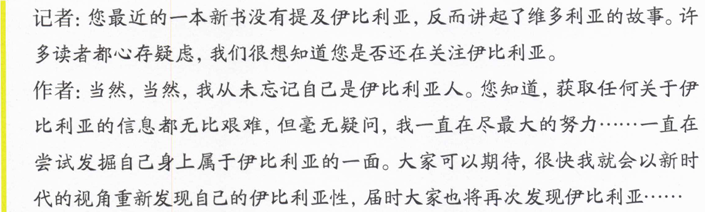

关掉电视时，我回想起马丁内斯先生的问题:“什么才是伊比利亚?......伊比利亚到哪里去了?”大静谧已经过去了数十年之久，人们仍在尝试“发现伊比利亚”，不论身处伊比利亚国内还是国外，不论是出于寻求慰藉还是追逐利益的心理。伊比利亚曾凭借它的探索精神与伟大发现声震泰拉，但如今，它成了需要被探索发现的对象。关于伊比利亚是什么，许多声音给出了许多不同的答案，这些答案又构成了许多人的身份认知。假使大静谧那样的灾难再次来临，这些认知与答案能否使人更团结、更坚定地抵御灾祸?

#### 沉默诏令
##### THE SILENCED EDICT

### 阿戈尔

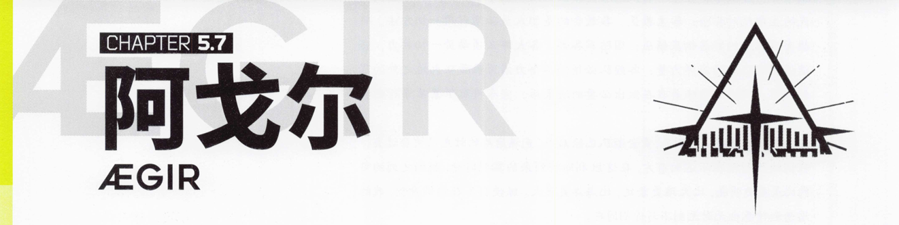

## 谢拉格

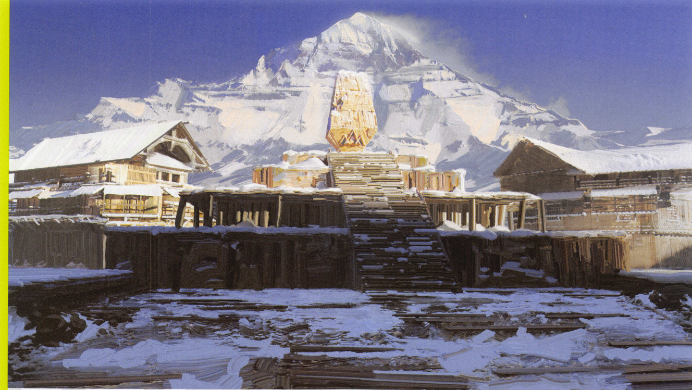

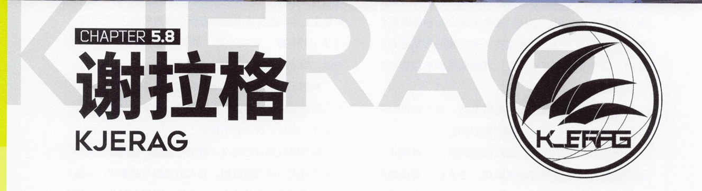

### 概览
遥远而神秘的雪国谢拉格坐落在泰拉大陆中部的高大山脉上，是文明所能抵达的最高之处。地理条件的限制让谢拉格在长久以来都保持相对封闭的状态，而这一点也令其他国家对它知之甚少，流传于大地上的也多为似是而非的远古传说。
神话和零星的传闻构成了大众对谢拉格的一般想象-一个终年为白雪所覆盖、信奉独特神明的宗教国家，而且似乎有意地与大地保持距离。然而近年来，随着雪境之国对外派出使团的行动越发频繁，人们开始意识到，高山上的国度正在悄然但迅速地发生着改变。

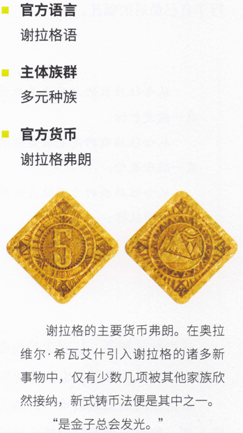

### 历史
#### 神山纪年
如同泰拉大地上的许多族群，谢拉格人的祖先在文明早期见证了天灾的毁灭威力，因为畏惧那股力量而在大地上奔逃。这群天灾难民被追赶在身后的天灾逼上了严酷的雪山，被迫在艰难的环境中顽强求生。
万幸，相较于掠夺性命的天灾，高耸巍峨的雪山对这群灾民似乎有着近乎无限的温情。在谢拉格代代相传的神话传说中，善良慈悲的雪山神耶拉冈德怜悯灾民们的遭遇，不忍他们在地上流离，向他们伸出了援手。神明创造了会淌热水的泉、会结果子的树，更重要的是创造了“能够冰冻天灾的风雪”......在神衹的庇佑之下，这些灾民们建立了最初的聚居地。梦幻温柔的故事全部出自谢拉格人自己的叙述，连同保存至今的宗教典籍，真实性已经难以考证。近年来，谢拉格邀请国际学术团队到雪山交流，进行了大量的地质钻孔研究。结果表明，在至少千年内，辽阔的雪山地区确实没有发生过具有显著影响的天灾，这在整个泰拉大地都是难以解答的谜题。古代谢拉格人将这一现象理解成由神力所致，因此在谢拉格，最先诞生的权力组织是代表神权的宗教机构，谢拉格由此成为一个由信仰维系的国度。
#### 雪中文明
就算是神话传说也必须承认，美好的庇佑终究不能永续。雪山神给谢拉格的先民创造了堪称优越的生息环境之后，需要进人漫长的休憩--这实际上可等同于对神山时代结束的解释，预示着谢拉格从蒙昧走向新时期的第一次重大变革，即将失去神灵庇佑的人们需要找到新的方式生活下去。沉睡之前，雪山神召集了“最勇敢、最赤诚”的三个部族的领袖，进行了自己最后的嘱托。

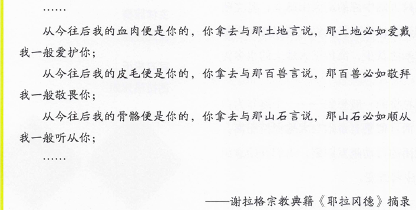

这当然是神话，从现实的角度看，就算谢拉格人能够神奇地免受天灾威胁，他们的社会形成也依然受到恶劣自然条件的影响。
谢拉格的诸部族以单一种族为基础，形成固定聚居地，但高原地带交通不便，聚落与聚落之间被山脉险峰分割，被迫保持独立。在这样独立而封闭的环境中，拥有多个部族的聚落以血脉血缘为依据，以家族为单位，产生了简单的社会结构，还出现了平民和贵族的分化。
般来说，在劳动过程中表现突出、在人际交往中手段精到、在武力比试中占据上风的个人和家族，会自然而然地受到他人的尊敬而成为贵族，其他家族也往往会因此而愿意接受他们的领导。贵族从此具有了内部协调和外部作战的责任与权威，成为其所在聚落的事实领袖。如此形成的简单社会结构成了传统，并延续至今。
在所有贵族中，位于谢拉格盆地的希瓦艾什家族、布朗陶家族、佩尔罗契家族享有相对较好的自然环境，因此实力最为强大。他们将自己的领地确立为谢拉格的核心区域也是顺理成章的事，而这就是谢拉格后来建立的三族议会制度的来源。

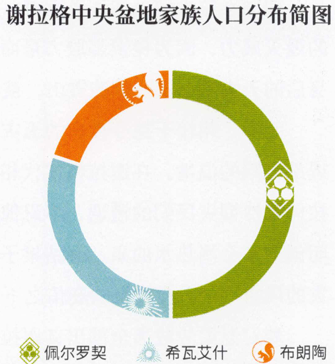

#### 雪山变革
与世隔绝的谢拉格在高原之上简单而平稳地度过了几百年的时光。在这段时间里，泰拉大地上的各国从未停下发展的脚步，帝国崛起又衰落，王朝兴盛又灭亡，但变革的力量似乎与雪境之国彼此遗忘了。
无论外部如何变迁，高山上的谢拉格人始终维持着原始的生活。直到本世纪六十年代，掌握谢拉格实权的贵族内部出现了求变的声音-他们中的部分人见识到了大地上正在发生的一切，意识到即使谢拉格停滞不前，终有一天也会与未来碰撞，与其等待那天惨烈地到来，雪山的子嗣不如主动向未来奔去。
声量最大的贵族代表是希瓦艾什家族的时任领袖奥拉维尔，他最先与维多利亚等国的贵族交游，看到了变革的重要性。他在三族议会上提到了种种革新的观念，但也引发了其他家族的担忧:原本谢拉格在神灵的庇佑下能够免受天灾的威胁，恪守传统的生活方式让谢拉格人安稳地度过了漫长的岁月，其他国家并未如谢拉格一般保持千年祥和，谢拉格是否应该效仿他们的生活方式?如果谢拉格人的生活发生了变动，神灵是否会继续庇护他的子民?如果无人能够确定谢拉格会走向什么样的未来，那谢拉格是否应该迈出这一步?
诸多问题到现在仍未得到回答，希瓦艾什家族的领袖奥拉维尔和伊丽莎白夫妇却早已在一场突如其来的交通事故中丧生。
这场神秘的交通事故在许多人眼中至今仍是未解的悬案。在那个年代的谢拉格老人中，有传闻说这是耶拉冈德亲自降下的灾难，要夺去亵渎之人的性命;布朗陶家族将事故归结为希瓦艾什夫妇遭到了“政敌陷害”并声称幕后黑手是埃德怀斯家族，导致后者流亡国外;关心谢拉格局势的外国人纷纷将矛头指向与希瓦艾什家族矛盾日益加深的另外两大家族，认为是他们联合设计，暗杀了锐意改革的夫妇俩;根据近年来谢拉格官方释出的报告口径，这次事故完全是一场“意外事件”;而与之关系最为密切的希瓦艾什家族的后人，则在后续的所有采访中对此闭口不谈......无论如何，这场事故使谢拉格的局势发生了重大转变，让改革陷人停滞，也让希瓦艾什家族几乎败亡。
不过，希瓦艾什家族并未就此消沉。奥拉维尔的长子恩希欧迪斯于1090年从维多利亚学成归国，之后继任希瓦艾什家族族长，创办了喀兰贸易公司，并依据传统重回三族议会。
在恩希欧迪斯的极力主张之下，三大家族终于重新坐回谈判桌，1097年，三族议会如期召开。在喀兰圣女的见证下，三大家族最终达成久违的和解。想必谢拉格将会踏出发展和开放的脚步，以全新的面貌为泰拉大地所知。
### 地理
谢拉格所在的地理区域可以说是泰拉大陆上最特殊的区域之一。南北走向的高大山脉横亘于大陆中央偏西部，像一堵城墙截断了大陆的北部。它的海拔是如此之高，许多山峰至今都难以翻越。山脉东部即核心圈诸国，西边则是哥伦比亚。谢拉格山脉奇险难登，气候寒冷恶劣，谢拉格人的聚居地也因此广泛而零星地遍布高原上能够栖身的地区，图里卡姆是其中最大的城市。
人们理解中的谢拉格地带其实指高原上面积最大的一块盆地，谢拉格最重要的三大家族、蔓珠院以及谢拉格圣山均在其中，是谢拉格的核心区域。四周发源的大量融雪河滋养了盆地中的茂密树林和辽阔湖泊，后二者所在的区域也是相对宜人的定居点。
如此严酷的自然条件让人不难明白，为什么在过去的岁月里，谢拉格会长期与外部世界隔绝，就算是散布在高原上的各部族之间也极少往来。

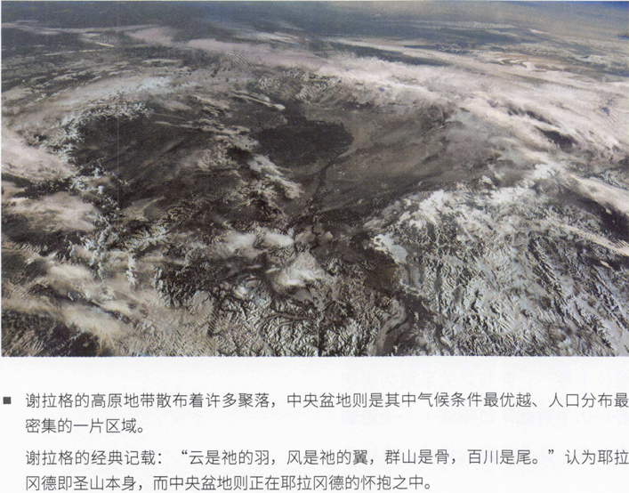

### 政治与军事
#### 政体
外人对神秘的谢拉格一直不甚了解，只有从风雪中走出的宗教使者能够让其他人窥得雪中国度的一二。来自谢拉格的宗教使者自称“蔓珠院修士”，代表着雪境的最高宗教机关一-蔓珠院。人们根据他们的描述推测，蔓珠院不仅掌握宗教权力，还拥有极大的世俗权力，对谢拉格大部分事务都有裁判权。领导蔓珠院的是宗教长老组成的团体及最高宗教领袖，即雪山神耶拉冈德的代言人喀兰圣女。于是在人们以往的印象里，谢拉格是一个教义严明的宗教国家，一切权力归于神衹和他的代言人。
但随着谢拉格与外界的交流日益密切，各种非宗教的外交渠道和官方公告将一个更完整、更真实的谢拉格呈现在我们面前。
总领谢拉格世俗事务的其实是三族议会。虽然名为“议会”，但其实是贵族领袖之间的一种比较原始的协商机制，未设常驻机关。贵族们也常常在三族议会之外交流，每逢跨领地事件发生，相关方会进行一般性的沟通，再将沟通结果告知未参加的方面。名义上，三族议会是谢拉格世俗贵族的联合，与蔓珠院分享权力。

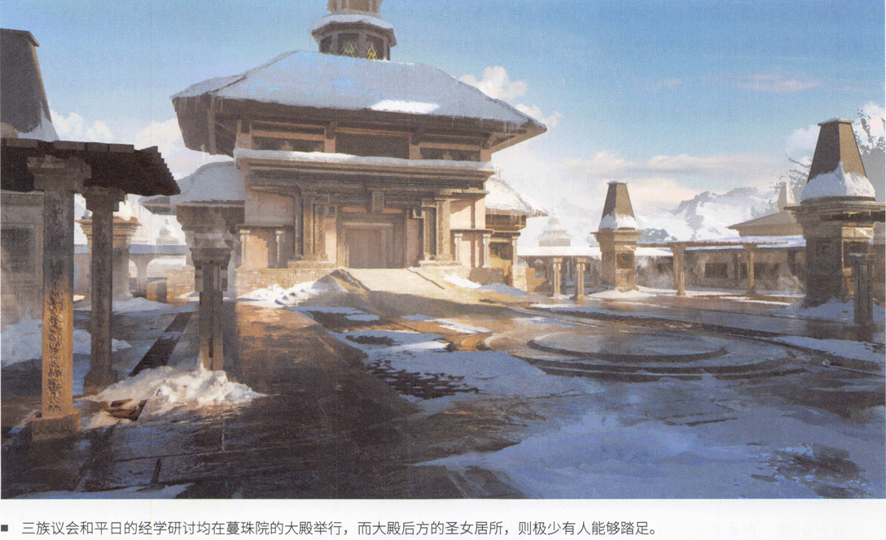

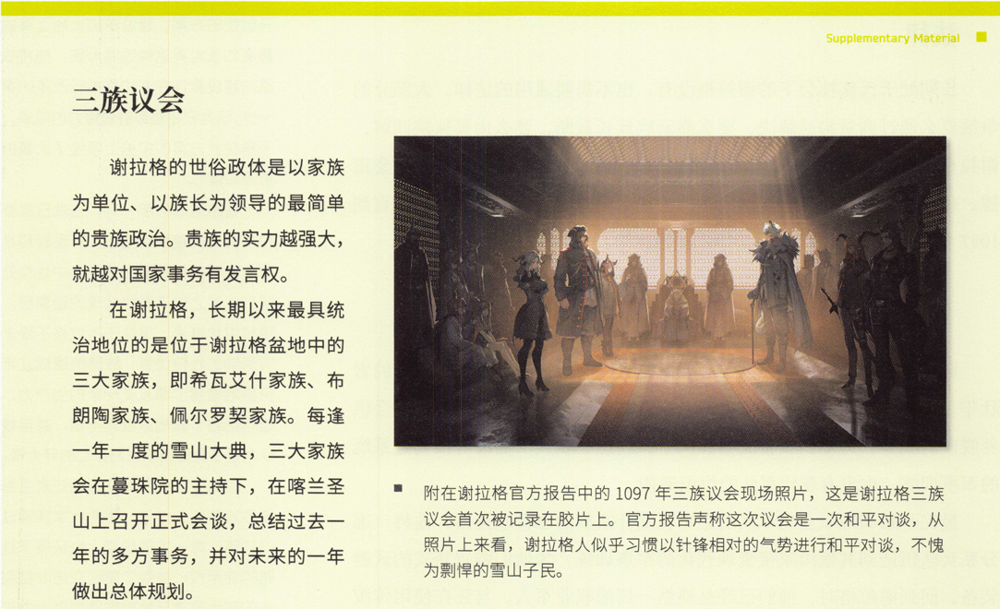

值得注意的是，在目前的谢拉格，蔓珠院和三族议会是两个并行的权力机构，象征着谢拉格的政体是宗教神权与贵族权力的微妙结合。这一结合的法理依据被解释为神的旨意。祂将权力让渡给三大家族的这一改变发生在数百年之前，这被记录在蔓珠院的宗教典籍里，成为谢拉格人耳熟能详的历史。
某种意义上，这说明适时而动的处世智慧早已刻在了谢拉格人的血脉中。

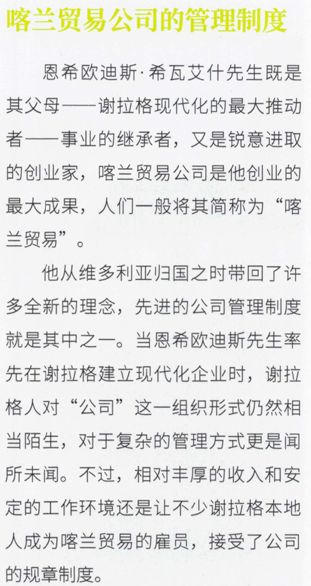
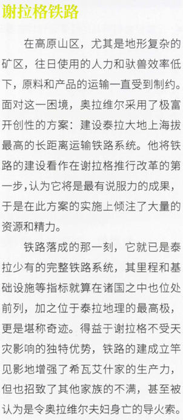
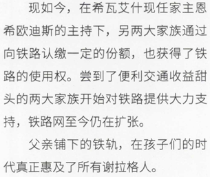

#### 区划
受制于地理因素，谢拉格没有特别明显的区域划分，也没有严格意义上的“国土”与“国境”的概念，区划多是以聚居地为基本单位的“家族领地”概念。
在过去，只有谢拉格盆地中的三大家族联系比较紧密，其他的高原部族虽然挂名归属于三大家族，但除了基本的生活资源交换和提交税收，几方基本不沟通交流，对谢拉格的认同也更多是建立在信仰而非地缘上的。各个领地以家族为单位，基本上过着自给自足、互不干涉的生活。
官方记载，自本世纪六十年代以来，随着谢拉格现代化的发端，其他部族也越发频繁地从山间造访谢拉格盆地，更积极地参与国家事务，“谢拉格”开始成为一个更团结的整体。
#### 法律
长期处于氏族社会下的谢拉格没有，也不需要通用的法律。大部分的争端要么通过商量沟通解决，要么靠家族族长裁断，要么由蔓珠院调解，谢拉格人在日常生活中遵守的最多也只是耶拉冈德教义中的基本社会道德。相对的封闭和独立让这套简单的治理逻辑稳定运行了很长时间，直到1097年之后，真正意义上的法律才开始建构。
#### 军事
谢拉格原本没有职业军队，必要时充当武装力量的基本是家族中的青壮年，部族人数越多，能够出力的人也就越多。部分实力强劲的贵族会供养脱产的私兵，为他们装备武器和护甲，但这些私兵依然没有接受过系统的军事训练，也没有现代军队的组织架构。
最先开始训练职业化军队的是希瓦艾什家族的恩希欧迪斯。他将一部分私兵队伍送到其他国家接受现代化的军事训练，为他们购置新式的武器装备。回到谢拉格时，他们已经是焕然一新的职业军人。与还在使用传统武器、组织形式松散的武装力量相比，希瓦艾什家的这支部队已是超越时代的存在，因此被其他家族冠以骇人的称号一“山雪鬼”。
### 经济
谢拉格山区地形多变复杂，人烟稀少，林业和矿业资源都仍未被充分开发。
按照古老经文中的内容，三大家族对谢拉格盆地内的耕地、林地和矿物进行了简单的分配，各个家族也就此分别发展出了虽然不免原始但高度专业化的农业、手工业和矿业。佩尔罗契家族出产的粮谷、布朗陶家族的皮毛衣裳及希瓦艾什家族的矿石和工具是聚落之间互相交易的典型商品。在盆地之外，山间部族根据当地的自然条件从事生产活动，以家庭为单位耕作、采猎、编织，没有特别明确的分工。不同的部族之间因为交通困难，很少彼此交易，也无法形成产业。
总体来说，谢拉格的经济呈现出一种自给自足的自然经济的特点，产能落后，产业链简单，但高度专业化。
希瓦艾什家的前代领袖大力推行一些新式生产技术，引进了一批旧式维多利亚矿业设备和相关技术人员，谷地间的矿业产出在极短的时间内爆发式增长，大大超过谢拉格内部所能消化的产量，于是希瓦艾什家率先开始了谢拉格的对外贸易。在现任希瓦艾什家族首领恩希欧迪斯创办的喀兰贸易的主导下，矿业出口目前是谢拉格最重要的贸易途径。围绕喀兰贸易的产业，衍生出了现代化的交通设施和贸易港，甚至还有一些中小型的源石工业设施。

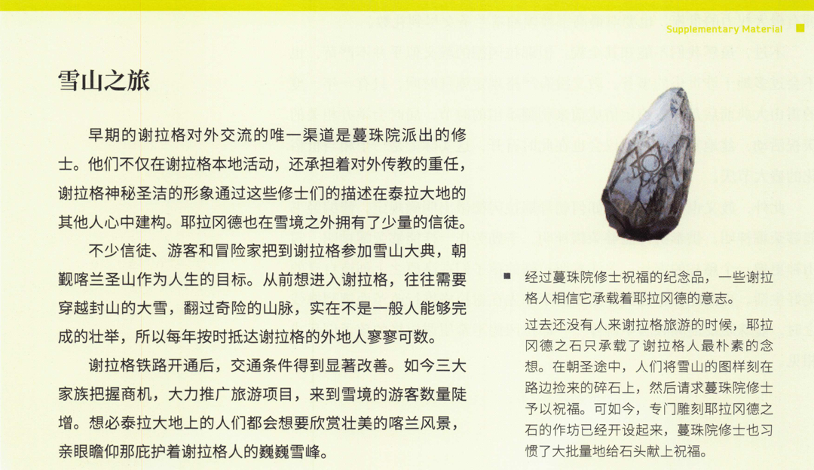

目前，谢拉格诸族已经达成共识，今日的雪境要以崭新的面貌出现在人们面前，团结协作也属必要。三大家族牵头对谢拉格的经济形态进行了大规模的改革，初步成果是催生了以旅游业为主的一系列新兴服务型产业。与此同时，喀兰贸易也在不断扩大经营范围，旨在将更多的谢拉格产品出口到其他国家。在该公司的支持下，各大家族纷纷派代表团出访各国，以期学习更多经验，或是吸引外国商人与谢拉格各方展开贸易及其他经济交流。
### 文化与社会
因为地理条件严苛，交通不便，谢拉格各个分散的聚落难以在地理上形成整体，将他们团结起来的其实是对雪山神祗耶拉冈德的信仰，祂正是这条山脉，与之同名。谢拉格人对耶拉冈德有着外人难以想象的虔诚，几乎所有高原住民都相信耶拉冈德真的施过神迹。随便询问一个谢拉格人，从老叟到孩童都能娓娓讲述与耶拉冈德有关的神话故事，这得益于谢拉格的宗教机构蔓珠院和宗教典籍《耶拉冈德》。
在过去很长的一段时间里，谢拉格的文化完全依托宗教信仰而存在。蔓珠院会向所有的聚落派遣修士，向人们传播耶拉冈德的教义，普及《耶拉冈德》中的内容。普通人要想了解更多文化知识，一般也只能进人蔓珠院，成为修士中的一员，然后继续将耶拉冈德的文化传播下去。如此一来，蔓珠院在谢拉格人心中的地位就崇高起来。几乎所有的谢拉格人，即便是拥有极大权力的贵族，也要对最高宗教领袖喀兰圣女尽到礼数。
不过，虽然我们不能知其全貌，但耶拉冈德的教义似乎并不严苛，也不会过多地干涉世俗的事务。教义没有严格规定朝拜时间，只有一年一度的雪山大典前后是各方约定俗成前来朝觐圣山的时节，届时会举办相关的庆祝活动，盆地家族的三族议会也在此时召开，这实际上是一个相当世俗化的盛大节庆。
此外，教义也没有对人们如何朝拜耶拉冈德做出明确规定。修编经书能够荣耀神明，供奉祈祷能够荣耀神明，辛勤劳作一样能够荣耀神明。雪山神更像一个慈祥的家长，关注着谢拉格的孩子们在高原之上创造自己的美好生活。也因此，希瓦艾什家族由于率先在谢拉格推行改革而遭到挞伐之时，蔓珠院反而频频居中调停--耶拉冈德不希望谢拉格的孩子们兵戎相见。
### 结语:雪境新生
神秘圣洁的雪山国度向泰拉大地揭开了自己为风雪所遮蔽的面纱，把雪境冻结在古老时光中的坚冰终于开始融化。改革需要勇气，脱离安逸需要勇气，从现在奔向未来需要更大的勇气。崇山峻岭之上的谢拉格子民靠着无限的勇敢向未来迈出了坚实的第一步，若慈爱无限的雪山神耶拉冈德真的存在，若祂还在关爱谢拉格的孩子们，便请祂与这片土地一同迎接骄傲的新生吧。

## 卡西米尔

### 概览
卡西米尔联合领简称“卡西米尔”，是骑士与商业之国。卡西米尔有着深厚的军事文化，是一个传统军事强国。同时，卡西米尔也是目前全泰拉经济最开放、金融业最发达的国家。卡西米尔位于泰拉中部偏北，曾经与邻国乌萨斯、维多利亚和莱塔尼亚有过多次武装冲突与战争。

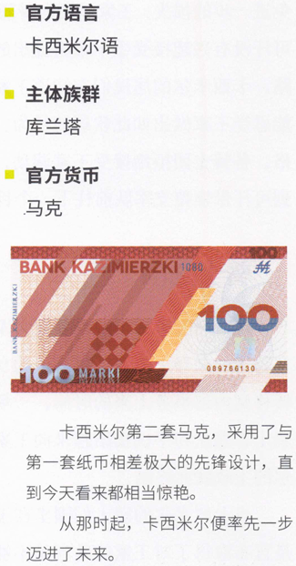

### 历史
#### 天马征服
在各地的强大族群纷纷建国的时代，高傲的天马们不愿被其他人统治，决定组建名为“骑士团”的军事团体，以征服的方式为天马和他们的库兰塔亲族打下一片天地。彼时有一片人称“卡西米尔”的平原正处于各方势力的争夺中，天马们于中途介人了争端，引发了一场大战。令人惊奇的是，这场无谋的军事冒险成功了，他们击败了所有对手。在那之后，天马们在这片平原上修筑堡垒、建立村庄，并将各个定居点以领地的形式分封给骑士们。这就是最初的卡西米尔，由一系列天马骑士团所统治的领地构成。在站稳脚跟之后，天马们面临的外部威胁越来越多，骑士团的规模也越来越大。最终，骑士团大幅超员，内部出现了多种问题，几乎无法正常运作。为了改变现状，天马们改组并拆分了旧骑士团，组建了一系列新的骑士团，并且首次明确规定了骑士、扈从和平民各自的权利和义务。为了增强整体的军事实力，其他种族也被允许加人骑士的行列。在失去了对骑士头衔的垄断后，天马们决定用另一种形式确保他们的统治地位。他们宣布建立天马王国，并宣称天马的黄金血脉足以证明其居于王位的正当性。
#### 梦魇袭来
天马王国自成立以来就与东方的骏鹰王国摩擦不断，双方冲突逐渐升级。但在一个平常的日子里，驻扎在边境的骏鹰贵族突然失去了踪迹。感到蹊跷的骑士们前去查探，遭遇的却不是骏鹰或乌萨斯，而是远征至此的另一支库兰塔神民一-梦魇。曾经征服了卡西米尔的天马将要面对的是同样为征服而来的库兰塔同族。
不久之后，在卡西米尔平原上，天马和梦魇间爆发了一场激烈的会战。在传说中，天马带领着骑士们向梦魇大军的阵线冲锋，却陷人了梦魇制造的幻象。待他们清醒过来，却发现自己已经被团团包围。最终，可汗亲自带领怯薛击溃了骑士们的最后一搏，天马王国在梦魇大军的面前彻底溃败。会战的失败令天马王家产生了巨大的震动。以神话式的军事胜利立国的天马们第一次遭受如此彻底的军事失败。为了维护自身的统治地位，避免进一步的损失，王家试图向梦魇可汗求和。这一尝试理所当然地失败了。可汗没有兴趣接受手下败将提出的政治谈判，他更关注的是自己的征服之路。卡西米尔的居民们在知道王家试图单方面求和后被彻底激怒，他们不能忍受王家做出如此软弱的行为，认为天马们已经失去了作为统治者的品格。各骑士团拒绝接受王家调动，自行在各地组织起来对抗梦魇大军，直到可汗带领整支军队前往下一个目的地。
#### 骑士之国
从天马王家被击败到梦魇大军离开的这段时间里，卡西米尔各地已经在骑士的领导下形成了事实上的自治状态。当所有人将注意力从外部威胁转移到内部事务上来的时候，一场激烈的变革几乎立刻就发生了:愤怒的骑士、扈从和平民集结起来向王家兴师问罪，将天马们赶下了台。卡西米尔的王政就此终结。
当卡西米尔的骑士们围坐在王宫议事厅的长桌旁时，他们意识到，光是宣布取得了对王家的胜利是不够的，这片土地需要新的秩序。在旷日持久的辩论、争吵和互相威胁以后，骑士们最终还是达成了共识。
卡西米尔将从一个王国变为一个由骑士贵族所统治的领地之联合，同时卡西米尔的贵族骑士们会成立名为“监正会”的联席会议，协调联合领的各项事务。之后，专职协调骑士事务的骑士协会和作为法律机构的国民院相继成立，卡西米尔的政治制度基本完善。但在监正会还没完全建立的时候，统治不同领地的贵族骑士便因为利益冲突而明争暗斗起来。这些纷争从未终止，即便到了今日亦是如此。

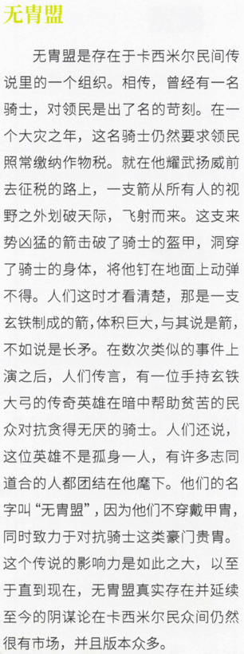

#### 商人崛起
在抵抗梦魇的战斗中，扈从们为了更有效地向联合起来的骑士团提供服务，比照骑士团的组织结构建立了扈从团。在天马王家被推翻以后，新政权的统治者骑士阶层都是典型的军事贵族，卡西米尔有关民生和经济的具体工作因此都交给了扈从团。从此，扈从团逐渐控制了骑士们不在意却又无比重要的一项内容，那就是卡西米尔全国的经济活动。
时代在前进，历史在发展。骑士们从无休止的内部纷争中回过神来的时候，卡西米尔已经变得无比陌生。扈从团以重商主义来指导卡西米尔运作的做法颇有成效，卡西米尔已是一个强大的商业国家，引进了大量的科技产物。骑士们手中的权力不再能够统治这个国家的全部。扈从团集合重组，摇身一变成了一个叫作“商业联合会”的经济组织。他们积极引进外来援助，拥有了资本和企业，并以此控制了移动城市，开始挑战骑士们的地位。
骑士和商人并立的格局在卡西米尔确立后，监正会和商业联合会之间的关系变得异常微妙。双方都试图在某些事务上与对方达成合作，同时将自身的影响力投射到对方的势力范围中去，以期获得完全控制卡西米尔的实力。

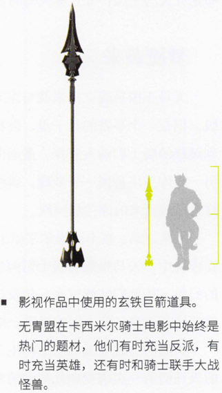

### 地理
卡西米尔与三个国家相邻，它位于乌萨斯的西南部、维多利亚的北部、莱塔尼亚的西北部。平原和丘陵是卡西米尔境内最为常见的地形。宽广的巨大平原与环绕其四周而又起伏变化的低矮丘陵组合在一起，构成了泰拉人心目中标准的卡西米尔平原的景象。此外，这里的森林资源也十分丰富。卡西米尔整体上为温带草原半干旱气候，冬冷夏热，干燥少雨。

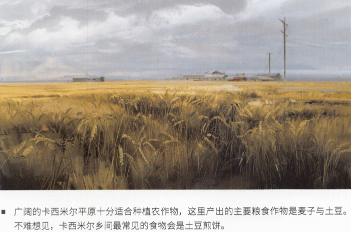

### 政治与军事
#### 政体
卡西米尔在数百年前就经历了从王政到贵族共和的变革。领地制度是卡西米尔的基础，这个国家在本质上是一个贵族骑士们的领地联合体，监正会最初的职责就是对这些领地进行统一的管理和协调。在商业联合会成立后，监正会为了巩固自身的权力不断调整权力架构，现在，它已成了一个由骑士领袖指挥的军政府。
#### 国家机构
监正会是一个主要由骑士构成的议行合一的委员会，负责组建政府，行使治权。大骑士长是监正会行政长官的头衔，同时也是卡西米尔国家元首的头衔。绝大多数的监正会成员都有骑士和政府职员两重身份，这充分体现了卡西米尔深厚的军事传统。
骑士协会是卡西米尔专门处理骑士事务、管理骑士头衔的机构。骑士协会的历史相当悠久，在如今的卡西米尔建国之初就存在了。虽然名字一直在变，但它自打建立起就一直处于相对独立的状态。不过时至今日，骑士协会的工作重心绝大部分已放在了与竞技骑士相关的内容上。
国民院是卡西米尔的立法和司法机构。作为最晚建立的重要国家机构，国民院事实上向监正会让渡了一部分立法权。作为执法机构的卡西米尔国民警察名义上是国民院的下属。

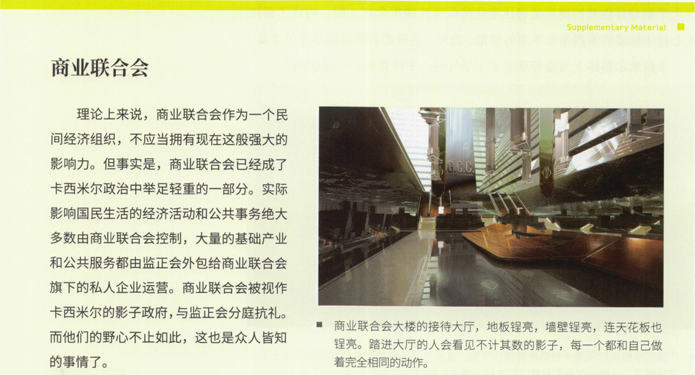

### 区划
卡西米尔的行政区划以领地为单位，每一块领地都为一个贵族骑士家族所有。
在区划上，有的移动城市是领地的一部分，而有的移动城市本身就是一块领地。卡西米尔的大部分人口都聚居在移动城市内。
卡西米尔境内的固定定居点基本都是中小型村镇，大多数处于城市的影响力范围之外。
### 卡西米尔的骑士
在卡西米尔，“骑士”这一词语的内涵和外延远比其他任何地方来得更复杂，因为卡西米尔的社会基础就构建在长久以来的骑士传统之上。经过长期演化之后，骑士阶层由于各方面的原因，分化出了不同的群体。

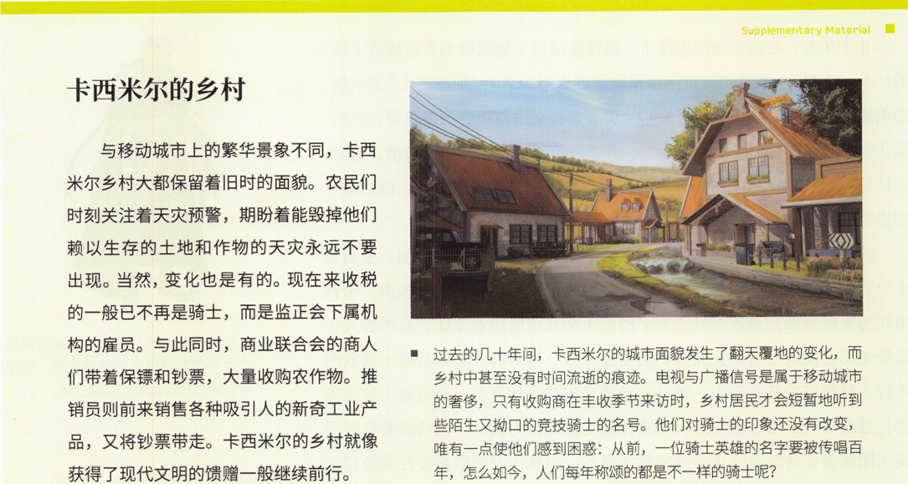

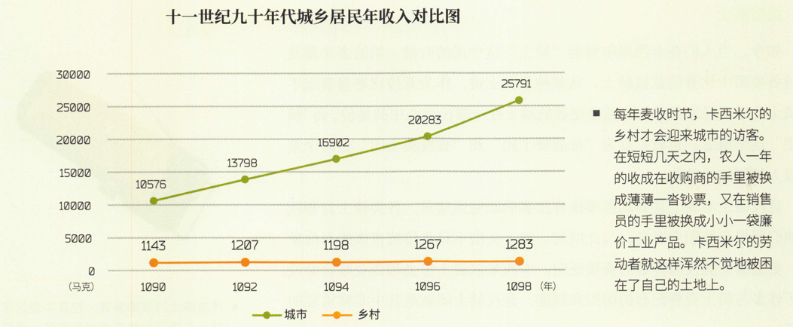

#### 贵族骑士
骑士贵族，或者说贵族骑士，是最传统的、拥有领地的骑士。过去还没有监正会和骑士协会的时候，骑士贵族的家族往往是某个骑士团的直接领导层。在战争时，他们大都率领部队冲锋一线;在和平时，骑士贵族则通过政治活动来增强自己的影响力，并以此壮大自己的实力。但在如今这个世道，骑士贵族不再被允许拥有私兵，还得受到骑士协会的严格监管。骑士贵族们已无法通过战争的方式来维持自身需要的巨额开销，于是各地的骑士贵族纷纷转而投资企业与人脉，希望通过这些方式维持贵族身份的最后一点脸面。
#### 征战骑士
几十年前，在监正会的主持下，国民院通过了被简称为《征战骑士法》的一系列法案。法案首先规定国家军队将被重组为名叫“征战骑士”的队伍，而组建、招募、训练等与其相关的一切事务都交由监正会全权负责。然后，监正会禁止了贵族私募军队的行为，并将所有贵族骑士团全部解散。同时，这些法案还规定，加人国家军队的骑士贵族将会失去贵族身份，他们的一切贵族权益将被暂时冻结直至军队生涯结束。
自此开始，卡西米尔的军队由各骑士家族自行训练的骑士团，变为数十个直属于监正会并实施募兵制的征战骑士团。从组织形式上来讲，卡西米尔的军队从旧式贵族军队变为了由监正会雇用的职业军队。虽然加人征战骑士团会使骑士贵族丢失他们的贵族身份，但仍有许多来自骑士家族的年轻人自愿成为征战骑士。得益于卡西米尔的发达商业，征战骑士的装备都先进而实用。征战骑士团大都直接接受监正会的指挥，这代表着各征战骑士团需要在各地为监正会处理棘手事务，也意味着他们需要在商业联合会与监正会的斗争中站在监正会的一边。

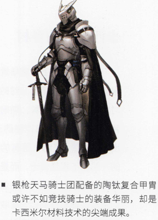
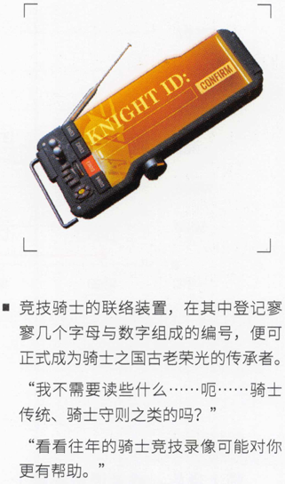

#### 竞技骑士
如今，当人们在卡西米尔提起“骑士”这个词的时候，指的多半都是参与各项骑士比赛的竞技骑士。从某种意义上讲，作为竞技比赛参赛选手的骑士几乎已经取代了作为战争使者的骑士在一般民众心中的地位。而“骑士团”这个概念，也被扩展为“征战骑士团”和“竞技骑士团”这两个差异极大的团体的总称。
竞技骑士本质上是参加各项体育比赛的职业运动员，各类骑士竞赛就是他们所投身的职业赛场。与此同时，骑士头衔不只是传统贵族的身份象征，更是骑士竞技参赛者的资质证明。卡西米尔骑士协会和商业联合会设计了许多与骑士竞赛配套的组织和制度，竞技骑士团就是其中非常重要的一环。
与作为军队而需要负责备战和作战的征战骑士团相比，竞技骑士团的业务基本上都是商业性质的日常运营。竞技骑士团负责招募和训练竞技骑士，并处理旗下注册骑士的公众形象及参赛等相关的事务。对于规模较大的各项竞技赛事而言，只有竞技骑士团的成员和骑士家族的代表才有资格参赛。大部分规模较大的竞技骑士团的运作资金都来自巨型企业以及各类财团，小型竞技骑士团则大部分是自负盈亏的。

#### 骑士家族和长骑
如果将卡西米尔的贵族制度看作一棵大树，那么骑士家族便是树上的枝丫，骑士则是树叶与果实。骑士家族是获得骑士协会认证的贵族家族，绝大部分骑士家族都是在监正会和骑士协会成立初期被册封后一直传承下来的古老世家。各骑士家族的领袖称为“长骑”，负责管理家族的内部事务，而每一位长骑都需要在骑士协会登记自己作为族长的信息。那些成了征战骑士的长骑仍会保有这个头衔，即便他们在从军期间会失去贵族身份，却还是可以出手管理家族内部事务。近些年来，卡西米尔官方致力于收回这些家族的头衔，极少认证新的骑士家族，骑士协会最常用的手段就是以“没有长骑”和“无法承担贵族身份的支出”为由，取缔骑士家族的身份。
卡西米尔的传统贵族制度内部并无规制上的等级差距，所以理论上来说，所有被称为“骑士家族”的家庭组织都是身份同级的贵族团体，这种设计主要源自骑士们的军事传统。过去的大骑士团中往往存在着几个甚至十几个骑士家族，自从各骑士团将所有贵族的特权等级定为平级后，军队内部便能利用军阶的差别最大限度地减少贵族身份对作战指挥的影响。这种改动的影响延续到现在，骑士家族的成员享有直接参加骑士竞技的特权，却无法在此之外索取更多实质性的权利。

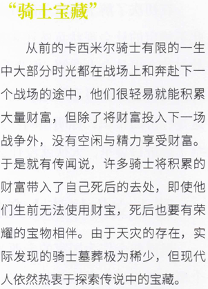

### 商业、金融和消费
人们习惯于称呼卡西米尔为“骑士与商业之国”，将骑士置于商业之前当然是受到了历史及文化传统的影响，但如今的卡西米尔早已不是以前那个靠着骑士四处征战才能立足的国家了。现在支撑卡西米尔一切事物的其实是强劲有力的商业以及金融业。
庞大的资金流宛如这个国家的血液，在企业不间断地泵击下日夜不息地高速流通。人们疯狂地将自己的资产兑换成各式各样的金融产品，期待着自己彻夜钻研的经济规律能够成为现实，从而获得梦寐以求的财富。存在或者不存在的商品被买人，然后卖出，长此以往那些本不属于商品的东西在人们眼中也被打上了价签，变成了可供贩卖的消费品。所有的事物就这样消融在名为“消费”的海洋里，只有交易所里飞速跳动的指数表在提醒着人们，一切还没有走到尽头。
在卡西米尔，几乎每个你能想到的与社会生活相关的产业都被商业联合会把持。医疗、教育、交通、农业等产业都由无数个不同的承包企业负责向社会提供服务，这些企业唯一的共同点就是加人了商业联合会。企业间的斗争势同水火，普通人也许会认为相同领域内有多个企业共存会产生良性竞争甚至提升出产的质量，但事实是各方都在试图使用低劣的手段独占所有市场份额。曾经有一个季度，负责管控大骑士领供电的企业连换三家，但他们使用的甚至还是同一套设备和人员。“兼并，然后被兼并”，卡西米尔这句描述古代领主之间互相攻伐的谚语在新时代被赋予了新的含义--企业间的战争结果。

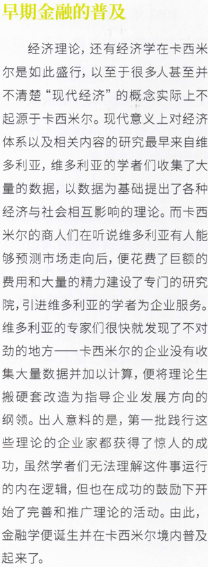

在初次了解卡西米尔的社会现状时，其他地区的人往往都会惊讶于如此不稳定的社会现状竟然还未崩溃，卡西米尔政府和商业联合会之间的半敌对状态更是令人费解。但当我问生活在卡西米尔的民众对未来的预期时，得到的答复却显得意外地乐观:“钱生钱，我是说一-钱总会越来越多的，这是经济的常识，你明白吗?只要还能见着更多的马克在等着人们自己去拿了放进口袋里，大伙就没什么好担心的。”

#### 骑士文化与骑士竞技
虽说如今作为国家的卡西米尔并不依靠骑士而存在，“卡西米尔”这个概念却与骑士无法分割。卡西米尔人骄傲于自身悠久的骑士文化传统，在他们的普遍认知中，骑士的形象从四处征战的战争机器演化为今天赛场上的角斗明星，这种变化正是一种社会进步的表现。骑士身份也从无序的战争中解放，成为秩序指导下的比赛中的一部分。因此，普通民众非常欢迎骑士竞技的存在和流行。尽管传统骑士家族的成员与征战骑士军队的发言人经常公开指责骑士竞技与骑士本身所承载的精神内核不相符合，也并不利于训练真正能保护社会的骑士，但他们作为社会中的极少数人，始终无法与商业联合会掌控的宣传机器对抗。
1062年，第十次乌卡战争结束后，卡西米尔的各大媒体对内宣布卡西米尔方在战争中取得了令人满意的战果。此后，对骑士竞技的批判大幅度减少。因为人们发现自己热衷于骑士竞技并投入其中这件事不会使国家的生存空间受到影响，卡西米尔在战争后甚至可以算是获利的一方。这种想法在外人看来可以说是无视了征战骑士在战争中起到的作用，但确实至今仍属社会主流观点。
当然，从经济的角度来看，骑士竞技甚至可以说是有百利而无一害的项目。紧张刺激的赛制和极高的话题度极大强化了人们的付费欲望，从场内的补给投放到场外的周边产品，仿佛只要消费便与聚光灯下的骑士们有了共同的参与感。骑士竞技给卡西米尔的各地带来了不可计数的财富和声誉，慕名前来观看比赛的游客更是来自泰拉各地。得益于移动城市的存在，各类锦标赛可以在巡航路线上的任何地方举行，即便是居住在城外定居点的居民们也能隔三岔五地进城看几场比赛。

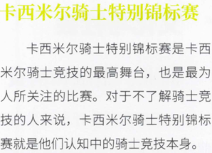
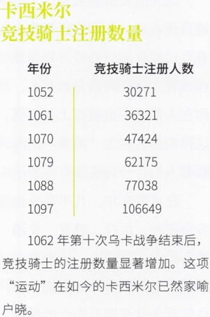

### 结语:旗帜不再
卡西米尔这个国家就像卡西米尔人最擅长的金融学一样令人捉摸不透，只剩躯壳的传统被名为“创新”的恶意填满，代表荣光的骑士团旗帜如今沾满了阴谋的污渍，内部分裂并且矛盾丛生，然而她依旧茁壮成长，甚至越来越强。无人知晓这种奇观能够膨胀到的极限究竟在哪，身处其中的人们仿佛在经历一场没有尽头的漫长赛跑，期待在身后的一切崩溃之前自己能超越更多的对手。

## 哥伦比亚
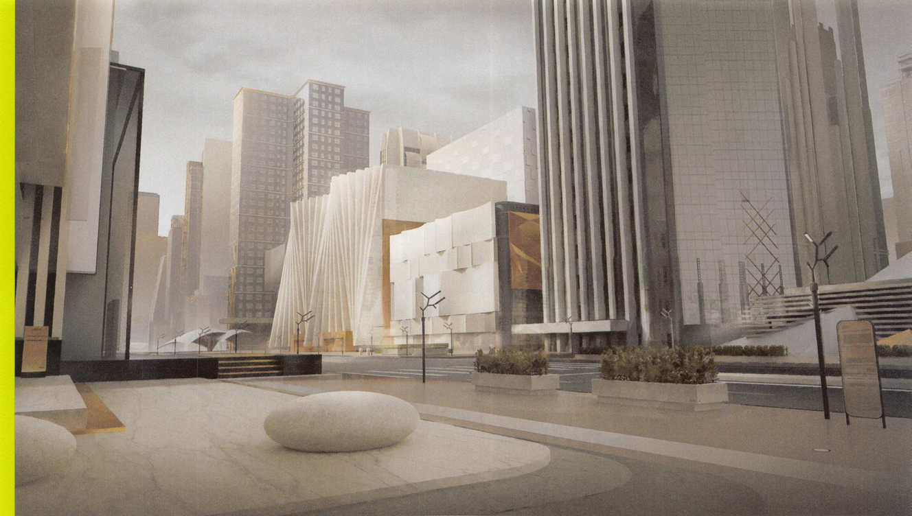

### 概览
哥伦比亚联邦是一个相当年轻的政治实体，位于已知大地的西北方，是玻利瓦尔的近邻。移动城市脚下的土地曾经是一片了无人烟的荒原，直到公爵们赞助的探险家向他们回报了这片未开发土地的存在。随着开拓军和移民的到来，拖挂式移动城镇拔地而起，大篷车队将工业原料送抵维多利亚的边境，哥伦比亚很快就成了维多利亚最重要的开拓区之一。通过高卢支持下的独立战争，开拓区最终摆脱了维多利亚的远程统治，由移民、商人和士兵组成了一个充满活力却危机四伏的社会。今天的哥伦比亚已经成为极具影响力的政治经济实体，但拓地者的后裔显然不满足于现状，力图在核心圈的圆桌旁放下一把属于自己的椅子。

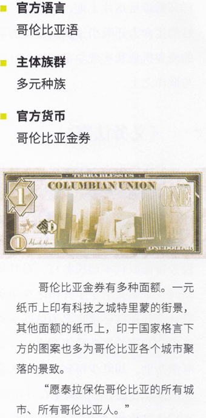

### 历史
#### 一只靴子
990年，由议会赞助的探险队向北出发，穿过千里荒地与重重山峦，来到了今天被称为“哥伦比亚”的地区。莱塔尼亚的宫廷信使曾经宣称，玻利瓦尔的东方仅有荒芜恶土，是完美的流放地，除此之外没有任何价值。维多利亚的探险家看到了同样的景象:谢拉格山脉西北方的大平原裸露着龟裂的胸脯，只有蜷成一团的奇特植物滚过探险家的脚边。但这没有完全浇灭他们的热情，探险家们带来了由皇家科学院提供的秘密武器--一套用于深层源石勘探的新式设备，这将帮助他们深人莱塔尼亚人尚未触及的领域，发掘那些隐藏在枯涸地表之下的宝藏。七个月后，一封信被呈给了伦蒂尼姆的议会，这封信以著名的“一只靴子”宣言作为开头:如果一片土地能够放得下一只靴子，它就应当属于维多利亚。
探险队找到了埋藏在大平原下方的源石矿脉。以今天的眼光审视当时的勘探结果，哥伦比亚的深层源石储量不如雷姆必拓的那么丰富，但哥伦比亚的优势在于地表源石环境更加稳定，天灾发生的频率也相对更低。当然，真正打动议会的还是新开拓区的战略价值一-哥伦比亚开拓区将在玻利瓦尔和它的东方宗主之间放下一只靴子。很快，财大气粗的高多汀公爵就调集了一批移动采矿平台，开拓军也随之开拔，绕过高耸人云的雪峰，向尚未被开拓的新边境进发。
在接下来的十五年中，大量的移民人口来到了哥伦比亚，将这里从流放地变成一个名副其实的开拓区。移动采矿平台拖挂着废铁焊成的城镇，异铁熔炉和永不停歇的源石精炼厂将有毒的发光烟雾喷上半空，映亮了城镇阴影下的驮兽牧群;荒地牧兽人围坐在篝火边，靴筒里插着短刀，他们大多是来自玻利瓦尔和卡西米尔的移民。高卢也不甘落后，帝国的信使同样开始涉足这片土地，试图向“维多利亚的靴子”施加影响。新开拓区奇妙的生命力还吸引了跃跃欲试的商人和学者，他们纷纷来到这里寻找开放的商业机遇和实现学术理想的环境--尽管这一切都建立在对弱者的迫害与欺诈之上。

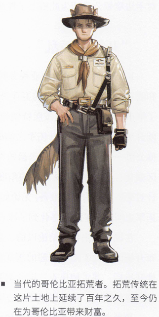

#### 《义务法案》
弗雷德里克三世和议会对新开拓区的前景十分满意。高卢在地缘博弈中步步紧逼，维多利亚急需将手中的每一张牌都投入这场对抗中。议会在1011年通过了《开拓地税金、治安与感染者管制义务法案》，简称《义务法案》。法案在针对哥伦比亚的税收措施上不断加码，以维多利亚派遣的税务特使取代本地税务官，对开拓军成员及其家人持有的产业课以重税。同时，法案又给予了开拓区在防务和感染者管制上的“宽松自主权”，这意味着开拓区必须自己为这些事务买单。在这二十年中，荒地野兽、亡命匪帮和恶劣的自然环境夺去了许多拓地者的生命，开拓区不止一次向本土寻求帮助，却鲜少得到回应。法案的颁布加剧了开拓区与维多利亚之间关系的紧张程度，不满情绪在开拓军之中爆发，并迅速蔓延至整个哥伦比亚。在后来被称为“联邦之父”的梅兰德·塞勒涅等人的倡导下，独立运动在开拓区各处纷纷兴起。
回顾维多利亚，法案的颁布还意味着哥伦比亚开拓的最大受益者高多汀的坎农公爵一“慷慨”地割舍了自己的利益。耐人寻味的是，高多汀公爵几乎没有在这之后的“开拓区叛乱”中蒙受任何损失，他的主要对手边境领公爵却为此搭上了性命。
#### “开拓区叛乱”
1016年，一名维多利亚税务特使在执行公务时遭到了持械暴徒的袭击和殴打，特使和两名随行的卫兵身负重伤。尽管当地的开拓军第一时间缉拿一了肇事者，但他们拒绝按照特使的要求将犯人送回维多利亚审判，事件很快就升级为特使卫队与开拓军之间的流血冲突。自《义务法案》颁布以来，其他公爵--尤其是边境领公爵的军事力量就开始以“保护财产”为由在开拓区强化自身的存在。从狮王的角度出发，这既是对高多汀公爵的制衡，也是针对莱塔尼亚的军事准备。无论如何，这起暴力事件都意味着帝国驻军与开拓军之间的关系已经恶化到了冰点，双方的摩擦正演变得愈发血腥。在议会得出任何结论以前，急于夺取战利品的边境领公爵提伯特就宣布开拓区正处于不可饶恕的叛乱状态，并带着自己的军队远征哥伦比亚。他开拔后，弗雷德里克三世立刻强迫议会达成共识一-在高卢仍在蚕食维多利亚的城市、莱塔尼亚陈兵边境的当时，狮王决定静观其变。战事之初，由开拓军叛军和地方民兵组成的哥伦比亚独立武装力量完全无力阻挡公爵的进军。他们士气低迷，缺乏对抗战舰的有效手段，甚至在规模上也不占优势。大多数人只知道边境领公爵不是宽厚的贵族，他不接受投降，并且愿意使用一切手段镇压这场叛乱。在前线以外的其他地方，移民商人们向家乡送去信使，买下每一双握剑的手，希望异国的雇佣兵能够充实对抗公爵的作战力量。高卢不愿错过这个削弱维多利亚的机会，四座哥伦比亚的大型移动城市在帝国军事顾问的指导下被改建为军事要塞，安装了能够击毁战舰的重炮。尽管如此，独立军仍节节败退，直到传奇人物马克·麦克斯在哥伦比亚的历史上登场。
#### 马克·麦克斯
在哥伦比亚的通识教科书上，马克·麦克斯是“联邦之父”梅兰德·塞勒涅的重要战友。后者在战后拒绝出任政府职位，建立了致力于维护哥伦比亚公民福祉的私人机构--梅兰德基金会。马克·麦克斯是一位颇具神秘色彩的独立运动领袖，直到战争的第二个年头，他才在梅兰德的担保下加人独立武装力量的指挥部。马克自称是矿场精算顾问，曾在边境领公爵的磨下服役多年，能够以自己的军事经验和运算天赋帮助独立武装力量制定战略。由于家人还在维多利亚，他无法公开露面，只能通过梅兰德架设的扬声器参与对话。一开始，人们对梅兰德的判断极其失望，没有人愿意采纳这个神秘人的建议，高卢顾问则坚信他是间谍。但当他准确地预言了数次战略上的失败之后，大多数人的态度发生了变化。在他的建议下，独立武装力量重整为哥伦比亚独立军，感染者被允许参与后勤生产以换取更好的生活环境，许多作战策略也得到了重新制定。更重要的是，马克为独立军带来了久违的胜利，使人们逐渐恢复了信心。公爵不止一次试图除掉这个难缠的对手，但自从马克加人独立军指挥部后，公爵深耕多年的情报网络就再也没有奏效过。

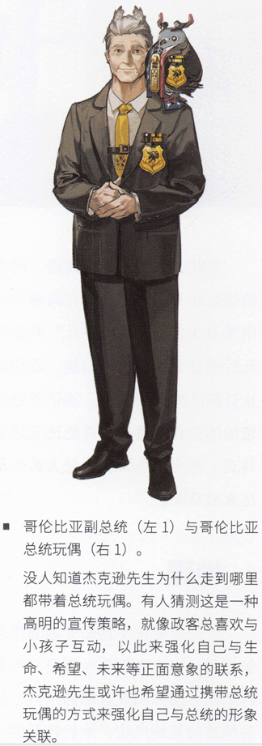

#### “泰拉保佑我们”
在马克的指挥下，灵活的独立军开始袭扰并夺回边境领公爵在过去一年中控制的区域。这种看似不痛不痒的反击破坏了提伯特以迅速平叛为首要目标的战略部署，使他的舰队无法专注于突破由城市要塞组成的防线，被蚕食的控制区开始加速迈向崩溃。到了1018年春季，提伯特公爵意识到迅速平叛已是痴人说梦，他陷人了一场艰难的拉锯战。一开始，他还敢于命令士兵钻进矿道，冒着感染矿石病的风险清扫独立军;后来，他不得不在绕开或是摧毁整个矿场之间做出选择，否则就要为消灭一百名独立军战士而付出超过五百人的代价。
提伯特决定放下尊严，向伦蒂尼姆派出求援的信使。他甚至愿意与高多汀公爵重新谈判，希望坎农能够不计前嫌地伸出援手。边境领公爵的恳求石沉大海，维多利亚保持着令他恐慌的沉默，一如他们在过去二十余年中对待哥伦比亚开拓区那般。
1018年秋冬两季的一连串战役将边境领公爵推向了失败的边缘。独立军在战场上投人了更多隐藏在地下工事中的重型火炮，维多利亚的战舰再也不能主导战局走向。公爵舰队在这六个月间损失了十余艘战舰，提伯特的座舰也在11月的巴贝奇战役中被跳帮攻占;公爵本人与登舰的独立军进行了勇敢的搏斗，但最后也不得不选择弃船。正是在这场战役中，从一位不知名的独立军战士口中诞生了那句后来成为哥伦比亚国家格言的话:
泰拉保佑我们。

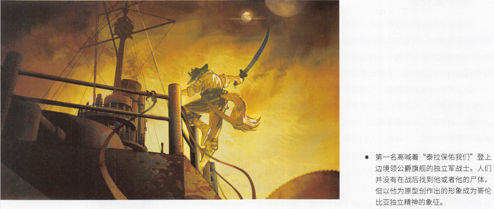

自此，公爵军开始败退，向南撤出哥伦比亚。边境领公爵在巴贝奇受的伤始终未能痊愈，他在高烧中产生了幻觉，坚信自己感染了矿石病，因用军刀为自己“切除病灶”而不治身亡。没有理会提伯特求援的议会在他死后向独立军派去了信使，希望体面地结束双方的敌对行动。狮王同意终止开拓区的一切义务，承认哥伦比亚的独立地位，并且协商清算遗留在当地的维多利亚资产。哥伦比亚终于成为一个独立的政治实体，厥功至伟的马克·麦克斯也来到了更大的荧幕上一-这个奇特的黎博利被推举为哥伦比亚的总统。

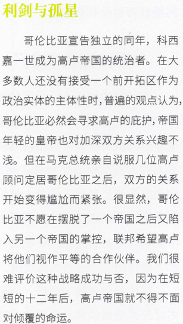

### 地理
哥伦比亚位于已知大地的西北方，向西接近玻利瓦尔，向东与卡西米尔相望，国土面积在今天已与维多利亚相近。高耸的谢拉格山脉阻挡了来自东南方维多利亚近海的水汽，让哥伦比亚东部形成了由大平原和砂岩峡谷组成的荒地风貌。地势较低的中部则是另一番景象，发源自多个方向的河流最终汇人这里，为横贯南北的广大湖泊水域提供了丰富的水资源。在西部，荒地再度占据上风，玻利瓦尔平原在向东延伸的过程中逐渐褪去绿意，受大陆性气候的影响变得干旱荒芜。由于已探明的科罗萨主矿脉从这里穿过，西部地区自然也成为哥伦比亚地下源石资源分布最集中的区域。

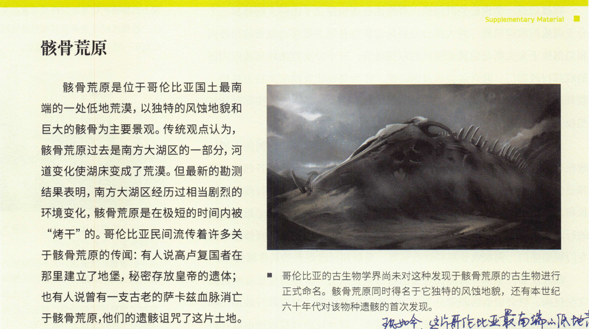

### 政治与军事
#### 政体

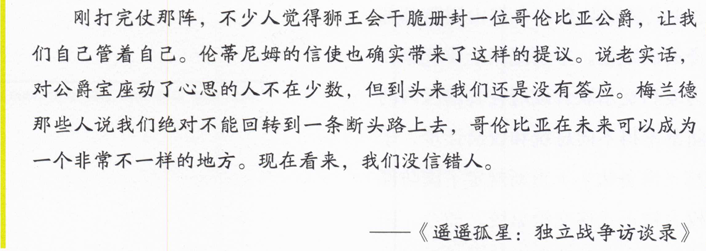

哥伦比亚联邦是一个由民选总统领导的联邦国家。被誉为“联邦之父”的梅兰德·塞勒涅认为，唯有组成一个比城市联盟更有力的实体，开拓区才能抵御来自维多利亚的挟制与威胁。总统制则出自马克·麦克斯的提议，他提出哥伦比亚需要一位取代皇家总督的“联邦总督”，以行政首脑-也就是总统一-的身份为新生的国家服务。开拓区的自治传统可以继续发挥作用，帮助哥伦比亚通过民选产生总统人选。这些理念奠定了哥伦比亚国家体制的基础，构建了一种迥异于维多利亚及其他核心圈大国的政治系统。
政府
在战后近一个世纪的时间里，哥伦比亚逐步建立了由两大部分和三个分支组成的政府机构:两大部分分别是设置在各州主要移动城市的州政府和总部位于麦克斯哥伦比亚特区的联邦政府;三个分支则指联邦政府内部的联邦行政部门、联合议会以及国防部。作为哥伦比亚的中央权力机构，联邦政府对重要的行政、立法与战争事务具有最高决策权，而实际行使这些权力的便是上述的三个分支机构。
总统领导着整个联邦行政部门，自上而下形成了总统、内阁和下属行政机构这三个层级。哥伦比亚联邦总统是民选的行政首脑，是各州的“联邦总督”，也是哥伦比亚武装部队的总司令。内阁由副总统、行政机构部长和总统指定顾问组成，是一支精干的行政团队，辅助总统制定最高级别的行政决策。下属行政机构包含了联邦政府中的一系列由联邦官僚组成的专门职能部门，例如农业部和财政部等，是联邦行政事务的具体履行者。联合议会，全称“哥伦比亚自由城市联合议会”，是哥伦比亚的最高立法机构。联合议会的职能分为三项:制定联邦法律、对联邦行政部门和国防部进行监督、代表哥伦比亚公民的意志。联合议会有权驳回由联邦行政部门和国防部提出的动议，对联邦官僚发起弹劾。无论哥伦比亚人是否乐意承认，联合议会参、众两院的设置都显而易见地模仿了维多利亚的两院制架构。参议院的议长由副总统担任，参议员代表各州、各移动城市的利益;众议院的议长由众议员们自行推选，他们与哥伦比亚各界的社会机构与企业团体有着密切而微妙的联系。
国防部是哥伦比亚军方在联邦政府中的代表，继承了独立军在战争中赢得的政治遗产，直到1056年，哥伦比亚武装部队总司令都由国防部部长担任，国防部甚至掌握了部分对外事务的决定权。本世纪四十年代末，对玻利瓦尔内战的失败干预(主要体现为玻利瓦尔联合政府在其辖区内的无能)让军方受到了全方位的责难，国防部不得不向总统和议会让步。于是，1056年的《联邦战争准备法》(简称《准备法》)重新规定了国防部的权力范围，武装部队总司令的职责与权力被正式移交给总统。如今，国防部行使的实际上是“军事准备权”，他们有权在总统宣布战争状态后动员联邦军事力量，并在这之前为联邦提供一支有能力“对战争进行提前遏制”的军事力量。

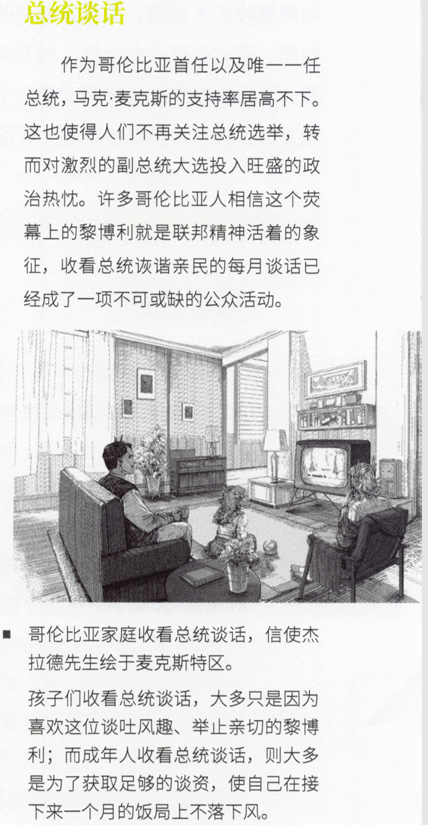
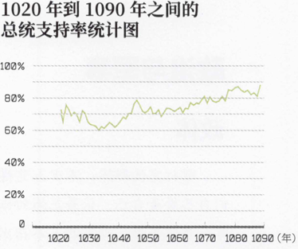

#### “提前遏制”战略
“提前遏制”战略，是由哥伦比亚国防部在1058年的年度《联邦防务白皮书》中提出的构想。这一构想通常被认为是国防部对本世纪四十年代末干预玻利瓦尔失败的辩白和再检讨，也是后《准备法》时代军方向总统和议会释放的破冰信号。概括而言，这项战略构想旨在通过向热点地区实施不再局限于军事手段的多层次主动干预，提前遏制战争威胁，实现确保联邦防务安全的目的。在得到了总统的首肯和议会较为一致的认可后，“提前遏制”成为哥伦比亚近半个世纪以来的基本安全战略。到目前为止，这项战略已经对玻利瓦尔和萨尔贡的地区局势产生了显著的影响。
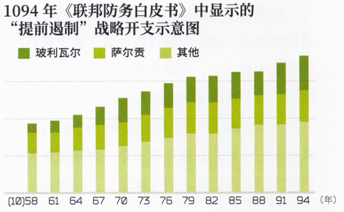
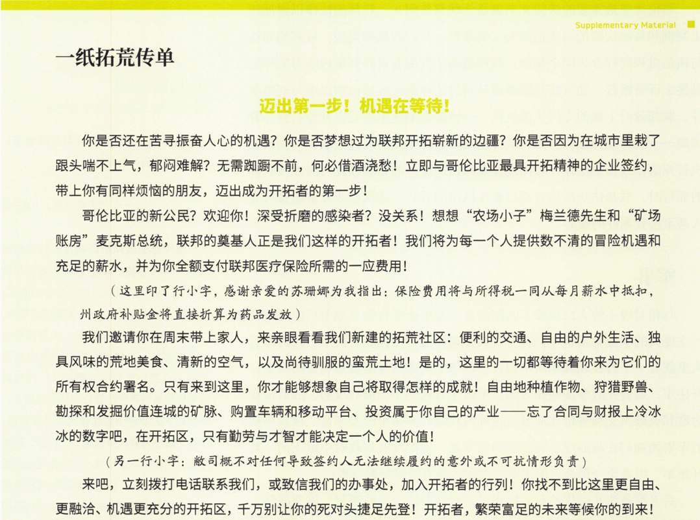
#### 区划
哥伦比亚是一个由十个境内州、一个特区首府及若干自由邦组成的联邦国家。被称为“州”的政治实体同时也是哥伦比亚的第一级地方行政区划。哥伦比亚的州普遍由数个主要的移动城市及分布在城市周边的城镇定居点组成。自由邦则是联邦在境外的加盟飞地，通常是具有完全自治权的独立城市，最著名的例子就是汐斯塔。
州政府是哥伦比亚的地方行政机构。与炎国宣政司和高卢行省不同，哥伦比亚的州政府仅在行政层级上低于联邦政府，并非接受联邦政府直接管辖的下属机构。州政府延续了开拓区时代的地方自治传统，在行政和立法、司法上保留了有限的自治权力。
根据1083年的统计数据，哥伦比亚广阔的领土承载了一千六百万人口，其中约一半居住在移动城市中。在移民和大拓荒的双重作用下，哥伦比亚的总人口正在以惊人的速度增长，持续为这个年轻的国家注人新鲜血液。

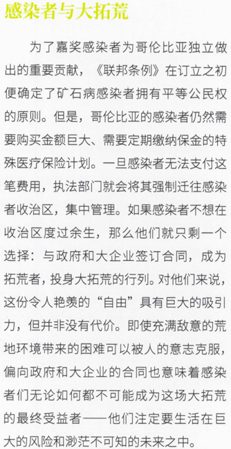

#### 法律
哥伦比亚最重要的法律文书就是《联邦条例》，联邦的法律以遵循历史判例和最高法院的司法指南为主要原则。与行政机构类似，联邦的司法与执法机构同样分为两个部分。联邦最高法院拥有对联邦境内所有案件的最终上诉管辖权，地方法院则遵照各州的法律裁决区域内的民事与刑事案件。联邦政府下属的专门执法机构--例如烟酒施术单元以及源石制品管理局-执行联邦法律，由州或移动城市自行组织的地方执法机构则负责执行州法律或市镇法律。若出现涉及跨州、涉外的犯罪以及可能涉及联邦的罪行时，联邦执法机构会通过委任执法的方式，让探员或专案组直接介人甚至接管案件的侦办。
#### 军事
与相对较小的人口规模不匹配的是，哥伦比亚自独立战争后便保留了一支庞大的职业化常备军。在符合兵役条件的哥伦比亚公民中，大约每五人里就有一个曾在联邦军队中服役。联邦军队的前身是维多利亚的高多汀开拓军，后者在战争期间作为独立军的主力遏制了公爵的攻势，战后被视为联邦英雄主义和哥伦比亚独立精神的代表。开拓军经验丰富、极具声望的军事领袖们在战后成了国防部的领导者，他们在联邦政府中留下的“老开拓军”派系至今仍是哥伦比亚国内政治角力的重要参与者。
后《准备法》时代的军方提出了“对战争进行提前遏制”的新战略。联邦军队着重于提升精确的先发打击能力，发挥作为安全政策工具的影响力，避免哥伦比亚在毫无准备的情况下陷人一场全面战争。在这一前提下，联邦武装部队形成了由职业常备军和私人军事承包商组成的灵活力量:职业军队配备制式的武器装备，以高速战舰支持下的机械化步兵师为主要作战编制。私人军事承包商则以合同形式为军方服务，提供后勤方面的支持。

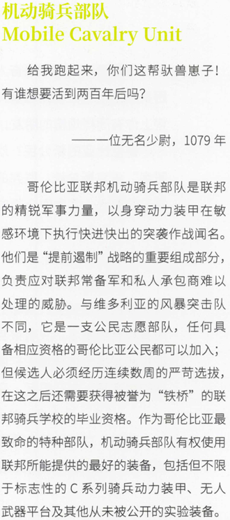
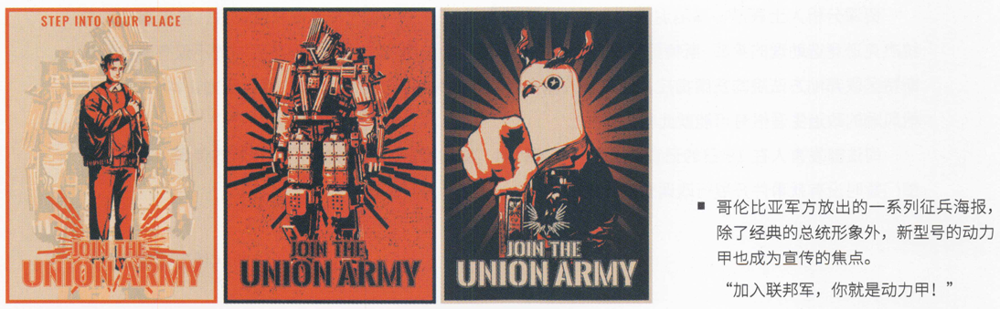

### 经济
伦蒂尼姆的经济学家曾经断言，哥伦比亚的经济发展基于两个主要推动力:发达的商品贸易和对于技术进步的执着追求。尽管他们在相关论述中有意无意地撇去了维多利亚在开拓区时期对哥伦比亚经济造成的负面影响，但这一结论基本上是准确的。独立战争后，哥伦比亚就致力于在玻利瓦尔和卡西米尔之间开辟稳定的贸易通道。联邦政府的掮客说服了辛嘉斯政府和卡西米尔的商人，一条横跨哥伦比亚东西两端的商贸线路被建立了起来。这条通道在一开始仅仅是两国商品中转的捷径，但很快，哥伦比亚开始借助它向两国市场输出自己的经济影响力，从中赚取了巨大的利润。惊人的科技发展是哥伦比亚经济的另一个侧面，我们几乎无法想象，近一个世纪前的哥伦比亚是一个贫穷的开拓区。以莱茵生命为代表的私人科研机构，以及雷神工业这样的尖端装备制造商，已经让哥伦比亚在将科学技术转化为经济效益的领域获得了领先地位。在大型科技企业的主导下，商业化的科技成果也被应用于哥伦比亚的诸多基础产业，使企业主在哥伦比亚的政治领域获得了巨大的影响力。
但我们必须注意到，这里提到的巨额利润以及各种夸张的经济增幅似乎并没有对普通人产生什么影响。难以计数的财富落进了企业家的口袋里，政府则鼓励所有哥伦比亚人成为企业家。联邦政府应该统计每年因为创业失败欠下贷款而被迫成为拓荒者的人数，并公之于众。我猜测这个数字会大到令每个阅读这份报告的人都感到震惊。

### 文化与社会
哥伦比亚的社会文化以维多利亚开拓区时代为起点，在各地区、各种族移民的影响下，它成了多元的文化熔炉。在打开一盒哥伦比亚商队油炸快餐的同时，我们可以看到这样一幅图景:开拓军将高多汀地区的土豆带去哥伦比亚，塔拉地区的移民后代发明了以腌制羽兽肉为原料的高热量油炸食品，其又常常佐以玻利瓦尔的流行风味酱汁。
在哥伦比亚，判断外来群体能否被社群接纳的一个重要标准，就是他们带来的文化是否成为哥伦比亚流行文化的一部分。与之相应的是，哥伦比亚的文化艺术界热衷于借用各式各样的文化元素进行创作，在蓝卡坞这样的“流水线”上生产受到市场欢迎的文化产品。在联邦政府的激励下，包括但不限于餐饮、音乐、影视作品的哥伦比亚流行文化，在其他国家和地区产生了越来越广泛的影响。

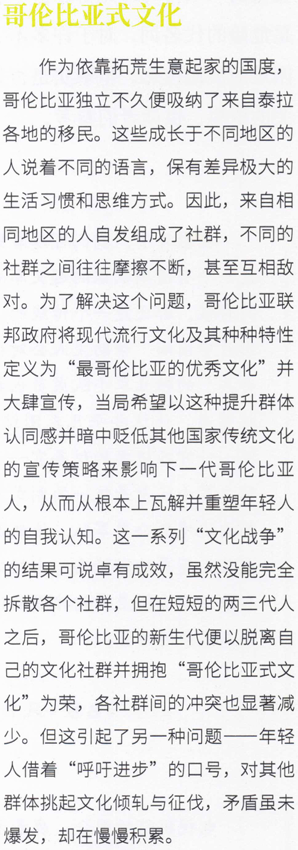

### 结语:在孤星与灯火背后
几乎每一位哥伦比亚公民都会告诉你:哥伦比亚联邦是泰拉最了不起的国家。哥伦比亚人骄傲于他们的选举，骄傲于感染者的公民权，骄傲于他们的技术进步和“哥伦比亚梦”。但是，在孤星与璀璨灯火背后，一条老路等待着这个年轻的联邦。

## 荒地拾遗

### 汐斯塔

人们热衷于赋事物以名，即便是最常见的公共空间，也被人分为不同等级，并依次安上从“聚落”到“定居点”再到“城市”等不同的名字。在过去的很长一段时间内，人们所依赖的、国家外的最大集体，称为“独立城邦”。如今，独立城邦大都被国家吞并或接近消亡，汐斯塔这座特殊的独立城市却是镶嵌在南方漫长海岸线上的旧日遗珠，正是我们研究现代独立城邦的绝佳范例。
汐斯塔位于海边，却因为在大静谧中免遭摧残而拥有着与泰拉绝大部分海岸不同的海滨风光，因此也成了全泰拉数一数二的旅游度假胜地。在历史上，它曾经是新生的哥伦比亚与伊比利亚的交会点，而如今的汐斯塔在哥伦比亚和维多利亚之间找到了自己的定位，移动城市化的“新汐斯塔”也已经建设完毕，驶向了下一个时代。
#### 历史

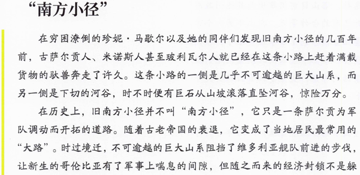

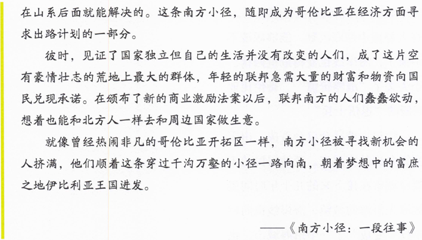

1020年，新兴的哥伦比亚联邦迎来了独立以来的第一个春天。这一年，面对从维多利亚独立后愈发凸显的经济问题，年轻的联邦进行了一系列开拓，竭力寻求着广阔的市场和机遇。
此时南方的伊比利亚王国控制着海洋，商业发展势头正旺，这对处于百废待兴状态的哥伦比亚来说实在令人向往。与此同时，强势的伊比利亚与维多利亚也谈不上关系和睦，这恰是哥伦比亚人可以利用的一点。为了追随商机，在巨大山系的庇护下，哥伦比亚人从1025年开始在旧南方小径的基础上开拓前往伊比利亚控制范围的陆地道路，并在沿途建立起一些普通的定居点。1035年，在“坚持拓荒”的哥伦比亚军方的推波助澜下，一批来自哥伦比亚的“退伍”独立军士兵及哥伦比亚的普通移居者和当地人合作，在接近海边的地区找到了一大片无人认领的宜居地。他们效仿附近的伊比利亚王国贸易城邦，组建了一个很简陋的“议事大会”，并以此为基础建立了独立定居点，由于这片天灾甚少的地区当时被称呼为“汐斯塔”，这个独立定居点也被称为“汐斯塔”。

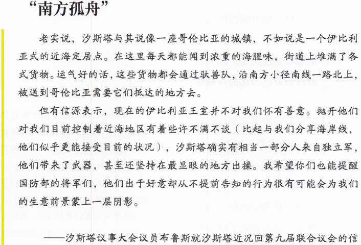

当时的人们不会想到，上文表述的这种微妙局势很快就灰飞烟灭了。1038年，盛极一时的伊比利亚王国在大静谧中彻底沉默，能够源源不断给哥伦比亚提供货物的“南方航道”中断了，海岸线也变得危机四伏。根据已公开的一些汐斯塔城邦文件，由于失去了“战略价值”，哥伦比亚军方毫不犹豫地选择撤回了大部分愿意回国的“退伍士兵”。
伴随着哥伦比亚军方在国内的失势，后续规划被联合议会否决，由军方推动而建立的“独立城邦”汐斯塔也变得名副其实起来。荒地居民的不断加人，加上来自四方的文化影响，让整座城市在接下来的几十年时间里有了自己的模样。大静谧摧毁了绝大多数原先沿海的城镇，海岸线也向后退缩了一大截，原先并不靠海的汐斯塔不仅“变成”了一个沿海城市，也因为受到大静谧影响最小，而能比别的地区更快地恢复，并在新的领域找到了自己的特产-附近盛产的黑曜石。
除此之外，汐斯塔地区依然位于维多利亚前往萨尔贡等多地的交通要道上，这个定居点因此在短短几十年时间里飞速兴盛，从沿海城镇变为所在地区最为强大的独立城市。从“南方小径”“南方航道”到“南方孤舟”汐斯塔顽强地驶出了枯竭的航道，这也难免令向西顾盼的维多利亚公爵们都心生觊觎。
1066年，汐斯塔接到了维多利亚单方面的“通知”，内容是邀请汐斯塔作为新城市加人维多利亚。然而，大部分的汐斯塔市民并不希望改变好不容易得来的自由环境。
当时担任议事大会成员，在汐斯塔声望斐然的企业主赫尔曼·道尔科斯提出应重新与哥伦比亚建立联系。他认为，时过境迁，汐斯塔已经从航道中断的危机中复苏，他们有足够的筹码让哥伦比亚重新考虑为这座独立城邦提供庇护。与此同时，这里仍然与联邦本土相隔甚远，在曾经的海岸线已然失去商贸价值的当下，总统和联合议会宁可在当地人当中委任一位市长，也不会选择完全改变并接管汐斯塔。
经过艰难的全民讨论，汐斯塔的决策层决定向与自己颇有渊源的哥伦比亚求援。
哥伦比亚联邦同意了汐斯塔的请求，同时汐斯塔市通过决议，加人哥伦比亚，成为享有完全自治权的自由邦。此后，维多利亚也不再向汐斯塔发来他们的“邀请函”。
借助这一事件带来的宝贵机遇，赫尔曼利用联邦与汐斯塔之间的信息差以及他个人的广泛影响力，将传统的城市议事大会改为市政厅和市议会，以便他更高效地处理政务。在表决后，汐斯塔成了真正的哥伦比亚自由邦，赫尔曼也就此成为汐斯塔的市长、“南方孤舟”的领航员。也许维多利亚人从未预料到，汐斯塔这样一个独立城邦会如此决绝地对抗维多利亚帝国的命令，采取强势压迫的手段更是让局面变成了维多利亚最不想看见的情况一一个边境外的小城成了哥伦比亚的飞地。这种情况下，维多利亚当局更换策略，开始尝试用更温和的手段影响这座城市如今的立场。

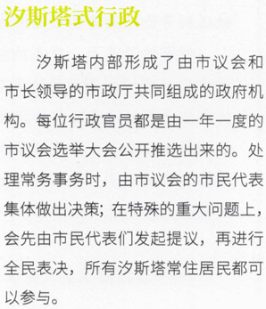

#### 地理
汐斯塔与维多利亚西南部毗邻，西侧是萨尔贡帝国的实际控制区。从维多利亚出发，穿过汐斯塔，一路向西就可以前往萨尔贡和哥伦比亚。作为城邦，汐斯塔并没有占据多少土地面积。
汐斯塔全域都坐落在近海平原，气候湿润炎热，常常遭受海洋风暴的季节性侵扰，但海洋风暴也为这里带来了丰沛的雨水。
1097年前后，汐斯塔开始逐步搬迁，旧城区均被转为移动城市地块。移动城市的活动范围仍然在原汐斯塔市附近。古老的汐斯塔火山位于汐斯塔市原址的东部地区。在搬迁工作全部完成之前，有相当多的居民选择暂居于新汐斯塔航道附近的固定乡镇中。

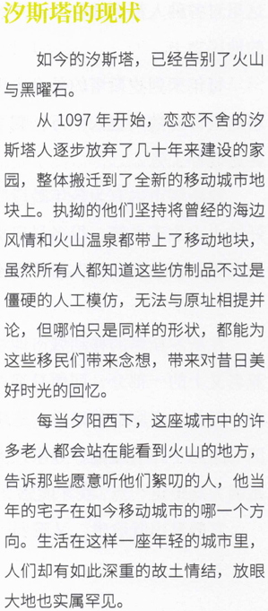

#### 治安
就像目前还存在的绝大多数独立城邦一样，汐斯塔也没有真正意义上的军队系统，仅有一支人数不多的职业警察队伍，主要处理城市内的治安管理事务。汐斯塔很少遇上需要全力应对的军事冲突，当前的警察系统足以应付日常事务。
#### 经济
在1097年之前，汐斯塔的特产是火山中产出的黑曜石，这种珍贵的矿石及其制品的交易产生的收益是汐斯塔旅游业尚不发达时的主要经济来源。但由于开采黑曜石会对当地的火山生态造成破坏，该行为早已被禁止。曾经汐斯塔主要的经济来源是秀丽的风景造就的旅游业。拜大静谧所赐，如今绝大多数的海岸线都变得凶险无比且不适宜居住，汐斯塔却依然宁静，让这里毫无疑问地成了独一无二的海边旧日时光重温处。在移动城市落成之后，汐斯塔人需要接受海岸线远去的事实，商业贸易再次成为这座城市最重要的收人来源之一。
#### 文化与社会
包容的文化氛围是汐斯塔这座城市重要的组成部分之一。作为地处交通要道的旅游与商贸城市，汐斯塔实际上是个备受各方关注的文化路口。这里对各种人都保持着自由开放的态度，也是少数对感染者都堪称“友好”的地区之一。
每年来到汐斯塔的外乡人极多。当地常住人口仅三十万左右，而汐斯塔的人口总数高达八十万，剩下约五十万人都是来自泰拉各地的商人、游客还有务工者。
汐斯塔市内有为各年龄段服务的教育机构。城市航道附近存在环境良好的火山生态系统，很多科研机构在这里设有研究所和观测站。因此，本地高等教育学府内的生态环境相关专业水平非常高。
在新汐斯塔的移动城市地块上漫步，不会有人觉得这里其实是哥伦比亚名义上的一部分，即便是那些联邦来的游客，也会认为这片乐土是自由的。但是从实际局势来看，这座近海小城就如它落成时一样，依然得在大国的压力下左右逢迎，寻求一方平安之路也深受诸多外部因素的限制。正是因为知道这一点，我才能感受到如今汐斯塔表面的繁荣难掩深层的纷争。它的自由既珍贵，又脆弱。

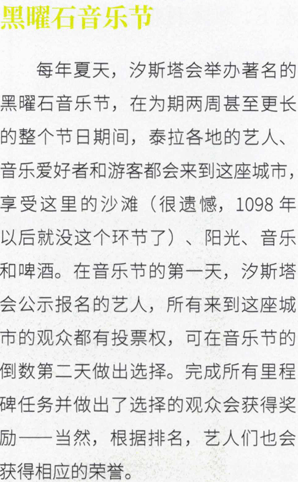

## 玻利瓦尔

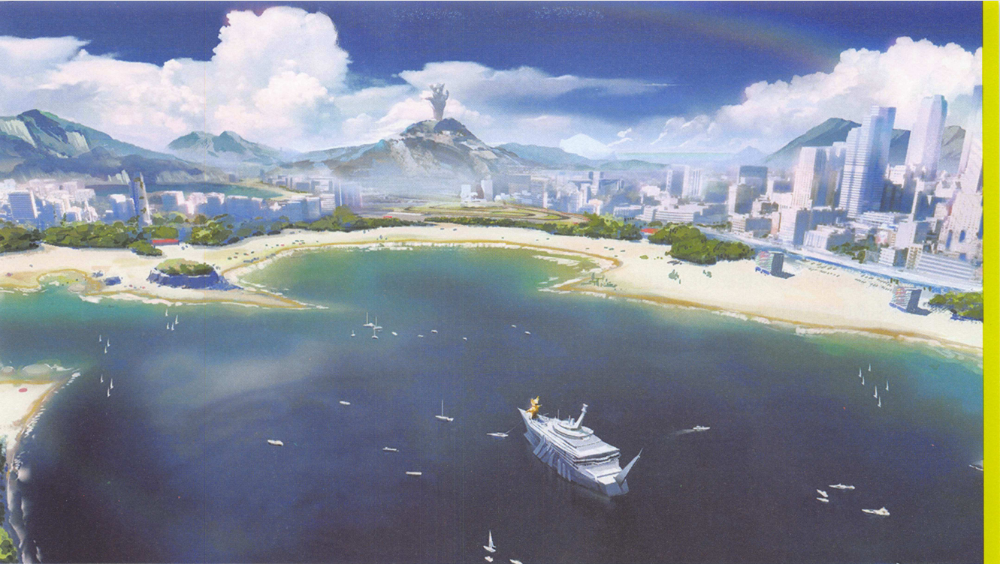

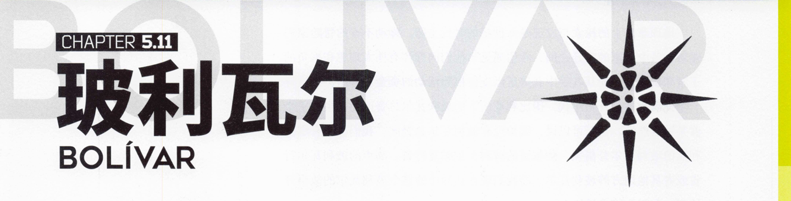

### 概览
“探险者乐园”“征服者的王国”“赤金原野”......这些早已淡出人们视野的称呼曾经属于现在正饱受战火折磨的玻利瓦尔--这一位于泰拉西部的地区甚至不能被简单地叫作一个国家。三百多年来，人们对玻利瓦尔的印象从象征着富裕与强大的玻利瓦尔总督区变化至代表了混乱和落后的玻利瓦尔地区。对于那些身处安全之地的人来说，混乱是机遇的另一个名字，老牌强国莱塔尼亚和新兴大国哥伦比亚先后试图控制玻利瓦尔为己所用，却一直没有成功。富饶、广阔的玻利瓦尔在各方势力的侵略和争夺下已经残破不堪，但人们的生活还要继续，即便动荡的阴霾从未消散。

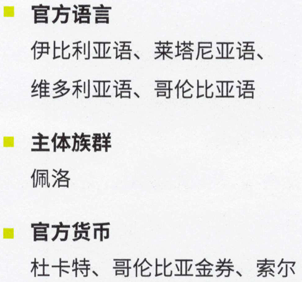

### 历史
#### 光荣远征
地理意义上的探索与发现是八世纪的时代主题，躁动不安的冒险家们辗转于各个国家的宫廷之间，希望遇见与他们同样怀有伟大理想和抱负的王室和贵族，以便从其手中获得足以支持探险活动的资金和补给。在这样个充满激情的开拓年代，伊比利亚治下的玻利瓦尔总督区的诞生似乎带着某种必然性。甚至可以说，哪怕没有玻利瓦尔总督区，我们也会有维多利亚的玻利瓦尔公爵领、萨尔贡的玻利瓦尔帕夏行省、高卢的玻利瓦尔行省或者其他地方的玻利瓦尔。而我们现在认知中的这个玻利瓦尔的故事开始于一个叫作德菜昂的人。
弗朗西斯科·德莱昂698年出生于伊比利亚北部一个贫穷的村庄(那个时候还没有移动城市)，他在人生的前十多年中都只是一个经常在荒野四处游荡的无名之辈。717年，德莱昂加人了一支途经村庄的探险队，这支人数不多的队伍的目标是前往伊比利亚的东部，探索未知的土地。年轻的德莱昂在旅途中展现出了一名优秀探险家应该具备的品质:坚强、活跃、机灵、善于规划且充满野心。随后的时间里，这位来自北方的穷小伙不但迅速接管了探险队，还成了各国宫廷的座上宾。他为高卢皇帝提供开拓国境的建议，也向维多利亚公爵献上来自远方的宝物。从炎国到萨尔贡，从乌萨斯到伊比利亚，德莱昂在717一735年间几乎走遍了当时人类已知的整个泰拉。他下定决心成就一番更加伟大的事业。
735年，德莱昂正式向伊比利亚国王提请援助，目的是请其“赞助一次人类历史上规模最宏大的探险”。德莱昂向王室说明，这次探险的目标是从未有人踏足过的泰拉大地西北方，如果能够发现合适的定居地，那么便由伊比利亚来接管和建设那里，如果没有发现合适的定居地，这支探险队的见闻和经历将成为宝贵的经验以及彰显伊比利亚国力和君主开明决策的有力证据。国王与廷臣商议再三，最终被探险家的实力及其允诺的荣耀所打动，决定从全国范围内征集人手和资源来资助德莱昂。已经脱离了那个各国争相开疆拓土年代的现代人也许很难理解，一国之主为何要花如此之大的精力来投资一项看起来并不可靠的事业。但在八世纪，前往未知地区这件事本身就被人们视为一种勇敢者的壮举，各地的人都会向以身试险的探险家们致以敬意，而他们背后的赞助人则会以此宣传自己的名号，就好像是赞助人自己为全人类开拓出了一片广阔的新天地一样。
在经过了长达两年的准备后，德莱昂带着大量的物资于737年踏上了前往泰拉西北部的旅途。为了获得更多资源，德莱昂向国王提供了一套详细的路线方案--他会沿着核心圈各国的贸易道路前进，这样虽然消耗巨大却最为保险。但实际上，德莱昂从来都没有打算返回伊比利亚，他将人生余下的一切都赌在了这次探险上，他希望能够带着足够多的资源开拓片属于自己的领地。为了能够在最短的时间内消耗最少的补给到达目的地，探险家决定带着所有人和补给借道萨尔贡，走最短的路径前往目的地。就这样，德莱昂靠着一套假方案从国王手里拿到了两倍于实际所需的物资。当探险队离开伊比利亚后，独掌大权的德莱昂才将真正的计划向队员们展示并令众人执行。
当时的伊比利亚与萨尔贡之间虽有商业交流，但仅限于局部的少量贸易，几乎没有国家级别的往来。在抵达萨尔贡境内时，德莱昂作为探险队的全权代表直接找上了当地的最高长官--贝亚德帕夏。在沟通时，德菜昂提出了各种合作的可能性，邀请帕夏与伊比利亚交好并与他共同建设商道。帕夏欣赏探险家孤注一掷的冒险精神和他说的各种天马行空的想法，于是同探险队协商了一系列合作方案。在仔细检查过探险队携带的都是普通的补给后，帕夏同意放行，并且派出了自己的军队开拓出一条新的道路。事实证明，德莱昂的赌博赢得了不可计数的丰厚回报。他在泰拉大陆的西北方发现了一片资源丰沛的开阔大平原，于是决定在这里停下脚步，一边开始建设，一边派使者返回伊比利亚沟通建立新领地的事宜。

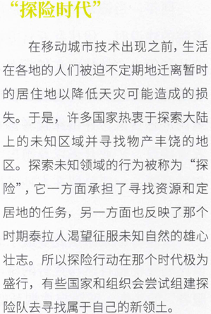

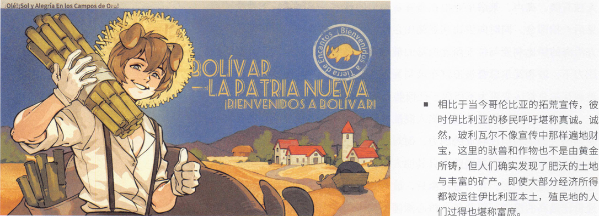

同年，当德莱昂和探险队的成员在如火如茶地完善第一个定居地和修道院的建设时，伊比利亚官方派出的特使随着德莱昂的使者的脚步来到了这片新领土。特使向在场所有人宣布了伊比利亚王室的命令--探险队发现的这片土地从即日起属于伊比利亚，这里被命名为“玻利瓦尔”，设立殖民地总督区，并由探险者德莱昂出任总督，管理一切事务。总督区进行农业建设、矿业开采以及殖民活动，每年所有的经济所得一部分支付给萨尔贡商路，一部分留在本地维持正常生产运转，剩下的全部运往伊比利亚本国。
探险者德莱昂从此变成了总督德莱昂，为了宣传他的功绩，以及彰显伊比利亚征服自然与荒野的雄心壮志和大胆尝试，王室赐予了德莱昂“征服者”的头衔。城镇与炊烟开始出现在这片名为“玻利瓦尔”的平原之上，萨尔贡境内的那条商路见证了玻利瓦尔的崛起，伊比利亚更是收获颇丰，一切都呈现出欣欣向荣之势。那个时候，还没有人预料到，等待这个新兴地区的将是长久的苦难与战火。
#### 厄运降临
玻利瓦尔总督区在德莱昂的治理下进人了高速发展的黄金时期，人们将这里视为实现梦想之地，萨尔贡、莱塔尼亚及维多利亚等地陆续有人移居至这片充满活力和生机的土地。759年德莱昂去世，伊比利亚指派了另一位总督接管玻利瓦尔。新任总督虽然没有德莱昂那样出色的能力和极高的人望，但也是堪用之材。在接下来的几年中，玻利瓦尔仍然保持着活跃的状态。
一切的变化开始于767年，这一年开发伊比利亚一萨尔贡一玻利瓦尔商道的贝亚德帕夏去世，他的继任者为了淡化贝亚德的功绩并为自己累积威望，强行关闭了这条玻利瓦尔与伊比利亚本土之间最繁荣也最重要的商路。同时，维多利亚皇帝担忧玻利瓦尔这块伊比利亚飞地的快速发展会威胁到本国未来的安全，于是尝试联合其他国家一同破坏玻利瓦尔的现状。无独有偶，高卢、莱塔尼亚也在盘算着类似的计划，三国在简单地交流意见后一拍即合，同时向伊比利亚施压，他们尝试通过各种手段切断位于南方沿海的伊比利亚与位于西北内陆的玻利瓦尔之间的关联。在多方同时的压力下，玻利瓦尔总督被迫宣布玻利瓦尔决定独立，并从伊比利亚治下的玻利瓦尔总督区变更为不臣服于任何势力的玻利瓦尔自治领。
至此，玻利瓦尔开始逐步陷人混乱的状态。以维多利亚为首的各核心圈强国只想削弱伊比利亚的国力，而对在玻利瓦尔生活的居民毫不关心。这些老牌帝国一方面要提防来自其他大国的威胁，一方面又想尽可能地从玻利瓦尔攫取资源。在一番权衡后，放弃独占玻利瓦尔的计划反而变成了性价比最高的选项，因此各个核心圈国家均未对新兴的自治领施以援手，反而还暗中破坏其他国家与这里进行的贸易和政治往来。玻利瓦尔南边的萨尔贡则宣称可以帮助玻利瓦尔自治领，但要求这个地区像瓦伊凡地区一样对萨尔贡万王之王俯首称臣并接受一位帕夏的治理。此时的玻利瓦尔刚刚经过了蓬勃生长的三十年，对自己的未来仍充满信心，萨尔贡这种傲慢并且略带羞辱的态度使得总督直接回绝了万王之王的使者。那时的玻利瓦尔人以为自己遇到的困难只是暂时的，却没想到这种程度的困难在多年以后回看简直堪称幸福。
玻利瓦尔自治领存在了一百三十年左右，其间一共经历了四十余位统治者，每人在位时间平均不到三年。内忧外患完全笼罩了玻利瓦尔。就内部而言，自治领政府崩溃、经济瘫痪、瘟疫横行，各地都是割据政权，整个国家呈现出完全混乱的状态。伊比利亚的第一批移民在贫困、疾病与暴行的夹缝中挣扎求生，只有少数聚落还保留着信仰，渴望重新与祖国建立联系。而外部社会也在发生剧烈动荡，移动城市的出现完全改变了国际局势。曾经因为忌惮长途行军作战可能带来的意外情况而未对玻利瓦尔发兵的大国，也把控制玻利瓦尔的计划重新提上了议程。
#### 战争泥沼
九世纪下半叶，高卢、维多利亚和莱塔尼亚等国在拥有了属于自己的移动城市后纷纷试图插手玻利瓦尔的事务。各方混乱的外交拉锯战从885年一直延续到897年，最后的胜利者是莱塔尼亚。施彤领的选帝侯召集了一大批来自各区的军队以“协助新政府”为由，在这年发兵进人玻利瓦尔自治领，在经历了一系列打着“平叛”口号的战争后，基本上重新统一了玻利瓦尔全境。选帝侯协助的这个“新政府”被称为“辛嘉斯王朝”，这基本上是个纯正莱塔尼亚风格的傀儡政权。辛嘉斯的领袖自称为“国王”，定都玻利瓦尔的大辛德拉卡托，从此开启了玻利瓦尔王国时代。
选帝侯的大军撤走后，辛嘉斯政府参考莱塔尼亚的大区模式统治了玻利瓦尔，但这种统治更多是一种名义上的管理，各地在对待辛嘉斯政府的政策时不约而同地采取了阳奉阴违的做法。辛嘉斯政府每年向莱塔尼亚提供源石矿、粮食、人力以及大量的现金，而玻利瓦尔也成为莱塔尼亚人出门远游的首选之地，说莱塔尼亚语的人在这里能够同时享受到便利的语言环境、贵族一般的旅居生活和景色独特的异国风光一-然而这一切都建立在玻利瓦尔人的苦难之上。虽然辛嘉斯王朝因为尾大不掉的行政体系和平庸的治理能力并没能有效地快速发展玻利瓦尔，但与自治领时期相比，玻利瓦尔人的生活至少有了些许略带耻辱的改善。
可这种虚假的平静也没有持续多久，哥伦比亚这个新兴势力的出现再次改变了核心圈诸国对于玻利瓦尔的外交策略。1019年获得独立的哥伦比亚完全覆盖了玻利瓦尔前往莱塔尼亚的路线，虽然此时的哥伦比亚还没有能够切断莱塔尼亚一玻利瓦尔商路的实力，却也实打实地严重影响了两地之间的通行效率。不仅如此，哥伦比亚联邦政府还试图通过扶持具有政治影响力的企业和商人来左右玻利瓦尔的国内事务。哥伦比亚的一系列行为在1020一1047年这段时间里越来越明目张胆，甚至玻利瓦尔部分地区的割据势力已经实际上脱离了辛嘉斯王朝的控制而投向哥伦比亚的庇护。哥伦比亚当局于是做出判断--莱塔尼亚已无实际能力掌控玻利瓦尔，所以哥伦比亚应该尽可能地投人资源加人这场玻利瓦尔争夺战。
这个时间段，玻利瓦尔真正的统治者其实是被称为“巫王”的赫尔昏佐伦，此时已值赫尔昏佐伦统治的后期，这位近乎癫狂的强大皇帝于1048年向玻利瓦尔派出大军，剑指所有与哥伦比亚暗中勾结的“叛徒”。同时，赫尔昏佐伦还希望利用玻利瓦尔在哥伦比亚掀起内乱。莱塔尼亚本土此时也是一片混乱，因此巫王从各大区召集来的军队主要由流民和盗匪组成，而金律法卫指挥官则以自己只为《金律乐章》庇护的九大区而战为由，拒绝了赫尔昏佐伦的调度。这支半职业军队一-或者说得更直接点，这些职业兵匪一-纪律散乱，战斗力低下，他们前往玻利瓦尔可能更多是为了逃离巫王的统治而不是去对抗哥伦比亚。
在莱塔尼亚军队缓慢进军的途中，哥伦比亚趁机撮合玻利瓦尔境内早就私通了哥伦比亚的大商人和地方政府，在拉乌尼达组成了由财阀议会领导的玻利瓦尔联合政府，意图反过来颠覆莱塔尼亚的控制，榨取更多的资源。哥伦比亚不断地向玻利瓦尔联合政府控制区输送武器、军队教官和参谋，试图通过这种方式帮助自己扶持的傀儡控制玻利瓦尔。但哥伦比亚显然低估了玻利瓦尔的混乱程度，长期的投资并没有让哥伦比亚迅速夺取这片地区，反而将其拖人泥沼。从此，玻利瓦尔陷入长期内战，哥伦比亚为了削弱莱塔尼亚在玻利瓦尔的影响力，借此机会将玻利瓦尔联合政府控制的地区从玻利瓦尔王国改称为“玻利瓦尔独立国”。
在联合政府与辛嘉斯政府开战的前几年中，一大批有着结束内战或者消除外国干涉等不同诉求的军事组织在玻利瓦尔陆续出现--有要求结束内战并驱逐傀儡政府的玻利瓦尔拯救阵线，有接受了锈锤思想反对一切政府的解放玻利瓦尔斗争联盟，也有要求建立全新议会体制的玻利瓦尔青年党等。这些军事组织在1050年合流，名义上以“真正玻利瓦尔人解放运动”(简称“真正玻利瓦尔人”)自称并一同行动。辛嘉斯政府以及联合政府都将真正玻利瓦尔人称为“恐怖分子”，而真正玻利瓦尔人内部大多也都使用这个词语来称呼辛嘉斯政府和联合政府的人。新势力的出现并没有从根本上改变玻利瓦尔残破不堪的分裂状态。时至今日，玻利瓦尔仍处于激烈内战的状态。三百余年过去了，那些与玻利瓦尔的命运息息相关的国家都变成了不同的模样:伊比利亚遭遇变故濒临崩溃，高卢兵败战场而彻底灭亡，莱塔尼亚在政权更迭后进人恢复期，维多利亚内部接近分裂且皇权衰微，而新生的哥伦比亚则开始了自己的强盛时代。但是玻利瓦尔从诞生的那天起，便从未逃离他人的掌控。有关人生的一切对这里的人来说，就如同一位真正玻利瓦尔人解放运动军阀说的那样:“我的生活和我本人好像是两个分离的存在一-我想要掌控我的生活，但我的生活似乎从来不在乎我的看法。”
### 地理
总体而言，北高南低是玻利瓦尔地区最大的地理特点，位于中部的玻利瓦尔平原是这片地区的中心，而南、北地区则被生活在这里的人称为“边境”。北部靠近诺勒特海的地方被称为“玻利瓦尔边境高原”，整片高原占了全国面积的百分之二十左右，这里各种资源稀少，全年温差大，降水较少，并不适合生存，因此居民不多。
玻利瓦尔的大部分区域地处平原，一望无际的原野和丰富的动植物资源正是探险者决定在此扎根落脚的决定性因素。同时，玻利瓦尔平原的矿产资源也十分丰富，泰拉三大源石矿脉之一的科罗萨主矿脉由西南至东北横贯了整个平原的中心。一千六百万玻利瓦尔人中的百分之九十以上在这片巨大的平原之上生活。
玻利瓦尔最南部与瓦伊凡联盟相邻地区的景色有着极鲜明的丛林特征一-遮天蔽日的蓊郁雨林，每天下午几乎准时的强烈降雨以及蜿蜒几百千米的湍急河流等。与北部类似，南部这些并不适宜居住的地方人烟稀少。
### 政治与军事
玻利瓦尔境内的三个政权有完全不同的名称，也采取完全不同的三种政体以及治理逻辑。在此我会分别介绍玻利瓦尔王国(辛嘉斯政府)、玻利瓦尔独立国(联合政府)和真正玻利瓦尔人解放运动的特点。最后，还有一个特殊的地方一-多索雷斯，这里与玻利瓦尔其余各处的治理逻辑完全不同，我认为有必要向各位做出特别说明。如果正在观看这本书的您对这个部分感到困惑，那么我只能恭敬地向您道歉--我对这里的一切也同样地感到困惑。
#### 辛嘉斯王朝
作为目前玻利瓦尔存在时间最长的政权，辛嘉斯王朝并没有表现出什么带有玻利瓦尔地域风格的特质。或者说，也许它的平庸本质才是其得以延续至今的根本因素。
辛嘉斯王朝统治的玻利瓦尔王国是典型的君主专制国家，国王理论上掌握境内的一切资源。作为一个被莱塔尼亚扶持起来的政府，辛嘉斯政府在成立初期便尽可能地学习或者说借鉴了莱塔尼亚的政府机构设置。由血脉决定继承权的国王(选帝侯)、不知所谓的廷臣、由七级贵族更改而来的六级贵族和永远在受苦的平民一一切都是熟悉的莱塔尼亚风格，却缺少了莱塔尼亚政权中最核心的妥协与互助之道。莱塔尼亚政权的一切都建立在九个大区互帮互助之上，这些地区即使彼此之间时常有矛盾，却都认同自己属于同一个集体，这也是巫王能通过放逐叙拉古自治领来凝聚莱塔尼亚九区的根本原因。辛嘉斯王朝却从未，也不需要拥有这样的认知，所以在应用莱塔尼亚的政体时，就如同一个没有源石技艺适应性的人拿着法杖尝试施法一般白费力气。这种徒劳在越远离王都大辛德拉卡托的地方体现得越明显，在辛嘉斯政府控制下的偏远村庄里生活的人可能根本不会在意自己生活的地区理论上有六种贵族，对于他们来说就算这里有一百种不同的贵族头衔也完全无所谓。而在其他典型的君主制国家生活的人，比如同等生活条件下的乌萨斯人，他们在成长时就从生活环境里习得了准确称呼各级贵族老爷的能力。这种现象说明，辛嘉斯政府在文化上对生活在这里的人的影响力可能还不如他们的宗主国莱塔尼亚一-至少这里的老百姓都在说莱塔尼亚语。腐败和不公在玻利瓦尔王国是人们司空见惯的事情，并且在可以预见的未来中还会维持很长一段时间。
与混乱的政府系统形成鲜明对比的是辛嘉斯王朝较为出色的军队系统。玻利瓦尔王国境内实行不论性别的强制兵役，包括贵族在内的所有人都需要在军队里度过至少三年的时光。来自莱塔尼亚各级军事学院的教官和学生出现在辛嘉斯军队的各个角落，这些人大都是成绩优秀的未来指挥官，莱塔尼亚将他们派来玻利瓦尔不仅是为了帮助辛嘉斯王朝训练军队，也是为了让这些人亲历战场的前线并给以后可能遭遇的战争积累指挥经验。巫王自玻利瓦尔内战正式爆发后便停止了从军事指挥上援助辛嘉斯王朝的行动，但双子女皇登基后恢复了这个传统。辛嘉斯王朝控制的区域大都保留了完整的工业设备和基础设施，所以能够做到在领地内对军队武器和补给进行充分供应。对比而言，辛嘉斯军队有着良好的军纪和充分的补给，这也是这一政权能够在玻利瓦尔延续两百余年统治的根基。
#### 玻利瓦尔联合政府
在玻利瓦尔独立国旅行期间，不少居民都向我抱怨过政府的混乱和生活的压力。其中一位的说法令我印象深刻:“虽然这里叫联合政府，但是我们生活在这里的人既不知道他们联合的是什么，也不知道我们的政府在59哪里。
玻利瓦尔联合政府的政治体制十分独特，这里存在着一种与泰拉其他所有地方都不同的政治制度，为了更好地解释其运作原理，我甚至专门发明了“寡头议会制”这个名字来称呼它。联合政府中拥有决策权的是由15人组成的最高议会，这15人通过投票来决定这个国家最重要的事务。而这些人无一例外都是玻利瓦尔独立国境内最富有、最强大以及掌握了最多资源的人。他们通常都是一些带有垄断性质的财阀团体或者军事集团的领袖，也就是人们俗称的“寡头”。最高议会的席位是终身制，只有议员主动放弃或者死亡才能有下一个候补议员，这种规定带来了大量不光彩的勒索以及暗杀。
拉乌尼达的本地人喜欢告诉游客说，每一位最高议会的议员都曾经尝试统治这个国家，但都因为其他议员和哥伦比亚的阻挠而失败。在看见足够的证据之前我并不会完全相信这个小道消息，但是我非常理解它能够传播如此之广的原因。每一位议员都是在动荡时代抓住机遇彻底改变命运的投机者，当有十几个这样的“成功人士”聚在一起的时候，大家想做的事情其实每个人都心知肚明一-他们都想变得比其他人更成功一点。而哥伦比亚虽然一直以来都在扶持和培养他们，却绝对不能容忍这些人真的实现自己的梦想，也不允许他们脱离掌控。一般而言，国家的政治局势想要保持稳定，就需要国内有一股强势政治力量来牵制另一股强势政治力量，比如卡西米尔的商业联合会和监正会，又或者维多利亚的皇帝和各大公爵。但是玻利瓦尔联合政府的稳定是靠着外部的哥伦比亚来维持的，这种危险的平衡比辛嘉斯王朝腐朽的王权更加脆弱。不过考虑到联合政府成立至今只有五十余年的历史，我在这里也只能说这套体制的稳定性还有待考察。玻利瓦尔独立国实行征兵制，本质上是寡头出钱雇用领地内的居民成为职业军人。军队的教官是各大寡头高薪聘请的各国退役军人，而这些教官带来的是七八种完全不同的训练方式和军事理论，因此联合政府军队的军纪和战斗力良莠不齐。除了专门的军人外，联合政府内部还有一支名为“玻利瓦尔国民警备队”的部队，这支部队是政府在军队系统外单独训练的军警部队。联合政府每年都会花费巨资从其他国家那里购买新式军备来武装自己的士兵。
#### 真正玻利瓦尔人解放运动
我一生中见过的绝大多数非国有军事组织都是只收钱办事的高度专业化团体，但也有少数像“真正玻利瓦尔人”这样自诩正义却松散混乱的组织。毫无章法的他们究竟要实现什么样的目标，他们究竟要解放什么?在同我交流过的成员中，没有两位玻利瓦尔人说出一样的答案。
真正玻利瓦尔人解放运动是一个勉强联合的巨型军政府，十几支完全不同的军队在这里并肩作战--他们的唯一相同点是都反对辛嘉斯政府和联合政府。各级军官同时也是政策的制定者和执行者，军队内等级严明的上下级关系大大提升了政策执行的效率。他们治下的控制区基本上全年都维持着紧张的戒严状态，只有在节日的时候才会稍微放松管控。
许多生活在和平地区的人经常会呼吁大家支持真正玻利瓦尔人，毕竟当他们一听到这个名字，脑海中自然浮现出的就是饱受压迫的人忍无可忍起义反抗惨无人道的压迫者的场景。我不会评价这种做法和幻想是错误的，但是我想补充一下这个场景中外国人所不知道的后半部分。真正玻利瓦尔人反抗压迫者的做法并没有统一的纲领和愿景，目的也并不是单纯地驱逐辛嘉斯政府以及联合政府，他们中的大部分还热衷于摧毁一切与敌人哪怕只有一点关系的人一-而这些人大部分都只是在乱世中艰难求生的普通人。真正玻利瓦尔人对于敌人治下的领土实施焦土政策，即消灭所有人并劫掠一切物资后再彻底摧毁定居地。在真正玻利瓦尔人眼中，他们杀死的不是被贵族或者寡头折磨的老百姓，而是向敌人提供粮食或者衣物的叛徒。从1050年至1060年，被真正玻利瓦尔人这个迅速成长为强大军事集团的组织彻底摧毁的定居地加起来至少足够三十万人生存。虽然在最近十几年中，较为温和的玻利瓦尔青年党在真正玻利瓦尔人内掌握主导权后，这种惨绝人寰的事件已少有发生，但真正玻利瓦尔人从未杜绝使用最极端的暴力。
#### 多索雷斯
人们总说风暴的中心最为平静，而多索雷斯正是玻利瓦尔这个巨大且无序的风暴的中心。热闹的市集、繁华的街道和来往的外国旅客让这里看起来充满和谐，似乎与玻利瓦尔格格不入，但这和平的表象之下充满着玻利瓦尔最本质的一切。
多索雷斯是玻利瓦尔境内唯一一座中立移动城市，它不属于任何政府，而只属于市长个人。它位于玻利瓦尔平原西北部，有着独特的航道，每年会前往北方的诺勒特海引人海水来更换城内人工海里的水。多索雷斯被称为“娱乐之都”，这里的旅游业、商业、娱乐业、酿酒业和咖啡种植与加工产业非常发达。城市中的各种门店给市政府带来了巨额税收。多索雷斯还是玻利瓦尔地区极少数从政策上不迫害感染者的城市，感染者被允许进人多索雷斯市区，但是只能进人官方指定的感染者酒吧和赌场等娱乐场所消费。

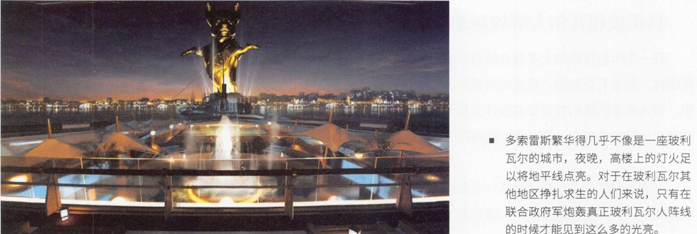

多索雷斯市的前身索雷城建立于1007年，索雷城在创立之初只是一座没有什么特色的普通移动城市。本世纪四十年代的时候，辛嘉斯王朝的统治者希望拥有一座以旅游业和娱乐业为主体产业的移动城市，于是就打算对索雷城进行改造，结果却遭遇了哥伦比亚扶持玻利瓦尔联合政府等一系列事情，所以索雷城的改造陷人了停摆，整个城市变成了一座庞大的烂尾楼。上一任市长老桑切斯在本世纪七十年代买下索雷城后开始继续对其进行改造。最大的变化出现在坎黛拉·桑切斯于1083年就任市长后，索雷城进人了高速发展期。这里成为玻利瓦尔境内重要的中立城市和经济中心。整座城市在1086年完成人工海的建设后更名为“多索雷斯”。
市长坎黛拉·桑切斯在多索雷斯实行独裁统治，她有着极强的魄力和政治手腕，通过与多方势力周旋确保了多索雷斯的中立地位。这座目前拥有超过一百万人口的城市在她的治理下成为玻利瓦尔的经济中心。在多索雷斯的生活看似美好，但这种美好建立在玻利瓦尔的苦难中心。
### 经济与社会文化
玻利瓦尔虽然一直处于战争中，但是这里的经济一直保持着平稳的发展。以农业和矿业为首的产业非常发达。丰饶且平坦的玻利瓦尔平原堪称农业的天赐福地，德莱昂曾经感叹在这里随便撒一把种子不需劳作就能长出作物，后世的纷争也大都因这片平原而起。玻利瓦尔的农业呈现出极大的南北差异:南方以咖啡和甘蔗种植为主，而北方则是瓜果和甜菜种植占主导。在玻利瓦尔平原上有大小各异的种植园，种植园主用极低的价格雇用工人进行劳作。产品中的绝大部分被莱塔尼亚和哥伦比亚等大国掠走，而这些消费品对玻利瓦尔本地人来说则十分昂贵。此外，丰富的源石矿、铁、铜和其他宝石也是各方势力争相抢夺的资源。

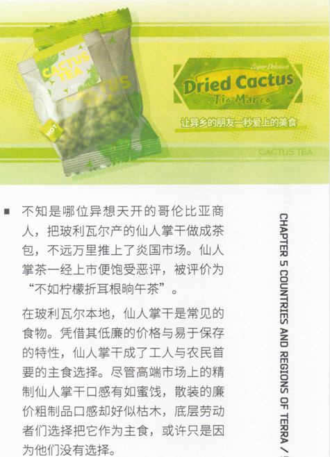

雇佣兵是玻利瓦尔的一大热门产业，受雇于任意一方的军人都可以获得不菲的报酬。这些雇佣兵是游荡在玻利瓦尔境内的中立军事单位，来自泰拉各处的他们带着战争报酬在玻利瓦尔境内移动且消费，在所到之处大肆挥霍并且购买巨量的补给和产品，这极大提高了各个地区经济循环的速度与活力。
与蓬勃发展的经济相对的是活跃的文化。玻利瓦尔与人们印象中落后野蛮的殖民地不同，这里的文化实力非常强劲。虽然识字率不高，但是很多人可以熟练地说二至三种语言。这里盛产各类文学和音乐作品。几个世纪以来，来自伊比利亚、高卢、萨尔贡、莱塔尼亚、哥伦比亚和维多利亚的人在这里共同生活，他们带来了各国的语言和艺术，来自不同国家的作品在这里碰撞然后交融，这种独特的文化影响了一代又一代的玻利瓦尔人。除了玻利瓦尔人见多识广的因素外，这里危险的生活和动荡不安的政治局势也催生出了大量的艺术作品，人们凭借艺术创作控诉着现实世界的丑陋与不公。
### 结语:希望的另一面
759年初春的一天，德莱昂总督在离世之前挣扎着向身边的随从说了人生中最后一句话:“玻利瓦尔必将摆脱伊比利亚的控制。”从某种程度上说，德莱昂的预言实现了。多年来，左右玻利瓦尔局势的政权早已不是伊比利亚，但我们都明白德菜昂期待的是玻利瓦尔不再受任何外人摆布。目前看来，玻利瓦尔仍需时日才能追上德莱昂的希望。

## 叙拉古

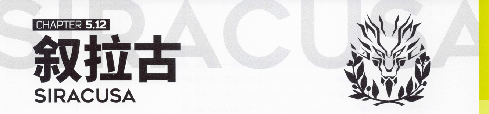

### 概览
长久以来，人们在听到叙拉古的名字时，想到的总是莱塔尼亚以东的一片土地，而不是一个政治实体。这里形成的松散城邦组织甚至不能被称为“同盟”，在盘踞各城邦的家族势力之间，矛盾与冲突从不缺席。仅在约六十年前，真正意义上的国家秩序才在这片土地上成形。当叙拉古的第座法院挂出门牌的那一天，许多民众上前围观，试图理解它的含义。如今是叙拉古城邦联合法院的这栋建筑，曾是叙拉古最豪华的家族宅邸之一，但在叙拉古脱离莱塔尼亚之后，家族争斗最为激烈的那段时间里，它所属的家族遭到灭门，金碧辉煌的厅堂里空留雨声鸣咽。西西里夫人将败者的遗产改建为新秩序的象征，与法院共同诞生的那一代人年轻时坚信家族势力将成为历史。然而今天，他们大多陷人迷惘。叙拉古真正由什么支配，依然值得考证。
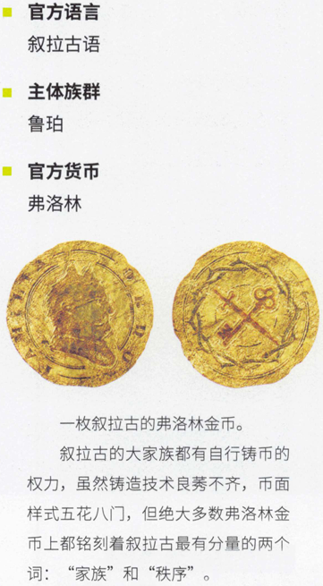

### 历史
#### 叙拉古地区
每个谈及叙拉古的人都会不厌其烦地讨论同一个话题-家族。但要追溯叙拉古家族传统的根源，人们也许应当将目光投向荒野上的“狼群”由鲁珀兽亲组成的“狼群”已经在叙拉古的土地上生活了至少千余年。时至今日，它们仍像古老传说中所描述的那样，在林野间无休止地追逐、猎捕、争斗。从生态学角度来看，相对于当地的猎物密度，叙拉古地区的“狼群”密度高到了超乎常理的地步。若要绘制一幅叙拉古地区的生物质能塔图，它可能会少见地呈现出近乎沙漏的形状。不论是在“狼群”内部，还是在不同“狼群”之间，都存在着极为激烈的竞争。
现代科学无力解释如此畸形的生态系统是如何形成，又是怎样存续的。但毫无疑问，“狼群”的存在对当地的人类产生了深重的影响。不葬身狼口已属不易，从狼口夺食更是妄想。叙拉古的原始部族无时无刻不面临着饥荒的风险，部族内也因此总是存在针对食物分配权的严酷竞争。鲜明的等级关系或许正是由此产生。
直到能伐倒林木的金属器得到普及，人们的生产方式有了一定程度的变革，叙拉古地区的人口才开始稳定增长。随着人口规模的扩大，维系家族同一性的主要因素也由血缘关系变成了身份信仰。被排除在家族认同之外的劳力群体开始出现，家族等级的区分转变为了社会阶层的区分。直到第一座由家族统领的城邦建立，叙拉古地区的人们才步人了一般意义上的文明社会。
历史上，叙拉古地区的各家族城邦之间形成了许多性质与规模各不相同的联盟或组织。条约与规则被订立又遭践踏，议事的厅堂被焚毁又得重建。很少有家族甘于遵循一套不受尊重的既定秩序，但在喋血之余，各大家族也总需要一个谈话的场合。叙拉古历史上规模最大、存在时间最久的家族议事组织是叙拉古城邦盟会，叙拉古历史上的多数家族都曾在盟会的桌边参与过谈判。

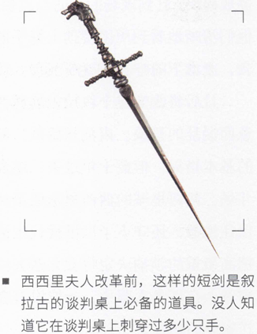

#### 叙拉古自治领
莱塔尼亚的古老颂词记载:“双角漆黑的萨卡兹踏穿东边的地平线，在乐与法的土地上抛洒血与火。”
若说叙拉古与莱塔尼亚的历史叙事在主题上有什么共通之处，那只能是共同抵御来自卡兹戴尔的侵袭。对萨卡兹的恐惧促使分散的族群结成同盟，传说“金色的羽兽掠过厅堂，它的啁啾就是金律的第一乐句”。当结盟一事尘埃落定时，莱塔尼亚地区的九名部族领袖不约而同地在大厅中架起各式乐器，后来成为整个莱塔尼亚治国之本的《金律乐章》最初正是自他们的管弦中诞生。而叙拉古的家族领袖们则面面相觑，他们的行囊里有猎物的角爪与皮毛，有防身用的刀与唬人用的剑，却唯独没有一把像样的乐器。莱塔尼亚帝国的建立或许是长久以来文化融合的必然结果，但对于叙拉古地区的人们来说，它仅仅是应付萨卡兹侵袭的权宜之计。最终，文化氛围、政治格局、种族构成等多方面的独特性使叙拉古被列为莱塔尼亚的自治领，虽无权参与皇帝的选举，但保有极高的自治权。
然而叙拉古与莱塔尼亚薄弱的联系很快被遗忘，很少有莱塔尼亚人记得帝国东边山林间还有一群异族的同胞。如果向莱塔尼亚人询问去叙拉古的路，他十有八九会反问你:“叙拉古是什么地方?”967年，在数个大家族的策动下，叙拉古爆发了声势浩大的独立运动。
#### 叙拉古城邦联合
事实上，尽管莱塔尼亚在数百年间对叙拉古所遭受的侵袭不闻不问，但在两百年前的卡兹戴尔远征中，莱塔尼亚的术师军团发挥了不可小觑的作用。萨卡兹以整座卡兹戴尔城化作焦土为代价换来了惨痛的胜利，但在接下来的数十年间，他们也只能龟缩在废墟中舔舐伤口。独立运动爆发的十世纪六十年代，叙拉古境内其实已经很少能见到萨卡兹的身影了。可以说，叙拉古独立并不是因为莱塔尼亚没有履行宗主的职责，恰恰相反，正因莱塔尼亚出兵讨伐卡兹戴尔，长久以来困于战火的叙拉古人才有了重拾野心的契机。

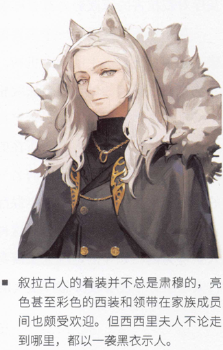

969年，叙拉古正式脱离莱塔尼亚帝国，这个本应轰动叙拉古各城邦的消息仅仅在报纸头条上待了两天，就被一场所谓的“爆炸事故”替代。在莱塔尼亚统治期间已经数百年未遭焚毁的城邦盟会议事厅被源石爆炸物撕成碎块，赶到现场的消防与救援人员却只能焦急地在砾石与砖瓦旁观望。他们清晰地看到周围楼顶上弩手的箭尖闪着寒光，当日没有一人敢上前施救。废墟下的呼救声逐渐沉寂，叙拉古长达七十年的内乱就此打响。
日后将改变整个叙拉古的西西里夫人出生时，迎接她的是一幅令人疲惫而混乱的景象。内乱开始前，叙拉古始终保持着一个家族割据一座城邦的基本格局，但数十年过去，绝大多数城市都成了数个家族明争暗斗的角斗场。西西里城的西西里家族虽然不复往日荣光，但能在动乱的数十年间保住性命，还守下了世世代代生活的土地，已然堪称壮举。尽管如此，当德高望重的领袖决定将女儿送去拉特兰留学时，族内上下仍泛起了不满的声音。在许多人眼中，一位没有在叙拉古接受过领袖熏陶的接班人只会葬送家族的前程。

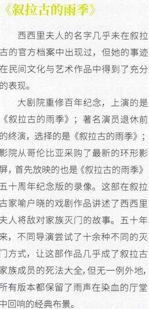

而当年轻的西西里倚身在拉特兰一家旅店的阳台上，望着喧嚣的街市，她考虑的却并非西西里家族的前程，而是叙拉古的未来。十点的钟声刚刚敲响，不远处的校园里传出整齐的铳鸣，那是拉特兰学生在做课间操。拉特兰有“千年和平”之美誉，但这里的人们绝非温室里的嫩芽。事实上，没有哪里的人们能像拉特兰人这样，将一种暴力工具如此完美地融入生活。她想，或许叙拉古的症结不在于暴力过剩，而在于秩序匮乏。

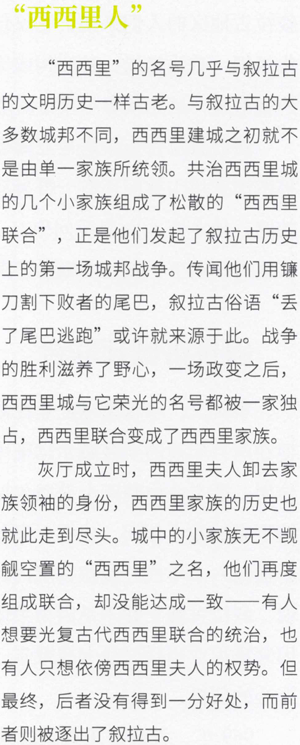

但西西里也清楚:叙拉古的家族哪一个没有自己的规矩?叙拉古人哪位不是从小接受规训?这片土地只是还没见过一种对所有人都有价值与权威的秩序。结束游学的西西里与她在拉特兰结识的友人阿格尼尔共同回到叙拉古，短短数年间，她让几大家族的领袖低下了高傲的头颅。据传西西里夫人极少动用武力，谄媚或威胁都不能在她的脸上激起一丝波澜;但在必要时，她的手腕强硬得惊人，手段残忍得出奇。最终，叙拉古的各大家族重回被遗忘了数十年之久的谈判桌。西西里夫人放弃了家族领袖的身份，成了灰厅的主导人。最大的十二家族接受了同一套秩序，他们组成的灰厅对叙拉古的家族势力有着可观的影响力与约束力。
灰厅绝不仅仅是另一个家族盟会。在新的家族秩序之上，西西里夫人建立起了真正意义上的国家机构。作为行政机构的城邦联合议事会与作为立法、司法机构的城邦联合法院相继落成，由普通人组成的政府从家族手中接过了治理城市的工作。曾将自己视作一城之主的大家族领袖，如今已无权阻止其他家族进人自己所在的城市发展。大家族割据城邦的格局彻底成为历史，人们不再用家族的名号来指代一座城市。如今，在政府与法院的规制下，这片经受了千余年混乱的土地已经呈现出了秩序的表象，但真正在叙拉古生活的人或许会对这种秩序的现实性抱有怀疑。西西里夫人本人正可为例，如今的她既无家族身份也无政府职务，但人们清楚她在叙拉古大小事务中能够发挥怎样重大的作用。

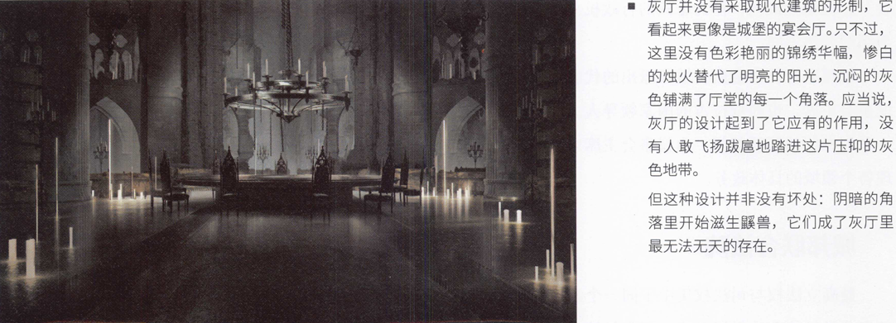

### 政治与治安
几十年前进人政府工作的一批年轻人也许曾心怀忐忑，但他们踏人大厅时无不昂首阔步。这些人大多没有家族势力背景，他们从小听着西西里夫人的传奇故事长大，坚信西西里夫人能够控制一切家族势力，也坚信自己有责任为叙拉古开创全新的秩序。
约三十年前，一座城市的政府官员动用他们能动用的所有资源，开始依照他们的想法“将西西里夫人的意志更进一步”。他们的意图是让叙拉古摆脱家族势力的掌控，但在长久的谋划之后，他们的方式只不过是笼络当地有权势的家族。他们的挣扎最终在静默中平息，血河在市政大厅中无声地流淌。后来，血迹被擦洗干净，市政大厅又恢复了往日的热闹。无人对此发表言论，但人们都相信这场血案是西西里夫人的手笔，或许因为缄默的厅堂太像西西里夫人的风格，又或许因为自灰厅建立后，只有西西里夫人敢制造如此规模的血案。正是在这次事件后，她发出了那句无人不晓的感慨:“政府就像是灰厅中那张圆桌的桌布。”
西西里夫人改革后，由普通人运作的政治体系和在暗处发挥影响的家族势力共同维持着叙拉古的秩序。在西西里夫人的威压下，各大家族也许会同意退居幕后，却绝不甘于泯然众人。在灰厅默许的范围内，他们极尽所能试图掌控政府的运作。叙拉古的政治机构在很多方面仅有名义上的权力，实际运行高度仰赖各大家族的意见与判断。但如今，各大家族也开始需要依靠政治机构处理各类行政事务。面对不断增长的人口规模与越发复杂的社会关系，家族的治事方式越发显出了它的疲软之处。
#### 城邦联合议事会
自古以来，叙拉古的各家族常常组成松散的议事组织。不知是为了颠覆还是沿承这一传统，叙拉古的中央行政机关被命名为“城邦联合议事会”。但毫无疑问，作为正式的行政机关，它的形式和职能与家族间的议事组织截然不同。
城邦联合议事会由各城邦派出的代表组成，再从这些代表中产生一位议事会主席，也即叙拉古的国家领导人。联合议事会的下属行政机构包括系列专门的职能部门，由议事会主席以外的其他代表出任部长，负责处理各个领域的具体政务。
#### 城邦联合法院
最高立法权与司法权集中于同一个政府机构，这在当代的核心圈并不是十分常见的政治组织形式，但在叙拉古，这种形式的存在并不难理解。谈及法院，叙拉古人大多只将其视为“西西里夫人意志的代行机构”。当规矩白纸黑字地印在法典上，散发出刺鼻的油墨气息，各大家族的领袖便心知不应逾越的底线在哪里。长久以来，法院的存在维系了各大家族间脆弱的和平。尽管城邦联合法院拥有流程上的立法权，可以将司法过程中产生的一系列判例法典化，但叙拉古人心知肚明，这些法律并非法院的创制，而是西西里夫人立下的界碑。因此，实际运行中，城邦联合法院在大部分时候仅相当于中央司法机构。
但是，如果结构与流程上的不合理因为实际运行中存在偏差而得到了解释，这是否说明结构与流程本身就是瘫痪的呢?

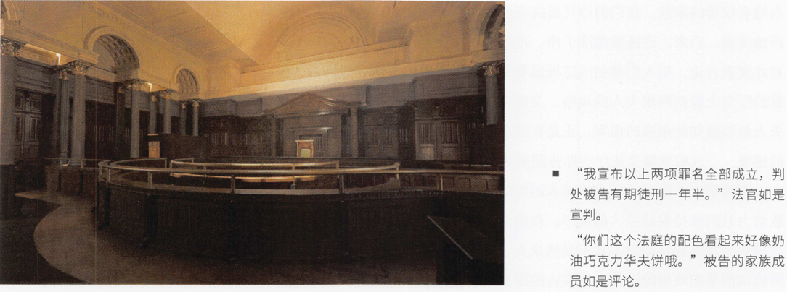

#### 地方政府机构
二十余座城市构成了叙拉古的版图，每座城市均设有市政府与法院。地方法院仅有司法权，不具备流程上的立法权。敲下法槌前，城邦法官总会下意识地看向陪审席，那里就座的陪审员大多来自各大家族。西西里夫人不会允许法院成为另一个家族议事组织，由家族成员组成的陪审团无权参与裁决，但陪审团的存在本身就代表着家族的态度。若是瞥见某位家族顾问坐在陪审席读报，法官将不得不重新掂量自己手中法槌的重量。
#### 治安
传统意义上的警察在叙拉古并不存在，这部分职权由法官行使。法官不仅需要熟习法律，有时也需要身手矫健。叙拉古的刑法典也被称作“荆棘法典”，每一版刑法典都会印制一批特殊的精装本，封面上环绕着金铁打制的荆棘。叙拉古的许多法官酷爱携带这种法典，必要时，他们可以将它狙狙地在罪犯的头上。

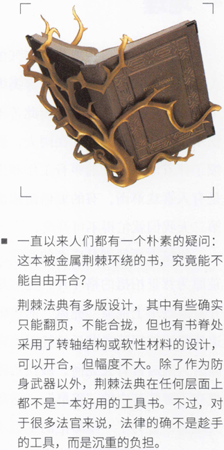

只不过，法官在职业生涯中并不常遇到真正“必要”的场合。大多时候，如果在斗殴的人群中辨认出了家族成员的标志，法官就只能袖手旁观。在灰厅的约束下，各个家族理应维护斗殴现场的街面秩序，但无论自己是否尽责，他们都会将法官的介人视作越界。只有当纠纷双方都是普通人、当家族行动严重危及普通人的安全，或当家族间的矛盾升级到了难以调和的地步时，法官才会出面。然而即使是这种程度的介人，对于法官而言也如同在荆棘上踏步。大部分时候，各大家族愿意给予法官基本的尊重，违反法律的家族成员即使不用锒铛人狱，也会进人法庭接受审判。可一旦法官触及家族的颜面或利益，这种尊重便荡然无存。

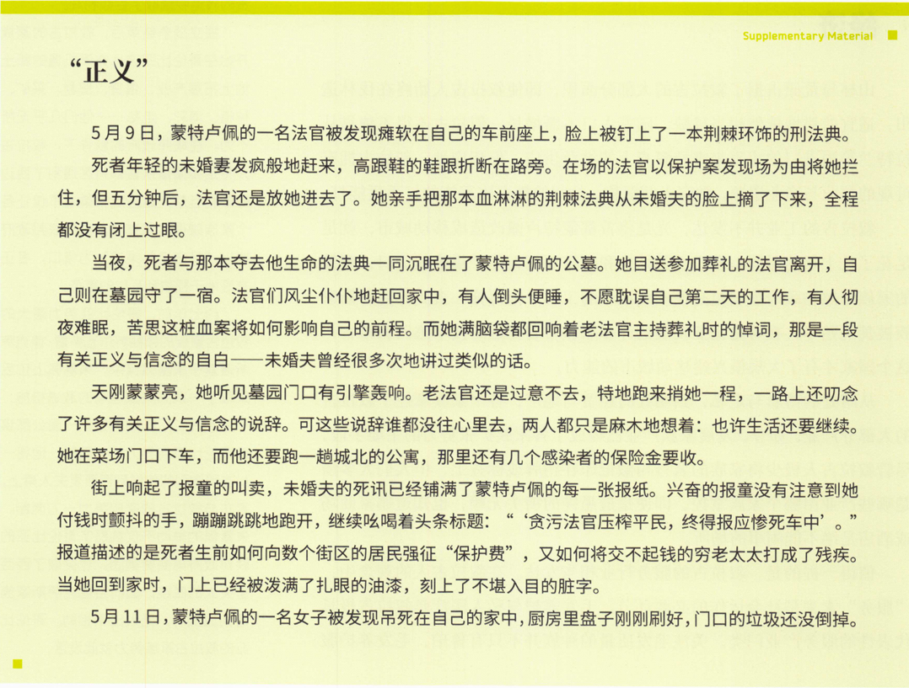

### 地理
叙拉古的人口主要集中在气候湿润的东部地区，这里山峦起伏，林木茂盛。在漫长的雨季，林间雾霭缭绕，泥泞遍地，不仅商队难以通行，从事林业生产的工人也常常因此苦不堪言。但在城市里，雨是人们生活中稀松平常的一部分。即使在雨天，叙拉古的街道上也热闹不减，人们仿佛习惯了伴着淅淅沥沥的声音工作和生活，钟爱雨天的也大有人在。“叙拉古是有人喜欢淋雨。有的要借雨水洗刷血迹，有的要靠雨水洗涤心灵，然后第二天我们就忙得不可开交。”一洗衣房伙计如是说。
叙拉古西部则是广袤的荒原，这里气候干旱，几乎无人定居。以西部荒原为背景拍摄的格斗片、寻宝片和流浪片曾经风靡一时，那段时间里，开着越野车上荒原“兜风”的极限运动在叙拉古上流社会大受欢迎。这些追逐潮流的探险者背后往往跟着声势浩大的保镖车队，而真正敢于只身涉险的人则时常有去无回。叙拉古西部荒原的危险性不仅在于恶劣的气候，更在于游荡其中的“狼群”。这些在生存竞争中被逐出猎场，流落荒野的失败者，会为了一丝渺茫的生机不计后果地袭击踏人荒原的所有生物。因此，旅人与商队大多结队成行，沿着几条既定的路线穿越荒原。

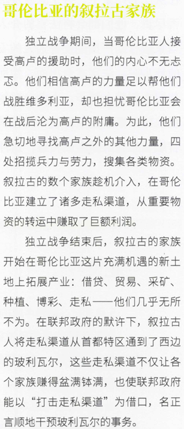
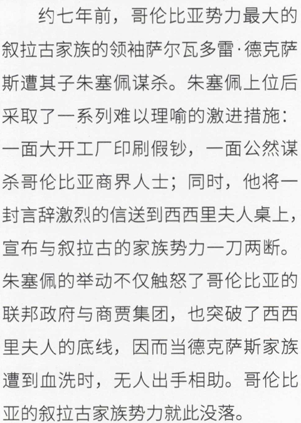

### 经济
山林与荒原占据了叙拉古的大部分面积，即使叙拉古人始终在伐林造田，适宜的耕地依然相当稀缺。随着人口不断增长，叙拉古不得不依靠从拉特兰等国进口的小麦来维持餐桌上的披萨供应。但相应地，叙拉古拥有可观的林业与渔业资源。常有人调侃称，林间的樵夫比家族的打手更能打。叙拉古的工业并不发达，光是将首都蒙特卢佩改造成移动城市，就足足花了几十年的时间。核心承重结构和精密源石元件严重依赖进口，频繁的家族摩擦和政府换届更是使本就艰难的工程一拖再拖。直到德克萨斯家族被焚烧殆尽，在哥伦比亚发展的许多家族带着先进的技术逃回叙拉古，这个国家才有了大规模兴建移动城市的能力。
从暗处的博彩与走私，到明处的经贸与地产，各个家族掌控了叙拉古的大部分产业。如今，发展家族产业已经成了各家族扩张势力的主要手段。尽管叙拉古人极少将家族的名号与徽记印在招牌或标签上，但人们大多清楚哪些产业由哪个家族掌控。即使是最愚钝的街头无赖，也知道哪家商场或酒店是绝不能闹事的场所。
值得一提的是，叙拉古的服务行业相当发达。在叙拉古人的观念中，“服务”素来是社会运作的必要环节。毛发养护与私人医疗是叙拉古极具代表性的服务产业门类。关注毛发质量的种族并不只有鲁珀，毛发养护服务在泰拉各地普遍存在，但叙拉古的毛发养护场所不仅提供烫毛、染毛、剪毛等基本服务，更是许多家族成员钟爱的娱乐与社交场所。由家族开设的私立医院平常看起来与公立医院无异，但这些私立医院时不时会毫无征兆地封门闭户，既不再收治外来的病患，也不允许院内的病患出院。医疗器具能够救人也可以伤人，这些私立医院的人员、场地与物资时刻准备着处理家族的“不时之需”。

### 文化与社会
包括我在内，许多人在谈及叙拉古时都会不自觉地将“家族”与“普通人”分开探讨。但“家族”与“普通人”的分界线究竟该划在何处，无人知晓。大家族的成员围绕家族身份建立人格认同，通过为家族尽忠的方式来实现自我价值，但普通人从小接受的其实也是相仿的观念教育。“为家里做事”是叙拉古孩童听到最多的一句要求，也是他们获得认可的唯一途径。在叙拉古很难见到子女与家庭断绝关系的案例，哪怕幼时在家中备受虐待，叙拉古人在试图脱离原生家庭时也依然会经受强烈的道德折磨。叙拉古人对传统的执着或许正是来源于此。戏剧与美食是叙拉古最突出的两大文化要素，许多叙拉古人对这两者都有着近乎精神洁癖式的要求。从某种意义上来讲，叙拉古的剧坛充满活力却也死气沉沉，新异的作品时常出现，但流行的主题恒久不变。很多人痴迷于舞台上虚构的家族故事，并通过观剧获得精神的满足。有人在剧院里将手上的机油转化成对未来的期望，有人在剧院里将手上的血迹转化成对自我的认可。
而在饮食方面，叙拉古人对传统的执着更是闻名泰拉。“试图创新叙拉古菜的厨子遭人殴打”几乎已经成了最为烂俗的叙拉古笑话。上流人士对餐品的追求自不必谈，即使贫困到只能挑拣便宜食材的家庭，也以自己的方式固守着传统。哪怕餐桌上没法出现正宗的菜式，家长也依然会在餐前饭后向孩子强调:“总有一天你要吃到真正的叙拉古披萨。“

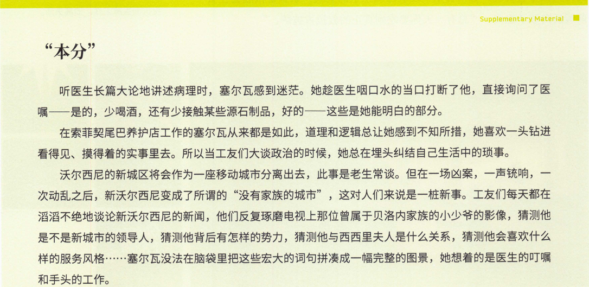
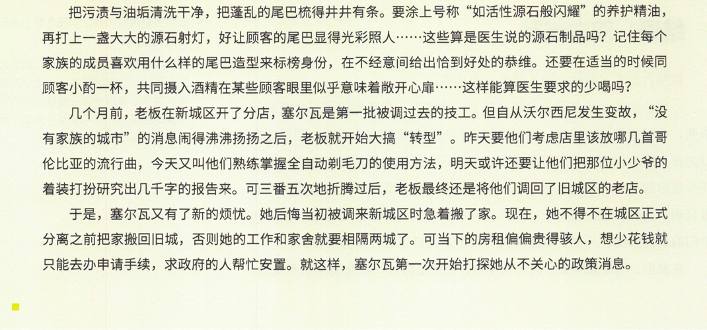
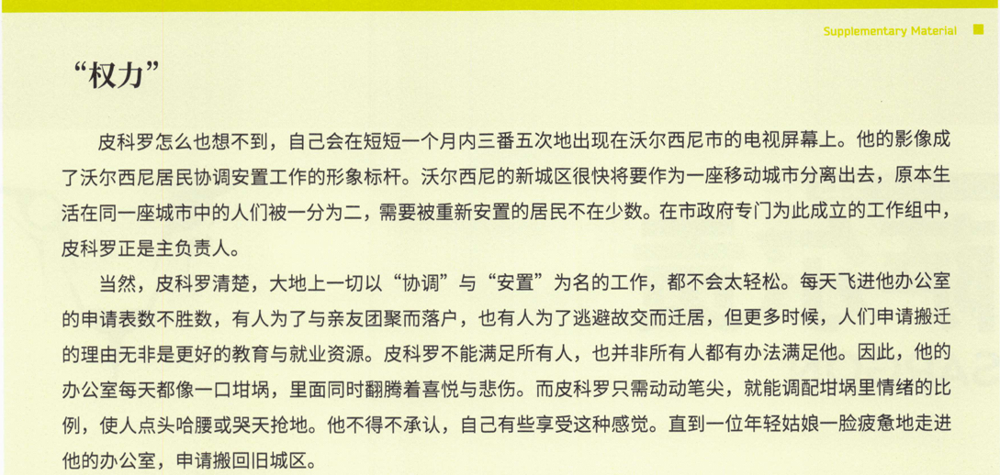
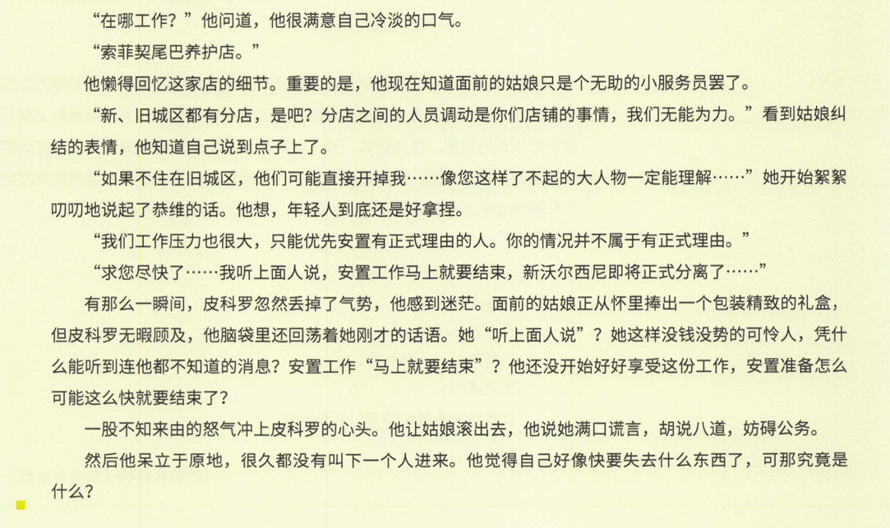

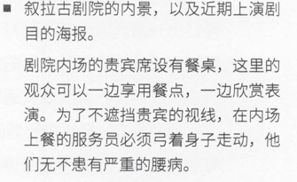
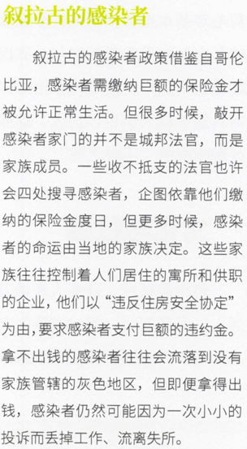

### 结语:双向缄默
叙拉古发生了两件小到不能再小的小事。
一所小学的十几名学生共同举行了一次审判，受审判的是三年级的马蒂亚，他被指控遵守校规，罪证是他直到被审判时还穿着校服，同时还有目击证人证明他当日非但没有翘课，甚至还向授课教师请教了数学问题。马蒂亚辩解道，穿校服是因为前一天晚上家里的水管破裂，没有遭殃的衣服只剩下这套校服。但对于向教师提问的罪行，马蒂亚无可辩驳。面对同学们的拳打脚踢，马蒂亚咬紧牙关，只字不提自己这样做的理由。在家里，马蒂亚接受了另一次审判，罪行是当日的随堂测验全不及格，罪证是白纸红字的试卷判分。马蒂亚跪在地上，听父亲数落他如何辜负了家里的期望，如何丢尽了家里的颜面，又将如何毁掉家里的未来。怒发冲冠的父亲誓要给带坏了马蒂亚的那些倒行逆施的恶童一点教训，可不论他如何挥舞皮带，马蒂亚始终咬紧牙关，不肯透露关于同学的一点信息。
这一天，两个小小的“家族”维系了自己微不足道的秩序，一个叙拉古人维系了自己分崩离析的价值。这样的小事在叙拉古还要成千上万遍地重演。
倘若有朝一日，叙拉古的人们真的厌倦了家族的规训，他们又如何能创造出一套与之不同的新秩序?

## 萨尔贡

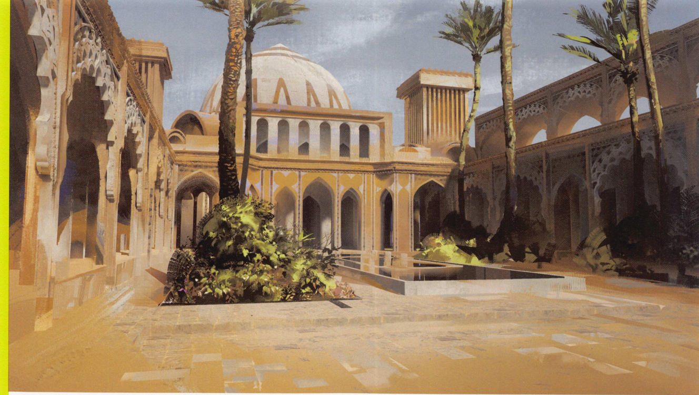
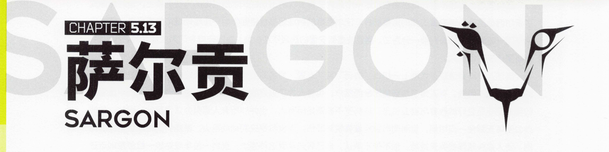

### 概览
萨尔贡帝国是泰拉大地上现存历史最为悠久的国家之一，也是一个典型的普世帝国，生活在萨尔贡的很多人笃信一种观念--萨尔贡帝国以前是，以后也会是泰拉最强大、最具权威的政权。帝国内部有着多元的人口结构和文化体系，是一个兼容并包的国家。曾经的萨尔贡帝国辉煌而强盛，对这片大地产生过深远的影响，许多地区的传统文化中都可以看见萨尔贡文明的痕迹。但在一系列事件后，萨尔贡陷人了停滞。现在，萨尔贡帝国正努力维持现状，试图存续下去，但外部环境的变化不断地冲击着本就脆弱的帝国根基。

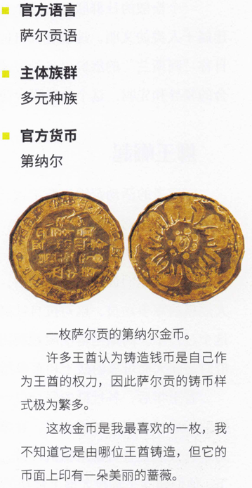

### 历史
#### “文明正统”
在泰拉历965年的时候，萨尔贡官方以庆祝万王之王路加萨尔古斯千年诞辰的名义推出了一套五十卷的《萨尔贡史》。这套官方修订的史书记载了有关萨尔贡诞生的故事。一万五千年前一个炎热的清晨，十几个疲惫的战士带着即将耗尽的物资走出阿卡胡拉丛林，在他们眼前的是稀疏的草原和远方一望无际的黄沙，背后则是蓊郁危险的庞大雨林。这些人是四处迁徙的流民们的侦察队，他们被大地的愤怒所驱赶，跋涉万里只希望能够找到安全的住所。沙漠的一切令人震惊，他们从未见过如此单调却又充满变化的景象。风卷过蜿蜒扭曲的沙脊，漫天沙粒落下后便形成了全然不同的沙丘。看见这个场面的人相信自己已经来到大地的尽头，于是就召集后方的同伴到沙漠边缘生活。长此以往，越来越多的人迁徙到沙漠边缘以及沙漠中的绿洲，他们带着来自泰拉各地的生活经验和各自群体内口头流传的知识和记忆，在这里定居下来。虽然后来他们也发现这里依然有危险的自然灾害，却已没有气力穿越沙漠。所以这些文明的继承者开始慢慢联合起来一同生活，而萨尔贡就是如此诞生的。
撇除“一万五千年”这个略带建国神话要素并且无法确定的具体时间不谈，这个充满文学修饰的故事给我们提供了一些很关键的事实--萨尔贡人是从别处迁移至此的。在难以追溯的久远时代，一批流民亲眼见证了历史上已知最早的天灾事件，人们在巨大的惊恐中四处迁徙，他们一路向着大地西南逃去，躲避那被他们认为不可战胜的天灾。他们跨过山岭，越过河流，来到了他们认为是大地尽头的地方，并在此定居。这里面积广大，自然条件良好，定居者数量迅速增长，开拓出的土地面积也随之增长。于是，这里形成了大量各不相同的社群。这些社群虽然文化背景有所差异，却有着一个共识:他们认为自己是泰拉人类文明的正统。
一个松散的社群联合在这个共识的基础上建立，意图在这片大地上重建属于人类的文明。这被各社群的成员们视作义务。在这个过程中，一支自称“阿斯兰”的族群以各种方式征服了许多其他社群，成为整个社群联合的领导和先驱。这个社群联合便是后世所称的“萨尔贡帝国”的雏形。
#### 狮王崛起
定居者的活动范围不断扩大，最终在遥远的南方遭遇了一群充满敌意的强大未知生物。它们极为危险，不仅无法交流，还会主动袭击当地的定居者，攻击方式也让人难以捉摸。这种怪异生物的袭击令定居者们不得不做出反应。他们彼此联络沟通后，明确了各自社群的活动边界，并进行了大规模的军事动员，以对抗自社群联合建立以来出现的最明确的威胁。在这个过程中，阿斯兰再次脱颖而出，这支族群中的许多成员成了保卫各社群时最强大而可靠的战士和军事指挥官。
若干年后，各社群的联合以一种接近军事同盟的形式稳定下来，而阿斯兰们成了事实上的统治者。在掌握了军政和民政的权力以后，阿斯兰们为了有效地整合资源来抵抗外敌，决定将整个社群联合置于自己的统治之下。他们建立了泰拉大地上最初的城市，并在此基础上建立了萨尔贡王朝，即后来世人所称的“萨尔贡帝国”。
在阿斯兰的统治下，萨尔贡帝国继续扩张。阿斯兰们保留了社群联合时期的政治传统，接纳征服地区的文化，承认当地的实际统治者，使萨尔贡帝国成为文化非常多元的国家。
在被后世尊为“过去与未来之王”的路加萨尔古斯执政时期，萨尔贡帝国运行稳定、国力强盛。路加萨尔古斯在四十年的帝王生涯中同时处理了帝国扩张和内部叛乱的问题，将萨尔贡帝国打造得空前强大和团结。在他执政的第三十九年(亦即泰拉历14年)，哈兰杜汗率领的梦魇大军远征至此。萨尔贡军队和梦魇大军之间爆发了战事，但在这个过程中，双方都遭到了南方诡异敌人的无差别袭击，这使阿斯兰和梦魇达成了暂时合作的共识。双方商议后，决定联合起来，向南方的敌人所在之地进军。这是一场旷世大战。经过艰苦的战斗，最终，萨尔贡帝国与梦魇大军合力歼灭了绝大多数敌人。但在最后的决战中发生了一场恐怖的大爆炸，亲征的萨尔贡万王之王在这场爆炸中不知所终;梦魇大军经此一役则十不存一，幸存者们四散而去。爆炸之后，这片区域的气温急剧上升，生物难以在此继续生存，也正因此，人们给这片区域起了一个新名字一-焚风热土。

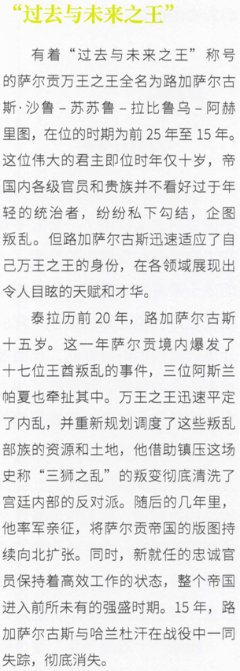
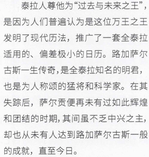

#### 帝国裂隙
战争之后，焚风热土的出现与万王之王的失踪对萨尔贡帝国产生了巨大的影响。众人合力抗敌的共识是萨尔贡立国的基础，敌人消失令这一基础不复存在。同时，萨尔贡失去了合法君主也迅速激化了阿斯兰皇室内部的派系斗争。新出现的焚风热土地区气温极高，带来的气候变化彻底改变了周边的自然环境，让许多人流离失所。最终，在一些阿斯兰付出极大的努力来稳定现状后，萨尔贡帝国得以维系，只是国力消耗严重，辉煌不再，日渐衰弱。
在多年勉力维持帝国存续后，阿斯兰皇室的分裂到了不可收拾的地步。长期谋划后，时任君主直系外的阿斯兰支系分批出走，前往维多利亚。当时的万王之王一开始认为这是个别行为，还曾为敌对派系减少而向近侍表示了安心，待其发现各支系的图谋时为时已晚。自此，萨尔贡帝国对边疆地区的控制力大大减弱。北面的瓦伊凡地区在接下来的数百年中逐渐脱离萨尔贡，进人了自治状态。
### 地理
萨尔贡位于目前已知泰拉大地的西南角，拥有广袤的国土。这片大地上最长的河流自东北向西南横跨整个萨尔贡，并在南部沿海地带形成三角洲，哺育了古老的萨尔贡文明。
一座山脉自北向南，将整个萨尔贡的疆域分为两个自然风貌差异极大的地带:山脉以东的近海低地一侧为热带雨林气候，以西的远海山地一侧为热带荒漠气候;越靠近南部的焚风热土，气温越高。
整个萨尔贡的地形呈现西高东低的大趋势，主要河流沿岸有绵长的绿洲带。

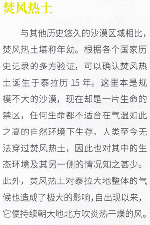
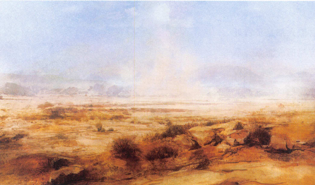

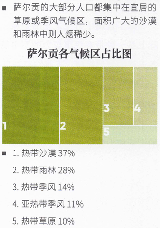

### 政治与军事
#### 政体
萨尔贡是十分古老的君主制国家，其君主制传统影响了维多利亚、伊比利亚、高卢、莱塔尼亚和乌萨斯等国家的政治体制。许多国家和地区的君主统治模式中都能找到来自萨尔贡的古老政治基因。
萨尔贡帝国的最高统治者、君主-万王之王一-在阿斯兰皇族内世袭产生。许多人也称萨尔贡帝国的君主为“皇帝”。

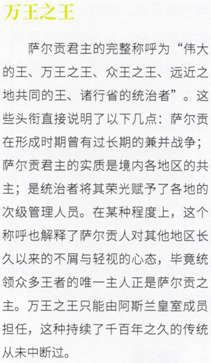

#### 政府
万王之王是萨尔贡的最高统治者，掌握全国的军政大权。国家政务由萨尔贡宫廷主理，这是一个由大臣和顾问组成的权力机构，辅助万王之王进行统治。从中央到地方，所有官员都由万王之王委任。
萨尔贡拥有如此广大的领土与众多的居民，可想而知的是，它的宫廷是个极为臃肿庞大的组织。从万王之王身边的帝国大臣到向各地派送讯息的信使都是宫廷的成员。这些效忠于皇帝的官员身负重任，他们的主要职能是辅助万王之王，分析大小事务的具体情况，维持帝国行政体系运转，将君主的意志传递到帝国各处。
成为萨尔贡官员的方式有三种:一是通过严格的考试，进人官僚系统，成为君主的臣属;二是作为贵族获得相应的头衔，同时被任命为官员;三是以某一社会团体代表的身份成为君主的顾问，例如石匠兄弟会代表或是商团首领。
通常来说，经由第一种方式选拔出来并获得晋升的官僚大都是负责处理行政琐事与核查数据的文官。理论上，他们在宫廷中容易形成派系，掌握极大的权力，不过事实上，文官们所处的政治环境被各地掌握实际兵权且地位极高的贵族们严格把控。虽然各地的情况略有差异，但总体来说，地方宫廷系统中的官僚们大都是代表万王之王在贵族身边工作的使者。此外，萨尔贡帝国官方并不热心外交，他们将此视作政治事务中不太重要的部分。外国势力经常直接接触萨尔贡的诸帕夏和王酋，以开展合作。
#### 区划
除了直属于万王之王的皇城，萨尔贡将全国划分为若干行省。行省实际上是一种带有民事权力的军事管制政区，由帕夏们管理。行省本身则由各王酋的领地组成，王酋们控制自身领地内领主、长老一类的地区统治者。萨尔贡只关心地区统治者是否宣誓效忠帝国，对建立一套通行的基层治理机构缺乏兴趣。因此，基层组织形式多种多样，地区统治者的称呼也各不相同。这导致萨尔贡对地方的控制力较差，帕夏、王酋和地区统治者的实际权力较大。

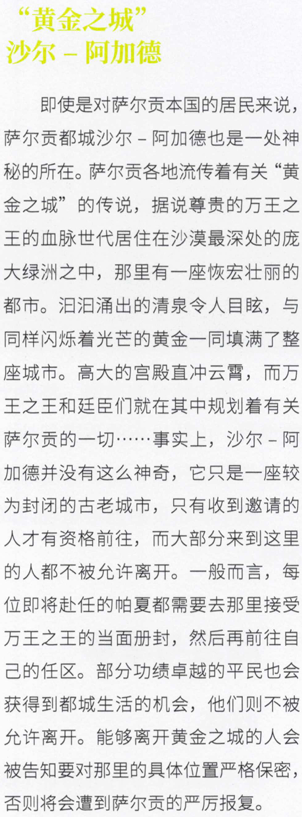

#### 贵族
萨尔贡有一项政治传统，即帝国授予大大小小的地区统治者各类能或是不能世袭的头衔，将他们视作萨尔贡宫廷的一部分，以此来加强对各地区的控制。这便是萨尔贡贵族制度的来源。这种传统与萨尔贡四处征战的历史息息相关。历史上，在萨尔贡帝国急速扩张的某个时间点，君主再也无法直接管辖治下庞大的领地，而各个主动加人萨尔贡帝国的小国与部落还在等待着万王之王的统治。于是万王之王将代表宫廷的身份分发给各地的实际领导人，以此维护统治。
时至今日，这已成为一个复杂的系统，从世袭职位到荣誉称号都包含在其中。贵族不是直接拥有领地，而是被授予了治理和征税的权力，土地本身仍然属于万王之王。从这个角度看，萨尔贡的贵族与维多利亚和莱塔尼亚等地的贵族有着极大的差别，前者只是代行万王之王的权力从而拥有治理权，而后两者本身从制度上来说就拥有极大的统治权力。

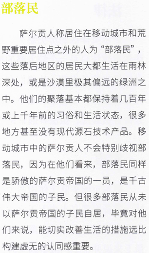

#### 帕夏、王酋和不同的地区统治者
除万王之王外，与萨尔贡相关的词语中最广为人知的应该就是“帕夏”和“王酋”了。这两个名字也是头衔，指向两级不同的萨尔贡官员。
帕夏既是管理行省的地方官员，也是军队的高级指挥官。“帕夏”这个词还是个贵族头衔，它既可以世袭，也可以是非世袭的。通常来说，一般人能接触到的最高行政长官就是本地的帕夏。帕夏是萨尔贡帝国得以存续的重要支柱，肩负处理地方事务和维护行省安全和平的重任。
王酋是帕夏之下的头衔，也是萨尔贡帝国统合并管理各地区社群的军政官员。他们对领地内各地区的控制力各不相同。此外，各地区社群也有不同的组织结构和不同的地区统治者，这些地区统治者的共同点在于都受王酋节制，向萨尔贡帝国宣誓效忠。
虽说广大的萨尔贡帝国境内存在着种类繁多的各级官员，其职能与权力大小也各不相同，但他们仍有共同之处，即都要接受万王之王的直接册封与统治。不过，在各地的日常生活中，地方统治者的权力明显总是强势的。
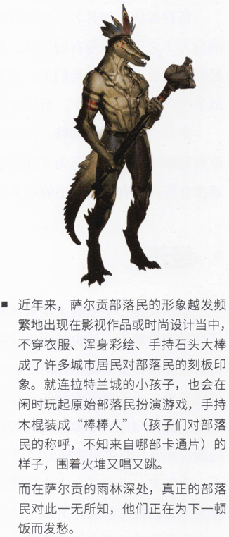

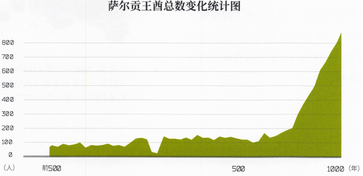

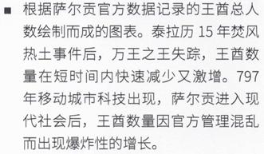

### 法律
萨尔贡律法的历史悠久，通常认为，实在法正是从萨尔贡发源。不过萨尔贡律法只是一个较大略的框架，难以覆盖社会生活的方方面面。万王之王授权给各王酋，让他们在不与萨尔贡律法冲突的前提下于自己的领地内颁布戒律，以适应各地不同的实际情况。整个法律系统作为民政的一部分由官员管理。执法者通常是当地的政府差役或军人。
### 军事
萨尔贡的军队主体由两个部分组成，分别是拿薪水的常备军和征召部队。常备军名义上由万王之王雇用，装备较为统一，接受武官的指挥。这些需要接受日常训练的部队是保障日常行政需求和贵族安全的军队，从数量上来说并不多。战争到来时，常备军主要负责城防和突击任务。
征召部队正如其名，是负有军事义务的贵族们在战时从领地上征召来响应万王之王战争号召的部队。他们的战斗力完全取决于征召他们的贵族是如何武装以及训练他们的。通常来说，在那些富裕的或是希望能在投机战争中获利的贵族手下，会出现善于征战的征召部队。
萨尔贡军队的一大特点是能够获得良好的行政支持，时常会有以军事原则组织的非战斗人员为军队提供各类服务。此外，萨尔贡的各地方社群通常自行维持着规模较小的军事单位。

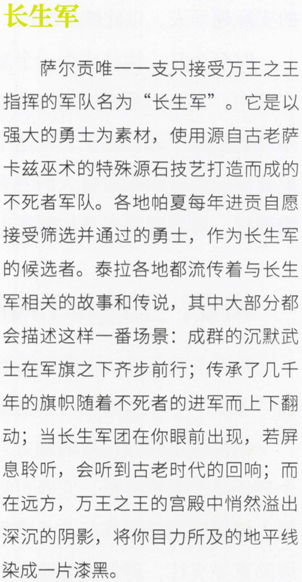

### 经济
萨尔贡是一个依赖土地资源的国家，农业生产在萨尔贡的经济中占据了最重要的地位。这也是萨尔贡陷人停滞的一大原因。庞大的帝国内，受低效运行的官僚系统和各帕夏自治传统的影响，各地的经济状况差异极大。现代以来，不乏想改善萨尔贡整体经济形势的万王之王，但各地盘根错节的贵族势力与尾大不掉的政府机构是所有改革者需要解决的障碍。就目前的情况而言，萨尔贡帝国的经济正在名为“往日辉煌”的泥潭中越陷越深。近年来，以万王之王直接管理的皇城及其近郊为代表的部分地区开始接受外来的技术和生产方式。帝国的主人希望发动一场自上而下的变革，以身作则地带动萨尔贡这垂垂老矣的国度，但除了几位负责守卫边境的帕夏之外，几乎没有人响应伟大君王的号召。总体而言，萨尔贡整体的经济环境并未因此受到足以带来变化的实际影响。

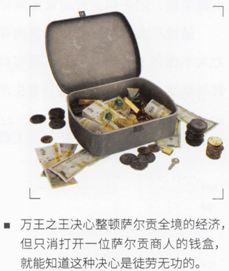

### 文化与社会
萨尔贡的主体文化是一种混合的多元文化。同时，许多地区也保留了各自的独特文化传统。萨尔贡并不打算，也无法有目的地建设一套文化体系，这与其传承数千年之久的治理逻辑关系紧密。萨尔贡帝国在从前兼并其他国家和地区的时候，仅强调被征服地区要在文化上认可万王之王的共主地位，这种传统导致了帝国在各地区社群保有自身文化体系这件事上始终保持着宽容的态度。
许多萨尔贡居民倾向于保存自然环境的原貌，在他们的认知中，保护祖先传承下来的资源是十分理智的做法。破坏环境将导致生产生活方式不断变化，并使传承了几千年的生活经验不再适用，这在许多萨尔贡人看来是不可接受的。整体来说，萨尔贡社会的氛围十分保守，倾向于不去破坏行之有效的东西。人们对能改变生活现状的事物缺乏兴趣，因为他们无法想象这些事物带来变革后的社会状态，不愿过无法预知的生活。

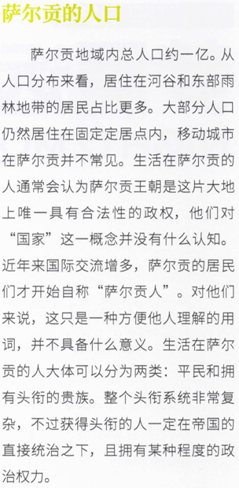

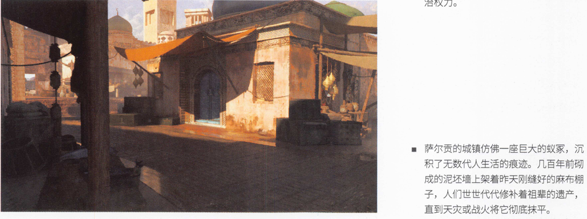

萨尔贡在各地都建立了学校来培养知识分子，以期从中选拔出国家官员。这些学校有官方设立的，也有私人开办的。近年来，也有帕夏和王酋引人外来的办学方法，教授其他体系中的知识。萨尔贡不同地区居民对矿石病和感染者的态度在细微处略有不同，但大体上是相似的。一般来说，感染者会从社会中被排除，而达成这一目的的手段通常直接而残忍。
### 结语:古老帝国
在泰拉久远的历史中，萨尔贡曾经辉煌一时。这个传承久远的古国为整片大地带来的影响深深地刻在各地的文化传统之中。当历史巨轮缓缓前行，萨尔贡却被往日自己强大的幻影拖入了停滞不前的泥沼。如今的萨尔贡正在积极寻求为自身破局的方法，却仍然需要些时日才能重整姿态。

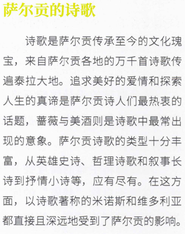

### 梦魇远征

## 米诺斯

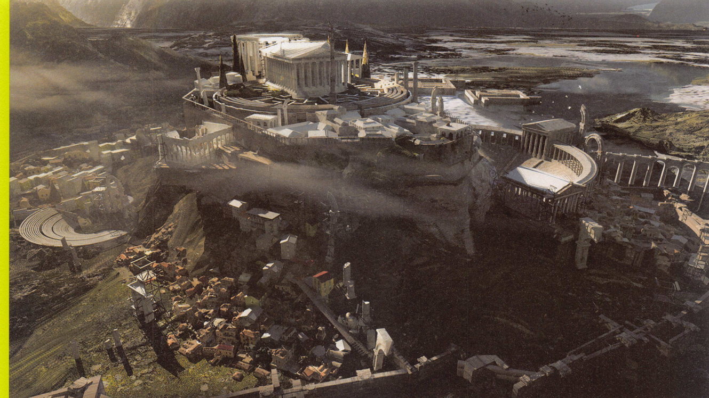

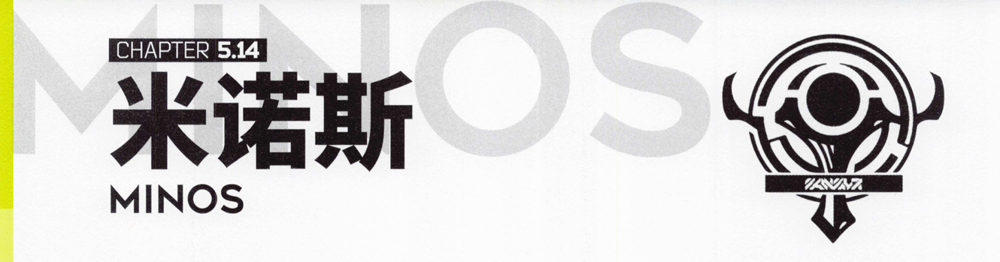

### 概览
米诺斯，群山环抱的英雄之乡。层叠险峻的山峰和宽广美丽的湖泊勾勒出一座座城邦。错落有致的山地景观，充满特色的移动城市，色彩缤纷的建筑拱卫着高大的英雄神殿，充满激情的米诺斯人在巨大的露天剧场中纵饮美酒，吟唱远古时代的歌谣。人们遵循英雄之道抗击残暴嗜血的入侵者，并在历练中锻炼了雕塑般的肉身，磨砺出坚忍的意志。这个充满传说和神话的国度曾陷人彻底灭亡的黑暗时代，如今她正从萨尔贡长达百年的占领中逐步恢复，危险却从未消失。

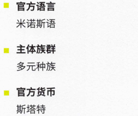

### 历史
#### 山巅之下
在米诺斯现存的建国神话之中，有关这个国家的一切都是随着雅赛努斯城的建立而展开的。这座最古老的城邦位于米诺斯境内第二高峰荷谟伊山的山脚，最初由躲避战火的各种族难民所建造。米诺斯古代史诗《克瑞斯拉纪》这样记载了雅赛努斯城建立者的漂泊旅程:“(克瑞斯拉)最终来到了荷谟伊山的山巅之下。因为可悲的时代，人们互相残杀攻伐。坚忍的克瑞斯拉，她在陆路上走坏了三十双鞋，在水路上也历尽磨难。她一路遭受战争和瘟疫的折磨，但最后建立城邦，把追随她的人安置在四面环山的花园里，这样才有了米诺斯人、雅赛努斯的智慧、科林尼亚的繁荣和拉刻代蒙不朽的殿堂。93
米诺斯这片区域确实拥有得天独厚的自然环境，其中尤以荷谟伊山附近最为壮观。覆盖山巅的永久积雪和冰川在日光的照耀下反射出淡淡光芒，而自冰川中融化的雪水汇聚成不息的流水冲刷出山下平坦的土地。花期各不相同的植物恣意生长在肥沃的土壤上，一年到头不重样的花海被和煦的风吹得摇曳，不难想象最初抵达这里的人看见的是怎样的极乐景象。
在雅赛努斯建立后，生活在这里的人便将其作为开拓米诺斯地区的根据地。后续迁移至这里的人和殖民者一起探索并开发了整个米诺斯，陆续有新的城邦被建立起来，在这个过程中，那些对城邦贡献极大的人-不论是领导者还是平民--会被人们冠以“英雄”的名号，而用以纪念英雄的一系列偶像崇拜活动也开始出现:人们为英雄书写赞美诗，将英雄的事迹编写成史诗，也根据英雄的一生创作出各种戏剧，甚至将崇拜偶像作为公众活动，并在城邦中心为英雄建造专属于他们的殿堂。在一段时间的平稳发展后，各城邦发展出了各自独特的文化和喜好，崇拜的英雄自然也各不相同，矛盾便随之而来。

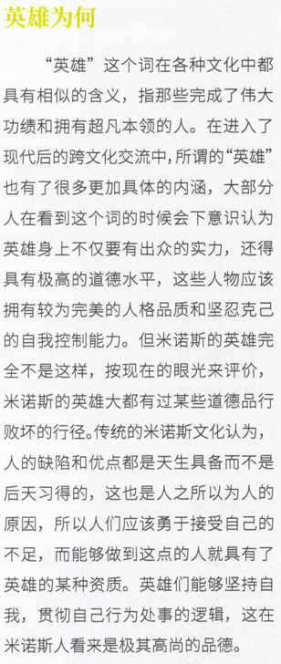
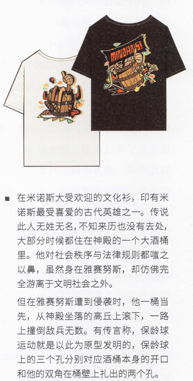

#### 城邦林立
城邦间的互相攻伐持续了很久，最后十几个大城邦之间形成了分别以雅赛努斯、科林尼亚和拉刻代蒙三座城邦为核心的三个联盟。雅赛努斯是米诺斯的文化和知识中心，雅赛努斯人崇拜的英雄也多为智者和诗人;科林尼亚是商业和交通之都，本地人供奉的英雄是商业的庇护者;拉刻代蒙是战士和武者的故乡，为勇士和将军而建的神殿最多。此时的米诺斯英雄崇拜发展成了类似于宗教的形式，各城邦的居民怀着不同的愿望前往祭祀英雄的神殿，向英雄们的雕塑献上祭品并期盼着能够获得庇佑。这种崇拜和各地的拉特兰教会里人们对律法的崇拜有很大区别:人们按照拉特兰的规则来生活是期盼能够将生活环境改造得如同拉特兰般和谐--至少看上去如此;而对米诺斯人来说，有关英雄的传说是他们认知中历史的一部分，虽然米诺斯人崇拜的英雄大多早已离去，但英雄们确实是曾经切实生活在这片土地上的人。
三大联盟之间时常互相结盟和背叛，虽然有大量的战争行为，但从未有过一方彻底击败其余两方的情况。频繁的互动也催生出战争之外的交流途径，米诺斯式的体育运动便是其中最显著的特色活动。来自不同城邦的竞争者每年聚集在盛大的体育赛事中展示自己健美的姿态和卓越的技术，各城邦轮流举办这些比赛，人们也在各地穿梭来支持自己家乡的参赛者，这种活动极大满足了和平年代中人们渴望竞争的愿望。可惜的是，许多以前的竞技项目目前都已失传，我们也很难复原出当时的人在日常生活中备赛和锻炼的方式。而造成失传的直接原因就是萨尔贡长达百年的占领，这也是米诺斯史上最黑暗的一段时间。

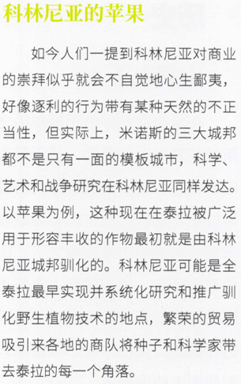

#### 萨尔贡入侵
发源于赫里亚山的阿涅斯河将米诺斯地区与萨尔贡分隔开来，河岸两侧拥有截然不同的自然风光--靠近山脉的这一侧雨水充足、土地肥沃，而在萨尔贡的那一侧，越往南边则越是荒凉贫瘠的沙漠戈壁。这一片广袤的沙漠在很长时间内都是米诺斯与萨尔贡帝国之间的一道地理屏障，但不断膨胀的萨尔贡终会将自己的利爪伸向与他们一河之隔的米诺斯。
自从萨尔贡发现这片丰饶的土地，这里就一直是萨尔贡的王酋们，特别是封地位于边境地带的数个王酋觊觎的目标。915年他们联合觐见万王之王，希望万王之王能够支持他们将米诺斯纳人囊中。当时的萨尔贡君主正是那位著名的“白鬃阿斯兰”(也称“白鬃王”)帕赫里图，萨尔贡在位时间最长的君主。彼时的帕赫里图也已经走到了他王权统治生涯的尽头，他花费了自己大部分的生命，用尽了一切手段维持了萨尔贡的稳定和繁荣，宫廷矛盾、地方矛盾、社会矛盾虽然得到缓解，但帝国依然暗藏危机。也许是为了转嫁帝国内部的矛盾，也许是要为萨尔贡走向核心圈铺平道路，也许单纯是嗅到了自己生命的终结即将到来的气息，白鬃王决意发动他人生中最后的一次战争-征服米诺斯。
917年初春，一支庞大的军队开始朝萨尔贡东北部集结，数以十万计的战兽伴随着前进的鼓声从萨尔贡各地出发。来自沙漠和雨林的士兵们在混乱的调度中来到米诺斯的山谷之外徘徊。米诺斯人也并非闭目塞耳，他们在几年前就发现有可疑的人物出现在各大城邦的街头巷尾，河对岸的使团和来客变少，取而代之的是悄悄建起的工事一-毫无疑问，白鬃王早已将他的目光从神秘的沙尔-阿加德投向了米诺斯那宜人的群山，贪婪的阿斯兰伺机待发，即将出动捕捉他早已垂涎三尺的猎物。
如此大规模的军队活动立刻被米诺斯人察觉，所有城邦的领导者在第一时间组成了同盟，为这场即将到来的战争做准备。当双方的军队第一次在阿涅斯河两岸对峙，米诺斯联军才发现对岸军队的规模远远超出了他们的想象。米诺斯人没有料到萨尔贡真的几乎倾全国之力，以将近百万之师扑向了小小的米诺斯。悬殊的兵力差距似乎一开始就决定了战争的结局。但是，米诺斯的将领在面对数倍甚至数十倍于己的萨尔贡大军时展现出了惊人的冷静，米诺斯全境首次团结一致对抗外来的敌人，身处前线的他们更没有丝毫理由退缩。他们决定利用主场作战的地形优势，保卫自己身后的家园。据米诺斯的新英雄史诗《阿加门纪》，萨尔贡军队在春季的最后一个夜晚跨过了阿涅斯河，率先发起了进攻。米诺斯的将军们将抗击入侵的主力安排在阿涅斯平原和阿加门山口之间几十千米长的复杂山区中，依托对地形地貌的熟悉，在战争初期让萨尔贡的先锋军付出了惨重的代价。萨尔贡军队原本的目标是在秋季之前攻占雅赛努斯，但一整个夏季，他们都未能抵达通往米诺斯核心区的最后关隘阿加门山口。
不过，战争双方的实力差距很快就体现了出来，萨尔贡军队调整战术适应了山地的复杂作战，同时继续往米诺斯投入兵力，力图用绝对的人数优势压制米诺斯。米诺斯方面的有生力量在高强度的连续作战中不断被消耗，被迫向核心区域撤退。秋季，米诺斯残存的主力军在撤退回阿加门山口的途中，于爱琴平原被萨尔贡军队发现，双方在此展开了最后的决战。尽管米诺斯主力军竭尽全力作战，但最终还是落败，连同关隘守军一起被全部消灭。随后，雅赛努斯、科林尼亚接连陷落，直到冬季，最后一个城邦拉刻代蒙开城投降，避免了更多的屠杀。少量拒绝投降的米诺斯人躲进山林之中，开始了旷日持久的游击生涯。
虽然萨尔贡最终征服了米诺斯各城邦，但代价依然是极其高昂的，参与这场战争的士兵阵亡十之五六。而且，就在拉刻代蒙投降的七天前，八十一岁的万王之王帕赫里图溘然长逝，结束了他长达六十七年的统治。这位享国最长的萨尔贡君王没能如期将米诺斯收归己有，拿到他生命中的最后一份武功。最终是继位的他的儿子沙苏鲁姆，宣告了战争的胜利。

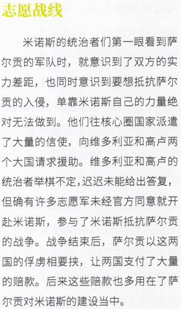

#### 至暗时刻
万王之王沙苏鲁姆在占领所有城邦后派遣了自己的妹妹玛拉从沙尔-阿加德前往米诺斯，担任管理一切事务的帕夏，这位阿斯兰皇室的嫡系成员后来因为对米诺斯的全方位掌控而被萨尔贡的其他贵族在私下称为“对岸女王”。玛拉在年轻的时候就是沙苏鲁姆的得力助手，为沙苏鲁姆出了很多计策，甚至有传言说有玛拉辅佐正是沙苏鲁姆被白鬃王选为继承人的原因。当沙苏鲁姆让他最信任的玛拉出任米诺斯帕夏时，摆在玛拉面前的是一个重大难题--如何治理一个如此棘手的占领区?米诺斯拥有当地人引以为傲的灿烂文化，并且和萨尔贡截然不同。初来乍到的萨尔贡征服者与这里格格不人，米诺斯人反抗情绪高涨，许多政令遭到了强烈的抵触，统治难以进行，如此的米诺斯不仅不能为帝国带来任何收益，反而可能变成激化帝国矛盾的一处顽疾。
不过，玛拉显然对米诺斯文化有着深刻的理解，在治理手段上也颇有魄力。她在米诺斯这个英雄的故乡执行了彻底的同化政策。她首先将各城邦的人口全部迁至雅赛努斯、科林尼亚和拉刻代蒙，然后彻底焚毁了剩下的城邦，无数的建筑和艺术品被完全毁灭。然后，她兑现了战争开始时白鬃王对王酋们的承诺，让他们把自己的领民大量迁人米诺斯。接下来，绝大部分的戏剧、体育运动和祭祀活动被直接取缔。保留下来的那部分中，供奉英雄的仪式被要求必须使用萨尔贡语进行。往日里人来人往的各大英雄神殿也被关闭，每座城邦只允许开放最主要的一座神殿，用于最基本的文化活动，而神殿中有关英雄的任何介绍和赞美当然也都被更换成了萨尔贡语书写的诗歌。那些由她直接任命的王酋经常前往各地的村庄掠夺人们逃难时携带的古老诗卷和艺术品，而她从来不会过问这种野蛮的行径，更别说进行处罚。原本各城邦独立的市民政治活动也被萨尔贡方面完全控制，萨尔贡国内的每次政局动荡，都会导致在各城邦活跃的政治家遭到更换。此外，玛拉对米诺斯也展现了难以置信的热忱。她几乎未离开过米诺斯，除了偶尔会回到沙尔-阿加德觐见她的兄长，为米诺斯要求更多资源投人，而兄长的信赖和她卓有成效的手段让她的请愿每一次都能够得到应允。她大力推广已经萨尔贡化的“米诺斯艺术”，资助米诺斯本地出身的官员和学者前往萨尔贡，也鼓励其他的萨尔贡人涌人米诺斯。她更是亲自参与到了米诺斯人的生活中，常常出席、主办各类演出和庆典，时常出现再米诺斯人之中。

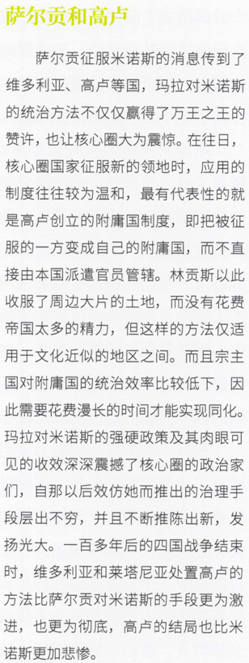

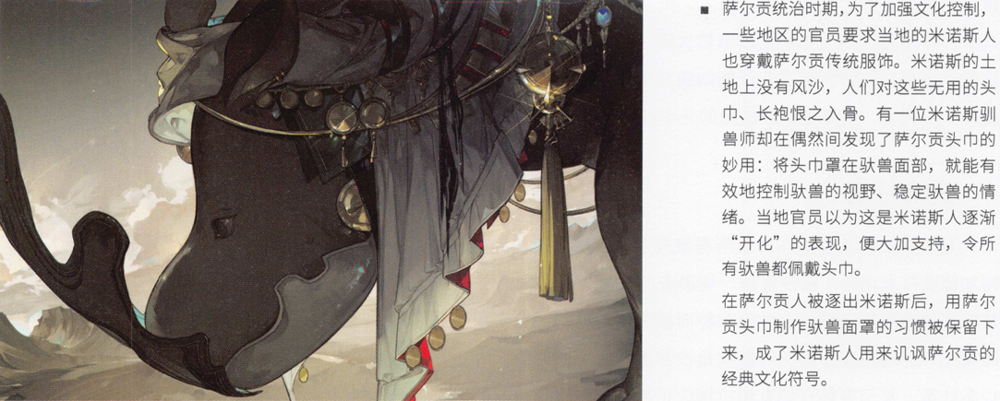

玛拉强硬的治理手腕在不到两代人的时间内就为米诺斯带来了全新的面貌。凭借着本就优厚的自然条件，加上诸城邦的统一、萨尔贡帝国倾注的大量资源和大量涌人的萨尔贡移民，米诺斯这一地区涌现出了前所未有的活力和生产力，几乎是一夜之间就成了萨尔贡帝国最重要的经济产区，米诺斯帕夏行省高速发展的势头一直持续到950年玛拉被新的万王之王召回沙尔-阿加德。
虽然米诺斯让萨尔贡帝国短暂地焕发了生机，但大部分米诺斯人并没有能够和萨尔贡共享这份繁荣。在米诺斯的土地上出产的资源要么被送回萨尔贡，要么优先被当地的萨尔贡人享有。米诺斯人眼睁睁看着自己的历史与文化被改写、被摧残、被毁灭，看着自己的孩子在征服者们的教育之下，愈发与自己一度熟知的文化与奉行的理念背道而驰。敢于按传统教育孩子或者在公共场合宣扬米诺斯传统文化的人将受到严厉的拷打，甚至遭到杀害。移动城市中巨大的宫殿和美丽的花园都只允许说萨尔贡语的人进人，米诺斯语一度接近失传。曾经参与过抵抗萨尔贡战争的米诺斯人受到了世代为奴的惩罚，他们中的大部分被出售给萨尔贡的奴隶商人，而没有离开的那些人则在本地做苦力。新生一代鲜有人知晓祖先辉煌的过去，他们只能被迫接受被萨尔贡改造过的米诺斯文化。

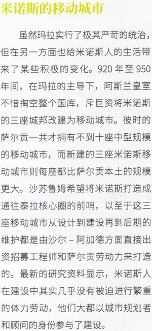

#### 复兴运动
1038年，沙苏鲁姆的孙子，时任的萨尔贡万王之王被自己的王后毒杀，他的继承者们开始了对王位的争夺，萨尔贡维持了百余年的相对稳定就此再度被打破。当时的米诺斯帕夏也是王位的有力竞争者，他几乎没有在米诺斯主持过政务，甚至没有在米诺斯生活超过一个月，而是将自己的精力放在萨尔贡国内，流连于宫廷斗争当中。万王之王的死更是让他无暇顾及米诺斯，一直在暗中活动的米诺斯复国主义者终于等来了机会。
1039年，藏匿于山林间的游击队和雅赛努斯城中的内应策动了一场针对萨尔贡官员的刺杀行动。虽然这次行动最终失败，但它点燃了在雅赛努斯生活的米诺斯人压抑已久的反抗情绪，起义就此爆发，并迅速传播到了其他两座移动城市，随后米诺斯全境掀起了声势浩大的解放运动。在复国战争中，有十二位英雄领袖崭露头角，其中最有威望的几位是策划了刺杀行动的神殿祭司阿苏克勒斯、拉刻代蒙王族后裔帕拉杜利斯，以及石匠普罗米西恩。对于疏于统治的米诺斯帕夏而言，这场起义的爆发无疑是突如其来的。他慌张失措地试图征调萨尔贡大军，想要戡平叛乱，却得不到任何支持，因为此时其他有实力的王酋都在争夺王位，没有人愿意帮助他解决米诺斯的问题，他只能自己回到米诺斯，独自率当地驻军镇压愈演愈烈的复国运动。1041年，科林尼亚最先迎来解放，阿苏克勒斯与其他英雄讨论之后决定乘胜追击、扩大战果，向剩下两座移动城市发起进攻，打响了米诺斯复国战争中最关键的一役，即“夺回神殿”作战，并于此一役中杀死米诺斯帕夏，夺回了长期被关闭的所有主要神殿，取得了重大胜利。至此米诺斯已经实现了事实上的独立。
1042年，新万王之王即位，此时的米诺斯对他来说已经变成彻底的烂摊子，加上国内局势依然混乱，他不得已只能放弃米诺斯。万王之王停止向米诺斯增派军队，下令让仅存的萨尔贡人撤出米诺斯。在一百二十五年的外族统治之后，米诺斯终于再度获得了自由。
在获得解放后，十二英雄带领米诺斯人民做的第一件事情就是尽可能地抢救仅存的文化传统，百年前进入山林进行游击战的那些米诺斯人的后裔被迎回属于米诺斯人的移动城市，大家希望能够从这些人身上找到米诺斯传统文化的碎片。祭司们开始重新学习米诺斯语这门古老的语言，不幸的是，传统米诺斯语在经过一百余年的废止后已然无法适应当代的使用需求。无奈之下，祭司和知识分子们只得借助现有的资源重新发明一种现代的米诺斯语。处于相同情况的还有米诺斯的仪式和体育竞技等传统文化，直至今日米诺斯人还在找寻幸存的物证来证明和复原自己的传统文化。
### 地理
米诺斯所在的地理区域被称为“米诺斯山脉”，和谢拉格山脉一样被认为是泰拉中央主山系的一部分。米诺斯山区位于中央主山系最南端，海拔适宜，因此比高原更宜居，但其境内依然拥有许多险峻的高峰，最主要的三座山峰按高度排列依次是赫里亚山、荷谟伊山和阿苏斯山。较适宜的海拔也让米诺斯的高山间更易于形成融雪河流，以特尔斐河、阿涅斯河、阿拉科涅河为代表的几条主要河流及其支流穿过山间的平原。其中特尔斐河发源自荷谟伊山，流经雅赛努斯和科林尼亚故城，是最重要的一条河流，在米诺斯的文化中也有着类似三座主峰一样的崇高地位。除了常年奔流不绝的河流之外，山麓的城邦还经常能受到降雨的滋润。更重要的是，米诺斯的山区内天灾少发，雅赛努斯、科林尼亚和拉刻代蒙原址几乎未曾遭受过天灾的袭击。如此优越的自然条件在全泰拉都相当难得。
### 政治与军事
政府
米诺斯现行的政治体制是基于古制改进的城邦联合制。目前三座移动城市的实际统治机构是以神殿为核心的议事厅，其中掌握主要权力的是神职人员中的祭司们，他们会定时召开并主持会议，邀请社会各阶层和团体的代表参加，讨论这段时间内各方关心的大小事务，并共同完成决策。米诺斯人特意复原了古时的市民政治活动，让市民们都能参与到政治生活中来，琐碎却不可忽视的政治问题是米诺斯人热衷讨论的话题。
米诺斯的区划目前按古代习惯以三座移动城市为核心，这三座城市分别是雅赛努斯、科林尼亚和拉刻代蒙，每座城市外也有归于该城管辖的城镇和村庄。城市内的神殿并不直接管辖其所在的移动城市，米诺斯人将城市划分成了数十个区域，每个区域里的居民会自行推选出治安官，治安官们需要到附近的神殿求得祝福和指导，向神殿负责，维持自己辖区内的秩序。
#### 军事
米诺斯的军队由神殿招募和维持，军队指挥官则由祭司等神职人员担任。同时，米诺斯存在大量由民间自行组织的防卫性质的半军事组织，例如城市卫队或是村镇民兵。米诺斯的军队编制基本上继承自被占领时期的编制，很多军职只是换了个米诺斯名字，但职责和萨尔贡军队中的一模一样。今天的米诺斯和萨尔贡之外的绝大部分国家都保持着友好的关系，经常通过各类竞赛进行国际交流。萨尔贡的边境王酋至今仍对米诺斯的土地念念不忘，米诺斯的正规部队也在阿涅斯河畔严阵以待，双方时常爆发小规模的冲突。
### 经济
得益于优良的自然条件，米诺斯一直拥有发达的农业，这也是米诺斯被萨尔贡列为征服目标的重要原因之一。在萨尔贡占领米诺斯的百余年间，米诺斯一直是萨尔贡境内最高产、最稳定的粮食产区，每年为帝国输送大量的粮食。依托农业诞生的其他产业比如酿酒、纺织等在米诺斯也得到了长足发展，并且深刻地影响到了米诺斯的文化和信仰。米诺斯重新获得独立地位之后，直接继承了许多萨尔贡建造的工业设施，如今其工业格局受制于地理因素，呈现出比较分散的状态，但质量很高，总量不可小觑。
此外，在诸多英雄神殿的大力推动下，米诺斯经常举办各类城际的，甚至是国际的竞赛活动，与这些竞技赛事伴生的新兴旅游业也非常发达。
### 文化与社会
英雄崇拜是米诺斯最显著的文化特征，米诺斯的社会与文化都可说是通过英雄崇拜塑造的，或者至少与英雄崇拜存在紧密的联系。绝大多数的米诺斯人都认为自己的生活是按照英雄们所指引的道路前进的，米诺斯兴盛的诗歌、剧场文化和雕塑文化也都是围绕着对英雄的崇拜而发展的。
米诺斯对矿石病感染者持较温和的态度，感染者不会受到系统性歧视和限制，也能够得到妥善治疗和善后。感染者在米诺斯可以从事绝大多数工作，除了神职人员一-当地的传统观念认为，感染矿石病可能会让人与英雄气质隔绝，从而无法胜任祭司的工作。

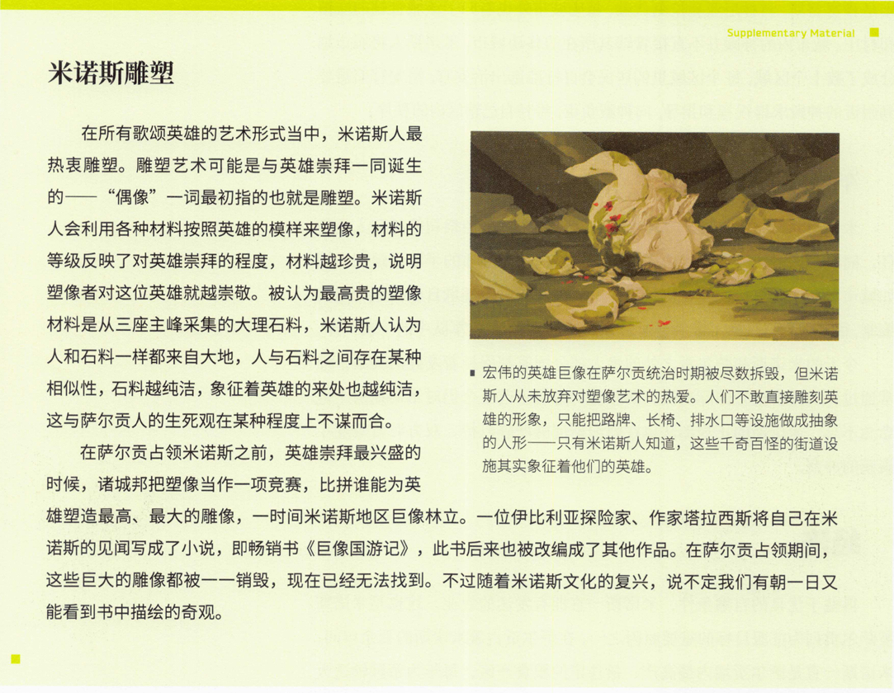

### 结语:传说新编
米诺斯人从贪婪残暴的狮子手中夺回了自己的故乡，如今强敌已被驱逐，在满目疮痍的土地上，米诺斯的英雄们要如何重建起自己的殿堂?

## 萨米

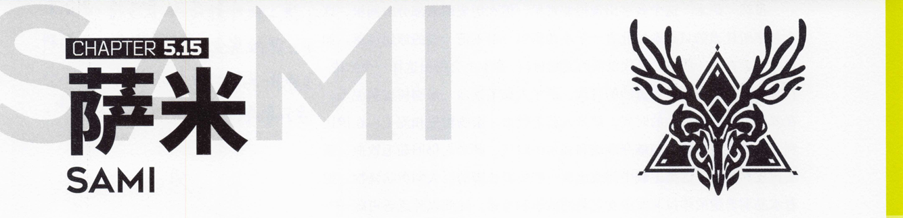

### 概览
萨米，大地的止境，森林与冻原的领土。对于一般人而言，它是遥远的旅游胜地，是桑拿浴的故乡。而在度假营地篝火的光芒之外，它很可能是泰拉体制最为独特的“国家”，也拥有全泰拉独一无二的人与自然相处模式。在这里，我们的常识必须虚心认识到自己的局限，让位于萨米的常识。

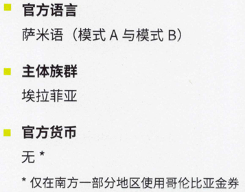

### 历史
#### 发现史
对于我们这些萨米之外的人(尤其是学术界的人)，萨米的历史其实是它的发现史。
虽然“萨米”这个名字出现得非常早，但在历史的大部分时间里，这个名字所代表的只是泰拉北方一个小角落里一群不值一提的原始部落。如果人们去查阅一些结晶时代以前的文献材料，基本上会得出这样一个结论:在萨尔贡的狮王们争霸黄沙的时代，萨米人茹毛饮血、亲吻树皮和泥土;在梦魇可汗征服大地的时代，萨米人茹毛饮血、亲吻树皮和泥土;在伊比利亚人和莱塔尼亚人相继夺取玻利瓦尔的时代，萨米人仍旧茹毛饮血、亲吻树皮和泥土。这类记载中间或出现一些生着长脚的巨大羽兽状怪物、抱着水晶羽兽蛋的埃拉菲亚少女之类的故事和童话，除此以外乏善可陈甚至在与萨米毗邻的乌萨斯也找不到更详尽、严肃的材料。在那个时代的常识中，没有什么东西会需要进人萨米，也没有什么东西想要从那里出来。当然，我们今天知道，事实并非如此。萨米人从未过着与世隔绝的生活，

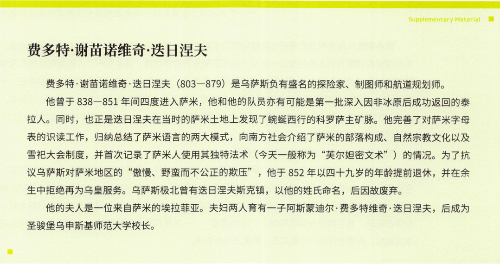

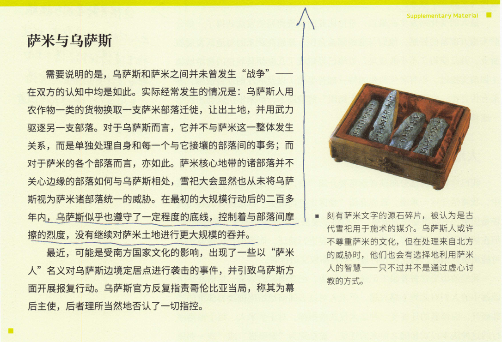

各种证据都表明，萨米是埃拉菲亚族群最主要的发源地，而他们如今在泰拉各地都可以找到-但这终究是在现代科学标准下所进行的推证。萨米太远了，彼时的人们对它的实际情况并不关心。而在过去走出萨米的人，可能是出于他们个人种种的理由，也没有给我们留下任何独特的记述。
学界公认，对萨米这块地区的详细文字记载，始于费多特·谢苗诺维奇·迭日涅夫的四次北方探险。这位在乌萨斯家喻户晓的探险家断断续续在萨米停留过十年以上的时间，真正开创了对萨米的系统性研究。不幸的是，探险家同时牵来了乌萨斯皇帝的手。在九世纪中叶的一小段时间里，由于源石矿藏的发现以及对卡西米尔战争的需要，乌萨斯通过军事侵略和经济收购等手段，快速割占了曾属于萨米诸部落的大片土地，今日一般认知中的乌萨斯西北部边界就此形成。
近些年来，萨米地区出现了一位主导权的挑战者:哥伦比亚联邦。与其他大多数国家不同，哥伦比亚一直对萨米表现出极大的兴趣。自本世纪六十年代起，一批又一批的哥伦比亚人在其国家或者其国内各个非政府组织的支持下进人萨米。与该国在西部荒地上进行的开拓运动不同，哥伦比亚对萨米的兴趣似乎是科学上的，自哥伦比亚进人萨米的人在当时也以科学考察人员为主。这些哥伦比亚人用现代科技重新勘测了沼泽区、黑森林和雪山的范围，宣称建立了前往冬牙群山的稳定通道。他们还在绵延的山脉中重新找到了遗世独立的独眼巨人--一支萨卡兹王庭氏族，并不可思议地与之建立了联系。
最大的变化则发生在最近:哥伦比亚的投资商显然设法获得了一部分萨米南方部落的好感，他们与这些部落合作，开始在萨米的湿地区发展旅游业，并且获得了不小的成果。当地已经建成了几座颇具规模的旅游城镇(如前文提过、小有名气的察帕特-加符里镇)以及成片的度假设施。甚至有传言称，在某个哥伦比亚“大集团”的赞助下，萨米很快就会出现第一座移动城市。
#### 大地之外
我已经在导言部分向读者承诺要介绍“景区之外的萨米”，在这一节中，我将信守这一承诺，首先介绍“景区之外的历史”。这部分内容与其说是历史，不如说是民间故事，它们将主要来自我的亲眼所见、亲耳所听。但在萨米之外，很少有人能对这部分内容进行验证，而我的记忆也显然有可能出错，因此，请允许我将最终的判断权交给读者。
我们的历史常常着眼于记录人的行为、纪念国家的兴衰，生活在萨米部落中的人们对此则不感兴趣。萨米人对过去的回忆始终围绕着部落的迁徙展开，而部落的迁徙受一种法术仪式的指挥。对于萨米人，每个部落举行的这种法术仪式和随之而来的迁徙，被总称为“索哈提”或“欧-弗里德尔”，即“大战役”。而“大战役”，便是萨米人眼中和口中自己的历史。我在第一次到访萨米时，曾经跟随一个萨米部落(它的名号请允许我隐去)迁徙，下文收录的故事梗概便是源自我于此时做出的记录。究竟“萨米”作为地名是发源于与“大战役”有关的故事，还是与此相反，我们尚难断言。这类故事经过漫长的文字改编和口耳相传，产生了非常多的版本，有一些已经传人南方，演变为我们曾经听过的精怪故事。在萨米部落中，这类故事通常都包含几个要素，如两个或多个神话生物之间的误会、突然出现的怪异敌人、萨米人为了泰拉而展开永恒的战斗等。
值得一提的是，“祖灵之父”除“萨米”外更常见的称呼是“萨米塔赫托”(模式A)或“萨米维利”(模式B)，这两个词有非常精确的维多利亚语译语，即“萨米的意志”。一部分雪祀明确表示过“占卜就是聆听萨米的意志”。我们可以认为这类故事实际上记载的正是标志萨米历史开始的事件。考虑到故事中描写的天地变动之宏大，萨米距离科罗萨主矿脉又非常近，天灾频发，我们可以推断，故事中神话生物的战斗很有可能实际上是上古时期一次非常剧烈的天灾。

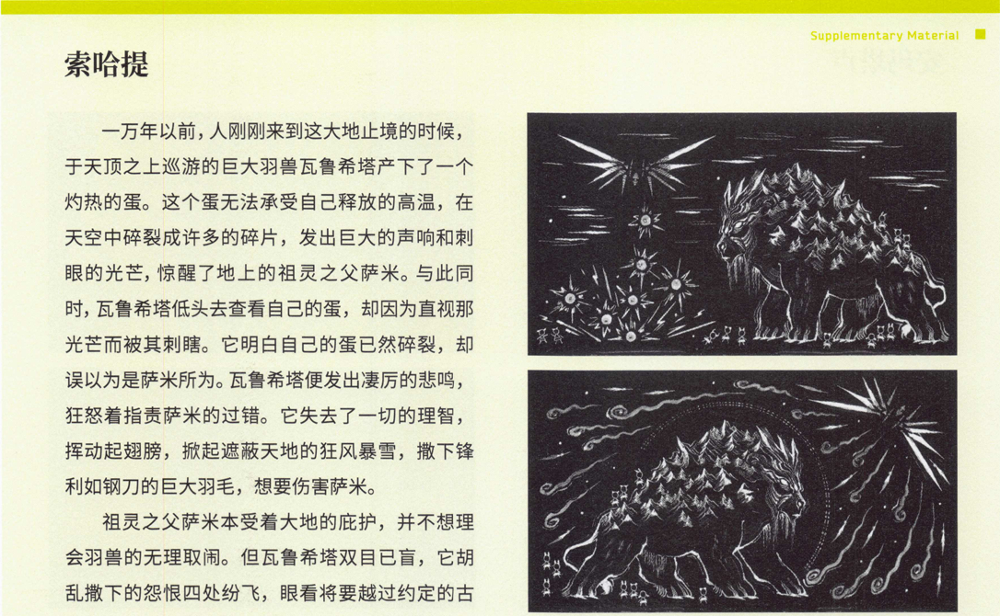
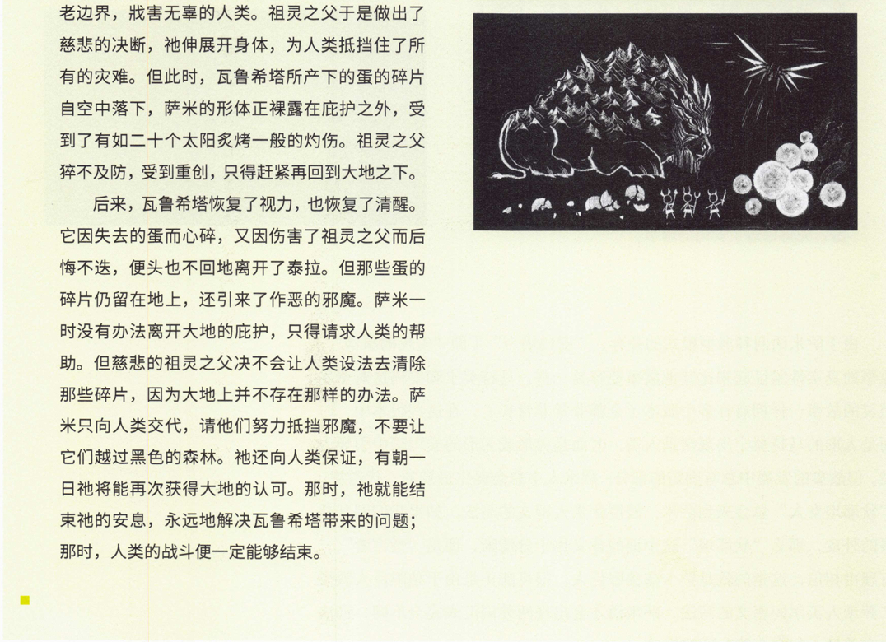

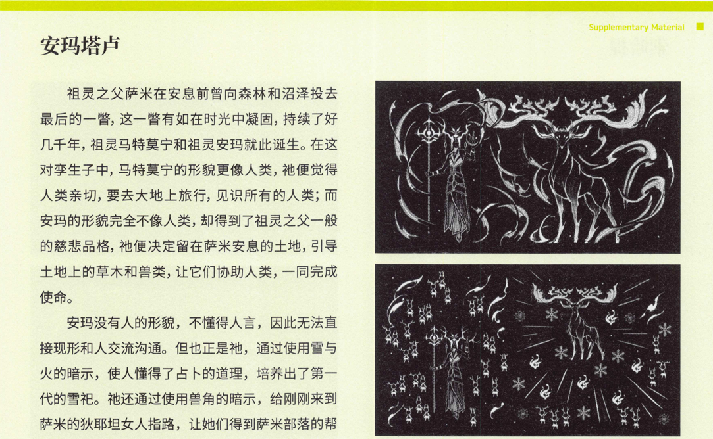
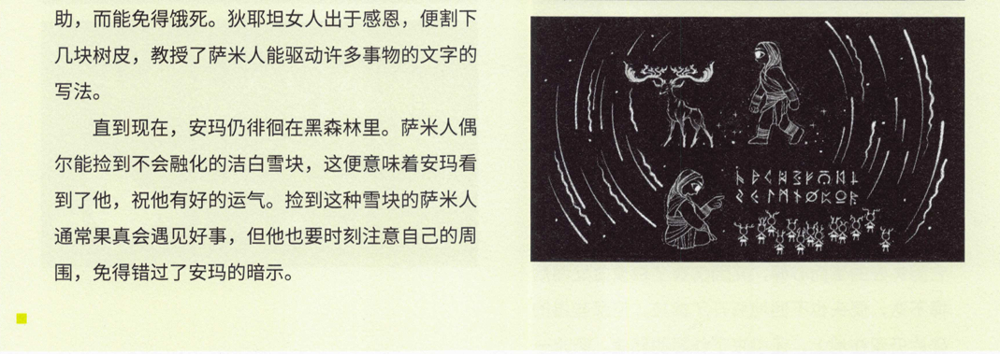

由于萨米语两种典型模式的并存，“安玛塔卢”(即“安玛的事情”)故事的真实性验证起来比其他故事要容易一些。马特莫宁和安玛这对孪生祖灵的故事一样拥有许多个版本(全都非常非常长)，在这些版本中，时而是人形的马特莫宁出现帮助人类，时而是兽形或无形的安玛暗中引导人类。但故事的发展中总有固定的部分:萨米人中总会诞生最初的一代雪祀;“狄耶坦女人”总会来到萨米，教授萨米人密文的写法。如果我们剥开故事的外皮，那么“狄耶坦”这个词的含义也十分清晰，便是“预言者”，有理由相信，这指的就是萨卡兹独眼巨人。很可能正是由于独眼巨人教授了萨米人芙尔姐密文的写法，萨米语才会出现两种词汇表完全不同，词法也有差异，却完全能互通的模式。
偶尔地，“狄耶坦女人”会在故事中分化成两支人群，其中一支会进人群山，而另一支会一路往北，，“寻找大地的伤口”。这可能暗示独眼巨人实际分为两支，抑或还有哪个我们暂时还不清楚的古老种族也曾在萨米停留。
萨米的其他故事在此不再赘述。如果读者愿意相信这些故事都有其现实的基点，那么我们大致可以总结出这样一段萨米部落的发展史:数千至一万年前，一场规模空前的天灾席卷了萨米，给当地留下了难以磨灭的集体印记。在天灾过后，幸存的人们觉醒了一种共有的源石技艺，这种源石技艺很可能属于传心感知系法术的范畴，能让使用者获得某种预知信息。在接下来的数千年中，萨米人的社会逐渐被这种源石技艺所塑造，形成了部落迁徙的传统来躲避天灾的伤害。再后来，独眼巨人自卡兹戴尔迁人萨米，同时引人了密文法术，使得萨米人能够驱使他们巨大的族树和傀儡。经过这三个事件，萨米人的社会形态得到了完全的塑造，才展现出了今天的样貌。
### 地理
#### 北方的阶梯
萨米是泰拉最北方的国家，位于乌萨斯西北方科罗萨主矿脉与科罗萨湖的交会地。自萨米继续往北，便会进人条件恶劣、无人定居的因非冰原。在萨米的土地上，地貌的变化总是遵循一个简单的四级规律:最南端的沼泽、次南方的森林、次北方的雪山、极北方的冻原。这种地貌的变化仿佛经过人为设计一般:要想进人冻原，旅行者便必须穿越雪山;要想从雪山回到南方的沼泽，也不存在绕开黑森林的路。在迭日涅夫的第三次探险中，乌萨斯探险队曾经尝试从哈拉德里加点沿着黑森林的边缘前进，想要丈量出黑森林的边界--他们最后一路走到了乌萨斯境内的叶夫雷诺夫考察站(今叶夫雷尼斯克)，而那里并没有什么森林。根据迭日涅夫的说法，萨米的地形并非固定不变，森林好像会在无人注意时行走，冰雪会每天决定它想要覆盖的地方，甚至河流也会偷偷改变流向。当然，事实很可能没有这样奇幻，在萨米，大部分地区的地貌单调而缺少变化，哪怕是在现代科学仪器的导引下，不熟悉地形的人仍然经常迷路。迭日涅夫其实很可能迷路了，他看到的黑森林也很可能是当地萨米人对他施展的法术。至少，现代勘测已经证实，可以绕开黑森林直接进人冰原，但这条路必须穿越乌萨斯的军事管控地带，长期禁止通行，因此实用意义不大。
#### 极光
在萨米，夜晚的时间通常比泰拉其他地方更长。在这里，人们常常在夜里观测到一种天空的发光现象，其形如一道道挂在天际的闪耀光带，蔚为壮观。这种发光现象被萨米人和乌萨斯人称为波利亚”，又因为它只发生在极北之地，所以又被泰拉其他地方的人称为“极光”。
极光的颜色经常发生变化，以绿色为主，但也经常表现为红色、蓝色或紫色。它的亮度和密度也时刻在发生变化。对于萨米人而言，极光是巨大的羽兽瓦鲁希塔在天顶之上所流下的眼泪;而对于我们其他人而言，极光很可能是来自太阳的物质与大气产生激烈对撞而发出的光芒。但无论何种解释，都不影响人们欣赏它的美丽。
### 政治与军事
#### 政府
萨米并不存在任何意义上的中央政府。这个“国家”的基本构成单位是一个个自我认同为“萨米人”的部族。这些部族有的会给自己取一个名字，有的则不会如此做。在萨米，至少有数百个这样的部族。
部族的核心一般是一名宗教领袖，称为“雪祀”。雪祀是部族最强大的萨满和术师，能够使用萨米独特的源石技艺和技术，并保管着部族主树的驱动咒语。一切一般性的部族事务均由雪祀和他的萨满顾问团体管理。在雪祀的所有职责中，最重要的一项是占卜。雪祀能通过占卜与“萨米的意志”进行沟通，获得启示。这种启示是雪祀率领部族进行迁徙以躲避天灾的最大依据，根据已有的记录来看，这种启示绝少失灵。
有时，多个部落的多位雪祀会收到同样的启示，类似于某种“通谕”场规模空前的雪祀大会将以极快的速度随之展开，几乎整个萨米的成百上千名雪祀都会快速赶到会场。这类会议未曾对外地人开放过，我对具体的讨论内容不得而知。但是在我的个人经验中，紧随这类会议发生的会是某种部落整体的大规模迁徙行动(通常是集体向南)。可以由此推测，这个大会的目的可能是讨论得出一个集体迁徙以躲避大规模恶劣天气或密集天灾的方案。这个大会也是萨米地区最接近国家机关的一个机构。
值得注意的是，结合哥伦比亚公布的信息来看，近一段时期内，未曾有过萨米部族大规模南迁后大规模北还的记录。一个合理的推测是，他们习惯了哥伦比亚带来的现代科技成果，从而更愿意在南方定居。倘若真是如此，那么我们无疑正站在萨米历史的一个重要转折点上。

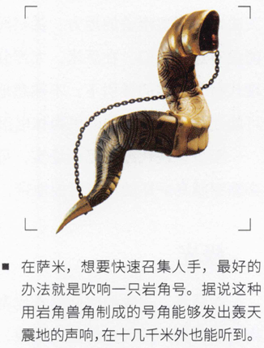

#### 军事
萨米没有统一的政府，自然也没有统一的军队。但每个部落中从不缺乏身体强健的战士和技艺精湛的术师，前者不仅精于普通的刀剑，更擅使巨大的长柄武器;后者标志性的风雪法术的名声则早已传到了萨米之外。这些人在概念上可算是构成了维护萨米内部安全及秩序的武装力量。萨米部落内部的争端基本上不会演变为武装冲突，而在和乌萨斯的对抗中，如前所述，各部落基本上也是各自为战。
但那其实是一种表象。对于萨米人来说，他们最勇猛的部落和最好的战士必须要进人“索阿特维亚卡”(意为“军团”)。这支队伍据说人数众多，永远在山脚下的要塞中戍守着冰原的边界。他们对抗的敌人据说并非人类，而是被称作“安德斯科塔尔尼尔”的可怕敌人。我没有见过军团的要塞，也没有接触过军团的战士，但读者应当记得，萨米人把雪祀占卜及部族迁徙总称为“大战役”--根据我的观察，萨米诸部落的迁徙确实在按照某种军事调动的思路进行。在看似无目的的前进中，一个部落竟能“路遇”许多其他也在迁徙中的部落--这说明部落迁徙的路线如同航道一般经过了规划，或至少是如同航道信息一般开放给所有部落认知的知识。而更进一步的是，我发现在向北行进的部落中，战士的比例明显更高。在部落迁徙交会的时候，甚至有战士会脱离原本的部落转而加人向北前进的部落。无疑，这些人的目的，正是加人军团。
在这些队伍中，我曾见过全副武装、列队前行的岩角兽，它们在驭手的操控下，行动比人的军队还要整齐划一。我也于此第一次目睹了萨米人巨大的战争傀儡，那些由整棵巨树、大片藤条和坚硬岩石组成的构装体看上去完全能战胜任何同等体量的战争机器。有些傀儡甚至全身覆盖着密文，它们的能力显然通过法术得到了更进一步的强化。驱使这样一支力量作战的萨米人究竟会在北方遇到什么，我只能想象，无法言说。
### 经济
在过去的长久岁月中，萨米的部落基本上都能自给自足，土地所提供的多过他们的需求。萨米人用双手就能制作一切生活必需品，物物交换可以同时满足部落内部和部落之间的需求，因此，萨米人也并不需要货币。但哥伦比亚改变了这一现状，外地慕名而来的人们现在能在萨米南部的度假区里使用哥伦比亚金券消费。很多度假和娱乐场所雇用了当地的部落人来充当劳工和服务员，这些人拿到了哥伦比亚的钱币，又会去购买哥伦比亚生产的工业品--萨米人似乎乐于如此，而我则选择将评论这一整套我们再熟悉不过的流程的权力留给读者。
#### 旅行
传统上，有两条路可以进人萨米:一条需要穿过哥伦比亚北部的广袤荒地，另一条则需要从乌萨斯出发，沿科罗萨湖的湖岸向西。外国人想从乌萨斯进人萨米需要经过几道相对烦琐的审批流程，这需要花一段时间，但并非如外界流传的那样不可能。此外，虽然有传闻说联邦政府计划修筑一条连通哥伦比亚本土和萨米的国道，设立正规的关卡，但目前两地之间基本上不存在严格的边界管控(值得注意的是，如果旅行者跟随自大型移动城市出发的车队前往萨米，仍有很大概率需要在出发前将旅行证件送检)。
1099年，有三条主要的车队航线通往萨米的旅游区:自哥伦比亚特里蒙出发的传统航线距离最短，票价最低;自维多利亚默奇赛德郡出发的航线则拥有更为奢华的服务设施，这条航线因为途经谢拉格，可以顺道远远地观赏到壮丽的喀兰雪山;自叙拉古蒙特卢佩出发的航线系首次开设，路途最为遥远，但是无疑为莱塔尼亚、叙拉古乃至拉特兰的居民提供了更多的选择。

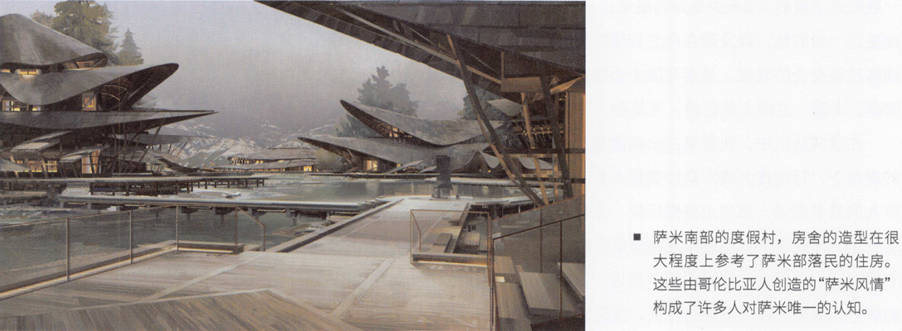

### 文化与社会
#### 语言
萨米语有两种已知的模式一-模式A与模式B。它们的主要区别在词汇表以及词法上，而句法则相对一致。这两种模式的词汇差异过于巨大，已经完全不能认为它们同源，因此也有将它们分别命名为两种不同语言的呼声。
萨米语的模式A与乌萨斯语接近，比较有可能是萨米的本土语言。它本来的文字可能与乌萨斯文字相似，但现在已经失传。模式B则相对孤立，但可以观察到与维多利亚语有部分相似之处，应当是一种外来语言，因为它的文字系统而在萨米得到了现在的地位。如果我们采信“安玛塔卢”的故事，那么这显然就是萨卡兹独眼巨人来到萨米后教授萨米人的语言。萨米语模式B的文字系统称为“芙尔姐塔尔”，即我们所说的芙尔姐密文。萨米人和萨卡兹独眼巨人拥有以这种文字为媒介施展源石技艺的能力。对于芙尔姐密文的表层翻译，二百多年来已经有了大量真实可信的成果，但其作为施术媒介的原理仍不清楚。
尽管存在个人偏好，但萨米人基本上都可以自如切换运用两种模式的萨米语。此外，虽然萨米人大多都识字，但在日常生活中，口语的应用应当仍旧占绝对多数。诗歌、文学和其他书面语形式也同时存在，但种类远称不上繁多。部落之间由从事类似信使职业的人传递书信，但各部落与萨米外部只存在极少的书信往来。

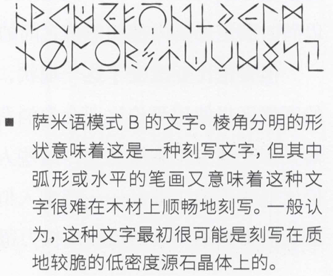

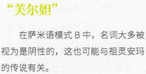

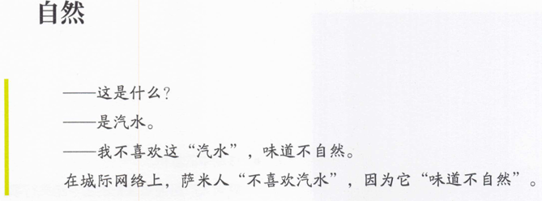

萨米人尊重自然的规律，认为万物皆有其时，不应受到打扰。他们从自然中尽情地取用自己的所需，但从不多取。他们的这种“文化气质”在南方小有名气，那种刻板印象中的“萨米人”形象正是由此而来。在文学和影视作品中，南方人和萨米人带有文化冲击元素的爱情故事已经成了一种模板，有固定的爱好者群体。然而，这些作品毕竟经过了浪漫想象的修饰和加工，“是汽水”显然并不能代表真实的情况。
在萨米，万物普遍的运行方式是捕食与被捕食的循环，这个循环有着人一样的名字，称为“阿加拉什·比弗丁”(模式A)或者“艾丽芙拉·薇蒂”(模式B)，翻译之后即“永恒狩猎”。通过“捕食”这个行为，万物的灵性才会交换、流转，因此这个行为不应被人的感情或道德所干扰。一般来说，理解并认同这个规则是被称为“萨米人”的前提。出于这个规则，他们对待自然的态度更多是实用主义的，而并不像文学想象中那样会偏爱某种树木或兽类。他们对于非人的事物并不会普遍地产生类似于对人的感情，在利用这些事物的时候也不会有任何的偏好。

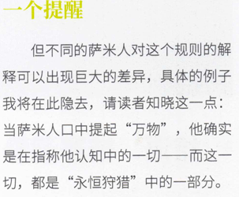
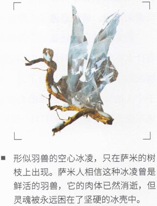

#### 部落迁徙
根据不同的部落文化，一个部落可能不会在同一个地点停留很久，也可能恰恰相反。但所有部落的雪祀每个月份都至少会进行一次占卜，如果她们在占卜中得到警告，迁徙就要开始。无论是出于占卜的结果，还是某种预先具备的知识，迁徙的路线和目的地在一开始就已经确定。
在部落的落脚地，一切生活设施的搭设都围绕着一棵或多棵巨大的树木傀儡进行。这些树木傀儡被称为“族树”，而其中最大、最重要的被称为“主树”。这些树木可以在雪祀的操控下行走、扎根，并能帮助部落搬运任何沉重的物体。
萨米人在这种长期的迁徙生活中形成了严谨的合作意识。他们的效率非常之高，这不仅体现在工作上，也体现在迁徙的准备上。他们有一种叫作“树谱”的古老文档，在部落中代代相传，是这种迁徙行为的指导规范。
而在我的观察记录中，在“树谱”的引导下，从占卜仪式结束到部落整体开拔，可能只需要短短的半小时，甚至可以说，效率比一般的移动平台切换航道还要高。

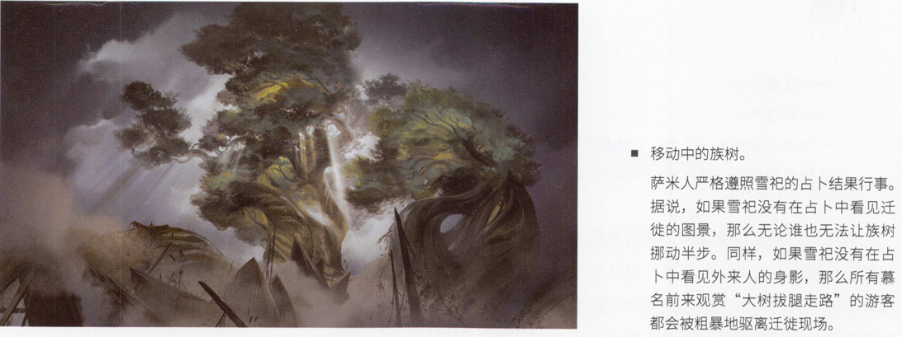

### 结语:枝寒涧静
对于有意前往萨米旅游的读者，我祝你们享受一趟完美的旅程。虽然我不知道那里算不算得上是“人间最可爱的土地”，但它确实是一片足够可爱的土地。请注意遵守度假场地的规则，不要离开度假场地的范围。
萨米可能最终还是一个遥远的化外之地或风景壮丽的旅游胜地，这没有什么不好。本文对萨米内部情况的介绍确实是为了增进读者对萨米真实情况的了解，但绝不是为了进一步鼓励读者前往萨米、亲身体验萨米。出于个人的经验，我对萨米的态度非常复杂，难以解释清楚。但我确信，萨米不应受到外界过多的打扰，那里恐怕存在着并不适宜现在就揭开的秘密。

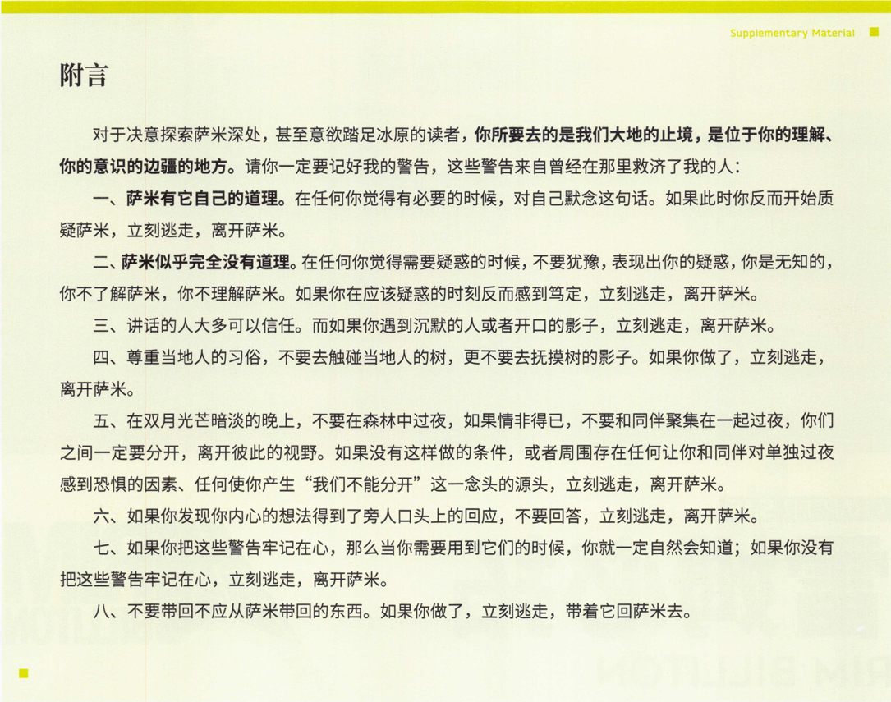

## 雷姆必拓

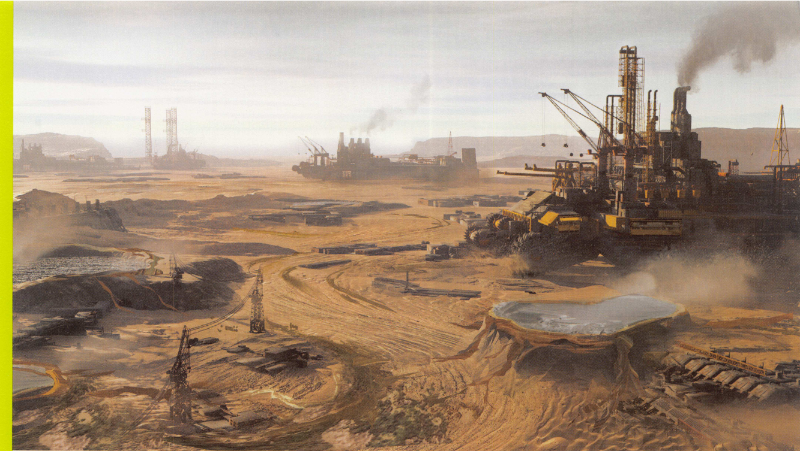

### 概览
雷姆必拓这片位于泰拉大地东南方的广袤土地曾经一度被认为是原始的蛮荒地带、生命的禁区，猛烈的天灾和崎岖险峻的高山深谷将它与核心圈文明长期隔绝，然而一旦跨过重重阻碍踏上这里的土地，人们即会发现，泰拉大地不会吝于将她的塑造之力分享给每一个角落，雷姆必拓也孕育着别具一格，但同样顽强且多彩的勃勃生机。现代工业将萦绕在这片土地上的灾厄之源转化成了一往无前的发展力量。似乎仅在转眼之间，这里的轰鸣声已不再是天灾的咆哮，而变成了无数采矿都市的喧嚷;这里高耸的源石晶簇周围，也兴建起了密集的精炼炉。如今的雷姆必拓，已经不再是荒芜的代名词，而以极为发达的矿业和独特的政治形态享誉泰拉。

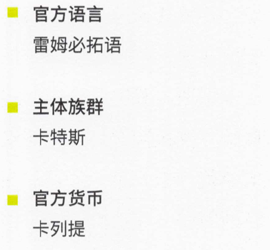

### 历史
#### 探索之前
雷姆必拓这片土地上为何会有人类活动，这本身就是一个足以引起许多人好奇的问题。在经过了近几十年广泛且细致的溯源研究之后我们可以发现，在泰拉大地已知的绝大多数文明的早期，人们都经历了从躲避天灾到趋利避害的过程。远古时期的人类在面对强大的天灾时往往都会选择大举迁徙，目的是抵达天灾少发的地带，在这些环境较为温和的地区生息劳作，最终发展出长久的文明，而天灾多发的地区在古代一般就是无人涉足的荒野，如萨尔贡的沙漠、如今哥伦比亚的荒原以及泰拉大地中部的一些地区。
当我们把目光投向泰拉大地的东南方向，如今被称为“雷姆必拓”的地区毫无疑问必然属于饱受天灾侵扰的地带，不仅如此，这一地区的天灾烈度也是首屈一指:人类有史以来所记录到的最为剧烈的几场天灾都发生在雷姆必拓。裸露在地表的源石晶簇如同山峦一般高耸而威严地林立在这片地区，被古人视为灾难的具象。伊比利亚人宁愿打造船舶深涉大海，也不愿面对环绕雷姆必拓的天灾。在相当漫长的一段时间里，在其他地区的人眼中，暴烈的天灾就如同一道密不透风的高墙，阻断了人类踏上这一地区的进程，人们认为这片地区是不可涉足的，应是荒无人烟的生命禁区。然而正是在这片一度被认为是人类禁区的土地上，在已知文明的蒙昧伊始，如今被称为“雷姆必拓”的大地之上就有人类活动，或者更为确切地说，有卡特斯族群的活动。我们尚不明确最早的卡特斯是如何出现在这里的，也不明确他们是否在这里发源、是否是某一支意外穿越了层峦叠嶂和暴烈天灾的卡特斯移民的后代，这些问题我们迄今为止仍然不能给出一个确切的答案。对于这一地区最早的文明史，我们唯一能够确信的是，从结果来看，大量的卡特斯没有和大多数的文明始祖一样，选择迁徙到天灾少发、环境宜人的地区，而是选择因地制宜，以自己的方式与天灾展开了千年的斗争。
卡特斯与天灾斗争的方式十分巧妙。他们懂得甄别稳固的沙土，会在这些地方挖掘洞穴，并在洞穴的基础上搭建简易的地表建筑，洞穴连同地表的建筑一起就是卡特斯的屯堡，又俗称“兔子洞”。遭遇天灾袭击时，卡特斯能够迅速地收起地表建筑，或是干脆放弃地面的部分，躲进洞穴里等待天灾过去。这种方式在如今享受着发达的移动城市技术的人们看来可能并不高明，但确实让世代卡特斯经受住了无数次小型天灾的考验。雷姆必拓的卡特斯围绕着屯堡建起了聚落，依靠耐沙耐旱的胡萝卜奇迹般地生存了下来。当然天灾的影响仍然不可忽视，半洞穴式的屯堡虽然能够抵御规模不大的天灾，但面对地动山摇的大型天灾，卡特斯仍是无可奈何，大型的聚落也因为天灾的屡屡侵扰而无法形成，卡特斯的族群被迫维持着比较小的规模，聚落与聚落之间距离的遥远和路途的危险也让沟通变得异常困难。在从前，雷姆必拓的卡特斯聚落呈现出小而分散的形态，没能组成较大规模的城市，所以也没能组建起统一的国家。

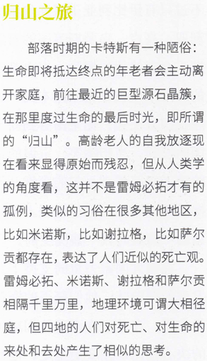

#### 第一次大移民
八世纪三十年代，著名的探险家弗朗西斯科·德莱昂得到了伊比利亚王室支持，实现了他人生中最伟大的一次冒险--在泰拉西北发现了后来被称为“玻利瓦尔”的广大土地，并在那里建立了总督区，短短几年之内向伊比利亚输送了丰厚的产出。事实上，周游各国的德莱昂在向伊比利亚王室提出赞助请求之前，也曾向其他国家的统治者提出过类似的建议，只不过只有伊比利亚王室向他慷慨解囊，其他国家都回绝了他的提案。维多利亚、高卢、乌萨斯等国的君主表面上对德莱昂的狂想不以为意，不愿豪掷千金支持他的探险，但也都暗中关注着他的动向。最终，这场孤注一掷的冒险不仅仅让德莱昂本人一跃成为独霸一方的行政长官，也让伊比利亚越发国富民强。德莱昂寻到新土地的消息当然第一时间传到了维多利亚等国的宫廷，当初嘲笑、讥讽的话语如今都变成了响亮的耳光。其他大国的统治者未等玻利瓦尔的探索开发收效尽显，就迫不及待地组织起了自己的探险队，将他们派往地图上未知的土地，希望能够复刻德莱昂的成功，所谓的“探险时代”盛况空前。
在强大国家力量的支持下，一时间涌现出了大量以官方名义进行地理发现的探险队。他们获得的资源比德莱昂优越，他们拥有的技术也比德莱昂先进，在君王许诺了他们更加优厚的报酬后，这些探险家突破地理阻隔的决心也比以往要更坚定。他们往未知的大地进发，雷姆必拓此时当然也成了他们的目的地之一。
诚然，萦绕在雷姆必拓的天灾是探险家们最大的阻碍，许多队伍葬身于天灾之腹，还有的则在踏人这片区域之后就完全失去了踪迹。但在无数探险队伍锲而不舍的努力下，仍然有许多人克服了重重障碍，来到了这片陌生的地区。他们发现在猛烈的天灾和崎岖的山脉之后，居然真的藏着这样一片与他们想象中完全不同的、充满生机与别样活力的土地。
但是，到达雷姆必拓的探险家们并没有如愿以偿地和德莱昂一样加官进爵。诸国在让自己的探险队倾巢而出的同时，也在阻止伊比利亚在玻利瓦尔的势力扩张。维多利亚、高卢、莱塔尼亚三国同时向伊比利亚施压，破坏了玻利瓦尔和伊比利亚之间的交流，逼迫玻利瓦尔总督宣布独立，伊比利亚被迫放弃对玻利瓦尔的控制。殖民地正值高速发展的大好时机，却因此陷人了混乱。联合干预的成效大大超过了诸国的预料，因此他们也放缓了对外探索的脚步，谁都不敢先对雷姆必拓宣示主权，担心自己在探索上的投资付诸流水，探险时代就此落下了帷幕。随着第一次探险潮的退去，此前成功抵达雷姆必拓地区的探险者们从始发国获得的支持越来越少，他们在某种意义上成了弃民。

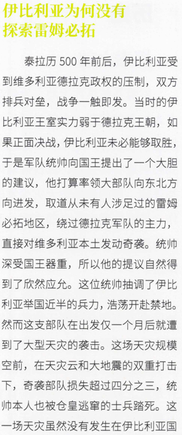

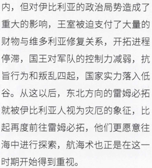

开拓者们在这片土地上面临着困难的处境，他们与母国的联系中断，彼此之间也被天灾分离。在这一时期里，唯一能够向他们伸出援手的是卡特斯原住民。卡特斯们热情地接纳了落难的开拓者。开拓者们也学着卡特斯构建起社群，在百年的时间内和谐相处，社群之间甚至出现了相互融合的现象。

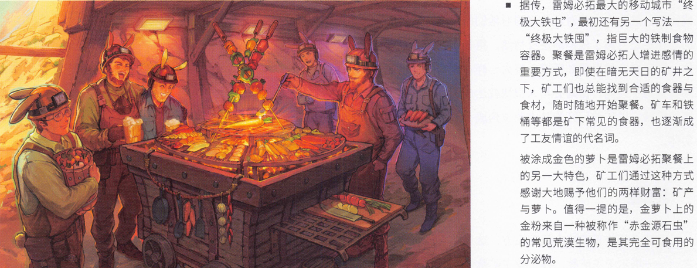

#### 第二次大移民
雷姆必拓第二次大规模的人口增长是在源石工业得到了发展之后。源石在现代工业科技的开发利用下爆发出前所未有的能量，一度神秘而危险的源石变成了必不可少的工业原料。现代工业这只巨兽敞开它的血盆大口，无穷无尽地吞食着人类供给它的源石。雷姆必拓地表分布有许多源石矿，这些原本被视为灾害化身的晶簇摇身一变成了丰饶的代名词，渐渐有人闻风来到雷姆必拓，想要与当地人分享这些唾手可得的“宝藏”。不过在这时候，人们只知道雷姆必拓有大量易于开采的地表矿物，这一地区真正的矿业潜力直到后来才被真正发现。
在十世纪与十一世纪交替时，源石产量已经不能满足飞速增长的工业需求，在声势浩大的探索运动中，凭借着不断进步完善的源石勘探技术，人类才对源石在泰拉大地的分布情况有了系统的认识，“三大主矿脉”的概念得到明确，其中探明储量最多、预计储量最多的塔尔干主矿脉就位于泰拉东南，也就是雷姆必拓所在的方向。人们终于了解到，雷姆必拓地下深埋的源石矿物的数量远远超乎他们的想象。越来越多的投资和人口蜂拥而至，矿业生产热火朝天。

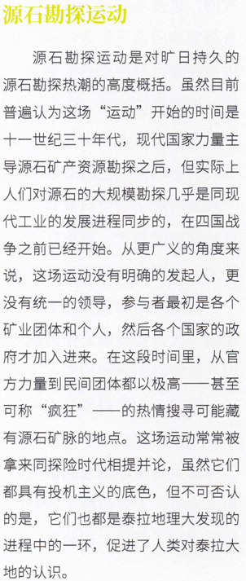

也正是这一时期，诸国重新拾起了对雷姆必拓的兴趣，但都发现雷姆必拓已经脱离控制太久，不通过强力手段重新取得控制几乎不可能。而且撼动泰拉的四国战争刚刚结束，诸国仍未走出惨烈的阴影，国内百废待兴，更无可能再对雷姆必拓发动大规模的军事行动。大国既不敢贸然采取措施，又绝不可能对如此重要的资源产地坐视不理。维多利亚、莱塔尼亚两国与雷姆必拓距离最近，他们评估了这里松散的政治结构，决定以小规模占领的方式，逐渐蚕食雷姆必拓。但是令两国没有预料到的是，他们对雷姆必拓的图谋起了反作用。此时的雷姆必拓人要么是世代与核心圈隔绝的卡特斯原住民，要么是大国弃民的后代，要么就是有意要脱离大国控制的企业或团体。这些人本就对从前诸国对他们的态度有所不满，诸国对雷姆必拓的动作更是点燃了他们的逆反情绪。得益于长久的互助氛围，基于工人群体，矿区联合的思想如同燎原野火一样在雷姆必拓迅速蔓延，团结的诉求终于得到了强调。雷姆必拓人很快就达成了共识，拒绝核心圈任何一个国家的管辖，以矿业厂区为基本单位构成了松散的联合体，成为独立的政治实体。

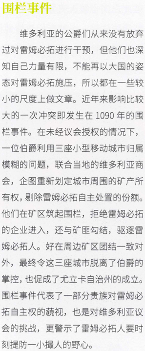

### 地理
雷姆必拓位于泰拉大陆东南方，这里拥有目前已探明的三大源石矿脉之一-塔尔干主矿脉。在三座主矿脉中，塔尔干主矿脉是已探明储量最大的，也是环境最为特殊的。这里有最密集的、暴露于地表的源石矿体，有最复杂的地下矿床结构，从而导致这里成为三大主矿脉所在地中天灾发生最频繁也是最剧烈的地方。与近年来流行的“现代工业导致天灾发生”这一说法相悖的是，根据对雷姆必拓不同地区的地层钻探分析研究的结果，雷姆必拓的天灾在现代工业诞生之前就相当活跃，即使是在大兴开采之后，天灾的活动情况也没有随着更多的源石矿物被挖掘而发生显著的变化。这一现象挑战了人类目前对工业、对天灾的理解，说明了雷姆必拓这一地区自然环境的恶劣，也更让人对世代居住在此地的卡特斯原住民以及后来冒险来到雷姆必拓的移民们感到钦佩和不可思议。
雷姆必拓的天灾确实深刻地影响了这里的自然环境塑造。从环境的角度说，天灾让雷姆必拓的地表时常处于不稳定的状态，水土都难以巩固，因此雷姆必拓境内出现了大面积的荒漠地区;天灾也加剧了这里的地质活动，地震、火山爆发与天灾的共同作用如同犁粑一般将大地不断翻动，把原本应该深藏在地下的源石矿床带到了地表，也创造了许多只有在这样的天灾高发地带才能看到的奇景，如大裂谷、间歇泉、地热井等。从生物的角度来说，天灾阻断了物种的迁徙和交流，对雷姆必拓和雷姆必拓之外的地区进行了事实上的分隔一-外部地区的种群无法进人雷姆必拓，雷姆必拓的种群也不能向外部传播，雷姆必拓的生态由此实现了相对独立。许多物种仅在雷姆必拓才有分布，比如高脚羽兽、有袋裂兽等，其他地区常见的小型生物在雷姆必拓也有较大体型的种类，比如常见的磐蟹，通常身长不到一米，而雷姆必拓的巨型磐蟹身长可达八米之多，它们的外壳更加坚硬，习性也更加凶猛。

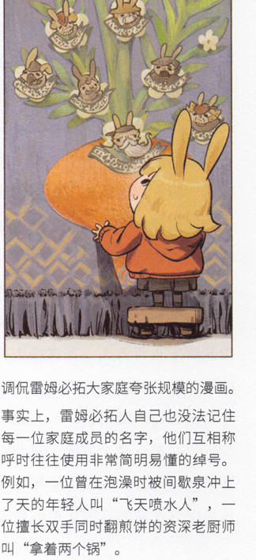

### 政治与军事
#### 政体
雷姆必拓的政治体制相当特别，可以说是泰拉政治历史上的一次创举。雷姆必拓并没有一个强力的中央政府，相反，其政治权力因当地悠久实用的大家庭传统被细分为无数个单元，具体的事务基本由各个家庭独立解决，若有事务涉及多个家庭、厂区、矿区，涉事方会派出代表进行讨论。
雷姆必拓的政治结构是从最基层构建起来的，最基本的政治单元是富有雷姆必拓特色的大家庭，数个大家庭以劳动生产合作的名义组成一个矿业厂区，多个矿业厂区按其开采的地域被归为同一个矿区，数个矿区又可组成最高一级的行政单位，即自治区或自治州。不过按照雷姆必拓人的习惯，他们通常更倾向于在比较小的尺度下进行政治生活，希望把事务限定在一家之内、一厂之内，很少在更大的尺度上有所动作。雷姆必拓人认为“事情捅得越大，要开的会就越多，浪费的时间也越多”。
#### 军事
雷姆必拓宣布独立的初期，以维多利亚为首的主要大国都曾经尝试对这一新生的国家施加影响，并由此引发了雷姆必拓人的一系列武装反抗。雷姆必拓人在这一时期高度团结，抵抗殖民侵略，但其也只在这一段时间内以国家整体的名义组织过正规军队。在诸国放弃染指雷姆必拓之后，各矿区的负责人经过研究商讨，决定废弃由国家统一领导的常备军事力量。既然独立是各个矿区之间的联合倡议，那么每个矿区就应有权利和义务组建自己的联防队以维持自己辖区内的治安一-这样的共识维持至今。虽然没有大规模的职业军队，但是雷姆必拓工业发达，与黑钢国际、雷神工业、沃尔沃特科钦斯基等军工企业有着频繁的业务往来，矿场会与这些企业签订协议，用贸易优势换取最先进的武器装备以及专业化的军事训练。有的矿区用心打造的联防队可能具有非常高的水准，呈现出少而精的特点。
外交
虽然在独立初期，雷姆必拓曾经与周边国家有过激烈的冲突，但在经过了一段时间的武装抗争而确保了独立地位之后，雷姆必拓仍然选择以和平友好的态度与核心圈大国相处。如今的雷姆必拓以经济和贸易手段同大部分国家都保持着良好的关系。作为泰拉最大的矿业出口国，其他国家的工业发展离不开雷姆必拓的矿石支持，雷姆必拓也依赖自己得天独厚的矿储优势和庞大的矿业生产规模在风云变幻的核心圈国家局势之下拥有立足之本，使得自己在大国的博弈之间找到了微妙的平衡点，有时甚至能在国际交流中扮演至关重要的角色。
### 社会与文化
#### 社会
雷姆必拓目前的人口统计相当困难，这一地区自从有文明记录以来就保持着极高的人口流动性，源石工业发展、大量移民涌人之后，雷姆必拓的人口构成情况就变得更加复杂了。从文化传统的角度来说，雷姆必拓的卡特斯族群会鼓励年轻的家庭成员外出冒险，探索新的家园，建立新的家庭社群。但在以往沟通条件匮乏的时期，故乡无法掌握他们的动向，更无法得知他们的情况。外出探险的年轻人往往要么就此杳无音信，要么就是时隔数年乃至十数年寄来一封家书，故乡的人由此才能确认他们是否安好。

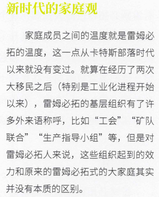

源石工业时代的到来也为雷姆必拓的社会结构带来了巨大的冲击。早在源石勘探运动之前，雷姆必拓地区地表大量分布的源石晶簇就吸引了大量的外来人口来到雷姆必拓进行矿业生产。经过了轰轰烈烈的源石勘探运动之后，塔尔干主矿脉得到正式确认，这条泰拉储量最大的源石矿脉引得更多大型矿业公司涌人，将雷姆必拓的第二次大移民的热潮推向了顶峰。在这一时期内迁人这一地区的人群中，有的仍持自己本国的身份，还有的干脆就是抱着要脱离迁出地控制的决心来到这片不受管辖的土地，寻找新的生活、新的机会。
1099年的统计结果显示，约有一千七百万人愿意在各矿区的名册上登记自己为雷姆必拓人，再加上其他的估算，目前活动在雷姆必拓的人口大约共两千八百万人。在这些人口中，超过一半人目前居住于各类移动采矿城市之上，且这个比例还会不断上升。源石工业的浪潮剧烈地改变了雷姆必拓的人口流动情况:一方面，大量的移民为了工作机会和新的生活而来到雷姆必拓;另一方面，雷姆必拓人外出冒险的习惯在新的时代依然有重要影响。此外，大型采矿城市的出现也挑战着雷姆必拓传统的社群结构，从血缘到地缘的认同正在向新的观念认同慢慢转变。
#### 矿石病
作为泰拉矿业最为发达的地区，矿石病一直是令雷姆必拓苦恼的问题。在外来人口大量参与矿业生产之前，在矿井中进行作业的大部分是拥有挖掘传统和开矿经验的卡特斯工人，他们深知源石对身体的危害，在开采时尤其谨慎，将矿石病的感染率控制在了比较低的水平。而在外来的工人进人生产环节之后，早期采矿技术落后，矿井中的工人得不到妥善防护的缺点就暴露了出来，矿石病患者数量激增，很快就成了不可忽视的社会问题具有传染性的矿石病会极大地影响正常的生产生活，所以大部分矿区对矿石病患者的处置都非常严肃。不过雷姆必拓的大家庭传统让他们不可能像乌萨斯那样残酷地对待感染者，在以往，被感染的人会从工作中退出，由专门的家庭成员照顾，在单独的地点生活直到病逝。若一个家庭无力照顾患者，则邻里乡亲往往会承担起这份责任。这样温和的隔离方式在以前小规模感染的时候可能行得通，矿石病大流行之后，如此细致的关照就难以在每一个患者身上实现了。雷姆必拓人面对新时代的困境也要做出艰难的选择:对于家庭来说，要保证生产效率，他们就不得不减少对矿石病感染者的关怀，部分矿区的隔离开始变得集中化，有了类似其他国家的隔离区;对于矿石病患者来说，罹患矿石病不单单是本人的不幸，如果传染了其他家庭成员，此等责任绝不是个人能够承担的，出于道德和家庭伦理的考虑，他们往往会踏上自我放逐的旅程，在远离其他人的地方了却余生。

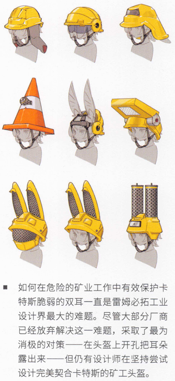

### 经济
矿业毫无疑问是雷姆必拓最重要的产业，它是雷姆必拓人现今建立认同的根本，矿业产出也是这一地区最主要的经济产出。雷姆必拓的矿业出口额遥遥领先于其他国家，与矿业相关的建筑业、运输业、加工业、制造业也相当发达。除此之外，雷姆必拓还负责承建大量的移动城市、移动平台，这些巨型建筑有的在雷姆必拓本地完成，再开赴交付地，有的则是雷姆必拓施工队在需求方当地建设完成。
雷姆必拓虽然拥有可能是泰拉最大的已探明源石储量，但目前来说可开采的储量只占很小的一部分，大部分的储量受到采矿技术和安全因素的限制，开采的难度和危险程度都很高，这一状况极大地限制了雷姆必拓的发展。也因为如此，矿业科技的革新在雷姆必拓是最重要的革新。
### 文化
雷姆必拓作为各国移民广泛融合的地区，能够接受各个族群、各个国家的移民带来的文化，只要其经过转译之后能有益于雷姆必拓人的精神风貌，就能受到当地人的欢迎。雷姆必拓人精神风貌的首要来源正是当地原住民卡特斯族群融洽的家庭文化，不过与部落时期的家族、宗族不同的是，如今的雷姆必拓大家庭具有极强的开放性，血缘已经不再是他们构建社会关系的唯一凭据，工业生产生活才是塑造他们社会形态的主要力量。因此，能够锻炼体能、提供娱乐和有利于团结合作的活动在雷姆必拓很流行，比如从米诺斯传播到雷姆必拓的竞技运动就很符合他们的喜好。以至于竞技运动在米诺斯被禁止的期间，各类大型运动会仍在雷姆必拓各厂区内如火如茶地进行着。

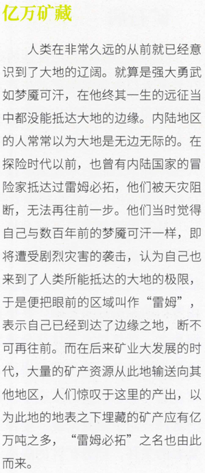

### 结语:家大业大
在现代科技的作用之下，几乎在转眼之间，曾经荒蛮险恶的雷姆必拓大地上升起了一座座钢铁丛林，它们也是人类文明的一座座丰碑。勇敢热情的雷姆必拓人在他们的移动城市、采矿都市和深不可测的矿井之间锻造出了可能是最为独特也是最为奇妙的政治实体，亟待向泰拉展现他们的拳脚。留心细看，说不定在那些脚架与熔炉的辉光之中，也正孕育着泰拉的新希望。

## 大炎总览（由于设定集中没有结构性的描述这里就不写了）
## 极东来信
## 卡兹戴尔
