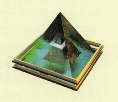
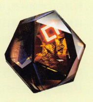
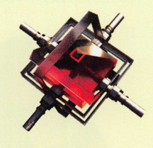
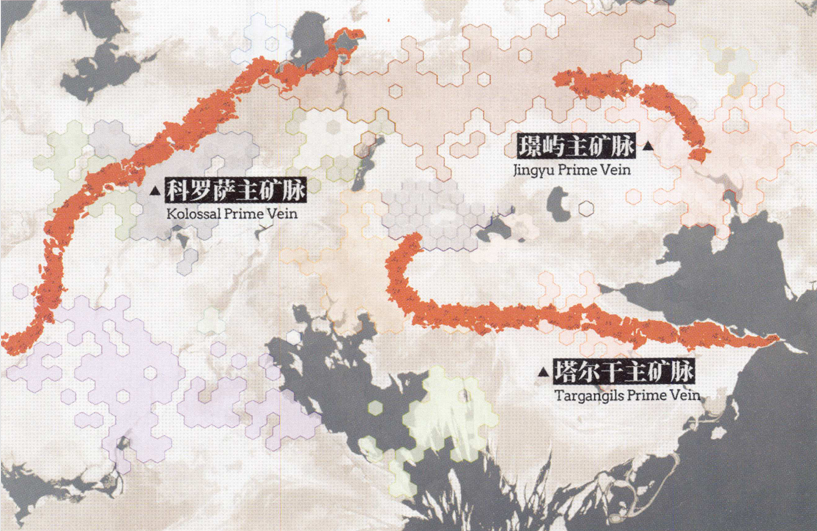

# 源石
本文大体上参考了明日方舟的官方设定集大地巡礼，对于其中没有说明或者模糊的地方，本人会根据现实参考予以完善（顺便掺上自己的设定 ^_^ ）。

源石（Originium）：作为泰拉大陆广泛存在的能量结晶矿物，其形态多样分布广泛，从地表至地下深层均有蕴藏。
作为该世界最重要的天然能源与工业原料，源石通过"源石技艺"实现能量转化，其自然增长特性为长期应用提供可能，
但接触易引发致命性疾病"矿石病"。源石具有活性化、适应性和自然增长三大特性：
活性化状态下会释放高密度能量并产生感染性颗粒；可通过不同形式释放能量；
在自然环境中存在自复制现象。根据形态差异可分为源石碎片、源石原矿和固化源石结晶等类型，
地理分布呈现科罗萨、塔尔干和璟屿三大主矿脉体系。作为能源广泛应用于法术材料、工业动力和原料加工领域，
衍生产品包括源石锭、至纯源石和合成玉。伴随源石工业技术进步，该矿物已深度融入泰拉文明发展进程，
但矿石病危机与天灾频发的关联性仍为现代社会面临的重大挑战。

## 源石的基础信息（基本教育信息）

“人们称现在这个时代为‘结晶时代’，是因为在现代，源石结晶在人们的生产生活中几乎无处不在。泰拉文明能发展到今天，
离不开人们对源石的广泛应用。尽管我们还不能完全解析源石本身，但源石科技已经相当成熟，并在近年来取得了长足的发展。
虽然矿石病问题在现代愈发严重，一些学者也指出，天灾频率的提高与现代源石工业的发展可能有一定的相关性，
但现代社会已经不可能脱离源石而存在了。泰拉人注定要直面源石的一切，做好准备，才能继续前行。”
——《结晶时代：源石与现代社会》序言
（E.E. 埃里克森．大地巡旅：《明日方舟》官方世界观设定集．浙江摄影出版社．2023．002）
自然界中的源石

## 源石工业
源石本身也是重要的工业原材料。源石的各类形态、各个部分都得到了充分的利用，不管是源石机械中的重要零部件，还是组成源石电子设备的品体电子单元，都是由经深度加工的源石制成的。
源石不仅从整个宏观的历史角度深刻地影响着我们，它的影响更体现在我们的日常生活当中。现代人已经无法想象在源石工业制品诞生以前，古代的人们是如何生活的，也不再像古代人那样对源石抱着审慎、敬畏的态度。不过，源石并没有随着人们对它利用方式的变化而改变它的本质，它仍然是危险的矿物。虽然现代源石工业已经使用了许多保险装置，比如源石隔离壳、源石尘吸收器、源石滤网等，大大降低了源石带来的风险,但是，如何更加安全、规范地使用源石，减轻它对我们造成的危害，仍有待更多技术上的探究和突破。
常用的源石制品有源石锭，至纯源石，合成玉等。

源石锭
至纯源石
合成玉
## 源石的地理分布
如今人们已探知的源石矿物资源，在地理分布上呈现为三条东西走向的主要分布带:一条称为"科罗萨分布带"(或称"科罗萨主矿脉"，下同)，从萨尔贡西北起始，经玻利瓦尔腹地向哥伦比亚北方大湖区延伸，穿过萨米南方，直至乌萨斯的西北部边境，它有着丰富的浅层源石储量。另一条称为"塔尔干分布带"，它的矿脉长度比科罗萨分布带稍短，从维多利亚东部河湖上游的山地起始，向东横穿雷姆必拓全境。据估计，塔尔干分布带的深层源石储量占全泰拉已探明总储量的百分之六十，仅在雷姆必拓一国境内的部分就占总储量的百分之三十，是毋庸置疑的源石资源宝库。除这两条分布带之外，大地的东方还有一片新月状的独立分布区域，即璟屿分布带。它从炎国腹地的两河流域中央起始，向西北方一路延伸，在东方诸国漫长的文明史中起到了举足轻重的作用。

## 源石的历史
源石是泰拉大地上普遍存在的一种蕴含能量的结品矿物，有数种不同的形态，从地表到地下数千米的岩层中都可以找到。源石目前是泰拉最重要的天然能源，也是重要的工业原料。通过一定的方法，可以转化源石中能量的形式，这些方法称为"源石技艺"。令人惊奇的是，根据观测，天然环境中的源石似乎能够自然增长，这让人们对源石能源的长期应用有了乐观的预期。不过，与源石接触，可能会导致源石感染，引发矿石病。
在远古时期，人们就发现了源石的存在，并试图去理解和利用它。长久以来，人类研究源石知识，开采源石矿物，生产源石制品，施展源石技艺。源石对人类来说是如此重要，可以说，泰拉人类的历史就是与源石交织的历史。
## 源石贸易

## 各国对源石的态度
