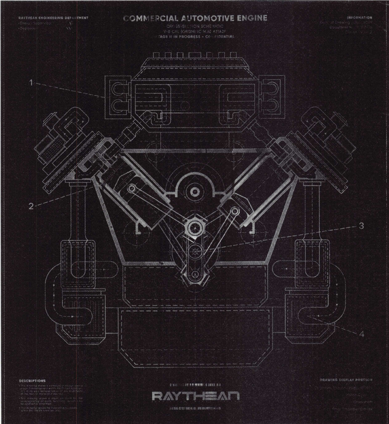
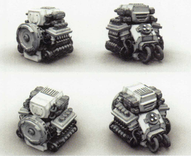
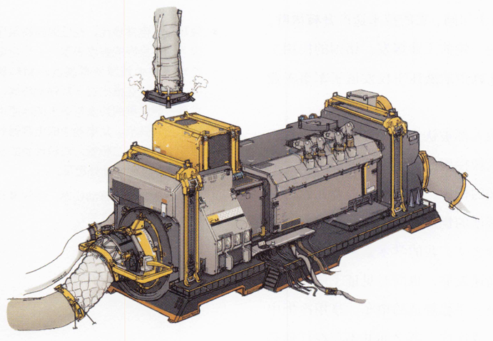
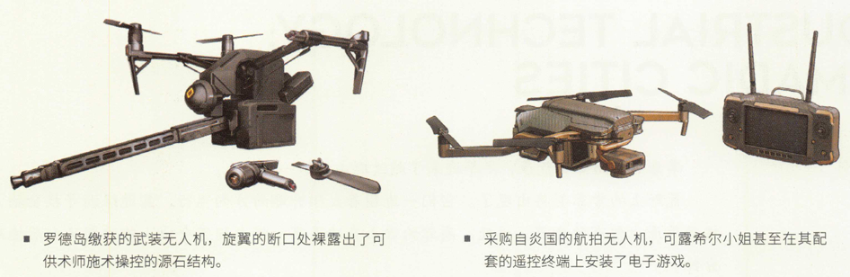

源石内燃机技术还并不成熟时，人们就急着将它投入了早期移动城市的建设。在最早的移动城市引擎中，固体源石燃料的燃烧速率和高温源石蒸气的压力水平都还需要依靠源石技艺来辅助控制，但在活性粉尘废料处理不到位的情况下，这些移动巨构会不断地将驱动它们的工程术师送入坟墓。
在移动城市诞生之后许久，可以安全投入民用的小型源石内燃机才真正得到了普及。如今，全自动的引擎控制模块和成熟的废料处理系统已经能够高效地解决这些曾经葬送了无数生命的难题。

源石工业技术
若用当今的目光审视，以源石技艺为基础的手工生产有着成本高、效率低、规模小、质量参差不齐、普及程度有限等诸多问题。只有技艺水平精湛、施术单元精良的术师才能制造复杂产品，人们生活中常见的仅有最简单粗陋的手工制品。
现代工业法术的普及不仅使源石技艺适应性中等或较低的人都能更便利地参与工业生产，也使零部件实现了标准化与可互换量产。现代意义上流水线的出现，大大提高了生产规模的上限。源石工业的高速发展带来了人口规模的巨幅增长与社会结构的剧烈变更，这种变化又通过消费需求引导着技术的发展:在移动城市的轰鸣响彻泰拉之后，冰箱、电视、空调等普通民用产品也逐渐步人了泰拉人的日常生活。
但不可否认的是，如今的工业设备能够实现的源石利用方式仍较为固定、单一。当一枚源石被制成特定的施术回路，它的用途也就固定为传导某一种特定的法术。各种特殊的加工操作以及源石设备的充能维护仍需仰赖专业工程术师的源石技艺。
启程前往拉特兰之前，我与老同僚聚餐一场。桌上有人笑称，过去移居一座城市最需要向本地人了解的是哪家餐馆正宗实惠，现在却成了哪家源石设备充能站正规可靠。"术师进行充能维护时不慎炸掉顾客的设备"之类的新闻永远不会从街头小报的民生版块缺席。然而在数十年前，这类媒体最喜闻乐见的则是各种新兴源石设备引发事故的新闻。

源石动力技术
由于应用范围广、可再生性强、能量密度高等特性，源石在当今泰拉大部分国家和地区的动力能源组成中占据着无可撼动的主导地位。但在结晶时代以前的漫长岁月里，它的主要用途却不是作为动力的来源。
源石动力设备的诞生彻底改变了这一格局。最初的源石动力装置是源石外燃机，它不是直接使源石输出动能，而是利用源石产生的热能，在锅炉中制造高压水蒸气，并以蒸汽作为工作介质，推动活塞连杆结构往复运动。这一技术的问世鸣响了结晶时代的晨钟，从起吊机到投料站，从货运车到粉碎机......喷吐蒸汽的机械开始接管工业生产的各方各面。伴随着蒸汽骑士的诞生，泰拉的军事领域也迎来了重大的变革。
尽管意义重大，早期源石外燃机的设计却不无缺陷。这种设备通常笨重而庞大，不仅严重依赖施术者的法术支持，也时常出现源石放出的巨量热能无法被充分转化利用，反而导致锅炉频繁过热的情况。种种缺陷导致源石外燃机几乎没能在日常民用领域发挥作用。外燃机诞生后的数十年岁月内，这片大地见证了人们对源石动力技术百花齐放式的探索，源石内燃机最终脱颖而出。它不仅不再对施术者有硬性要求，对源石热能的转化利用效率也更高。
源石内燃机的问世鸣响了第二次变革的钟声，七城联邦设计的第一座移动城市正是由数台大型内燃机提供动力的。随着源石内燃机体积的精简，民用载具也得到了一定程度的普及。

源石精炼技术
试想这样的场景:我们的先祖在无意间凿开源石矿的惰性晶体外壳，发现其中淡黄色的矿核能更顺畅地引导源石技艺。单纯敲开晶体外壳不能使源石的纯度发生任何变化，却足以让人意识到，加工源石即可大大提升其利用效率。人类精炼源石的历史或许正是由此开启的。
真正意义上提纯源石的精炼技术与源石技艺有着相辅相成的发展轨迹，前者极大地拓宽了后者的可能性，而后者对源石纯度的需求也推动了前者的进步。大地各处的精炼方法往往与当地的源石技艺体系密切相关，但大都依靠手工操作，主要服务于精良施术单元与奢侈工艺品的制作。结晶时代以前，人们对源石的危险性缺乏系统认知，稀有的高纯度精炼源石时常成为贵族标榜身份的象征物。伦蒂尼姆皇家博物馆的高卢展区藏有一枚镶嵌着精炼源石的婚戒，在灯光下，它透出淡黄绿色的光辉。这枚戒指曾经的主人是一位子爵夫人，她最终死于被戒指划破手指。如今，精炼源石的象征功能依然能在合成玉上得到体现，但源石精炼技术的主要服务对象已经从少数贵族变成了庞大的源石工业体系。

源石精炼技术

试想这样的场景:我们的先祖在无意间凿开源石矿的惰性晶体外壳，发现其中淡黄色的矿核能更顺畅地引导源石技艺。单纯敲开晶体外壳不能使源石的纯度发生任何变化，却足以让人意识到，加工源石即可大大提升其利用效率。人类精炼源石的历史或许正是由此开启的。
真正意义上提纯源石的精炼技术与源石技艺有着相辅相成的发展轨迹，前者极大地拓宽了后者的可能性，而后者对源石纯度的需求也推动了前者的进步。大地各处的精炼方法往往与当地的源石技艺体系密切相关，但大都依靠手工操作，主要服务于精良施术单元与奢侈工艺品的制作。结晶时代以前，人们对源石的危险性缺乏系统认知，稀有的高纯度精炼源石时常成为贵族标榜身份的象征物。伦蒂尼姆皇家博物馆的高卢展区藏有一枚镶嵌着精炼源石的婚戒，在灯光下，它透出淡黄绿色的光辉。这枚戒指曾经的主人是一位子爵夫人，她最终死于被戒指划破手指。如今，精炼源石的象征功能依然能在合成玉上得到体现，但源石精炼技术的主要服务对象已经从少数贵族变成了庞大的源石工业体系。
但手工精炼远不能满足近现代源石工业大规模发展制造的庞大需求，源石精炼工艺的探索方向从改变精炼产物的色泽纹理，变成了提升精炼加工的规模效率。同质精炼技术是这一探索最具标志性的成果。我习惯用食品发酵的术语来形容该技术的精炼流程:在精炼流程中，已精炼的高纯度源石发挥类似酵母的作用，在特定的催化条件下，能引发待精炼源石的晶体结构趋同纯化。该流程获得的精炼产物的纯度能与充当"酵母"的源石一致，并同样能作为"酵母"，用于后续的精炼流程。
源石精炼技术的突破常被誉为结晶时代最为重要的技术成果。无论是大规模工业生产所需的源石原料、高效率源石动力装置仰赖的高纯燃料，还是高精度源石电子单元必不可少的源石敏感材料与高传导性材料，最终都产自一座座平平无奇的精炼厂。

源石电子技术
源石电子工业对生产生活的影响不容小觑。从能够自动计时的交通灯，到连通整座城市的网络服务器，再到拥有一定程度自主行动与学习能力的智能作业平台......源石电子技术的诞生极大地拓宽了源石应用的可能性。源石电子技术的应用范围是广泛的，普及度却极低。高纯度的源石晶体、高传导性的合金材料、高精度的集成电路......电子工业的每一环都伴随着高昂的成本、稀有的材料、复杂的工序。因此，不同国家和地区之间的电子技术发展水平往往天差地别。事实上，"发展水平差异"这一说法并不严谨，因为在一些源石技术并不成熟的地区，"电子技术"的概念甚至尚不存在。

可露希尔小姐的收藏:源石电子技术的影响
似乎对无人机抱有特殊执着的可露希尔小姐从各处搜罗了各式无人机，源石电子技术带来的变化微妙地展现在她的收藏中。其中一台武装无人机是由作战干员在萨尔贡缴获的，它必须由术师在近距离内持续施术操控，操作难度高且稳定性差。可露希尔小姐饶有兴致地向我展示了当初的任务报告:技艺不精的术师将无人机砸到了友军头上，被砸断了旋翼的无人机和被砸昏了头的雇佣兵一并成了俘虏。

罗德岛缴获的武装无人机，旋翼的断口处裸露出了可供术师施术操控的源石结构。
采购自炎国的航拍无人机，可露希尔小姐甚至在其配套的遥控终端上安装了电子游戏。
停放在它旁边的，据说是远从炎国采购来的民用航拍测绘无人机。即使对源石技艺一窍不通，也可以通过配套的遥控终端实现远程操作。此外，该无人机还能在无人遥控时自动巡航，将拍摄到的画面实时传回操控者的终端，甚至能提供城市美食地图和自动预约餐厅服务.......介绍这些时，可露希尔小姐目光炯然，堪比源石射灯，令人印象深刻。