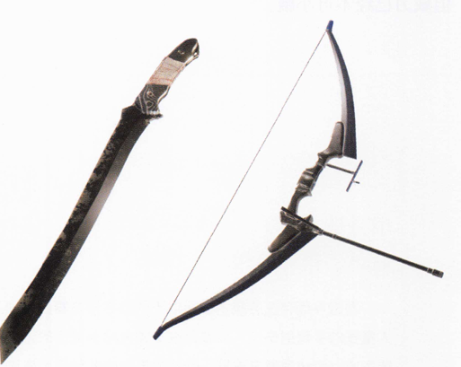
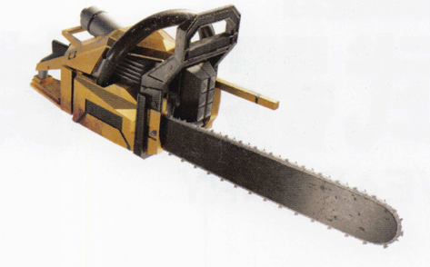
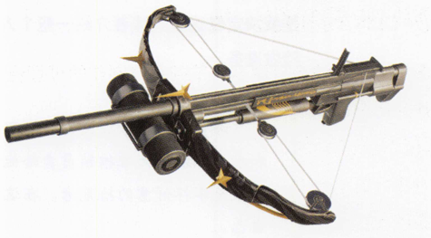
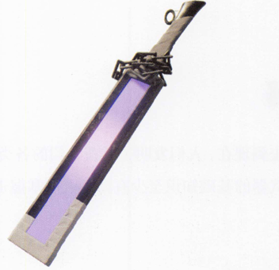
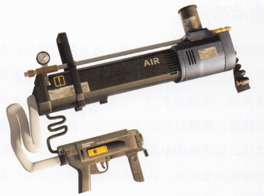
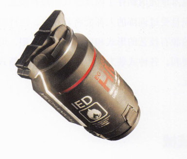
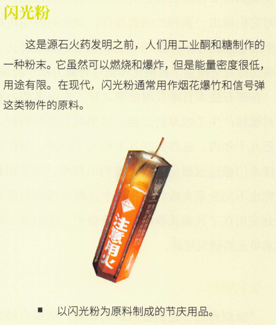
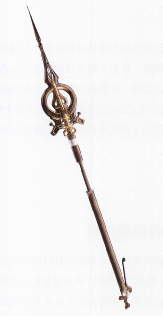
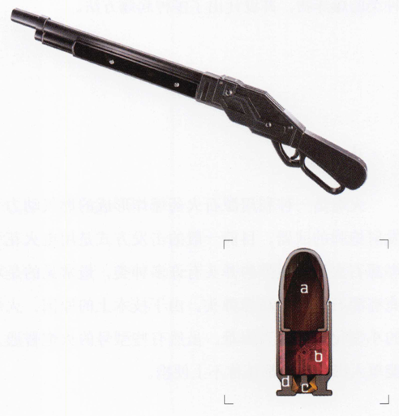
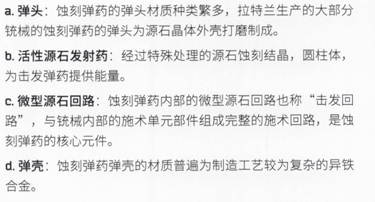

传统武器

刀剑、枪矛、弓弩和盾牌，这些不依赖额外能源的传统武器在现代仍然为人们所广泛使用。许多传统武器还保持着经典的形制，但发展到现在，它们或多或少都经过了现代化的改造:大型武器的柄被做成可靠的伸缩结构以方便携行;盾牌的材料、形制不断更新换代以提高效能;弓弩装上了滑轮组以增强威力。这些武器在现代仍然忠实地发挥着作用。

机械武器

随着源石技术的发展，人们制作出了集能源装置和机械结构于一体的复杂武器。这类武器通常较为沉重，运行时会发出巨大的声响，以其机械结构来造成杀伤。许多机械武器干脆就是由民用机械改造而来的。例如战斗链锯这种非常流行的武器，其实就是对普通的链锯进行军事化改造的产物。

自动武器

"自动武器"是对能够利用某种自动机构完成搭箭、上弦和发射等一系列步骤的弓弩类弹射武器的统称。其中，能自动完成整个发射过程的称为"全自动武器"，而只能自动完成发射过程中部分步骤的称为"半自动武器"。通常自动武器是由压缩气体或电力驱动的。

能量武器

能量武器是目前最先进的武器种类，不借助源石技艺而利用某种能量，就能直接造成毁伤。它们通常以电力驱动，以高能量密度产生杀伤力。最常见的能量武器是能够放电的近战兵刃，据说也有能发射能量束的远程武器存在。许多能量武器还处在实验阶段，但威力已经不可小觑。

发射器

发射器其实就是用大口径身管将物体以抛掷的方式发射出去的装置，发射一般采用液压或气压系统来实现。只要动力足够，发射器能够将任何塞得进身管里的东西打出去，这正是它的优势所在。由于这个特性，人们为发射器设计了各式非致命弹药，使其成为一种多功能武器。

源石火药和爆炸物

源石火药指的是以源石为基础材料制作的可燃烧和爆炸的药剂，通常为粉末状，也有其他形态的成品，例如液体状或晶体状。源石火药有各式各样的配方和制作方法，制成的成品性能也因此各不相同。那些专门强化了爆炸性能的源石火药称为"源石炸药"。人们基于源石炸药制作了炸弹、地雷等不同种类的爆炸物，并设计出了多种起爆方法。

火炮

火炮是一种利用源石火药爆炸形成的燃气动力来发射炮弹的武器。目前一般的击发方式是用电火花引燃源石火药。炮弹的弹头有许多种类，最常见的是填充有源石炸药的高爆弹头。由于技术上的原因，火炮的小型化设计相当困难。虽然有些型号的火炮普通人能单人操作，但都还称不上便携。

施术单元

施术单元是普通人施放源石技艺的必需品，在许多场合，人们会将施术单元视作武器。传统施术单元是最常见的一类施术单元，主要功能是提供施术所用的源石能源，也能对特定类型的源石技艺起到一定的增幅作用。这类施术单元可以做成各种样式，从双手法杖到特制手套均可。甚至有的施术单元的制作方式是将源石和金属熔铸在一起,最终成品不仅可以施术，也可以作为兵刃使用。
现代工业法术的发展带来了一种新的施术单元。这类施术单元内储存了固定形式的源石技艺，具备一定知识且受过训练的人都能将其激发。这样的装置施放出的源石技艺的形式和威力都相对有限，但使用上相当便利。各种武装力量经常装备这样的新式快速施术单元。

铳械

铳械是由拉特兰的萨科塔们最先发现的，他们也是械的主要操作者。用现代的理论来解释，铳械是一种极为精密和复杂的集成施术单元系统，用以发射蚀刻弹药。源石回路同时存在于铳械和蚀刻弹药上。击发铳械需要以源石技艺同时控制铳械和蚀刻弹药，并对它们做出一系列的细微操作。如此高的使用难度换来的是极高的准确度、非常远的射程和持续的火力，这些优点完全掩盖了铳械比传统弓弩威力稍小的缺点。在源石技术日渐发展成熟之际，有许多势力和机构对铳械产生了浓厚的兴趣，试图对其进行解析。但在近几十年内，这些研究基本陷人了停滞。制作铳械的技术门槛远远超出了研究者们的预期。尽管如此，研究也不完全是失败的，在这个过程中得到的成果大部分应用在了其他武器的技术升级中，还启发了新型施术单元的研究思路。

蚀刻弹药
"蚀刻弹药"是铳械弹药的总称。依据铳械的口径与种类的不同，蚀刻弹药的种类也五花八门。
黑钢国际的铳械
铳械高手、拉特兰佣兵"桥夹"是黑钢国际的创始人之一，在他的帮助下，黑钢国际的装备与应用技术部门仿制并简化了铳械。这些铳械内部的施术单元较为单一，使用的弹药在结构上也经过精简，整体性能比起原版大幅缩水，操作方式也有所不同。无论如何，作为少数合理、合法拥有锍械的组织，黑钢国际将简化铳械作为自己的一大优势来宣传。
手炮
伊比利亚利用对拉特兰铳械的解析成果开发出了手炮。手炮在外表和操作方式上模仿铳械，但不发射蚀刻弹药，而是激发源石发射药产生冲击波杀伤敌人。它运用的源石技艺原理也与铳械不同，实质上，这是一种形似锍械的新型特种施术单元。

常见的军工材料
在现代，材料学的发展成果有效地应用在武器和护甲的制造上。在军工业中，最常见的材料包括以下几种。金属:最经典的原材料。现代冶金工业发展成熟后，人们开始在武器制作中使用一些构成较为复杂的合金，例如异铁和D32钢。
聚合物:在如今的泰拉，塑料、橡胶和化学纤维已经得到了广泛的运用。这些聚合物都是从生物材料中制备的，制作方法包括将树脂等植物提取物再加工，或是从虫壳中获取几丁质，再与其他材料合成。
复合材料:复合材料种类繁多,其中的大部分技术成熟较晚，近年来才在少数地方投入实际使用。以玻璃纤维增强的硬质合成树脂是一种典型的复合材料。

护甲和携行具
除武器以外，护甲和携行具一类的装备在战斗中也是非常重要的。在观察和辨别武装人员时，这些装备的情况是关键所在。
护甲
在现代，护甲基本可以分为两个大类:一类是传统风格的偏向整体防护的甲胄，由大面积的硬质材料制成;另一类是出现较晚的各类强调功能性的防护服，多采用高强度织物作为基底，并以先进材料补强局部防护。当然，也有为数不少的武装人员出于保持机动性之类的理由并不装备护甲。
携行具
携行具指的是携带装备和物品的各类用具。武装人员使用的携行具通常都经过特殊设计，经常和护甲一起穿戴。事实上，这些军用的携行具对长途旅行也颇有帮助。