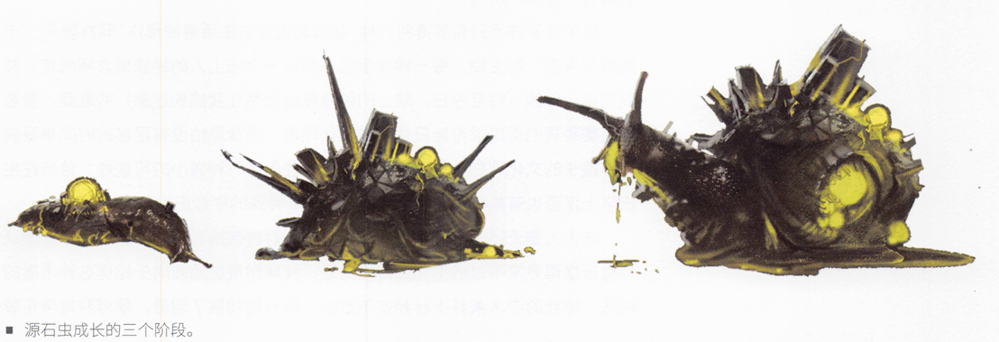
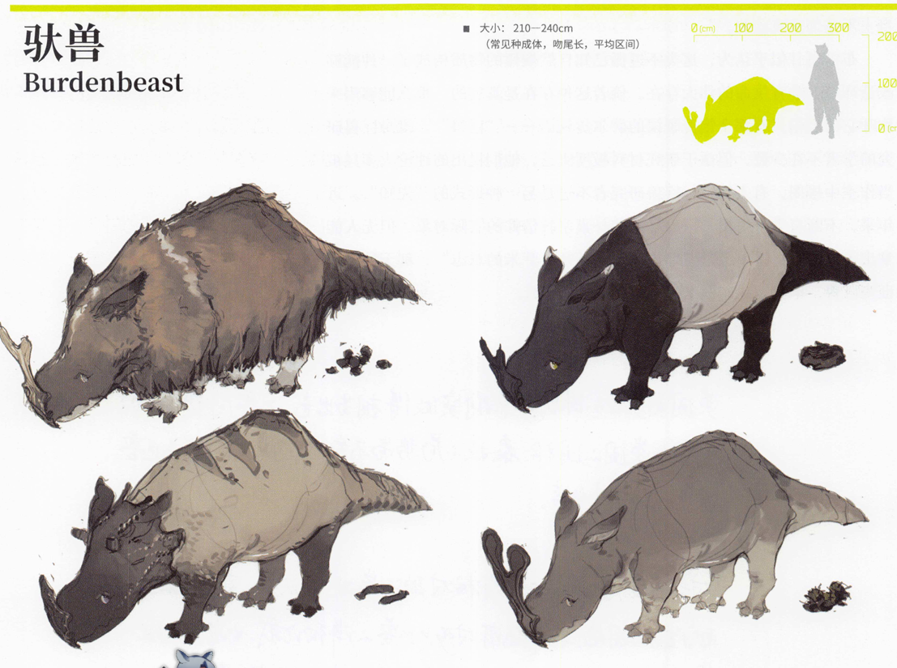
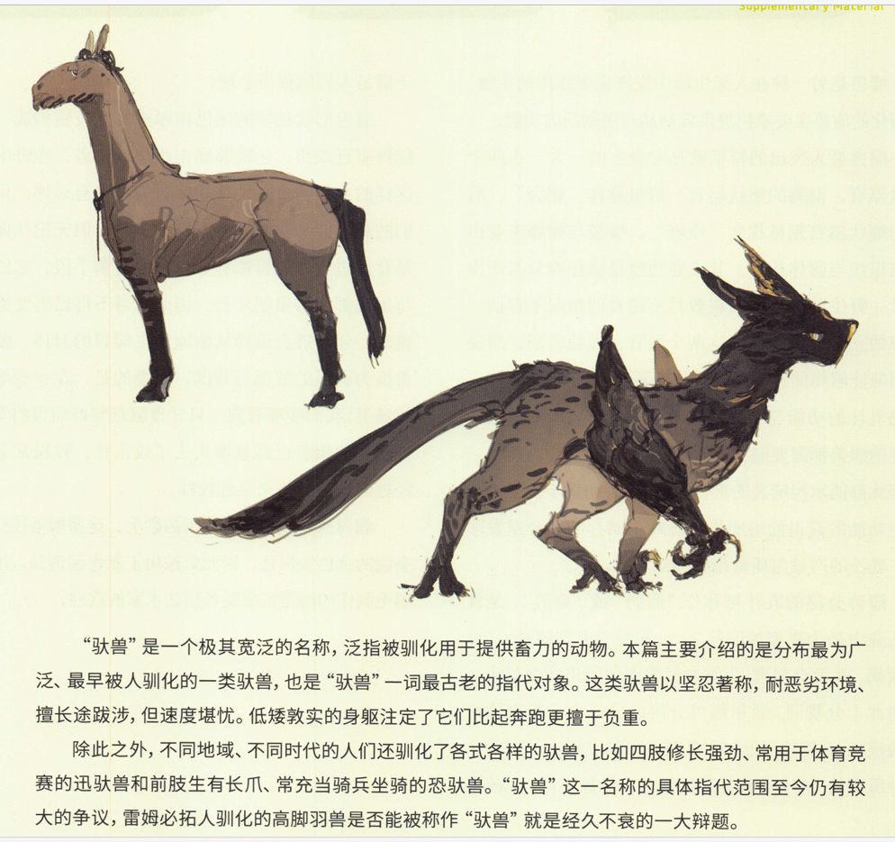
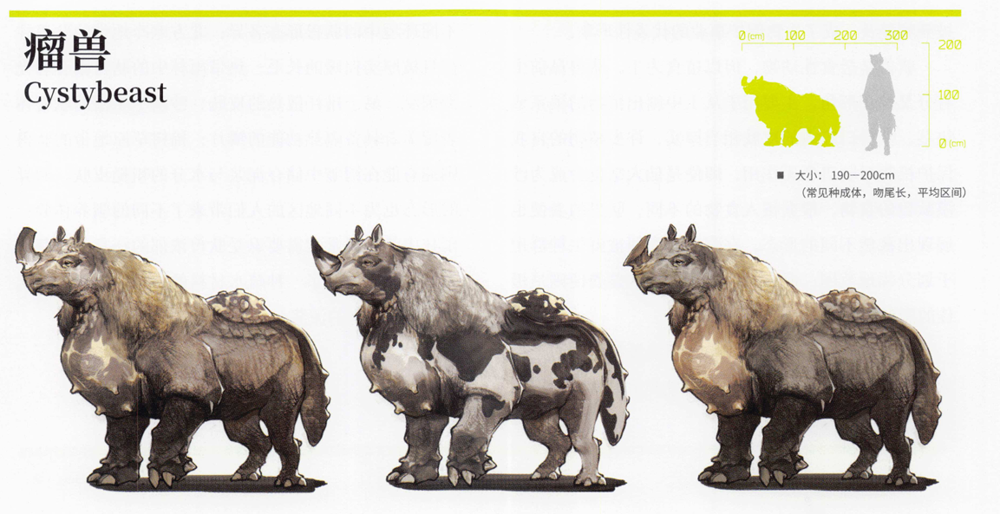
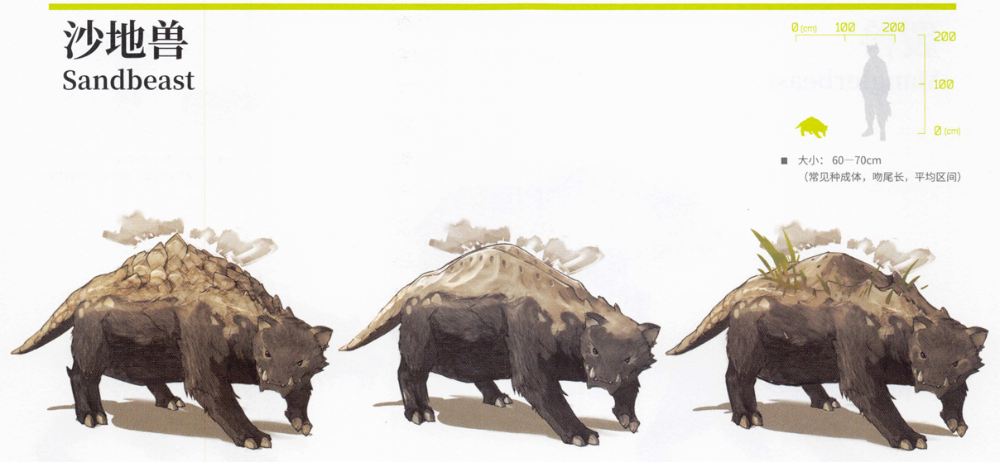
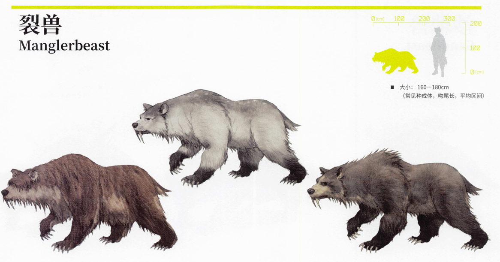
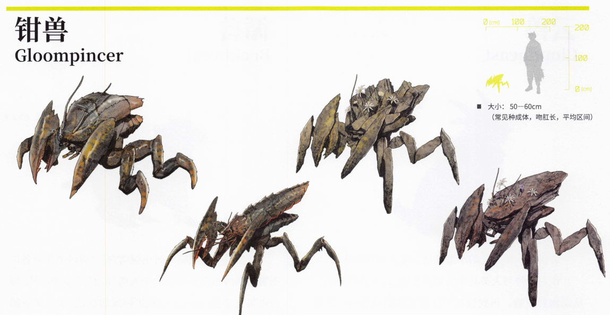
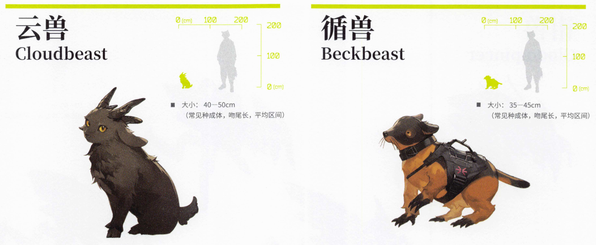
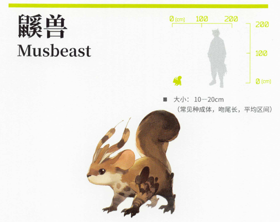

"源石虫"在陆上似乎是个由来已久的称呼，它的指代同样非常模糊。天灾之前，栖息在当地的源石虫属于有壳、软体、肉足生于腹面的一类生物。它身上的源石集中在坚韧的外壳上，已经与它的分泌物融为一体。这部分源石始终保持着惰性。但是按照我们目前的认知，活性源石会催使其他源石活性化，源石虫的外壳恐怕也不例外。那么理论上，在天灾的影响下，即使源石虫不会变成一团蠕动的火球，也会像人类那样"感染矿石病"，身体组织结晶化。
接下来的几天里，我们在营地通过望远镜继续观察。此前见过的几种源石虫的卵都不含源石成分，但我们在这里见到的发光虫卵无疑包裹着活性源石颗粒。在天灾过后的极寒环境里，活性源石提供的热量维系了虫卵的生命，却也宣判了子代染病的命运。这些虫卵以不可思议的速度孵化，幼虫进食、生长、寻找树木、再抛撒虫卵，整个过程不超过四十八小时。从第四天开始，我们观察到了更为不可思议的现象:虽然没有任何可见的飞行器官，这些源石虫却开始在空中悬浮，不借助树木就可以大范围地抛撒虫卵。(我们的向导惊恐地称之为"法术"，可莱塔尼亚人分明坚称"使用法术是属于且仅属于人类的特质"。)与彼德罗夫教授的会面不容耽搁，我没能见证这群源石虫的结局。但可以合理推测，它们将很快与这片森林一同灭亡。尽管天灾产生的源石已经丧失了活性，但源石虫体内的源石始终保持着活性状态。借助源石虫狂热的繁殖活动，这部分源石源源不断地接触到新的有机物。有相当数量的树木在最初的大火和接下来的极寒中幸存下来，但它们很快会被源石虫啃食殆尽，继而被活性源石感染同化。尽管如此，我还不能简单地用"寄生与被寄生"或"感染与被感染"来描述源石与源石虫之间的这种关系。活性源石充当了源石虫的热源与"施术材料"，其存在使得本应在天灾中灭亡的族群得以短暂地存续以一种自毁性的方式。相比于"适应"或"共生"，这样的结果似乎更适合用"妥协"来描述。

源石畸变现象的存在为生物分类工作带来了重大的难题。一方面，源石畸变毫无规律可循，同种生物在同样的源石环境中，也会表现出不同的感染症状。而另一方面，随着源石工业的高速发展，被感染生物也越发频繁地出现在人们的生产生活当中，它们不应被简单地归为特例了事。近年来，罗斯托夫实业、斯沃玛食品等多家企业的矿场或加工平台都因被感染生物的活动而蒙受了损失。除了带来学术难题之外，源石畸变现象的存在也扰乱了人们对于生物的朴素认知。遭受被感染的变异沙地兽袭扰之后，当地的萨尔贡王酋宣布普天之下所有的沙地兽皆为害兽，并为沙地兽的头颅开出赏金。在人们的大肆剿杀之下，当地的沙地兽几乎绝迹，失去了天敌的小型植食沙地动物泛滥成灾。
不过，源石对生命体的影响并不限于导致感染或催生畸变。一些生物与源石形成了脆弱的共生关系，源石虫就是其中最具代表性的一种。
"源石虫"是对一类与源石形成稳定共生关系的中小型动物的统称。源石虫种类繁多，在不同种的源石虫身上，源石的含量与分布方式也迥异。大多数情况下，源石与虫的分泌物相结合，构成介壳、棘刺、附肢等器官。在D32钢这类高性能合成材料面世之前，源石虫的外壳是少有的兼具柔韧性与传导性的材料。相比之下，一般的源石晶体虽然传导性更佳，却容易在某些场合下发生脆化。作为重要的工业原料，源石虫的外壳被广泛应用在需要耐受冲击的源石设备上。在哥伦比亚，源石虫的外壳曾被用于制作警用便携施术单元，因此，当地民众一度将警察戏称为"虫佬"。但源石虫外壳存在质地不均匀、传导精度不高等问题，用它制成的便携施术单元输出功率极不稳定。警方追捕时失手误杀嫌犯的事件多次发生后，源石虫警棍逐渐退出了历史舞台。

泰拉的大多数生物体内都含有微量的源石，如布雷奥甘所述，这些源石是从环境中富集而来的。刚刚孵化的源石虫幼体与深人人心的成虫形象大相径庭，它们光滑的身体上没有介壳或棘刺之类由源石构成的外部器官。源石虫在生长过程中不断从环境中摄取源石，这些器官也随之逐步成形。一般而言，在食物链中所处地位越高的生物，其体内的源石含量也越高。但是，相对于它们所处的生态位而言，源石虫体内的源石含量高得异乎寻常。如果没有额外的源石来源，那么源石虫恐怕要花上几十年的时间，才能形成一具厚实的源石外壳。因此，不论地表晶簇与地下矿洞，还是精炼工厂和源石动力炉，凡是富含源石的环境，总能见到摄取源石的源石虫。有时，它们甚至直接在废料堆中翻滚，将大量的源石粉尘裹人黏液。
许多源石虫爱好者宣称"源石虫不会感染矿石病"，是因为源石虫身上的源石不会自主活性化。由源石构成的外部器官会缓慢生长，但其中的源石成分却不会扩散。因此，源石虫的内部器官基本不含源石，常被用作染料、织物，甚至蜡制品的原料。此外，食品、博彩、宠物等行业中也常能见到源石虫的身影:源石虫酿酒是新近兴起的技术，芝士焗源石虫则是自古有之的传统菜肴;用于竞跑或陪伴的源石虫品种也相继问世，成了新潮娱乐活动的重要组成部分。
但"源石虫不会感染矿石病"的说法并不完全准确。高温、高压以及高浓度的活性源石环境，是催使源石活性化的重要条件。当这些条件齐备时，源石虫身上的源石也会毫不例外地活性化，使源石虫"感染矿石病"，甚至产生畸变。

瘤兽是另一种在人类生活中发挥重要作用的生物，被驯化的瘤兽主要承担提供乳制品与肉制品的功能。
瘤兽最为突出的特征就是它身上的一大一小两个瘤状器官，前胸的瘤状器官一般被称作"瘤袋"，后背的瘤状器官则被称作"瘤峰"。瘤袋与瘤峰主要由脂肪组织与腺体构成，其主要功能是储存养分与产出乳汁。野生的瘤兽能够在数月不进食的情况下存活，依靠的正是瘤袋与瘤峰这两个器官。在哺乳期，瘤袋与瘤峰能够将储存的养分转化为乳汁，用于哺育幼体。分泌乳汁的功能与瘤兽的性别无关，只与年龄有关。两性的瘤兽都需要储存养分，自然都生有瘤袋与瘤峰，也因此都能承担哺乳的责任。但是，当瘤兽步人老年，消化功能的衰退使得瘤袋与瘤峰中储存的养分越发珍贵，乳汁的产量与质量也就逐年下滑。
瘤兽分泌的乳汁被称作"瘤奶"或"瘤乳"，是食品工业中最为重要的原料之一。拉特兰有句谚语:"没有瘤奶，就没有料理。"作为瘤奶面包的忠实爱好者，我对此十分赞同。老年瘤兽分泌的乳汁由于带有独特的酸涩味,竟然成了近年来乳制品市场上最大的噱头。这种所谓的"酸奶"价格昂贵但营养价值不高，多被用
于满足人们的猎奇心理。
瘤兽形状独特的尾巴由厚重的硬胶质构成，不仅能够驱赶蚊虫，还能够痛击小型捕食者。像野生牙兽这样的小型捕食者，往往就对瘤兽多有忌惮。虽然它们的利齿能够刺破瘤兽厚实的皮肤，但无论从面前还是背后进攻，瘤兽都有着充分的防御手段，它的尖角与尾锤都能够重创牙兽。因此，当不得已需要捕猎瘤兽时，牙兽群会选择从侧面攀上瘤兽的身体，撕扯瘤兽最为脆弱的腹部与背部。有趣的是，在一些地区的牧场里，我们能够看到一只牙兽驱赶整群瘤兽的奇景。被驯化的瘤兽已经基本失去了攻击性，牧民常常利用经过训练的牙兽来驱赶牧群。
瘤兽的后颈处生有浓密的鬃毛，这些鬃毛往往呈现亮丽的金色或银色，因此常被用于制作装饰品，用瘤兽鬃毛制作的画笔也颇受各国艺术家的欢迎。

在沙漠中驻足观察，你也许会发现一些古怪的"沙丘"在阳光下有节律地缓慢起伏。这些"沙丘"属于一种奇妙的荒漠生物沙地兽。
沙地兽最为突出的特征是其背部的隆起，这是一种被称作"背扇"的器官。平常，背扇为沙地兽提供了重要的散热途径。沙地兽主要分布在戈壁、沙漠等荒漠地带，为了躲避烈日与高温，它们常常将自己埋人沙土，只把背扇露在外面。此时，背扇就会发挥另一项重要功能呼吸。沙地兽的背扇褶皱密布，皮肤薄而透光，内部有大量毛细血管分布，能够有效地与外界进行气体交换。因此，哪怕在沙中潜藏七八个小时，沙地兽也不会窒息。
沙地兽遁人沙土还有另一个重要目的:躲避天敌。在不同地带生活的沙地兽，其背扇也形态迥异:戈壁地带的沙地兽背扇棱角分明，好像平平无奇的砾石堆;沙漠地带的沙地兽背扇呈弧形，上有波痕状的褶皱，看上去与沙丘无异;而在地表植被相对较多的地带，沙地兽不仅生有形似土堆的背扇，有时还会在背扇上蹭上草叶以融人环境。
沙地兽宽厚的蹄是掘地的绝佳工具。它们的洞穴
四通八达，俨然是一座地下迷宫，很少有捕食者能够找到藏匿在洞穴深处的沙地兽幼崽。只有在食物相对匮乏的地区，人们才会选择大费周章地狩猎沙地兽，毕竟要找到它所有的洞口，恐怕都需要整整两天的时间。不过，据说沙地兽肉质鲜美，炎国北部地区就流传有一道名为"麻辣沙地兽"的名菜。近年来，越来越多的人萌生了养殖沙地兽的想法，他们大多只落得倾家荡产的结局。原因很简单:若用沙土铺地，沙地兽就会钻地逃跑;若用砖石铺地，不能钻地的沙地兽肉质又会变得极差。
沙地兽是杂食性动物，它们虽然生性胆小，却是优秀的捕食者。作为穴居动物，它们既能在隧道里敏捷地穿行，也懂得如何利落地掘开洞穴，许多小型的植食性穴居动物(如鼷兽)都是沙地兽食谱的一部分。沙地兽下颚生有尖锐的獠牙，猎物一旦被咬住就再无逃脱的余地。一些荒地猎人会训练沙地兽用于捕猎，但沙地兽毕竟是野生动物，训练的成功率并不高。如果七天之后沙地兽仍然拒不进食，猎人就只能将它放归荒野。荒地猎人们说，成功训练一只沙地兽仰仗的不仅是意志，更是缘分。

在许多人心目中，裂兽代表着恐惧。
裂兽是一种凶猛的肉食性动物，在泰拉各处广泛分布。裂兽最为突出的特征是它的利爪、獠牙与被称作"裂毛"的特殊毛发。裂兽的爪牙长而锋利，内侧生有细小的倒钩，能够在猎物身上撕出恐怖的伤口，使其血流不止。裂兽颈部与腹部的毛发中藏有一种特殊的硬质毛发，也就是"裂毛"。裂毛的边缘极其锋锐，能够轻易地划开大多数动物的口腔。哪怕裂兽被掀翻在地，暴露出了柔软的颈部与腹部，裂毛的存在也会令对手无从下口。当领地被侵犯时，裂兽群敢于向任何来犯者发起进攻，哪怕对方是数吨重的庞然大物，有人甚至目睹过裂兽群与一只巨翼兽展开激战。
经过训练的裂兽是乌萨斯军中重要的作战单位，这些渴求血肉的恶兽在战场上仿佛不知疼痛，它们的杀戮行为堪称疯狂。两军对垒时，乌萨斯人会命令裂兽在阵前将敌方战俘撕碎，使敌军士气涣散，不战而溃。值得一提的是，在极北地带生活着一种特殊的裂兽亚种:大型裂兽。它们的身体构造与普通裂兽基本无异，却有着几倍于普通裂兽的庞大体型。它们曾一度作为乌萨斯军力的象征为人所知，搭载了弩炮台的
大型裂兽是乌萨斯阵线里的绝对核心。在乌萨斯军队进行全面的战术革新之前，它们曾被用于对抗萨米人的战兽岩角兽。如今，大型裂兽在乌萨斯军中的职能已经被装甲部队全面取代，裂兽的战术身份从重型单位变成了特种单位，乌萨斯军队转而开始培养体型较小、行动灵敏、容易驯服的裂兽品种。
裂兽是典型的群居动物。一个完整的裂兽群一般由数十只裂兽组成，以一只雌性裂兽为头领。裂兽群的头领被称作"族母"。武力是决出裂兽族母的唯一方式，权力斗争在裂兽群中相当常见，在食物不充足时更是频繁。
裂兽表现出顺序性的雌雄同体现象，简而言之，它们能够改变性别。所有裂兽在出生时均为雌性，但当一只裂兽活过了漫长的争斗，长到十岁以上，它就会变为雄性，获得宝贵的交配机会。这种特性的存在，既使得群体中裂兽的数量能够保持稳定，也确保了群体中只有最善战的基因得以延续。野生的裂兽寿命不长，雄性裂兽数量稀少，且在完成交配后很快就会死去。因此，雄性裂兽往往难得一见，许多人甚至误以为裂兽只有一种性别。

钳兽是一种生活在河流、湖泊、沼泽等淡水环境中的甲壳动物。
钳兽最为突出的特征是它巨大的螯，即使是小体型钳兽的螯，其长度也相当于人的小臂。钳兽得名于其惊人的螯力，成年钳兽能够轻易夹碎驮兽等中大型动物的骨骼。但是，强大的鳌力并非没有代价，钳兽鳌的活动范围相当有限，只能触及身下的小片区域，而不能像磐蟹的螯那样高高举起。在应对大型猎物时，钳兽能够借助强有力的后足一跃而起，用锋利的足尖将自己固定在猎物身上，然后再施展巨螯。事实上，钳兽的足尖能够刺破的不仅有动物的皮肤，还有质地较脆的岩石。栖息在洞窟中的钳兽能够悬挂在洞壁上，伺机向路过的动物发起进攻。不过，尽管样貌可怖，但钳兽并不像裂兽那样好战，它们在大部分时候都会选择以小型鳞兽为食。钳兽的鳌与足仿佛天然的鳞叉，能够轻易地刺穿水中的鳞兽。
在卡西米尔，人工饲养的钳兽常作为工具出现在骑士竞技场上。在主办方术师的操控之下，它们会对需要被淘汰的骑士发起疯狂的进攻，也会在需要晋级的骑士面前表现得木讷呆滞，成为一场屠杀表演的牺牲品。由于竞技用钳兽的存在，在骨科配备更多的医护力量成了卡西米尔各大医院的共识。
腹部是钳兽身上最为柔软的部位，也是其最具食用价值的部位之一。钳兽螯因其筋道的口感而受到追捧，钳兽腹肉则因其鲜香的口味而被广泛应用在许多知名菜肴当中。钳兽的人工饲养技术成熟之后，罐装的钳兽腹肉酱也出现在了各大超市的货架上。为了保护柔软的腹部，钳兽生有坚硬的甲壳。遭遇天敌时，钳兽会将半个身子埋人泥沙，用螯与背甲对敌。相较于河湖中的钳兽，沼泽钳兽的甲壳更薄、更软，但它们通常会在身上裹满泥浆，泥浆板结后形成的硬壳也能提供可靠的防御。如果泥浆里恰巧裹挟了种子，这些沼泽植物还会在钳兽背上生根发芽，为钳兽提供额外的伪装手段。

云兽是一种常见的小型动物，多在城市中生活。作为一种与人类共生的城市生物，云兽食性很杂，从动物到植物，再到城市中最常见的厨余废料，云兽无所不食。但一些专门培育出的宠物云兽有着一定程度的消化系统缺陷，稍不注意饮食就容易出现腹泻等症状。因此，宠物品种一旦被遗弃就很难存活。
云兽柔软的长耳赋予了它极佳的听力，路过小巷时，人们常能听见清脆的蹄声一路远去那是云兽早早听见了来人的脚步声，匆匆逃离的声音。不同于许多擅用尾巴交流的动物，云兽尾巴短小，不能大幅摇摆，它们大多通过呼扇长耳来表达情绪。许多将云兽当作宠物饲养的人都表示，抚摸云兽耳朵是大地上最幸福的事情。
云兽毛色种类极多，根据毛色的不同，炎国人赋予了云兽许多别具一格的雅称，甚至专门整理了一本名为<<相云经>>的著作。比如，乌云兽指纯黑色的云兽，雪云兽指纯白色的云兽，乌云盖雪是黑背白腹，墨玉垂珠是黑身白尾......在炎国说唱曲艺中，云兽的雅称是经典的贯口段子，一气呵成地念出云兽的所有雅称是曲艺演员的基本功。
云兽是群居动物，由血缘维系的云兽家族组成群体，共同行动。在城市中，每群云兽都有各自固定的地盘，只有势力最大的群体才能占据像商业区这样食物充沛的地盘。敌对的云兽家族常常在街头巷尾聚众"斗殴"，通过顶角来决出胜负。近年来，一些城市里甚至出现了云兽家族的粉丝，当云兽们争夺地盘时，支持不同家族的粉丝也会大打出手。
循兽是一种被驯化的小型动物，一直以来作为各国军警力量的重要组成部分为人所知。除了军警以外，循兽也很受信使、消防员和私家侦探的欢迎。循兽灵敏的鼻子和胡须是它能够承担各种工作的重要原因。极佳的嗅觉使得循兽能够出色地完成搜救、排爆、追踪等特种任务。循兽的野生先祖是穴居生物，因而被驯化的循兽也保留了眼睛小、视力差的特征。因此，循兽在行动时高度依赖胡须，它们通过胡须感知周围的环境，以避开障碍与危险。
被驯化的循兽还保留了另一项穴居动物的特征:适于刨土的长爪。在人类社会中生活的循兽不再需要刨土，但它们的爪依然会不断生长，因此，抓板是饲养循兽必不可少的用具。
古代就有崇拜源石的信徒通过吞食源石矿物粉末来进人"通灵"状态，而在现代，含有源石成分的致幻药物依然存在。在没有紧急特种任务时，警用循兽的主要职责就是坚守城市关口，辨别试图走私致幻药物的罪犯。循兽体型矮小，即使抬起身也够不到旅客的背包，为了让循兽更好地完成嗅探工作，一些城市的关口专门设有供循兽站立的"循兽台"。
循兽的鼻子与胡须是灵敏的，却也是脆弱的。为了保护循兽，各国警方往往采取循兽轮班制，让一只循兽在服役三个月后休假三个月，确保它们能以最佳的状态踏上岗位。

鼷兽是一种原产于萨尔贡的小型穴居动物。随着跨国贸易的发展，鼷兽也随着往来通商的队伍散布到了泰拉各国。它们通常藏身在货车的夹层当中，不仔细搜查的话很难发现。这些鼷兽很快适应了城市生活，成了令许多人头痛不已的外来人侵物种。
鼷兽以各种坚果和植物块茎为食，生活在城市中的鼷兽最喜欢的食物就是土豆。它们常常成群结队地潜人快餐店，将厨房里的薯条洗劫一空。曾有快餐店为了防止鼷兽偷食，将薯条全部做成了麻辣与芥末口味，但鼷兽仍然照单全收。此外，鼷兽磨牙的习性也对人们的日常生活造成了不小的困扰，小到充电线，大到运输管道，鼷兽无所不咬。不难想见，在管道上涂抹苦味涂料的操作同样没能防止鼷兽啃咬。
鼷兽在萨尔贡荒漠中的天敌是沙地兽。同为穴居动物的沙地兽能够在隧道中轻松穿行，精准地找到鼷兽的藏身之处。但是，由于沙地兽难以驯化，也不能适应城市生活，用沙地兽治理鼷兽灾害的想法很快落空了。
值得一提的是，鼷兽头顶和前肢均生有形似羽毛的结构。其中，头顶的羽状结构类似于循兽的胡须,能够感知空气的细微振动;而前肢的羽状结构则能够张开，在鼷兽跳跃时产生微小的浮力，短暂地实现滑翔的效果。鼷兽会在洞口挖出类似于滑道的结构，在冲出洞穴时，它们能够凭借滑道飞出相当远的距离，以此逃过捕食者的追杀。

