乌萨斯
Ursus

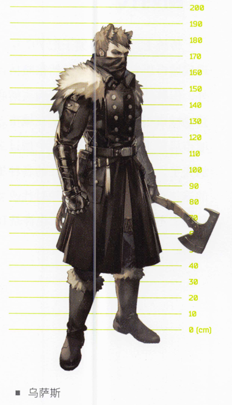

乌萨斯主要居住在泰拉北方的乌萨斯帝国境内，人口众多。此外，乌萨斯在卡西米尔、谢拉格、萨尔贡北部以及炎国等许多地区也多有分布，是较为常见的泰拉种族之一。

菲林
Feline

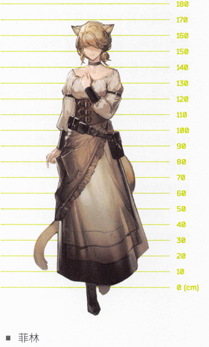

感官敏锐、大多生有尖耳和长尾的菲林，与佩洛、黎博利并列，是泰拉人数最多、族群分布最广的种族之一。一句出处不可考的高卢谚语是这么说的:"足迹所至，菲林所在。"维多利亚拥有相当广泛的菲林人口分布，我也是其中的一员。

阿斯兰
Aslan

阿斯兰主要居住在泰拉西南方的萨尔贡和泰拉中央南部的维多利亚境内，人口稀少，是极为少见的泰拉种族之一。

佩洛
Perro

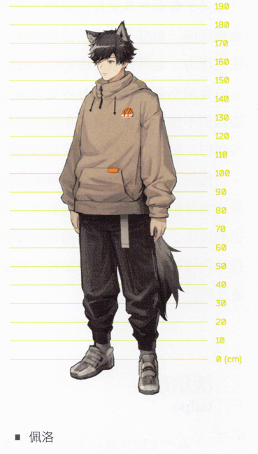

佩洛是分布最广、人数最多的泰拉种族之一，从萨尔贡帝国到萨米地区，从玻利瓦尔到东国，到处都能看到他们的身影。目前，玻利瓦尔地区人数最多的种族就是佩洛。

鲁珀Lupo

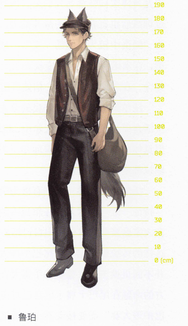

莱塔尼亚东方的叙拉古以鲁珀为主体种族。尽管鲁珀在乌萨斯、维多利亚等国家也有少量分布，但人们对鲁珀的认知常常与叙拉古的家族文化绑定。

沃尔珀
Vulpo

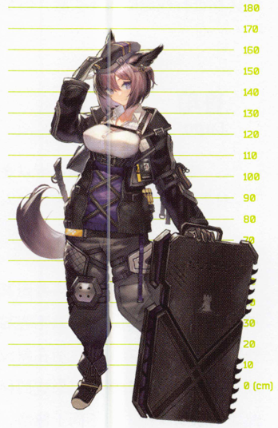

由于生理区别极其细微，直到今天，沃尔珀在相当多的地区仍会被误认为是佩洛。在大多数时候，这些被误认的沃尔珀也并不会因为自己被冠以其他种族之名而感到身受冒犯，因为这样的事司空见惯。也正是因此，沃尔珀在泰拉的分布统计并不可信，但从整体来看，生活在各地的沃尔珀占当地总人口的比例还是比较低的。

瑞柏巴
Reproba

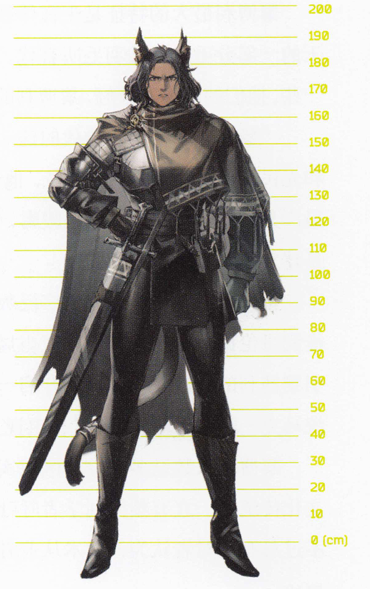

瑞柏巴是泰拉大地上人口较为稀少的种族之一，主要生活在萨尔贡地区。但这并不意味着他们不被人所知，根据一些历史记载，部落时代瑞柏巴的祖先们还保留着一些"亲近萨卡兹"的古老生活传统，他们因此成了彼时的佩洛族群中饱受非议的一支。在经过漫长的岁月后，瑞柏巴中放弃了旧生活传统的一支延续到了今天。伴随着阿斯兰带来的全新种族边界认知，"瑞柏巴"这个概念正式以一种称呼的形式从佩洛中分离。

黎博利
Liberi

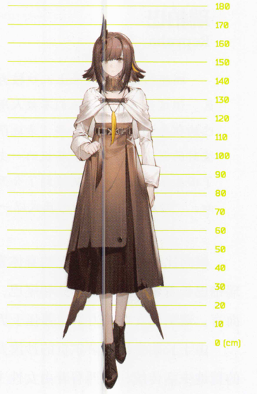

"黎博利"是对体表生有羽毛的神民和先民的统称。由于这一称呼所指代人群的广泛性，黎博利现在是泰拉最庞大的族群之一，广泛分布在泰拉各地。黎博利是构成哥伦比亚多元种族的主体种族之一，伊比利亚和拉特兰也有大量的黎博利人口。

卡特斯
Cautus

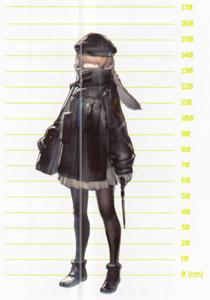

泰拉的卡特斯族群主要集中在雷姆必拓的自治州及周边地区，尽管他们在其他国家和地区不算罕见，但没有哪里能像雷姆必拓一样拥有如此众多的卡特斯人口。新家庭的大门时常敞开，无论他们喜欢萝卜罐头与否。

库兰塔
Kuranta

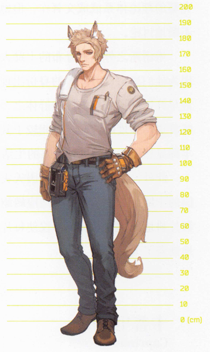

库兰塔的祖先们选择在泰拉中北部的卡西米尔平原定居后，这支强健善奔的族群便世代在广阔的平原上生活。有不少库兰塔在一千多年前随着梦魇可汗离开了草原，所以如今在泰拉各地都能见到库兰塔的身影。

丰蹄
Forte

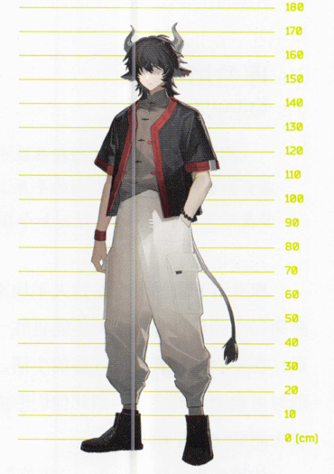

泰拉西南方的米诺斯以丰蹄为主体种族。除此之外，丰蹄也广泛地分布在炎国、萨尔贡等多平原的国家，是较常见的泰拉种族之一。

卡普里尼
Caprinae

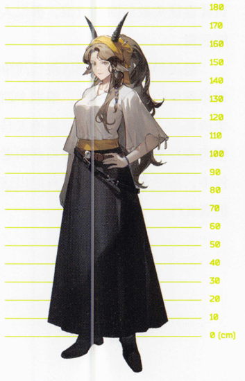

卡普里尼是较为常见的泰拉种族之一，主要居住在莱塔尼亚及其周边，亦有不少族群分布在泰拉各地。

埃拉菲亚
Elafa

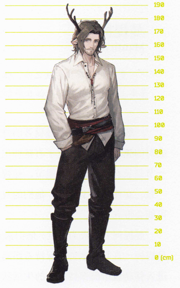

泰拉极北的萨米以埃拉菲亚为主体种族。除此之外，埃拉菲亚也广泛地分布在乌萨斯、卡西米尔、莱塔尼亚等多林地的国家，是较常见的泰拉种族之一。

瓦伊凡
Vouivre

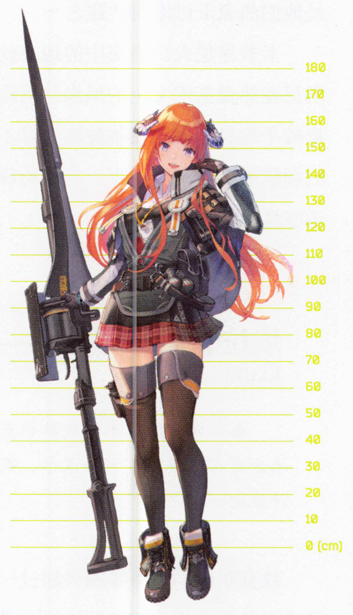

瓦伊凡主要居住在萨尔贡、维多利亚和瓦伊凡联盟(有争议的)控制区内。近年来有不少瓦伊凡在佣兵生涯结束后选择在其他国家和地区定居。

曼提柯
Manticore

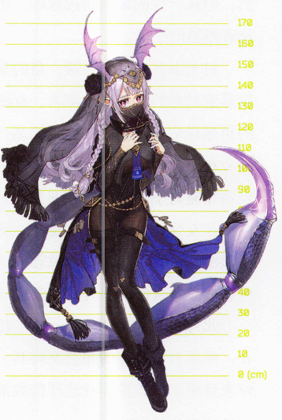

曼提柯是泰拉种族之一，体表生有双翼，躯干带有节肢状甲壳尾部。
基本上所有曼提柯都居住在萨尔贡境内，非常少见。

斐迪亚
Phidia

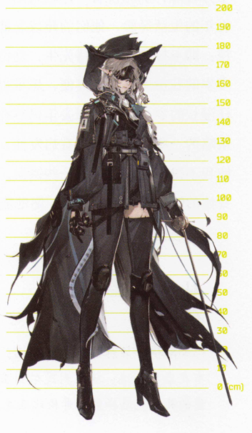

斐迪亚是泰拉较不常见的种族之一，但他们的居所遍布大地。不论是萨米的雪原上、乌萨斯的森林中，还是萨尔贡的黄土里、维多利亚的楼宇间，只要费力寻找一番，都可以找到斐迪亚的踪迹。

萨弗拉
Savra

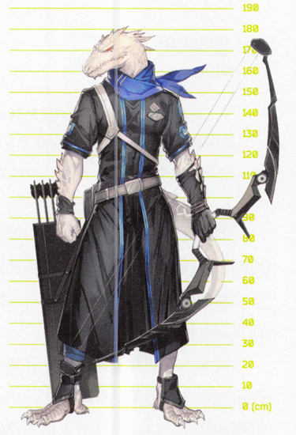

萨弗拉以沙漠为家，他们大多生活在萨尔贡，也有一部分迁居雷姆必拓。他们喜欢日照充足、可以长时间享受阳光的地方不过转念一想，我们又有谁不是如此呢?

札拉克
Zalak

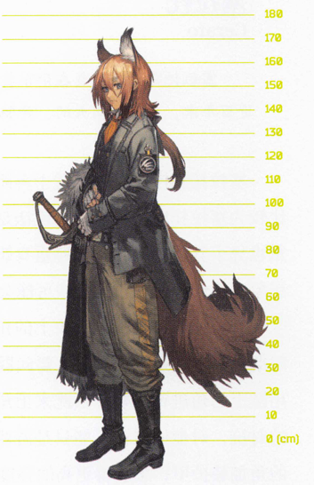

即使和菲林或黎博利相比，札拉克人口数量也堪称庞大，他们广泛分布在泰拉各地，从玻利瓦尔到雷姆必拓都可以找到。近年来，也有相当数量的札拉克选择前往哥伦比亚生活。

杜林
Durin

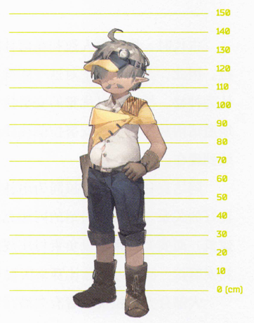

在大部分人眼中，杜林人是一群神秘的存在。这些身材矮小的尖耳朵会不时造访各处城市和定居点，但很少提及他们来自何方。各个地区的历史文献中都或多或少记载有和杜林相关的内容，但直到最近百年，人们才收集到有关杜林社会和文化的零散信息。

塞拉托
Cerato

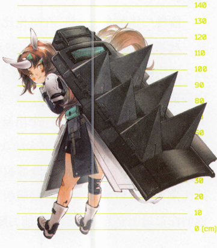

塞拉托是原本栖息在萨尔贡绿洲的诸多族群之一，以强健的体格著称。
近百年来，塞拉托高大的、奔驰的身影开始出现在了泰拉的其他地区。

安努拉
Anura

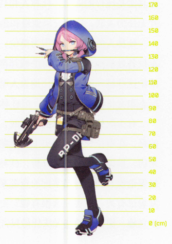

主要居住在萨尔贡和玻利瓦尔的安努拉是较为少见的存在，绝大多数其他地区的泰拉人都对他们没什么了解。安努拉们喜欢潮湿而又水草丰沛的地方，近年来迁去移动城市的安努拉也都倾向于定居在绿化率较高且水道治理良好的城市。

阿达克利斯
Archosauria

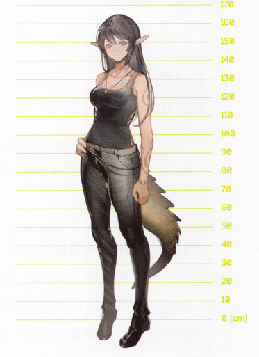

崇尚力量的阿达克利斯以雨林为家，他们大多生活在萨尔贡东部的湿润之地。在这里，有着标志性的尾巴的他们以部落的形式居住在沿河的地带，并形成了属于自己的身份认知。

依特拉
Itra

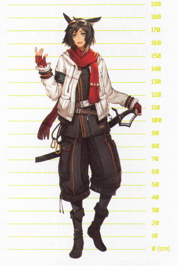

依特拉大都居住在泰拉那些寒冷的高原山地或者冰原附近。在炎国、谢拉格、乌萨斯和萨米地区的部分地方时常能看见他们的身影，但除此之外的其他地方则很少有依特拉居住。

匹特拉姆
Petram

匹特拉姆是极其少见的种族，许多人甚至从未听说过泰拉还存在这样一个名叫"匹特拉姆"的种族。事实上，匹特拉姆大都避世并且居住在水源丰富的地区。

阿纳缇
Anaty

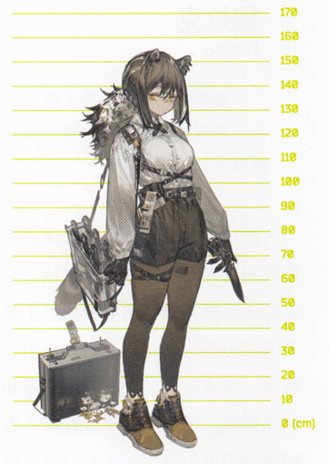

常与山脉绑定的阿纳缇是这片大地上的常见种族，在过去的很长一段时间里，他们常生活在远离平原的山区之中，并对任何拜访的客人都热情相待。

皮洛萨
Pilosa

我必须承认，我没亲眼见过皮洛萨，因为他们很容易被误认，也极少出现在人群中。在过去几十年里，我和我的同僚们听到的与皮洛萨相关的传闻也不多，因此难以总结。将这条放在这里，只是因为在漫长的历史上确实有过关于这个种族的记录。

德拉克
Draco

德拉克是在泰拉历史舞台上扮演了重要角色的神民种族。他们人数稀少，零散地分布在泰拉各个地区，每个地区的德拉克族群都有非常鲜明的地域特征。

龙
Lung

龙是炎国独有的神民种族。数千年来，他们生活在大地的东方，他们缔造了古老的文明，他们统治着一个繁荣且开明的帝国。

麒麟
Kylin

遥远东方的炎国大地孕育出了许多独特的种族，麒麟就是其中的一支，他们人数稀少，但地位崇高，历来是炎国朝堂与府衙的常客。

阿戈尔
Agir

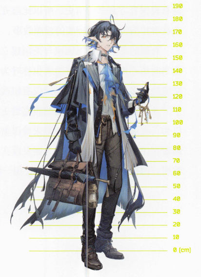

阿戈尔涉足的地区相当广泛，从泰拉的沿海地区到内陆的水体附近都有分布。近年以来，他们的传说引发了越来越多人的关注，也许他们的来处比我们想象的更加广博，更加深邃。

萨科塔
Sankta

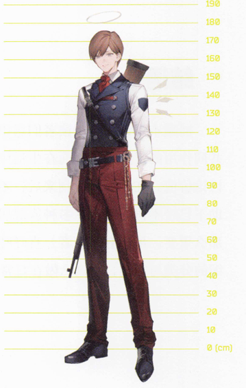

越是与萨科塔相处，就越能感觉到他们身上的特别之处。我忍不住想给萨科塔们更多篇幅，又担心有失公平。不过还是恳请读者们允许我在此赘言一二，也许有助于大家了解拉特兰一节中我所记叙的见闻。

萨卡弦
Sarkaz

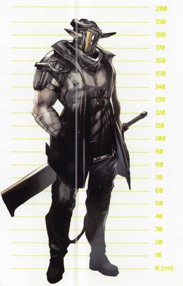

萨卡兹是较为少见的泰拉种族，长相各异的萨卡兹在人类的历史中始终遭受着其他种族的敌视。

